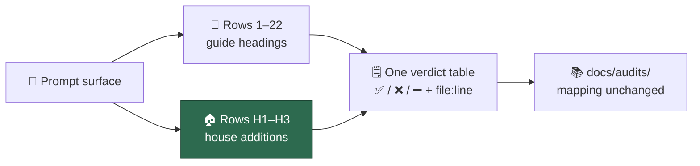

# Prompt rubric: house additions H1–H3

## Summary

Adds a **House additions** section to
`docs/PROMPT-BEST-PRACTICES-CHECKLIST.md` carrying the three levers the
Anthropic guide does not cover — positive framing, the no-op test, and leading
words — as rows `H1`–`H3`. Closes #659.

The rows are numbered outside the guide's 1–22 range and live in their own
section, so the row-to-guide-heading mapping every audit under `docs/audits/`
relies on is untouched. They are scored with the same ✅ / ❌ / ➖ verdicts and
the same `file:line` evidence, and they are carried in the copy-paste verdict
table template so audits pick them up without re-deriving them.

The issue's three vetting questions are settled in the doc rather than left
open:

- **Existing audits stay as scored** — audits already recorded are complete
  against rows 1–22 and are not reopened; a re-audit of the same surface picks
  the house rows up then.
- **An H2 verdict is a candidate until a run settles it** — the no-op test is
  model-relative, so an unattended audit records `❌ (candidate)`; a bare `❌`
  needs a cited run in which the line was removed and the behaviour held.
- **A hard-won guardrail is not sediment** — incident-earned rules (the
  spin-wait ban, the `tail -f | head` ban) pass H2 by definition, and H1 keeps
  them as prohibitions paired with their positive target.

Credit for the three levers belongs to
[mattpocock/skills](https://github.com/mattpocock/skills), recorded in
`docs/REFERENCES.md` beside the existing grill-me credit.

## Evidence

Documentation and rubric change with no web interface to screenshot. The rubric
is machine-checked, so the evidence is the test run over the committed
Markdown:

```text
running 14 tests from ./tests/prompt_best_practices_checklist_test.ts
house additions score the three house techniques ... ok
house rows are numbered outside the guide's 1-22 range ... ok
each house row defines pass, gap and n/a ... ok
house additions leave the guide rows untouched ... ok
house additions settle the model-relative and guardrail rules ... ok
verdict table template carries the house rows ... ok
ok | 14 passed | 0 failed
```

All five new tests were observed failing against the unmodified checklist
(`AssertionError: missing section heading containing "House additions"`) before
the document was edited.

`./quality.sh` reports every stage PASSED except `deno tests`, which fails on
three environment-bound cases unrelated to this change:
`tests/run_core_rate_limit_resume_test.ts` and `tests/run_core_test.ts` abort
with `GraphQL: API rate limit already exceeded`, and
`service_account_env_test.ts::applyServiceAccountEnv - an unwritable gh config
dir is restaged writable` expects a `/tmp` staging path but sees the
container's `.container-state/gh-config`. Both reproduce unchanged at the base
commit (`HEAD~2`) in a clean worktree, so they are pre-existing and not caused
by this PR.



## Test Plan

Added to `worker/deno/tests/prompt_best_practices_checklist_test.ts`:

- `house additions score the three house techniques` — the section scores
  exactly positive framing, no-ops and leading words, in order.
- `house rows are numbered outside the guide's 1-22 range` — ids are `H1`,
  `H2`, `H3`, so no guide row is renumbered.
- `each house row defines pass, gap and n/a` — every house row carries all
  three verdict definitions.
- `house additions leave the guide rows untouched` — the numbered checklist
  still holds exactly the 22 guide techniques and none of the house ones.
- `house additions settle the model-relative and guardrail rules` — the section
  states the candidate rule, the guardrail carve-out, and how existing
  `docs/audits/` records are treated.
- `verdict table template carries the house rows` — the copy-paste template
  lists the same house rows as the section, so audits cannot silently drop
  them.

Existing tests in the same file (guide-row coverage, contiguous numbering,
out-of-scope table, templates) are unchanged and still pass, which is what
proves the guide mapping was not disturbed.
