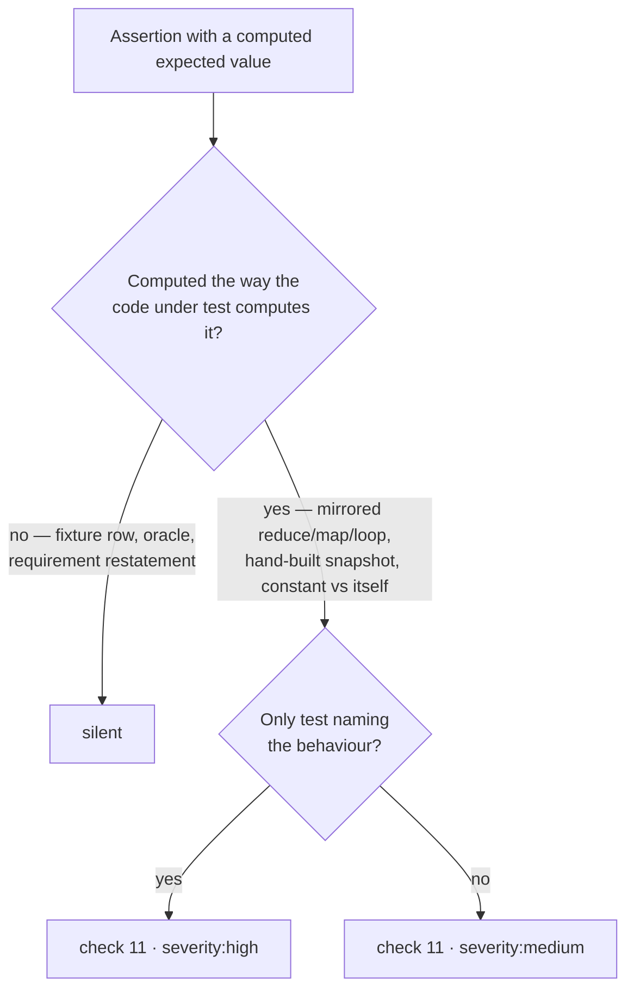

# Test-audit check 11 — tautological assertions

## Summary

`prompts/test_audit/v12.md` adds an eleventh audit check: **tautological
assertions**, where the expected value is derived inside the test by the same
computation the code under test performs. Such a test passes by construction —
change the algorithm and the expectation changes with it — so it can never
disagree with the implementation, yet it looks healthy because it survives every
refactor. Closes #660.

The check is a **new numbered check, not a fifth bullet on check 5**, for two
reasons:

- Check 5 is entirely about *literals* — which value was written down and where
  it came from — and opens by stating that a hard-coded literal is not itself a
  smell. A tautological test has no literal at all.
- The stable finding id derives from the audit-check slug. A shared slug would
  collapse a tautological finding and an unjustified-literal finding on the same
  file into one id; check 11 takes its own `tautological-expected-value` slug so
  the two stay distinct across runs.

The false-positive carve-out the issue asked for is explicit: the check turns on
the expected value being computed **the way the code computes it**, never on it
merely being computed. Fixture-row expected values in table-driven tests, a
deliberately different algorithm used as an oracle (a slow reference
implementation checking a fast one, a round trip through an inverse function),
and derivations that restate the requirement are all silent — with a worked
`<example>` for each side of the line.

v11 is untouched (prompt versions are immutable; `loadPrompt` resolves the
highest version, so v12 goes live on merge). Bookkeeping the output format
depends on was renumbered throughout: "ten audit checks" → eleven, "nine
test-maintainability smells" → ten, and every `checks 1–6 and 8–10` range now
reads `8–11`, including the Phase 4 `## Suggested fix` contract, which gains the
check 11 resolution (replace the recomputation with an independently-sourced
expected value).

Docs updated in the same change: `docs/TEST-AUDIT-SCAN.md` (heading, intent,
check table row 11, id-recipe slug list, the Mermaid flow node) and
`DESIGN-PRINCIPLES.md`. The DESIGN-PRINCIPLES paragraph was already stale — it
still said "Seven audit checks … six smells", never updated when v7 added checks
8–10 — so the count sentence now names checks 8–10 and 11 as well.

## Evidence

Backend/prompt-only change with no web interface to screenshot. The evidence is
the test run below, which loads the real prompt files through
`loadPrompt`/`getLatestVersion` and asserts on the resolved template, with v11 as
the negative control:

```text
running 10 tests from ./tests/test_audit_prompt_v12_test.ts
test_audit v12 - is the version the worker resolves ... ok
test_audit v12 - keeps the dedup and attribution placeholders ... ok
test_audit v12 - adds check 11 for tautological assertions ... ok
test_audit v12 - check 11 names the recomputation shapes it fires on ... ok
test_audit v12 - check 11 carves out the two legitimate look-alikes ... ok
test_audit v12 - check 11 has a worked example and a silent near-miss ... ok
test_audit v12 - the stable-id recipe registers the new slug ... ok
test_audit v12 - renumbers the check counts consistently ... ok
test_audit v12 - the maintainability check range includes check 11 ... ok
test_audit v12 - severity guidance covers a tautological finding ... ok

ok | 10 passed | 0 failed
```

All ten failed before `prompts/test_audit/v12.md` existed (TDD: the test file was
committed against the v11-only tree first and every case failed).



## Test Plan

- Added `worker/deno/tests/test_audit_prompt_v12_test.ts` — ten cases covering
  version resolution (`getLatestVersion("test_audit") === "v12"` and the
  no-version `loadPrompt` returning the same body), placeholder preservation,
  the check 11 rule and its three flagged shapes, the two carve-outs, the worked
  example pair, the new stable-id slug, the renumbered counts and check ranges,
  and the severity guidance. Each check-11 case asserts the gap is present in
  v11 and closed in v12.
- Re-ran `tests/prompt_manager_test.ts`,
  `tests/docs_prompt_version_freshness_test.ts`,
  `tests/test_audit_template_test.ts`, `tests/fable5_remaining_prompts_test.ts`
  and `tests/prompt_hash_test.ts` (108 passed) — the new version file does not
  disturb prompt loading, validation, hashing or the docs version-freshness
  guard.
- `./quality.sh` run in full.
