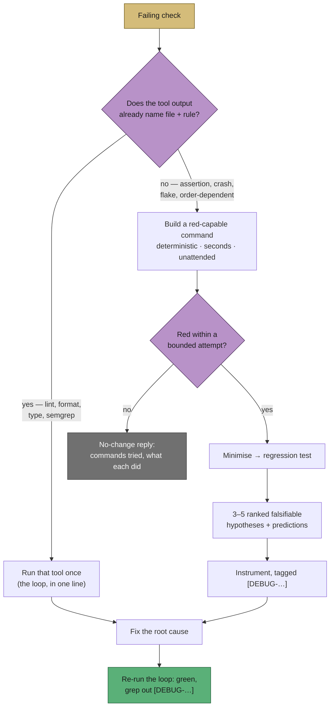

# ci_fix v14 + issue v38: gate the fix behind a reproduction loop

## Summary

`prompts/ci_fix/v13.md:78` held the whole of our diagnosis guidance — "read the
failing test, CI config, and relevant source to find the root cause, then apply a
minimal, targeted fix". That is straight to hypothesis: nothing stood between a
plausible theory and a pushed commit, and nothing distinguished "the check is
green now" from "the check is green because the cause is gone". The `unknown`
triage branch said "reproduce locally if you can" — permission, not a gate, with
no definition of a good reproduction.

`prompts/ci_fix/v14.md` puts a loop in front of the fix, and
`prompts/issue/v38.md` gives the `## Reproduction` block's `verified` status the
same method so a hard bug has a ladder to climb instead of degrading to
`not-run`. Credit for the phase-gated shape belongs to
[mattpocock/skills](https://github.com/mattpocock/skills); the bound and the
give-up path are ours, because these runs are unattended and budgeted. Closes
#661.

**What v14 adds:**

- **A reproduction gate before any fix** — one named, already-run **red-capable**
  command that drives the failing path and reproduces the check's own symptom.
  "No red command, no hypothesis." Its output is quoted in
  `.pr_response_message`.
- **A bounded attempt with an honest give-up path** — roughly three shapes of
  command; if none goes red, the run records which it tried, what each did
  instead, and why the symptom would not reproduce. A loop that could not be
  built is a legitimate outcome, matching the no-change analysis the prompt
  already prefers.
- **Minimise before fixing** — cut one element at a time, re-running each time,
  until removing anything left turns it green. What survives becomes the
  regression test.
- **Three to five ranked, falsifiable hypotheses before instrumenting**, each
  stating the prediction that would kill it.
- **Tagged instrumentation** — a unique `[DEBUG-…]` prefix on every temporary
  debug log, with `grep -rn "\[DEBUG-" .` required to come back empty before the
  commit. This joins the existing scratch-file rule rather than replacing it:
  scratch files sit *beside* the source, instrumentation hides *inside* it.
- **Both reply skeletons carry a `**Reproduction:**` line**, so a reviewer sees
  the command and its symptom — or the commands tried and why none went red.

**The vetting notes from the issue are honoured, not ignored:**

- *"Most CI failures are not hard bugs."* The gate is explicitly cheap where the
  failure is mechanical: a lint violation, a formatting drift, a type error or a
  `semgrep` finding is **already reproduced by the tool that reported it**, so
  running that tool *is* the loop — one line, no ceremony. The three steps earn
  their keep only on failures the log does not explain.
- *"Six phases is a lot of prompt."* Condensed to **three numbered steps** plus a
  tagging rule, in one section. v14 is 154 lines against v13's 138 — sixteen
  lines of net growth, not a second template.
- *"Open-ended 'refuse to give up' could burn a run."* Replaced with an explicit
  bound and a reportable give-up outcome.

## Evidence

This is a prompt- and docs-only change with no web interface, so there is nothing
to screenshot. The evidence is the test suite below, run against the prompt tree
through the worker's real `loadPrompt` / `getLatestVersion` functions.

```
$ deno test --allow-read tests/ci_fix_reproduction_loop_v14_test.ts \
                         tests/issue_prompt_v38_reproduction_method_test.ts
running 11 tests from ./tests/ci_fix_reproduction_loop_v14_test.ts
ci_fix v14 - is the version the worker resolves ... ok
ci_fix v14 - keeps the placeholders and the reply contract ... ok
ci_fix v14 - gates the fix behind one red-capable command ... ok
ci_fix v14 - names what makes a loop good ... ok
ci_fix v14 - bounds the attempt and keeps an honest give-up path ... ok
ci_fix v14 - stays cheap for a failure the tool output already names ... ok
ci_fix v14 - requires the repro to be minimised before the fix ... ok
ci_fix v14 - requires three to five ranked falsifiable hypotheses ... ok
ci_fix v14 - tags temporary instrumentation and greps it out ... ok
ci_fix v14 - the unknown branch points at the gate, not at permission ... ok
ci_fix v14 - both reply skeletons report the reproduction ... ok
running 4 tests from ./tests/issue_prompt_v38_reproduction_method_test.ts
issue v38 - is the version the worker resolves ... ok
issue v38 - keeps the placeholders and the existing gated blocks ... ok
issue v38 - gives verified a method, not only a definition ... ok
issue v38 - a loop that never went red cannot be reported verified ... ok

ok | 15 passed | 0 failed
```

Every new-rule assertion is paired with a negative control on the previous
version — `v13` for `ci_fix`, `v37` for `issue` — so the suite fails against the
unfixed prompt tree rather than passing vacuously. Committed prompt versions are
immutable, so v13 and v37 are untouched and remain loadable.

The gate the `ci_fix` prompt now applies:



## Files changed

| File | Change |
| ---- | ------ |
| `prompts/ci_fix/v14.md` | New version — the reproduction-loop gate, minimisation, ranked hypotheses, `[DEBUG-…]` tagging, and a `**Reproduction:**` line in both reply skeletons. v13 untouched. |
| `prompts/issue/v38.md` | New version — the `## Reproduction` block's `verified` status gains the method behind it, with the same bound and the same honest bottom rung. v37 untouched. |
| `worker/deno/tests/ci_fix_reproduction_loop_v14_test.ts` | 11 tests, each new rule paired with a v13 negative control. |
| `worker/deno/tests/issue_prompt_v38_reproduction_method_test.ts` | 4 tests, each paired with a v37 negative control. |
| `docs/workflows/ci-fix.md` | New "🔁 The reproduction loop before the fix" section with the flowchart above; the stale "currently `v4`" prompt pin replaced with a pointer to the directory. |
| `docs/workflows/issue-processing.md` | "How a run climbs to `verified`" added beside the three status definitions; version-pinned prose de-pinned. |
| `docs/PROMPTS.md` | `ci_fix` and `issue` rows record the new behaviour. |
| `docs/REFERENCES.md` | mattpocock/skills row credits the reproduction-loop discipline alongside grill-me. |
| `docs/SPEC-KIT-COMPARISON.md` | Version-pinned `prompts/issue/v37.md` references de-pinned. |

## Test Plan

- **Added** `worker/deno/tests/ci_fix_reproduction_loop_v14_test.ts` — 11 tests
  covering version resolution (`getLatestVersion("ci_fix")` → `v14`), the
  preserved placeholder/reply contract, the red-capable gate, the four loop
  qualities, the bound and give-up path, the cheap path for mechanical failures,
  minimisation, ranked falsifiable hypotheses, `[DEBUG-…]` tagging beside the
  scratch-file rule, the rewritten `unknown` triage branch, and the
  `**Reproduction:**` line in both reply skeletons.
- **Added** `worker/deno/tests/issue_prompt_v38_reproduction_method_test.ts` — 4
  tests covering version resolution, the preserved placeholders and gated
  blocks, `verified` gaining a method, and the rule that a loop which never went
  red is reported `partial` / `not-run` rather than inflated.
- **Unchanged**: no existing test was modified, commented out, or removed. The
  suites that pin v13 and v37 still pass — committed prompt versions are
  immutable and both remain loadable.
- **Gate**: `./quality.sh` passes locally.
