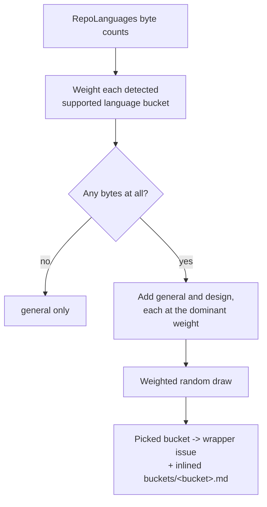

# PR Summary — Issue #662

## Summary

Adds `design`, a second language-agnostic best-practices bucket, carrying the
twelve named design smells from Fowler's _Refactoring_ ch. 3 as checks — each
written as _what it is_ → _how to fix it_ — and registers it alongside the
existing buckets so the idle-task filer can draw it. Closes #662.

The two rules that make the baseline safe are stated in the guide and binding on
every check: the repository's own documented standards override the baseline
(where a documented convention endorses the shape a smell would flag, the
candidate is dropped), and every smell is reported as a judgement call
("Possible Feature Envy in …"), never a violation. Anything the repo's tooling
already enforces is skipped.

Three further limits answer the issue's vetting notes:

- **A tighter cap than the other buckets** — at most three findings per run
  (against the orchestrator's six), severity floor `low` and ceiling `medium`.
  The orchestrating prompt was updated so a bucket guide's tighter cap wins.
- **The object-oriented smells are scoped** — middle man and refused bequest
  (and the polymorphic-dispatch fix in repeated switches) apply only where the
  repo actually uses delegation or an inheritance hierarchy, and stay silent on
  a procedural or declarative repo such as Bash or Terraform.
- **Overlap is assigned one owner per shape** — duplicated code belongs to the
  `duplicated_knowledge` scan and unreferenced code to the `dead_code` scan; the
  `design` bucket files only the design-shaped remainder, and checks the
  orchestrator's open-issue list before filing either.

Because neither `general` nor `design` names a language, a repo written entirely
in unsupported languages (Bash, Python, COBOL) now draws one of them instead of
`general` every time — which is what gives such a repo design feedback at all. A
repo with no detected code has nothing to design-review and still falls back to
`general` alone.

### Bucket selection after this change

## Evidence

Backend/prompt change with no web interface, so there is no screenshot to
capture. The evidence is the test suite and the quality gate:

- `./quality.sh < /dev/null` — passes (exit 0), including `deno fmt --check`,
  `deno lint`, the full Deno test suite, markdownlint and the mermaid check.
- 121 tests pass across the affected files (`best_practices_bucket_picker_test.ts`,
  `best_practices_template_test.ts`, `bucket_docs_test.ts`,
  `bucket_check_numbering_test.ts`, `best_practices_bucket_guides_consumer_test.ts`,
  `setup_content_label_definitions_test.ts`).
- `bucket_docs_test.ts` and `best_practices_bucket_guides_consumer_test.ts` are
  the structural gates: the new guide must be linked from `CODING-STANDARDS.md`
  and must exist on disk for every bucket the template can target.

## Acceptance Criteria

<!-- vibe-spec-review inputs="diff+issue-body" -->

- **met** — new bucket `prompts/best_practices/buckets/design.md` carrying the
  twelve named smells, each as _what it is_ → _how to fix_ — evidence:
  `prompts/best_practices/buckets/design.md:48-115` (gapless checks 1–12,
  verified by `worker/deno/tests/bucket_check_numbering_test.ts`) — reviewer: met
- **met** — the repo's documented standards override the baseline — evidence:
  `prompts/best_practices/buckets/design.md:24-31` — reviewer: met
- **met** — every smell reported as a judgement call, never a violation, and
  tooling-enforced shapes skipped — evidence:
  `prompts/best_practices/buckets/design.md:32-43,144` — reviewer: met
- **met** — registered alongside the existing buckets, selectable by the
  idle-task filer — evidence: `worker/deno/lib/best_practices_bucket_picker.ts:104`,
  `worker/deno/lib/idle_task_templates/best_practices_template.ts:240`,
  `worker/deno/setup/content_label_definitions.ts:262`, and
  `worker/deno/tests/best_practices_bucket_picker_test.ts::pickBucket - design is a candidate on a marker-only repo`
  — reviewer: met
- **met** — kept out of `general.md`, whose scope line is explicit — evidence:
  `prompts/best_practices/buckets/general.md` untouched;
  `prompts/best_practices/buckets/design.md:11-18` states the scope split —
  reviewer: met
- **met** — hard cap on findings per run so the scan does not become noise —
  evidence: `prompts/best_practices/buckets/design.md:135-143` and
  `prompts/best_practices/v12.md:358-360` (a guide's tighter cap wins) —
  reviewer: met
- **met** — decision recorded on whether the object-oriented smells earn their
  place — evidence: `prompts/best_practices/buckets/design.md:117-126` —
  reviewer: met
- **met** — suppression rule for the `duplicated_knowledge` / `dead_code`
  overlap — evidence: `prompts/best_practices/buckets/design.md:153-177` —
  reviewer: met
- **unrequested** — the picker no longer returns `general` deterministically for
  a repo whose languages have no bucket; `general` and `design` now draw 50/50
  — evidence: `worker/deno/lib/best_practices_bucket_picker.ts:91-108` —
  reviewer: unrequested — reason: kept, because the issue's stated gap is that
  "a repo in a language with no bucket gets no design feedback whatsoever";
  without this the new bucket is unreachable on exactly those repos
- **unrequested** — `design` competes at the dominant language's weight, so a
  single-language repo's language bucket falls from a 1/2 to a 1/3 share —
  evidence: `worker/deno/lib/best_practices_bucket_picker.ts:108` — reviewer:
  unrequested — reason: kept, because it mirrors exactly how `general` is
  registered; a fractional weight would be a new, undocumented weighting rule
- **unrequested** — an operator-manual section describing the new bucket —
  evidence: `docs/BEST-PRACTICES-SCAN.md:371-406` — reviewer: unrequested —
  reason: kept, because every other bucket has a doc surface and the repo's
  standards require a docs change alongside the code change
- **unrequested** — a new orchestrating prompt version `v12.md` (copy of `v11`
  plus 26 changed lines) — evidence: `prompts/best_practices/v12.md:31,179-182,358-360`
  — reviewer: not flagged as creep — reason: prompt versions are immutable in
  this repo, so any prompt edit is a new version

## Standards Review

<!-- vibe-standards-review inputs="diff+CODING-STANDARDS.md" -->

- **violation** — `docs/PROMPTS.md` still enumerated the buckets without
  `design`, breaching "A Code Change Owes a Docs Change" — evidence:
  `docs/PROMPTS.md:33` — reason: fixed in this diff
- **violation** — "a ninth bucket" wording described the pre-change world after
  `design` became the ninth — evidence: `CODING-STANDARDS.md:261`,
  `worker/deno/lib/bucket_docs_check.ts:14`,
  `worker/deno/tests/bucket_docs_test.ts:15` — reason: fixed in this diff, made
  version-neutral ("a new bucket") so it cannot drift again
- **violation** — the picker's module summary still called `general` the only
  language-agnostic bucket while its own design notes had been updated —
  evidence: `worker/deno/lib/best_practices_bucket_picker.ts:4` — reason: fixed
  in this diff
- **violation** — `dominantRawWeight()` guarded against a missing `raw` and
  non-numeric byte counts that the non-optional `Record<string, number>` cannot
  hold, against KISS — evidence:
  `worker/deno/lib/best_practices_bucket_picker.ts:117` — reason: fixed in this
  diff, now `Math.max(0, ...Object.values(langs.raw))`
- **violation** — the picker test re-implemented `bucketSlug()` locally instead
  of importing it, against DRY/single-source-of-truth — evidence:
  `worker/deno/tests/best_practices_bucket_picker_test.ts:35` — reason: fixed in
  this diff; the tests now call the real `bucketSlug`
- **violation** — the zero edge case of the new code path was untested (only the
  empty-map case was covered), against the required happy/error/edge coverage —
  evidence: `worker/deno/tests/best_practices_bucket_picker_test.ts` — reason:
  fixed in this diff by
  `pickBucket - all-zero byte counts count as no code at all`
- **violation** — the operator manual said "Three rules … all three live in
  buckets/design.md" where the guide states two binding rules plus separate
  limits and a cap — evidence: `docs/BEST-PRACTICES-SCAN.md:383` — reason: fixed
  in this diff; the manual now says "three limits — the guide's two binding
  rules and its own finding cap"
- **violation** — several guide instructions were negatively framed against the
  standards' "prefer positive instructions" rule — evidence:
  `prompts/best_practices/buckets/design.md:29,37,43,124,138,153` — reason:
  fixed in this diff where the positive phrasing carries the same meaning; the
  `severity:high` prohibition stands as a hard bound, matching the sibling
  guides
- **violation (stands)** — `prompts/best_practices/v12.md:29-31,173` still lists
  `github-actions` as a bucket, though no such guide exists and workflow review
  moved to the `github-actions-audit` template — evidence:
  `prompts/best_practices/v12.md:30` — reason: stands; it is pre-existing since
  v1 and the picker cannot emit that slug, so removing it is a separate change
  outside this issue's scope
- **clean** — Australian English throughout the added lines (`labelled`,
  `licence`, `judgement`, `recognisable`, `colour`, `catalogue`); prompt
  versions immutable (`v11.md` untouched, `v12.md` new); every added test calls
  real code and asserts on returned values or distributions (no source-text
  greps); the guide follows the house bucket shape with gapless `1..12` check
  numbering; `lang:design` label registered with its own test; no hidden paths
  staged; the one new branch (`dominantWeight <= 0` → `general`) is a documented
  domain fallback, not a swallowed error

One further reviewer observation, recorded rather than changed: a repo whose
only bytes are CSS, Makefile or Dockerfile will draw `design` and then exit with
zero findings under the guide's own "no source at all" rule. It burns an idle
slot at worst, and those repos arguably do contain code, so the byte-count gate
was left as it is.

## Test Plan

Added (`worker/deno/tests/best_practices_bucket_picker_test.ts`):

- `pickBucket - unknown language only returns general or design` — the
  behaviour change for repos with no language bucket.
- `pickBucket - a repo with no code at all never picks design`
- `pickBucket - all-zero byte counts count as no code at all`
- `pickBucket - design is a candidate on a marker-only repo`
- `pickBucket - design does not displace the language buckets` — each of
  language / general / design holds about a third on a single-language repo.
- `pickBucket - general and design weights equal the max language byte count` —
  updated proportions and chi-square degrees of freedom for the extra bucket.

Added (`worker/deno/tests/best_practices_template_test.ts`):

- `bucketSlug - returns 'design' for the design pick (Issue #662)`
- `parseBucketFromBody - recovers the design bucket`
- `isLanguageBucket - design is NOT a language bucket (Issue #662)` — a design
  run has no linter/compile CI gate to check.

Updated: `best_practices_bucket_guides_consumer_test.ts` and
`setup_content_label_definitions_test.ts` now include `design` in the bucket
list, so the guide file and the `lang:design` label are both required to exist.

No existing test was removed or disabled. One existing assertion changed
deliberately: `pickBucket - unknown language only returns general` asserted the
old contract that an unsupported-language repo always returns `general`, which
is precisely the gap this issue closes; it is rewritten (not deleted) to assert
the new general-or-design contract.
