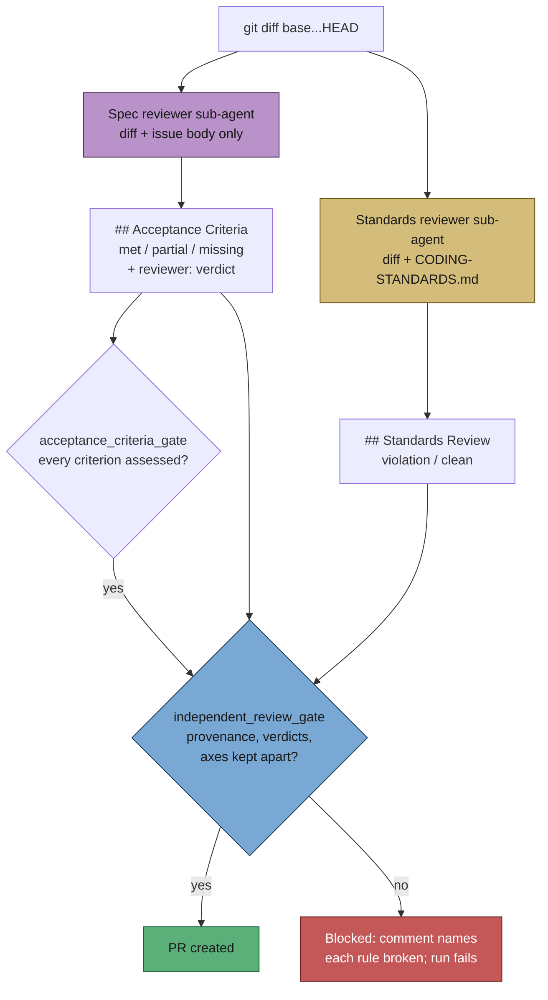

## Summary

The `## Acceptance Criteria` closure block was self-assessed by the agent that
wrote the code, in the context that produced it — which is why the prompt had to
counter-steer in wording ("do not inflate a status", "when in doubt use
`partial`"). The Standards axis was the injected `<coding_guidelines>` block,
applied while writing rather than checked against the finished diff, and the two
were never reported side by side.

This change puts the structural fix behind both: a criteria-bearing issue now
dispatches **two independent reviewer sub-agents** before the PR summary is
written, and their verdicts — not the author's recollection — populate the
summary, on two headings that are never merged or reranked.

- **`prompts/issue/v39.md`** (new; v38 untouched) — a new
  **Independent Review Before the PR** section dispatches both reviewers in one
  parallel `Agent` message. The Spec reviewer gets only
  `git diff <base>...HEAD` and the issue body (never the implementation
  transcript) and answers the three Spec questions: requirements missing or
  partial, behaviour in the diff that was not asked for, and requirements that
  look implemented but are implemented wrongly. The Standards reviewer gets the
  diff and `CODING-STANDARDS.md`. The closure block now carries a provenance
  marker and a `reviewer:` verdict per entry; the Standards findings sit under
  their own `## Standards Review` heading, and the closing summary names the
  worst issue *within each axis*. The two reviewers are carved out of the
  "Delegate sparingly" cap explicitly — an independent context is the point, and
  it is two agents, not a fleet.
- **`worker/deno/lib/independent_review_gate.ts`** (new) — the deterministic
  gate behind that prose, running beside `acceptance_criteria_gate.ts` at the
  same PR-creation chokepoint in `completion_phase.ts`. It blocks when the
  criteria block carries no `vibe-spec-review` provenance, when an entry names
  no `reviewer:` verdict, when a departure from that verdict carries no reason,
  when `## Standards Review` is absent/unsourced/empty, when a `violation` names
  no evidence or outcome, or when either axis carries the other's findings.

**The open question the issue left — does the reviewer's verdict bind or merely
challenge?** It challenges, and the departure is recorded. A reviewer that saw
only the diff is sometimes wrong about a criterion satisfied by code it could
not see, so the run may depart from its verdict — but only out loud, keeping the
`reviewer:` field as the reviewer wrote it and adding a one-line `reason:`. A
binding verdict would have made a blind reviewer's mistake unappealable; a
merely advisory one would have restored the self-assessment. Recorded departure
is the fail-loud middle: the disagreement is visible in the PR, not resolved
silently in the author's favour.

Credit for the idea belongs to `skills/engineering/code-review/SKILL.md` in
[mattpocock/skills](https://github.com/mattpocock/skills), recorded in
`docs/REFERENCES.md`.

Closes #663.

## Evidence

Backend/CLI only — there is no web surface to screenshot. The evidence is the
tests below plus the live completion-phase integration test, which drives
`workOnIssueCompletion` and asserts that `gh pr create` does **not** run when a
criteria-bearing issue produces a self-assessed summary.



Command output:

```
deno test -A tests/independent_review_gate_test.ts
ok | 19 passed | 0 failed

deno test -A tests/issue_prompt_v39_independent_review_test.ts
ok | 8 passed | 0 failed

deno test -A tests/completion_phase_acceptance_closure_test.ts tests/acceptance_criteria_gate_test.ts
ok | 19 passed | 0 failed
```

## Test Plan

Added:

- `worker/deno/tests/independent_review_gate_test.ts` — 19 tests driving the
  real gate: applicability, both provenance markers (including a marker with
  empty `inputs`), a missing per-entry `reviewer:` verdict, an unrecognised
  verdict, a silent departure vs a recorded one, the Standards section rules
  (absent, unsourced, empty, a `violation` with no evidence or outcome), axis
  separation in both directions, prose that mentions the other axis without
  merging it, and the blocking comment.
- `worker/deno/tests/issue_prompt_v39_independent_review_test.ts` — 8 tests
  asserting v39 resolves as the latest issue prompt, keeps every placeholder and
  previously gated block, dispatches both reviewers with their exact inputs,
  asks all three Spec questions, keeps the axes on separate headings, records
  provenance and departures, carves the reviewers out of the delegation cap, and
  — the anti-drift test — that the worked example v39 tells a run to copy
  actually passes `validateIndependentReview`.

Modified (documented behaviour changes, no test removed or weakened):

- `worker/deno/tests/completion_phase_acceptance_closure_test.ts` — the passing
  fixture `SUMMARY_WITH_BLOCK` gained the provenance markers, the `reviewer:`
  verdicts and the `## Standards Review` block, because a closure block alone is
  no longer a passing summary. The old shape is retained as
  `SUMMARY_SELF_ASSESSED` and drives a new test asserting the review gate blocks
  it. Every pre-existing assertion is unchanged.
- `worker/deno/tests/issue_prompt_v38_reproduction_method_test.ts` — the
  "is the version the worker resolves" test now asserts v38 still loads by
  explicit version and is no longer the resolved one, since v39 supersedes it.
  All v38 content assertions are untouched.

Docs updated in the same change: `docs/workflows/issue-processing.md` (new
"Independent review on two axes" section with a Mermaid diagram),
`docs/PROMPTS.md` (the issue-prompt row) and `docs/REFERENCES.md` (credit for
the two-axis review).

## Standards Review

<!-- vibe-standards-review inputs="diff+CODING-STANDARDS.md" -->

The gate does not apply to this issue — issue #663 states no
`## Acceptance Criteria`, so no reviewer sub-agents were dispatched and no
verdict is claimed. This block is here because the change *is* the two-axis
contract, and the Standards axis of it should be visible on its own PR:

- **clean** — Australian English throughout the new module, its tests and the
  docs (behaviour, organisation, minimise)
- **clean** — untrusted-text handling: the new gate caps the scanned slice at
  200k chars and uses only hardcoded bounded regexes, never a `new RegExp` built
  from an argument (the ReDoS surface Semgrep blocks), matching
  `reproduction_status_gate.ts`
- **clean** — fail-loud: the gate reports every rule broken and blocks PR
  creation; nothing degrades to a silent pass, and the prompt forbids writing a
  provenance marker for a review that was not run
- **clean** — no hidden paths staged; the deliverables are the prompt, the gate,
  its tests and the docs
