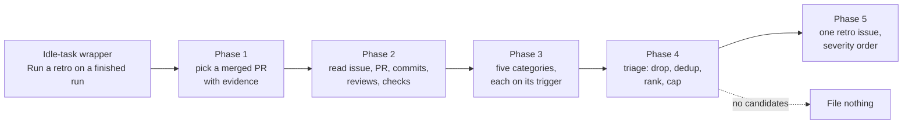

## Summary

Added `retro`, the eighteenth idle-task template: a **suggestion-only**
retrospective that reads a finished piece of work in the target repository —
the most recent merged PR with enough evidence, its issue, its commits, and its
review and check feedback — and files **at most one** issue listing environment
improvement candidates in severity order, each naming the surface it would
change. It edits nothing and never raises a PR. Closes #664.

The idea comes from a review of the `retro` skill in
[mattpocock/skills](https://github.com/mattpocock/skills); credit belongs there.

**Categories, trimmed to what our artefacts support** (the issue's own vetting
note): navigation, automated checks, coding standards, steering-file size, and
information access. **Tool economy** and **no-ops** are explicitly out of scope
and the prompt says so — both need the session transcript, which merged
artefacts do not carry, and the no-op test is already owned by the prompt
rubric (#659, which landed first). The "reviewer, not implementer" argument in
the issue was left alone: the issue itself says it deserves its own issue rather
than riding on this one.

**Duplicate suppression** uses the framework's standard two-line contract, so
the scan cannot re-propose "the steering file is too big" every week: each
candidate carries its own `<!-- finding-id: BP-… -->` marker inside the filed
issue, and both `{{KNOWN_OPEN_FINDING_IDS}}` and `{{OPEN_ISSUE_TITLES}}` are
fetched repo-wide (no `--label`) and substituted into the prompt.

## Evidence

Backend/CLI change — no web interface to screenshot. Evidence is the test suite:
`worker/deno/tests/retro_template_test.ts` (19 cases) plus the framework-wide
conformance gates, which now cover the new template rather than skipping it.



Local run (the container exports `PROMPTS_DIR`/`VIBE_BASE_DIR` at a stale
sibling checkout, so the prompt-loading tests are run with those unset — CI sets
neither):

```
env -u PROMPTS_DIR -u VIBE_BASE_DIR deno test --allow-all tests/ < /dev/null
```

## Test Plan

- **Added** `worker/deno/tests/retro_template_test.ts` — registration, contract
  flags (`cooldownHours: 168`, `skipMilestone`, `outputLabel`,
  `requiresStructuredOutput`), title/body dispatch fingerprint, prompt assembly
  including the `(none)` sentinels and the attribution footer, `shouldFile`
  veto, `runTask` happy path / scan failure / unexpected throw / empty diff, the
  repo-wide title lookup reaching the scan runner and degrading to `[]` on a
  `gh` failure, and claim-handler dispatch.
- **Extended** `worker/deno/tests/idle_task_scan_dedup_conformance_test.ts` —
  a `retro` harness, so the framework's dedup contract is enforced against it
  rather than the template being implicitly skipped.
- **Extended** `idle_task_cross_repo_body_refs_test.ts` (the prompt body is
  filed cross-repo, so it must carry no bare `#NNN` refs or internal paths),
  `scan_prompt_open_issue_titles_test.ts` (the dedup block verbatim),
  `prompt_manager_test.ts`, `idle_task_body_preview_limit_test.ts` and
  `idle_task_backfill_test.ts` (allowlist is now eighteen titles).

## Files

- `prompts/retro/v1.md` — the scan prompt (five phases, five categories, the two
  out-of-scope categories stated, one-issue output contract).
- `worker/deno/lib/idle_task_templates/retro_template.ts` — the template.
- `docs/RETRO-SCAN.md` — operator manual.
- Wiring: side-effect imports (claim handler, idle filer, wrapper seeder,
  freshness report), the backfill title map, `idle_task_template_names.ts`,
  `prompt_manager.ts` placeholders, and the `retro` content label.
- Docs: framework registry row, README documentation table,
  seventeen → eighteen counts in `DESIGN-PRINCIPLES.md` and
  `docs/IDLE-TASK-FRAMEWORK.md`.
