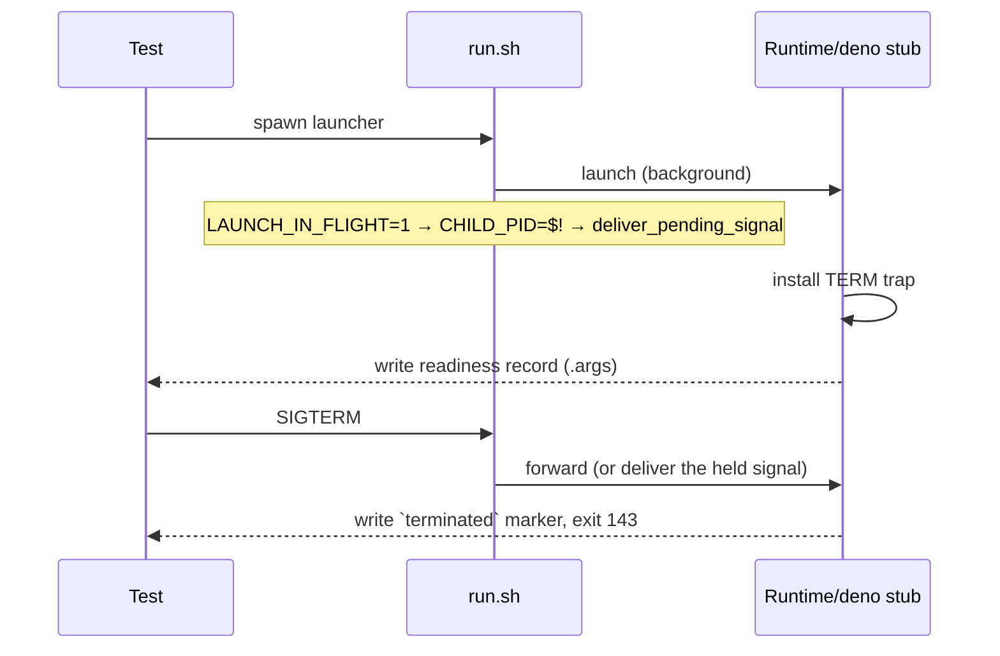

# Make the launcher SIGTERM readiness gate honest (Issue #668)

## Summary

The launcher SIGTERM tests wait for a stub's invocation record and then signal
the launcher, so that record has to mean **"ready to be signalled"** — not
merely "invoked". The deno stub's `run-entrypoint` path wrote its record first
and installed the TERM trap afterwards, leaving a window in which TERM took its
default disposition, the stub died silently, and the marker the test reads was
never created. That is the shape that failed `validate (container)` on a
docs-only PR.

Three changes, no assertion retried and no timeout widened:

- **`worker/deno/tests/fixtures/launcher_harness.ts`** — the deno stub installs
  its TERM handler (and initialises `sleep_pid`) **before** writing
  `run-entrypoint.args`, matching the runtime stub. A new `STUB_READY_DELAY`
  (with `STUB_READY_DELAY_SUB`, default `run`) stalls a stub between its
  readiness record and the work that record gates, so a test can hold the stub
  inside the window a loaded CI runner falls into and prove the gate rather than
  assume it. `stubPath()` is exported so a test can drive a stub directly.
- **`run.sh`** — a signal landing between the background launch and
  `CHILD_PID=$!` used to see an empty `CHILD_PID` and re-raise TERM on the
  launcher, leaving the container running unsignalled. It is now held
  (`LAUNCH_IN_FLIGHT` / `PENDING_SIGNAL`) and delivered by
  `deliver_pending_signal` the moment the PID is known. Held, never dropped: a
  signal arriving when no launch is in flight still takes its default
  disposition, so a shutdown request during an image build still fails loud.

Closes #668.

## Evidence

Backend/CLI change — no web surface to screenshot. The evidence is the test
run: each new case was observed failing against the unfixed ordering and passing
after the fix (see **Reproduction**).

The invariant both stubs now keep: **trap installed → record written → work**.
A test that sees the record can signal safely at any point after it.

## Reproduction

- **symptom** — `run.sh - propagates SIGTERM to the container and reports its
  status` failed in CI with
  `NotFound: … readfile '/tmp/vibe_launcher_test_*/record/terminated'`: the stub
  was signalled before its TERM trap existed, so it died without writing the
  marker.
- **status** — `verified` — with the trap moved back after the record (the
  unfixed ordering) and the stub held in that window, both stub cases failed
  with exactly the CI symptom (`actual: null`, expected `"terminated"`); with
  the fix in place all four cases pass.
- **regression test** —
  `worker/deno/tests/launcher_signal_readiness_test.ts::deno stub - a TERM in
  the window after the run-entrypoint record still writes the marker (Issue
  #668)` and `::run.sh - a SIGTERM held while the launch is in flight reaches
  the container (Issue #668)`.

The second, narrower cause — a signal landing between `… &` and `CHILD_PID=$!`
inside `run.sh` — is fixed but not separately reproduced: that window is a
single assignment wide in the parent shell and cannot be hit deterministically
from outside the process. It is covered indirectly by
`::run.sh - a SIGTERM before any container exists still fails loud (Issue
#668)`, which proves the new hold path neither swallows a signal nor hangs the
launcher when there is no child to forward to.

## Test Plan

- Added `worker/deno/tests/launcher_signal_readiness_test.ts` (4 cases):
  - runtime stub — a TERM in the window after the `run` record still writes the
    marker and exits 143.
  - deno stub — the same for `run-entrypoint` / `entrypoint-terminated`.
  - `run.sh` — a SIGTERM after the container is recorded reaches the container
    (marker written, launcher exits 143).
  - `run.sh` — a SIGTERM before any container exists still fails loud, forwards
    nothing, and never falls through to a launch.
- Re-ran `tests/run_sh_launcher_test.ts`, `tests/launcher_parity_test.ts` and
  `tests/launcher_failure_evidence_test.ts`: 67 passed, 0 failed.
- `shellcheck run.sh` and `bash -n run.sh` clean.
- Full `./quality.sh`: every check PASSED except `deno tests`, which fails on
  this container for reasons this change does not touch — `run_core_test.ts` and
  `run_core_rate_limit_resume_test.ts` abort on their simulated
  `API rate limit already exceeded` fixture, and
  `service_account_env_test.ts::applyServiceAccountEnv - an unwritable gh config
  dir is restaged writable` asserts on a permission this sandbox cannot revoke.
  The same suite was run at the pre-change commit for comparison: 58 failures
  before, 58 after (with the 4 new cases passing), and the failing set drifts
  between runs under parallel load. No launcher case is among them.
