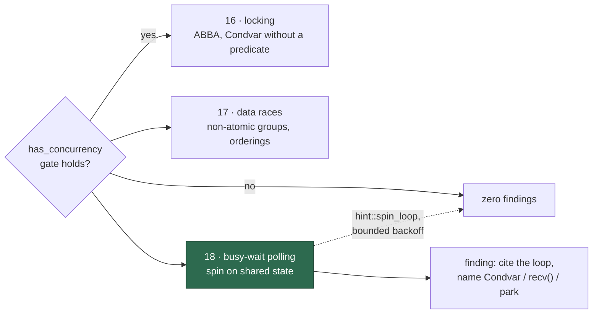

# PR Summary — Issue #677

## Summary

Added one new check to the Rust best-practices bucket: **busy-wait polling**.
A consumer thread that spins on shared state — `while !ready.load(Ordering::Acquire) {}`,
a bare `loop { if *done.lock().unwrap() { break } }`, `try_recv()` retried with
no wait — holds a core at 100 % for the entire length of the wait and starves
the producer it is waiting on. The bucket had no check for it: check 16 already
covers the two other lessons from the source video (a `Condvar` pairs with the
`Mutex` guarding the state, and a woken thread rechecks its predicate in a
`while` loop), so only the spin itself was missing. Closes #677.

The new check is **18**, sitting with the other two `has_concurrency`-gated
clusters (16 locking, 17 data races), so checks 18–30 shift to 19–31. It follows
the bucket's static-evidence rule — grep-able patterns, no build or test
commands — and explicitly does **not** flag deliberate spinning:
`hint::spin_loop()` inside a lock-free retry, and a bounded backoff that sleeps
or yields between attempts, both stay. Overlap with check 16 is suppressed in
the text (a `Condvar` waited without a predicate loop is check 16's finding, not
this one).

Renumbering thirteen checks is exactly the edit that leaves two "check 18"s or a
hole behind, and findings cite those numbers, so the change ships with a guard:
`worker/deno/lib/bucket_check_numbering.ts` fails loudly when any bucket guide's
checks are not a gapless `1..N`. It parses structure only — no prose assertions
— so guides stay freely rewordable, per the WHAT-vs-HOW rule (Issue #3115) that
retired the old prose-grep bucket tests.

## Evidence

Backend/prompt change with no web interface, so there is no screenshot to
capture. The evidence is the test suite plus the guide itself.

Check numbering after the change (`prompts/best_practices/buckets/rust.md`):

```text
16. **Concurrency — locking.**            Gate: has_concurrency
17. **Concurrency — data races.**         Gate: has_concurrency
18. **Concurrency — busy-wait polling.**  Gate: has_concurrency   ← new
19. **Async-runtime hazards.**            Gate: has_async         ← was 18
…
31. **Standard-library supersessions.**                           ← was 30
```

Where the new check sits in the scan:



Test run (`worker/deno`):

```text
deno test --allow-read --allow-env --allow-write --allow-run \
  tests/bucket_check_numbering_test.ts tests/bucket_docs_test.ts \
  tests/references_doc_test.ts tests/best_practices_bucket_guides_consumer_test.ts
ok | 60 passed | 0 failed
```

The numbering guard was watched failing before the implementation existed
(module absent → type-check failure) and again against mis-numbered fixture
Markdown (duplicate, gap, list not starting at 1) before the assertions were
brought green.

## Quality gate

`./quality.sh` reports every stage PASSED except `deno tests`, which fails on
**33 pre-existing, environment-caused failures unrelated to this change**:

- `tests/run_core_test.ts` and `tests/run_core_rate_limit_resume_test.ts` —
  module-level uncaught error, `gh command failed (exit 1): GraphQL: API rate
  limit already exceeded for user ID 23146043`. The worker account's GitHub API
  budget is spent on this host.
- `tests/service_account_env_test.ts::applyServiceAccountEnv - an unwritable gh
  config dir is restaged writable` — expects the restaged directory under
  `TMPDIR`, gets this host's `/home/vibe/auto-issue-work/.container-state/…`.

Verified pre-existing: the same three files were run in a clean worktree at the
base commit `daf1c1b` (before any change here) and produced the identical
`FAILED | 50 passed | 33 failed` result. None of them read a bucket guide, the
references document, or the new numbering module, and the four suites that do
(`bucket_check_numbering`, `bucket_docs`, `references_doc`,
`best_practices_bucket_guides_consumer`) are green. Fixing the host's `gh`
budget and the container-state path is separate work and out of scope here.

## Test Plan

Added `worker/deno/tests/bucket_check_numbering_test.ts` (10 tests):

- `checkNumbersIn` — collects check headings in order; ignores numbered lines
  inside fenced code blocks; ignores ordinary numbered prose with no bold lead;
  a guide with no checks yields none.
- `findCheckNumberingIssues` — a gapless `1..N` sequence is clean; a duplicated
  number, a skipped number, and a list not starting at 1 are each reported with
  the expected-versus-found position.
- Live sweep — every guide under `prompts/best_practices/buckets/` numbers its
  checks `1..N` with no gaps. This is the assertion that would have caught a
  slip in this PR's own renumber.

Existing suites re-run unchanged and green: `bucket_docs_test.ts`,
`references_doc_test.ts`, `best_practices_bucket_guides_consumer_test.ts`.

## Docs

- `docs/BEST-PRACTICES-SCAN.md` — bug-class cluster count fourteen → fifteen,
  the concurrency cluster renamed to "locking, data races and busy-wait
  polling", and a paragraph on what the new cluster flags and what it leaves
  alone.
- `docs/REFERENCES.md` — credits the source video in the language-bucket table,
  per that page's rule that every external idea names its author.
