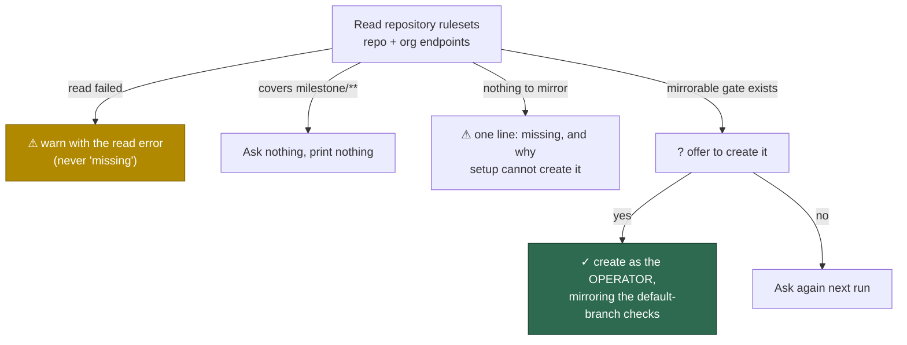

# setup: stop re-asking the milestone-ruleset question

## Summary

`setup.sh` kept asking "no ruleset covers `milestone/**` … create one? [y/N]"
on repositories where a previous run had already answered yes. The repository
state is the only memory, so the fault had to be in the detection read path —
and it was. Three ways a run reached that prompt with nothing an answer could
change, all closed:

1. **An unreadable ruleset state was reported as a missing ruleset.**
   `fetchRulesetDetails` caught every read failure and returned an empty list,
   so "cannot see the rulesets" was indistinguishable from "this repository has
   no rulesets" — and the assessment duly reported `no-milestone-ruleset`. It is
   replaced by `readRulesetDetails`, which returns the error, and setup prints a
   ⚠ naming the repository and the read error instead of offering to create
   anything. An unreadable individual ruleset, an empty response body and a
   summary carrying no id are all failures too: any one of them could be the
   milestone ruleset, so none is quietly omitted.
2. **The question was asked where creation was impossible.** On a repository
   whose default branch takes direct pushes there is no default-branch gate to
   mirror, so answering yes creates nothing (`createMilestoneRuleset` refuses to
   guess a check set) and the identical question returned on every run. The pure
   `planMilestoneRuleset` decides `covered` / `creatable` / `not-creatable`
   before the prompt; `not-creatable` explains itself in one line and asks
   nothing. `createMilestoneRuleset` writes from that same decision.
3. **Organisation-inherited rulesets 404'd the whole read.** The repository's
   ruleset list includes rulesets inherited from the organisation, but GitHub
   serves those from `orgs/{org}/rulesets/{id}` and answers the repository path
   for the same id with 404. Fetching every id from the repository path failed
   the entire read — which, now that a failed read is loud, would have warned on
   every run about a repository whose `milestone/**` ruleset is present and
   perfectly readable, reintroducing the reported noise through the fix itself.
   `rulesetDetailPath` routes each summary to the endpoint that serves it.

Setup also reads each repository's rulesets **once** and shares them between the
milestone findings, the offer and the default-branch auto-merge check (Issue
#553). The one call that deliberately re-reads is the create: it runs under the
operator's ambient credentials, the only identity holding the `admin` a ruleset
write needs (Issue #595), so it must decide what to write from what that
identity can see.

Closes #678.

## Evidence

Backend/CLI change — no web interface to screenshot. Evidence is the
reproduction below plus the test run.



Test run (`worker/deno`):

```text
deno test --allow-all tests/milestone_ruleset_read_test.ts \
  tests/milestone_ruleset_check_test.ts
ok | 44 passed | 0 failed
```

## Reproduction

- **symptom** — a `setup.sh` re-run asked `Create one mirroring the
  default-branch checks? [y/N]` again for repositories whose milestone ruleset
  had already been created (or could never be created) on a previous run
- **status** — `verified` — a standalone script driving `checkMilestoneRuleset`
  with a failing `gh` read was run against the unfixed tree in a detached
  worktree at `758233e^` and printed
  `codes: [ "no-milestone-ruleset" ]` (exit 1, the finding that triggers the
  prompt); the same script against the fixed tree printed
  `codes: [ "ruleset-read-failed" ]` (exit 0). The scratch script and worktree
  were removed after the run
- **regression test** —
  `worker/deno/tests/milestone_ruleset_read_test.ts::checkMilestoneRuleset - an unreadable state is reported as unreadable, never as missing`
  and
  `worker/deno/tests/milestone_ruleset_read_test.ts::reportMilestoneRuleset - a repo whose ruleset exists asks nothing and says nothing`

The second cause was confirmed against the live fleet: `stSoftwareAU/GRQ-setup`
— one of the repositories in the issue's log — has no rulesets at all, so every
run asked a question that could only ever be refused.

## Acceptance Criteria

<!-- vibe-spec-review inputs="diff+issue-body" -->

The issue's "Accepted scope so far" bullets are treated as the stated criteria.

- **met** — answering `y` creates the ruleset in the same run and prints the ✓
  line; a failed creation warns with the repo and the error, never a silent
  no-op — evidence:
  `worker/deno/tests/milestone_ruleset_read_test.ts::reportMilestoneRuleset - a failed creation warns and is never a silent no-op`
  — reviewer: met
- **met** — a later run against a repo whose `milestone/**` ruleset exists asks
  no question and prints nothing for that item — evidence:
  `worker/deno/tests/milestone_ruleset_read_test.ts::reportMilestoneRuleset - a repo whose ruleset exists asks nothing and says nothing`
  — reviewer: partial — reason: departed. The reviewer raised two gaps against
  the diff it saw. The second — an org-inherited ruleset 404ing the whole read,
  so a healthy repo warns every run — was real and is **fixed** in `a885fc9`
  (`rulesetDetailPath`, covered by
  `readRulesetDetails - an organisation-inherited ruleset is read from the org endpoint`).
  The first — that detection still reads as the service account while the create
  writes as the operator, so an unreadable repo now warns every run instead of
  asking every run — is the behaviour criterion 4 explicitly requires, not a
  gap: the issue states an unreadable state must warn and must never be reported
  as missing. Making the read use the operator's credentials would silence that
  warning by removing the diagnostic the issue asked for
- **met** — no per-answer state is stored; a declined answer leaves the ruleset
  missing and the question returns next run — evidence: `reportMilestoneRuleset`
  recomputes from the live read each run and writes no config; a declined answer
  falls through to the `no-milestone-ruleset` warning
  (`worker/deno/setup/setup_cli.ts`) — reviewer: met
- **met** — an unreadable ruleset list warns with the repo and the read error
  and asks no creation question — evidence:
  `worker/deno/tests/milestone_ruleset_read_test.ts::checkMilestoneRuleset - an unreadable state is reported as unreadable, never as missing`
  and `worker/deno/setup/setup_cli.ts` (the `!read.ok` branch never reaches
  `reportMilestoneRuleset`) — reviewer: met
- **unrequested** — `planMilestoneRuleset` and the "not-creatable → do not ask"
  branch — reviewer: unrequested — reason: kept. It addresses the same reported
  symptom for five of the repositories in the issue's own log (`GRQ-setup`,
  `GRQ-insiders`, `GRQ-listing`, `GRQ-commodities`, `GRQ-dividends`), whose
  default branch takes direct pushes: the question there can only ever be
  refused. It does not conflict with the "keep asking while missing" criterion,
  which governs a *declined* answer, not an unanswerable question
- **unrequested** — reading the rulesets once per repository and passing them
  into `checkMilestoneRuleset` — reviewer: unrequested — reason: kept. It is
  what makes the offer, the findings and the auto-merge check assess one state;
  three independent reads could disagree about whether the ruleset exists, which
  is the defect class this issue is about
- **unrequested** — `fetchRulesetDetails` removed rather than deprecated —
  reviewer: unrequested — reason: kept. Its empty-list-on-failure contract *is*
  the defect; leaving it in place leaves the footgun loaded. Repo-wide grep
  confirms no other callers
- **unrequested** — a successful creation no longer skips the "legacy classic
  branch protection" warning for that repository (the old loop `continue`d) —
  reviewer: unrequested — reason: kept and flagged. The warning is accurate in
  both cases and suppressing it after a create was incidental, not intended

## Standards Review

<!-- vibe-standards-review inputs="diff+CODING-STANDARDS.md" -->

- **violation** — an empty list body was still read as "no rulesets", the very
  defect the change exists to remove (Never Fail Silently) — evidence:
  `worker/deno/lib/milestone_ruleset_check.ts:389` — reason: fixed in `a885fc9`;
  an empty body is now a failure, covered by
  `readRulesetDetails - an empty list body is a failure, not an empty repository`
- **violation** — a summary with no id was dropped with `continue`, contradicting
  the function's own "the one that could not be read may be the milestone
  ruleset" reasoning (swallowed error) — evidence:
  `worker/deno/lib/milestone_ruleset_check.ts:411` — reason: fixed in `a885fc9`;
  covered by `readRulesetDetails - a summary with no id fails rather than being skipped`
- **violation** — the docstring asserted the offer and the write "can never
  disagree", but the write re-reads under a different identity (comment
  accuracy / DRY) — evidence: `worker/deno/setup/setup_cli.ts:942-944` — reason:
  fixed in `a885fc9`; the docstring now states the re-read is deliberate and why
- **violation** — a repo with nothing to mirror printed two lines that read as
  contradictory: "no check set to mirror" beside "add a ruleset with required
  status checks" (DRY / per-run noise for the repos the issue named) — evidence:
  `worker/deno/setup/setup_cli.ts:970-974` and `:1015-1022` — reason: fixed in
  `a885fc9`; folded into one line, covered by
  `reportMilestoneRuleset - a repo with nothing to mirror asks nothing and warns once`
- **violation** — the operator-visible behaviour was untested: the fix lived in
  an unexported `reportMilestoneRuleset` that called the prompt directly, so
  nothing asserted that no question is asked (TDD coverage) — evidence:
  `worker/deno/setup/setup_cli.ts:951` — reason: fixed in `a885fc9`; the
  function is exported and takes its `gh`, prompt and print edges as seams, with
  five tests driving it
- **violation** — a source-text grep test guarded the write's identity, which
  this change had just relocated (TDD rule: no tests that grep source) —
  evidence: `worker/deno/tests/milestone_ruleset_check_test.ts:366-380` — reason:
  fixed in `a885fc9`; replaced by
  `reportMilestoneRuleset - answering yes creates under the OPERATOR identity`,
  which runs the code. Documented in place and in the commit message
- **violation** — a copied "Australian English spelling throughout (behaviour,
  organisation)" header naming words absent from the file (comment quality) —
  evidence: `worker/deno/tests/milestone_ruleset_read_test.ts:14` — reason:
  removed in `a885fc9`
- **violation** — the harness `wip:` commit `074db6b` cites "(Issue #47)" rather
  than this issue — evidence: `074db6b` — reason: stands. It is a
  worker-generated checkpoint commit carrying only the PR summary; the
  substantive commits `758233e` and `a885fc9` both cite Issue #678 and carry the
  `Vibe-Coder-Run-Id` trailer
- **clean** — Australian English in all new prose, identifiers and messages;
  commit safety (no hidden path staged, no `git add -f`, no `--no-verify`); tests
  drive real exports through injected seams and assert on returned values, never
  source text; fail-loud on every read path; `RulesetRead` follows the
  documented `Result`-shaped discriminated union; `deno fmt`, `deno lint`,
  `deno check` and `markdownlint-cli2` clean; `docs/SETUP.md` updated alongside
  the code with no stale `fetchRulesetDetails` reference anywhere

## Test Plan

`worker/deno/tests/milestone_ruleset_read_test.ts` (21 tests):

- `readRulesetDetails` — returns details on success; a failed list read, an
  unreadable individual ruleset, a non-list response, an empty body and a
  summary with no id are all failures, never an empty repository; an
  organisation-inherited ruleset is fetched from the org endpoint rather than
  404ing the whole read.
- `checkMilestoneRuleset` — an unreadable state yields `ruleset-read-failed` and
  never `no-milestone-ruleset`; an existing milestone ruleset is detected through
  the read path; caller-supplied rulesets are reused without a second read.
- `planMilestoneRuleset` — `covered`, `creatable` (with the mirrored contexts),
  and `not-creatable` for a repository with no mirrorable gate or no rulesets.
- `createMilestoneRuleset` — an unreadable ruleset list fails loud instead of
  deciding "nothing covers `milestone/**`"; an existing ruleset is left alone.
- `reportMilestoneRuleset` — a covered repo asks nothing and prints nothing; a
  creatable one is offered; answering yes writes under the `operator` identity
  and prints the ✓ line; a failed creation warns; a repo with nothing to mirror
  asks nothing and warns exactly once.

`worker/deno/tests/milestone_ruleset_check_test.ts` — one test removed and
documented in place: the source-text grep asserting the write's identity, now
covered by a test that executes the code (see the Standards Review entry). The
rest of the suite is unchanged and still passes.
