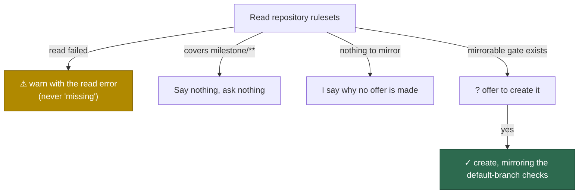

# setup: stop re-asking the milestone-ruleset question

## Summary

`setup.sh` kept asking "no ruleset covers `milestone/**` … create one? [y/N]"
on repositories where a previous run had already answered yes. Two ways a run
reached that prompt with nothing an answer could change, and both are closed:

1. **An unreadable ruleset state was reported as a missing ruleset.**
   `fetchRulesetDetails` caught every read failure and returned an empty list,
   so "cannot see the rulesets" was indistinguishable from "this repository has
   no rulesets" — and the assessment duly reported `no-milestone-ruleset`. It
   is replaced by `readRulesetDetails`, which returns the error, and setup
   prints a ⚠ naming the repository and the read error instead of offering to
   create anything. A single unreadable ruleset now fails the whole read too:
   the one that could not be read may be the milestone ruleset.
2. **The question was asked where creation was impossible.** On a repository
   whose default branch takes direct pushes there is no default-branch gate to
   mirror, so answering yes creates nothing (`createMilestoneRuleset` refuses to
   guess a check set) and the identical question returned on every run. The new
   pure `planMilestoneRuleset` decides `covered` / `creatable` / `not-creatable`
   before the prompt; `not-creatable` prints the reason once and asks nothing.
   `createMilestoneRuleset` now writes from that same decision, so the offer and
   the write can never disagree.

Setup also reads each repository's rulesets **once** and shares them between the
milestone findings, the offer and the default-branch auto-merge check (Issue
#553), which removes a duplicate read per repository.

Closes #678.

## Evidence

Backend/CLI change — no web interface to screenshot. Evidence is the
reproduction below plus the test run.



Test run (`worker/deno`):

```text
deno test --allow-all tests/milestone_ruleset_read_test.ts \
  tests/milestone_ruleset_check_test.ts
ok | 37 passed | 0 failed
```

## Reproduction

- **symptom** — a `setup.sh` re-run asked `Create one mirroring the
  default-branch checks? [y/N]` again for repositories whose milestone ruleset
  had already been created (or could never be created) on a previous run
- **status** — `verified` — with the same failing `gh` read,
  `checkMilestoneRuleset` at HEAD returned `["no-milestone-ruleset"]` (the
  finding that triggers the prompt) and returns `["ruleset-read-failed"]` after
  the fix; the new tests fail against the unfixed code and pass after it
- **regression test** —
  `worker/deno/tests/milestone_ruleset_read_test.ts::checkMilestoneRuleset - an unreadable state is reported as unreadable, never as missing`
  and
  `worker/deno/tests/milestone_ruleset_read_test.ts::planMilestoneRuleset - nothing to mirror means the question can never be answered usefully`

The second cause was confirmed against the live fleet: `stSoftwareAU/GRQ-setup`
— one of the repositories in the issue's log — has no rulesets at all, so every
run asked a question that could only ever be refused.

## Test Plan

Added `worker/deno/tests/milestone_ruleset_read_test.ts` (13 tests):

- `readRulesetDetails` — returns details on success; a failed list read, an
  unreadable individual ruleset, and a non-list response are all failures, never
  an empty repository.
- `checkMilestoneRuleset` — an unreadable state yields `ruleset-read-failed`
  and never `no-milestone-ruleset`; an existing milestone ruleset is detected
  through the read path; caller-supplied rulesets are reused without a second
  read.
- `planMilestoneRuleset` — `covered`, `creatable` (with the mirrored contexts),
  and `not-creatable` for a repository with no mirrorable gate or no rulesets.
- `createMilestoneRuleset` — an unreadable ruleset list fails loud instead of
  deciding "nothing covers `milestone/**`"; an existing ruleset is left alone.

The existing `worker/deno/tests/milestone_ruleset_check_test.ts` suite is
unchanged and still passes.

## Notes for the reviewer

- `fetchRulesetDetails` is **removed**, not deprecated: its silent
  empty-list-on-failure contract is the defect, and leaving it in place would
  leave the footgun loaded. There were no other callers.
- The per-repo milestone reporting moved into `reportMilestoneRuleset` in
  `setup_cli.ts`. One incidental behaviour change: a successful creation used to
  `continue` the repo loop and so skipped the "legacy classic branch protection
  is still present" warning for that repository; that warning is now printed in
  both cases.
