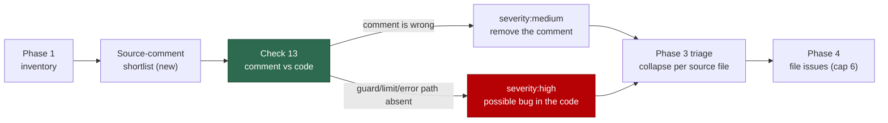

# PR Summary — Issue #685

## Summary

The source code is the single source of truth, so a comment that says something
the adjacent code does not do is rot with a line number attached. This adds
**check 13 — comment contradicts the code** to the existing `documentation-audit`
idle-task scan, as a new immutable prompt version
(`prompts/documentation_audit/v9.md`), rather than a one-off cleanup or a new
scan. Closes #685.

Two verdicts, and the distinction is the whole point of the check:

- **The comment is simply wrong** (a renamed parameter, a replaced algorithm, a
  default the constant contradicts) → the finding recommends **removing the
  comment**, citing its file and line and the code that refutes it.
  `severity:medium`.
- **The comment documents deliberate behaviour the code never implements** (a
  guard, limit, error path or lock it claims is applied) → the comment is the
  only surviving record of that intent, so it stays and the finding is filed as a
  **possible bug in the code**. `severity:high`.

Agent-file duplication of human standards — the issue's other concern — is
already owned by checks 5 and 9 of this same scan, which drive a repo towards one
shared set of instructions and at most one thin `AGENTS.md` pointer. No new check
was added for it, per the accepted scope; VibeCoder's own `AGENTS.md` already
models the end state.

### What changed



- `prompts/documentation_audit/v9.md` — new version: check 13, the bounded
  source-comment shortlist Phase 1 builds for it, per-source-file grouping, the
  `doc-coverage` ownership boundary, severity guidance, Phase 4 fix wording, and
  three worked examples (a stale comment, the possible-bug near-miss, and a
  rationale comment that must stay silent). v9's H1 also names its own version —
  v8's said `(v7)`.
- `docs/DOCUMENTATION-AUDIT-SCAN.md`, `DESIGN-PRINCIPLES.md`, `README.md`,
  `docs/IDLE-TASK-FRAMEWORK.md` — twelve checks → thirteen, with check 13's two
  verdicts, the sibling-ownership row, and the severity entries.

No worker code changed. `documentation_audit` is already registered in
`worker/deno/lib/prompt_manager.ts:155,294`, and `getLatestVersion` resolves the
highest `vN.md`, so dropping v9 into the directory is the whole wiring — asserted
by the first test below rather than assumed.

## Evidence

Backend/prompt change with no web interface to screenshot. The evidence is the
test suite, which loads the prompt through the real `loadPrompt` /
`getLatestVersion` the worker uses at runtime:

```
deno test --allow-read --allow-env tests/documentation_audit_prompt_v9_test.ts
ok | 21 passed | 0 failed
```

v8 is the negative control — every check-13 assertion asserts the gap is present
in v8 and closed in v9, so the suite was red (19 failures) against the unfixed
prompt tree before v9 existed.

## Acceptance Criteria

<!-- vibe-spec-review inputs="diff+issue-body" -->

- **met** — new prompt version v9 under `prompts/documentation_audit/`, following
  the v5–v8 upgrade pattern — evidence: `prompts/documentation_audit/v9.md`
  (v1–v8 byte-identical to main) — reviewer: met
- **met** — registered in `worker/deno/lib/prompt_manager.ts` — evidence:
  `worker/deno/lib/prompt_manager.ts:155,294` plus
  `documentation_audit_prompt_v9_test.ts::is the version the worker resolves` —
  reviewer: met
- **met** — the check catalogue in `docs/DOCUMENTATION-AUDIT-SCAN.md` updated from
  twelve to thirteen checks — evidence: `docs/DOCUMENTATION-AUDIT-SCAN.md:75,131`
  — reviewer: met
- **met** — a comment stating something the adjacent code does not do produces a
  finding recommending removal, citing file and line — evidence:
  `prompts/documentation_audit/v9.md` check 13, first bullet;
  `documentation_audit_prompt_v9_test.ts::check 13 removes the comment by
  default, citing file and line` — reviewer: partial — reason: the reviewer found
  the source-comment shortlist ranked below the docs in the drift order while
  Phase 2 stops sweeping at six document-level findings, so on a drafty repo
  check 13 would never fire; fixed after the review by exempting check 13 from
  the stop rule and applying it to each source file as checks 10–11 open it,
  covered by `::the Phase 2 sweep bound cannot starve check 13`
- **met** — a comment describing deliberate behaviour the code fails to implement
  is filed as a possible bug in the code, not a comment removal — evidence:
  check 13 second bullet, the `comment-documents-a-guard-the-code-lacks` worked
  example, and `::check 13 files a possible code bug when the comment documents
  absent behaviour` — reviewer: met
- **met** — the `doc-coverage` ownership boundary holds — evidence: the sibling
  boundary section of `v9.md`, the stay-silent carve-out for thin comments, and
  `::check 13 states the doc-coverage ownership boundary` — reviewer: met
- **met** — agent-file duplication stays with the existing checks; no new check
  for it — evidence: checks 5 and 9 unchanged in `v9.md`; the v8→v9 diff adds only
  check 13 — reviewer: met
- **met** — the scan files issues only and never edits files or raises PRs —
  evidence: Hard Constraints 1–2 carried over verbatim; check 13 adds no write or
  execution affordance — reviewer: met
- **met** — the check runs fleet-wide over all monitored repos — evidence:
  `documentation_audit_template.ts` untouched, so no repo gate or cadence changed
  — reviewer: met
- **unrequested** — check 13 permits correcting a wrong comment in place when the
  correct wording is obvious and one line long — reviewer: unrequested — reason:
  removal is still the default and the stated fix; forcing deletion of a comment
  whose one-word correction is obvious would trade rot for a worse doc
- **unrequested** — an ambiguous comment defaults to the possible-bug shape —
  reviewer: unrequested — reason: deleting the last trace of an intended
  safeguard is the expensive error; the reviewer noted this biased ambiguous
  cases to `severity:high` and could crowd the cap, so it was pinned to
  `severity:medium` after the review
- **unrequested** — the Phase 1 early exit widened from "no prose documentation"
  to "neither prose documentation nor source comments" — reviewer: unrequested —
  reason: a direct consequence of check 13; exiting early on a repo with code
  comments would make the new check unreachable there

## Standards Review

<!-- vibe-standards-review inputs="diff+CODING-STANDARDS.md" -->

- **violation** — `deno fmt --check` failed on the new test file — evidence:
  `worker/deno/tests/documentation_audit_prompt_v9_test.ts:165` — reason: fixed
  in this diff (`deno fmt`); the file is now formatter-clean
- **violation** — an internal contradiction introduced by the renumber: "Four
  systematic verification checks over a large `docs/` tree", but check 13 sweeps
  source comments, not `docs/` — evidence:
  `docs/DOCUMENTATION-AUDIT-SCAN.md:153` — reason: fixed in this diff — the
  sentence now says "three over a large `docs/` tree, one over the source-comment
  shortlist"
- **violation** — markdown wrap convention broken by in-place edits — evidence:
  `prompts/documentation_audit/v9.md:303` (147 chars) and `:820` (98 chars) —
  reason: fixed in this diff; both paragraphs re-wrapped to the file's band
- **violation** — the new sibling-ownership table row was not padded to the
  table's column widths — evidence: `docs/DOCUMENTATION-AUDIT-SCAN.md:62` —
  reason: fixed in this diff; the row now matches the ragged style the
  pre-existing `doc-coverage` row already uses
- **violation** — the three doc-content tests read Markdown and assert on literal
  phrases rather than exercising a function — evidence:
  `worker/deno/tests/documentation_audit_prompt_v9_test.ts:223` — reason: stands.
  The deliverable *is* that the docs and the prompt agree, which is the defect
  this issue exists to catch; the repo already sets this precedent in
  `design_principles_template_count_test.ts` and `idle_task_count_docs_test.ts`.
  The other 18 tests go through the real `loadPrompt` / `getLatestVersion` /
  `hasProjectConventionsStanza`
- **violation** — no PR summary — evidence:
  `docs/archive/pr-summaries/pr-summary-685.md` — reason: fixed — this file
- **clean** — prompt immutability (v1–v8 untouched, `getLatestVersion` resolves
  v9); no literal pinned prompt path in any doc, so the `docs prompt versions`
  gate stays silent; Australian English throughout; no hidden paths staged; the
  run-id and issue reference in the commit message; `@std/assert` only and
  `deno lint` clean; the twelve→thirteen renumber landed on all four doc surfaces;
  `markdownlint-cli2` reports zero issues

## Test Plan

`worker/deno/tests/documentation_audit_prompt_v9_test.ts` — 21 tests, all new:

- **Version resolution** — `getLatestVersion("documentation_audit")` returns v9
  and `loadPrompt` with no version returns the v9 body; the dedup and attribution
  placeholders and the shared Phase 0 stanza survive the bump; the H1 names its
  own version.
- **Check 13** — the check exists (absent in v8); removal is the default remedy
  and cites file and line; the possible-bug branch names guard / limit / error
  path; the `doc-coverage` boundary is stated; the stay-silent carve-outs cover
  `TODO`, commented-out code and rationale comments; findings collapse per source
  file; all three worked examples are present.
- **Bookkeeping** — Phase 1 inventories the source-comment shortlist; the sweep
  bound cannot starve check 13; an unresolved direction is pinned to
  `severity:medium`; the catalogue is renumbered to thirteen with no surviving
  "twelve-check" claim; the read-before-you-assert range extends to 10–13;
  severity guidance and the Phase 4 fix wording cover the new check.
- **Docs agree with the prompt** — the operator manual documents the thirteen-check
  catalogue and check 13, keeps the `doc-coverage` boundary row, and
  `DESIGN-PRINCIPLES.md` no longer claims twelve checks.

The suite fails against the unfixed tree: with v9 absent, 19 of the 21 are red.
