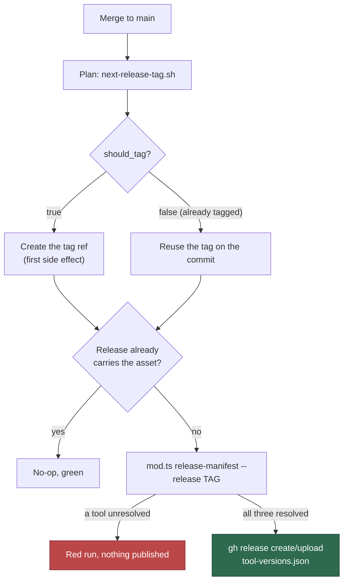

# Release manifest: record the tool versions each release ships with

## Summary

Every release now records the exact Claude CLI, `gh` and Deno versions it was
cut against, published as a `tool-versions.json` asset on the GitHub Release
for the tag — so a host pinning to a release can pin to the same tools instead
of drifting onto whatever is newest. Closes #688.

- `worker/deno/lib/release_manifest.ts` — the shared definition: the
  `ReleaseManifest` shape, `buildReleaseManifest()` (all-or-nothing),
  `formatReleaseManifest()` and `parseReleaseManifest()` (strict). Readers on
  the #675 side validate the asset through this parser rather than re-parsing
  it by hand.
- `worker/deno/commands/release_manifest.ts` — the `release-manifest` command,
  registered in `mod.ts`. Prints the manifest on stdout; versions come from
  `resolveDynamicVersions()` (Issue #623), so a release records exactly what
  dynamic mode would have installed when the release was minted.
- `.github/workflows/release-tag.yml` — after the tag ref is created, installs
  the pinned Deno toolchain and publishes the manifest for that tag. Existing
  structure kept: SHA-pinned actions, job-scoped `contents: write`,
  `concurrency: release-tag-main` with `cancel-in-progress: false`, and values
  passed through the environment rather than interpolated into `run:` bodies.
- `.github/scripts/next-release-tag.sh` — on the already-tagged path it now
  reports the tag the commit carries instead of an empty string, so the publish
  step can address that release. The mint decision (`should_tag`) is unchanged.

**Fail loud, never partial.** A tool whose version cannot be resolved — or that
the release-age gate reports ineligible — fails the step naming that tool, and
nothing is published. A manifest naming two tools out of three would let a host
silently drift on the third, the failure mode `pinned_tool_versions` being
all-or-nothing already guards against (#622). The parser is equally strict:
malformed JSON, a missing tool, a non-semver version or an unknown tool key is
an error, never a half-read object.

**Idempotent and recoverable.** A release already carrying the asset is left
alone, so a re-run publishes nothing twice; and because the publish is keyed to
the release tag on the commit rather than the tag this run minted, a re-run
after a failed publish still attaches the manifest.

## Evidence

Backend/CLI change — no web interface to screenshot. The generator was run for
real against the live release-age gate in this container, and its stdout parsed
back through the shared parser:

```console
$ deno run --allow-net --allow-run --allow-env --allow-read \
    mod.ts release-manifest --release 1.0.8 2>/dev/null
{
  "release": "1.0.8",
  "tools": {
    "claude": "2.1.251",
    "gh": "2.98.0",
    "deno": "2.9.6"
  }
}
$ # parsed back through parseReleaseManifest()
parses: {"release":"1.0.8","tools":{"claude":"2.1.251","gh":"2.98.0","deno":"2.9.6"}}
```

Stdout carries the manifest and nothing else: the gate logs through the default
logger, which writes to stderr.



## Acceptance Criteria

- **met** — a merge to `main` mints the tag as today **and** publishes a
  release with a `tool-versions.json` asset naming the release and all three
  tool versions — evidence: `.github/workflows/release-tag.yml` (the tag step
  is unchanged; the publish steps follow it),
  `worker/deno/tests/release_tag_workflow_test.ts::release-tag.yml - the
  manifest is published for the commit's release tag` and `::release-tag.yml -
  the tag is created before anything is published`. The workflow itself only
  runs post-merge, so the run on `main` is the final confirmation.
- **met** — the generator prints valid JSON matching the documented schema and
  its output parses through the shared parser — evidence:
  `worker/deno/tests/release_manifest_command_test.ts::release-manifest -
  prints the manifest for the release on stdout`, plus the live run in
  **Evidence** above.
- **met** — a tool that cannot be resolved (or is ineligible under the
  release-age gate) fails the step naming that tool, and no manifest is
  published — evidence:
  `worker/deno/tests/release_manifest_command_test.ts::release-manifest - an
  unresolved tool fails the command, naming it` and
  `worker/deno/tests/release_manifest_test.ts::buildReleaseManifest - an
  ineligible tool fails, naming it, with no manifest`.
- **met** — re-running against a commit whose tag already carries the manifest
  is a no-op and exits green — evidence: the asset check in the publish step,
  asserted by `worker/deno/tests/release_tag_workflow_test.ts::release-tag.yml
  - a release already carrying the asset is left alone`, and
  `worker/deno/tests/next_release_tag_test.ts::next-release-tag - a commit that
  already carries a release tag is not tagged again`.
- **met** — `docs/RELEASE-TAGGING.md` documents the asset name, the schema and
  where the versions come from — evidence: `docs/RELEASE-TAGGING.md` §"The
  tool-version manifest".
- **met** — unit tests cover the generator and the parser (including malformed
  and partial manifests) under `worker/deno/tests/`; `./quality.sh` passes —
  evidence: `worker/deno/tests/release_manifest_test.ts` (14 tests) and
  `worker/deno/tests/release_manifest_command_test.ts` (5 tests).
- **unrequested** — `.github/scripts/next-release-tag.sh` now emits the tag a
  commit already carries on the `should_tag=false` path (its test expectation
  updated with it) — reason: the publish step keys off that output, so without
  it a run that failed to publish could never be retried and the release would
  stay permanently without a manifest.
- **unrequested** — `PINNED_VERSION_PATTERN` is exported from
  `worker/deno/lib/software_updates.ts` — reason: the manifest must accept
  exactly what the pinned installer accepts, so the rule is shared rather than
  copied.
- **unrequested** — one README documentation-table cell mentions the manifest —
  reason: a code change owes a docs change; the row describes what
  `docs/RELEASE-TAGGING.md` now covers.

## Test Plan

- Added `worker/deno/tests/release_manifest_test.ts` — the all-or-nothing
  build (ineligible tool, unreported tool, several unresolved tools at once, a
  junk version) and the parser (non-JSON, non-object, missing `release`,
  missing/extra/mistyped tools, non-semver versions), plus a
  format→parse round trip.
- Added `worker/deno/tests/release_manifest_command_test.ts` — the command over
  a stubbed release-age gate: the manifest on stdout, the resolver actually
  being consulted, a failing tool rejecting the whole run, a missing or
  malformed `--release`, and a gate error not being swallowed.
- Extended `worker/deno/tests/release_tag_workflow_test.ts` — the publish step's
  gating, environment-passed values, tag-before-publish order, idempotent asset
  check and SHA-pinned Deno toolchain.
- Extended `worker/deno/tests/next_release_tag_test.ts` — the already-tagged
  path now reports the tag, including the newest when a commit carries more
  than one. **Modified test:** the existing "already carries a release tag"
  assertion changed from `tag: ""` to `tag: "1.0.1"` (and the same expectation
  in `release_tag_workflow_test.ts`), matching the deliberate output change
  above.
- Updated `worker/deno/tests/mod_test.ts` — registry count 142 → 143 with
  `release-manifest` registered.
- `./quality.sh` run in full.
