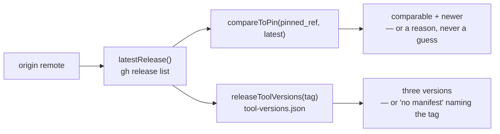

# Release check library (Issue #689)

## Summary

Adds `worker/deno/lib/release_check.ts` — the library #690, #691 and #692 all
read from — answering the three questions a release-aware host asks: what the
newest release is, whether this host's `pinned_ref` is behind it, and which
tool versions that release recorded. Closes #689.

- **`latestRelease(deps)`** — the newest release of the repository the worker
  checkout was cloned from, resolved through `gh release list`. A release is
  defined exactly as `.github/scripts/next-release-tag.sh` defines one: a bare
  `MAJOR.MINOR.PATCH` triple, optionally `v`-prefixed. Pre-releases, build
  metadata, moving names such as `latest` and draft releases are ignored, and
  ordering reuses `parseSemver`/`compareSemver` from `software_updates.ts` so
  `1.0.10` beats `1.0.9`. A repository with no releases returns `null` — a
  clean empty outcome, not an error.
- **`compareToPin(pinnedRef, latest)`** — `{ current, latest, newer,
  comparable }`. A semver `pinned_ref` compares numerically (`newer: true`
  only when the release is strictly greater; equal is `false`). A commit-SHA
  pin — the other shape `docs/CONFIGURATION.md` accepts — is not orderable
  against a tag: `comparable: false` with a reason, and the union's
  incomparable arm carries `newer?: undefined`, so a guessed answer is not
  representable.
- **`releaseToolVersions(tag, deps)`** — reads the `tool-versions.json` asset
  published under #688. A release without the asset returns a distinguishable
  `no-manifest` outcome naming the tag; a present-but-partial or malformed
  manifest is a failed `Result` naming the offending field, via the existing
  strict `parseReleaseManifest`.

Every function returns the repo's `Result` type and never throws — including
when an injected dep throws — because this runs on the launch path where a
failed check must degrade to a warning. Every side effect goes through
`ReleaseCheckDeps`, so the tests need no `gh`, no git and no network;
`createDefaultReleaseCheckDeps()` wires the real `gh`/`git` calls through the
shared `runWithTimeout` helper so an unreachable GitHub cannot hang a launch.
No caching, per the issue: one check per call.

## Evidence

Backend library change — no web interface to screenshot. The evidence is the
unit suite, run against injected deps:

```text
deno test tests/release_check_test.ts
ok | 25 passed | 0 failed (58ms)
```



## Acceptance Criteria

- **met** — `latestRelease()` returns the newest release by numeric segment
  order, ignoring pre-releases, build metadata and moving tags, and handles
  "no releases yet" as a clean empty outcome — evidence:
  `worker/deno/tests/release_check_test.ts::latestRelease - newest by numeric
  segment order, not lexical`, `::latestRelease - ignores pre-releases, build
  metadata and moving names`, `::latestRelease - no releases yet is a clean
  empty outcome`
- **met** — `compareToPin` reports `newer: true` only when the release is
  strictly greater; equal reports `false` — evidence:
  `worker/deno/tests/release_check_test.ts::compareToPin - a pin behind the
  newest release reports newer`, `::compareToPin - an equal pin is not newer`,
  `::compareToPin - a pin ahead of the newest release is not newer`
- **met** — a commit-SHA `pinned_ref` reports `comparable: false` with a
  reason and never reports `newer` — evidence:
  `worker/deno/tests/release_check_test.ts::compareToPin - a commit SHA is not
  orderable and never reports newer`, `::compareToPin - a short commit SHA is
  treated the same way`
- **met** — `releaseToolVersions` returns all three versions for a release
  carrying the manifest, and a distinct "no manifest" outcome naming the tag
  otherwise — evidence:
  `worker/deno/tests/release_check_test.ts::releaseToolVersions - returns all
  three recorded versions`, `::releaseToolVersions - a release without the
  asset is a distinct no-manifest outcome`
- **met** — a malformed or partial manifest is rejected with an error naming
  the offending field — evidence:
  `worker/deno/tests/release_check_test.ts::releaseToolVersions - a partial
  manifest is rejected naming the field`, `::releaseToolVersions - a malformed
  manifest is an error, not a partial read`
- **met** — network/`gh` failure, non-zero exit and timeout each produce a
  failed `Result` with an actionable message; nothing throws — evidence:
  `worker/deno/tests/release_check_test.ts::latestRelease - a non-zero gh exit
  reports the stderr`, `::latestRelease - a timeout says so rather than looking
  like a parse failure`, `::latestRelease - a network failure is a failed
  Result, not a throw`, `::latestRelease - a thrown dependency is caught, never
  propagated`, `::releaseToolVersions - a timed-out download is a failed
  Result`
- **met** — unit tests cover all of the above with injected deps (no real
  `gh`, no network); `./quality.sh` passes — evidence:
  `worker/deno/tests/release_check_test.ts` (25 tests, all against
  `ReleaseCheckDeps` fakes)
- **unrequested** — a `Reading the series back` section and a test-list entry
  in `docs/RELEASE-TAGGING.md` — reason: the repo standard is that a code
  change owes a docs change, and that page is where the release series and its
  manifest are already documented.

## Test Plan

Added `worker/deno/tests/release_check_test.ts` (25 tests), all with injected
deps:

- **`latestRelease`** — numeric ordering (`1.0.10` over `1.0.9`); pre-release,
  build-metadata and moving tags ignored; draft and GitHub-marked pre-release
  entries skipped; `v`-prefixed tags handled; empty and moving-tags-only
  repositories return `null`; the resolved repository is passed to `gh`;
  unresolvable origin, non-zero exit (stderr and exit code surfaced), timeout,
  transport failure, unreadable JSON and a throwing dep each return a failed
  `Result`.
- **`compareToPin`** — behind, equal and ahead; a full and a short commit SHA
  report `comparable: false` with a reason and no `newer`; a branch-like ref
  says it is not a release tag; a blank pin and a non-release `latest` fail
  loudly.
- **`releaseToolVersions`** — all three versions returned and the asset
  downloaded by name; a release without the asset yields the `no-manifest`
  outcome naming the tag; a partial manifest names `tools.deno`; malformed
  JSON is an error; a missing release names the tag and the `gh` stderr; a
  timed-out download fails; a tag outside the release series is rejected
  before any `gh` call is made.
