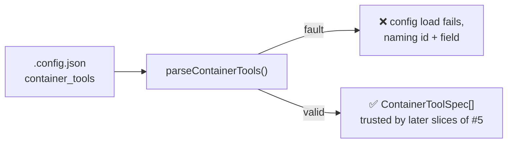

# PR Summary — Validate the `.config.json` `container_tools` key (Issue #69)

## Summary

Foundation slice of parent #5: the worker can now **read and validate** the new
top-level `container_tools` key. No container, Containerfile or build change —
this lands the type, the fail-loud validator and its tests so every other
sub-issue of #5 can assume an already-trusted spec. Closes #69.

- `worker/deno/types.ts` — `ContainerToolSpec` (plus `ContainerToolArchitecture`
  and `ContainerToolArchMap`) and `container_tools?: ContainerToolSpec[]` on
  `ConfigFile`.
- `worker/deno/lib/config_unknown_keys.ts` — `container_tools` registered in
  `KNOWN_CONFIG_KEYS`, so a valid config no longer warns about an unknown key
  and the near-miss suggester recognises typos of it.
- `worker/deno/lib/container_tools_config.ts` (new) —
  `parseContainerTools()` / `assertContainerTools()` reject, naming the
  offending tool id and field:
  - a malformed or duplicate `id` (same rule as a provider id in
    `container/install-providers.sh`);
  - a missing `version`;
  - a `url`/`sha256` architecture key outside `amd64` / `arm64` / `noarch`;
  - a `url` with no matching `sha256` and the reverse — an unverified download
    cannot be expressed;
  - a non-`https:` (or unparseable) URL;
  - a `sha256` that is not 64 hex characters (accepted digests normalise to
    lower case);
  - a `bin` or `env` value that is absolute, `~`-anchored or escapes the fixed
    `/opt/vibe-tools/<id>` prefix via `..` — the confinement is enforced, not
    merely documented;
  - a non-integer or negative `stripComponents`;
  - an unknown key inside a spec, so a typo cannot be silently ignored.
- `worker/deno/lib/config.ts` — `loadConfigFile()` runs the validator, so a
  malformed spec stops config load loudly before any download or install logic
  from a later sub-issue of #5 could run.
- `docs/CONFIGURATION.md` — new **Container Build-Time Tools** section plus a
  defaults-table row.

Nothing is repaired or partially applied: the first fault is the error, per
`DESIGN-PRINCIPLES.md` (never fail silently).

## Evidence

Backend/CLI change — no web interface to screenshot. Verified by tests and the
quality gate.

`deno test --allow-all tests/container_tools_config_test.ts` — **27 passed, 0
failed**.

`./quality.sh` — all checks pass except `deno tests`, which reports **7
pre-existing failures unrelated to this change**, all reproduced on the
unmodified branch tip before any edit:

- `tests/fleet_health_test.ts` — `buildFleetHealthConfig - container mode clones
  under the work-dir mount`
- `tests/optional_feature_env_test.ts` — `applyOptionalFeatureEnv - reads the
  file and sets what is missing…`
- `tests/setup_workdir_reminder_test.ts` — five
  `remind_obsolete_host_work_dirs` cases

Totals with this change: `14356 passed | 7 failed | 32 ignored` — the same seven.

## Test Plan

New suite `worker/deno/tests/container_tools_config_test.ts` (27 cases), one per
rejection rule plus the happy paths:

- happy path: a full spec parses; optional fields default
  (`stripComponents: 0`, `bin: []`, `env: {}`); a single-architecture and a
  `noarch` deployment parse; `sha256` normalises to lower case; an absent key
  yields `[]`.
- rejections: non-array block; non-object entry; malformed `id`
  (`Java`, `java_21`, `1java`, `""`, `../etc`, `java 21`); duplicate `id`;
  missing/empty/non-string `version`; unknown architecture key in `url` and in
  `sha256`; `url` without matching `sha256`; `sha256` without matching `url`;
  missing or empty `url`/`sha256` block; non-`https:` URL (`http:`, `file:`,
  `ftp:`, unparseable); malformed `sha256`; `bin` escaping the prefix
  (`/usr/bin`, `../../usr/bin`, `bin/../../..`, `~/bin`); non-string/non-array
  `bin`; `env` value escaping the prefix; malformed env variable name; invalid
  `stripComponents` (`-1`, `1.5`, `"1"`, `NaN`); unknown key inside a spec.
- fail-loud contract: every assertion checks the message names the offending
  tool id and field; `assertContainerTools()` throws with both.
- unknown-key regression: `KNOWN_CONFIG_KEYS.has("container_tools")` and
  `detectUnknownConfigKeys({ container_tools: [...] })` returns no warning.
- config-load backstop: `loadConfig()` accepts a valid block and rejects a
  malformed one with an error naming `java` and `url.amd64`.
