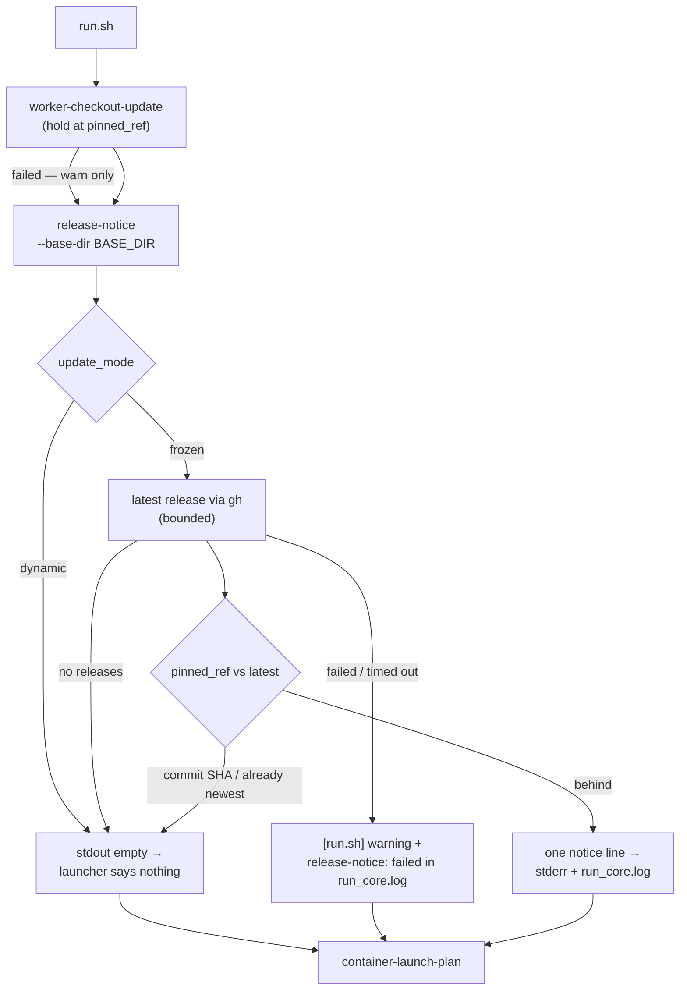

# Notify at launch when a newer release exists

## Summary

A host running `update_mode: "frozen"` is held at `pinned_ref` on purpose — and
until now had no way of learning that the world moved on. Each launch now asks
whether a newer release exists and, when it does, prints exactly one line to
stderr and to `run_core.log`:

```text
A new release of Vibe Coder is available: 1.0.4 → 1.0.5. Run ./run.sh upgrade to install it.
```

Notifying only: no pin is changed, nothing is installed and no checkout is
moved. Closes #690.

What landed:

- **`worker/deno/lib/release_notice.ts`** — decides whether this launch has
  anything to say and renders the line, on top of the Issue #689 release check.
  Silent for a `dynamic` host, a host already on the newest release, a
  commit-SHA pin (`comparable: false`) and a repository with no releases.
  Nothing throws: every fault is a `Result` the launcher degrades to a warning.
- **`worker/deno/lib/upgrade_command.ts`** — the upgrade command's name, once.
  The notice is built from it and the command Issue #691 registers is named
  from it, so the wording and the real command cannot drift into two hard-coded
  strings.
- **`worker/deno/commands/release_notice.ts`** — the `release-notice` command.
  It reads `update_mode` and `pinned_ref` through the very reader
  `worker-checkout-update` uses (Issue #624), because it runs before the
  configuration load, and prints the notice on stdout — or nothing at all.
- **`run.sh`** — captures that output beside the existing
  `worker-checkout-update` invocation and prints/logs it only when it is
  non-empty. No release logic in shell. A failed or timed-out check warns in the
  same shape as the checkout-update failure path and the launch proceeds.

Windows (`run.ps1`) is out of scope, matching how Issue #626 left `setup.ps1`;
the logic living in the Deno command keeps that a port rather than a rewrite.

## Evidence

Backend/CLI change with no web interface, so there is nothing to screenshot.
The evidence is the launcher and unit tests below, all run by the `validate`
job in `.github/workflows/validate-scripts.yml`.



Test output:

```text
deno test tests/release_notice_test.ts        ok | 14 passed | 0 failed
deno test tests/run_sh_launcher_test.ts --filter 690
  run.sh - prints the new-release notice once, on stderr and in the run-core log ... ok
  run.sh - says nothing when the release check has nothing to say ... ok
  run.sh - a failed release check warns and the launch proceeds ... ok
  run.sh - carries no release logic of its own ... ok
  ok | 4 passed | 0 failed
bash -n run.sh    (clean)
shellcheck run.sh (clean)
```

`./quality.sh` — every check passes except three failures that are
environmental and predate this branch, confirmed by running them against
`HEAD~2` (the commit before this work) in a scratch worktree:

| Failure | Why it is not this change |
| --- | --- |
| `service_account_env_test.ts::applyServiceAccountEnv - an unwritable gh config dir is restaged writable` | This sandbox has no writable `gh` staging directory, so the restage lands in `/tmp/<random>/vibe-gh-config` instead of `.container-state/gh-config`. Fails identically on `HEAD~2`. |
| `run_core_test.ts` (uncaught) | `GraphQL: API rate limit already exceeded for user ID …` — a live GitHub rate limit. |
| `run_core_rate_limit_resume_test.ts` (uncaught) | The same rate limit. |

All 18 tests added here pass inside that run
(`tests/release_notice_test.ts` and the four `Issue #690` launcher cases).

## Acceptance Criteria

- **met** — A frozen host pinned to an older release prints exactly one notice
  line, in the documented wording, naming both versions and the upgrade command
  — evidence:
  `worker/deno/tests/release_notice_test.ts::release notice - a frozen host behind the newest release is told, in the documented wording`
  and
  `worker/deno/tests/run_sh_launcher_test.ts::run.sh - prints the new-release notice once, on stderr and in the run-core log (Issue #690)`,
  which asserts the line appears on stderr exactly once.
- **met** — The same line appears in the run-core log — evidence: the same
  launcher test asserts the identical wording in `run_core.log`.
- **met** — A frozen host already on the newest release prints no notice —
  evidence:
  `worker/deno/tests/release_notice_test.ts::release notice - a frozen host already on the newest release says nothing`
  and the `release-notice command - prints nothing at all when there is nothing to say` case.
- **met** — A dynamic host prints no notice — evidence:
  `worker/deno/tests/release_notice_test.ts::release notice - a dynamic host says nothing: it installs the latest at every launch`,
  whose deps reject any `gh` call, so a dynamic host that looked at all fails
  the test.
- **met** — A frozen host pinned to a commit SHA prints no notice — evidence:
  `worker/deno/tests/release_notice_test.ts::release notice - a commit-SHA pin says nothing: it cannot be ordered against a tag`.
- **met** — A failing release check logs a warning, the launch proceeds and its
  exit status is unaffected — evidence:
  `worker/deno/tests/run_sh_launcher_test.ts::run.sh - a failed release check warns and the launch proceeds (Issue #690)`
  (exit 0, container still launched, warning on stderr and in `run_core.log`),
  plus the network-failure and timeout cases in
  `release notice - a failed release check is a fail-loud error, never a silent pass`.
- **partial** — The notice's command string is asserted against the real
  upgrade command's name — evidence:
  `worker/deno/lib/upgrade_command.ts` is the single source of truth,
  `worker/deno/tests/release_notice_test.ts::release notice - the notice names the upgrade command, and cannot drift from it`
  asserts the notice is built from it and that any registered command whose
  name mentions `upgrade` is exactly that constant — reason: the upgrade
  command itself lands in #691, so the registry half of the assertion has
  nothing to bind to yet; #691 registering `UPGRADE_COMMAND_NAME` closes it.
- **met** — Unit tests cover each case with injected deps; `bash -n`/shellcheck
  pass over the `run.sh` change; `./quality.sh` passes — evidence: the test
  output above; the quality gate's only failures are the three pre-existing
  environmental ones tabled in Evidence, each reproduced on `HEAD~2`.

## Test Plan

- Added `worker/deno/tests/release_notice_test.ts` — 14 tests: the notice
  wording, already-newest, dynamic, commit-SHA pin, no releases, pre-releases
  and moving names, `gh` failure and timeout, plus the command against a
  temporary `.config.json` (notice, silence, no config, failed check, malformed
  config, missing `--base-dir`).
- Added four `run.sh` cases to `worker/deno/tests/run_sh_launcher_test.ts`: the
  notice printed once on stderr and in `run_core.log`, silence when there is
  nothing to say, a failed check that warns without changing the exit status,
  and a source check that `run.sh` carries no release logic of its own.
- Extended `worker/deno/tests/fixtures/launcher_harness.ts` to intercept
  `release-notice` (`STUB_RELEASE_NOTICE_STDOUT`, `STUB_RELEASE_NOTICE_EXIT`),
  so the launcher tests never reach GitHub.
- Updated the registry count in `worker/deno/tests/mod_test.ts` (143 → 144).
- Docs: a New-Release Notice section in `docs/CONFIGURATION.md` (with a
  flowchart), the launcher steps in `docs/INTERNALS.md` and `docs/CONTAINER.md`
  (including its launcher flowchart), and an operator entry in
  `docs/TROUBLESHOOTING.md`.
