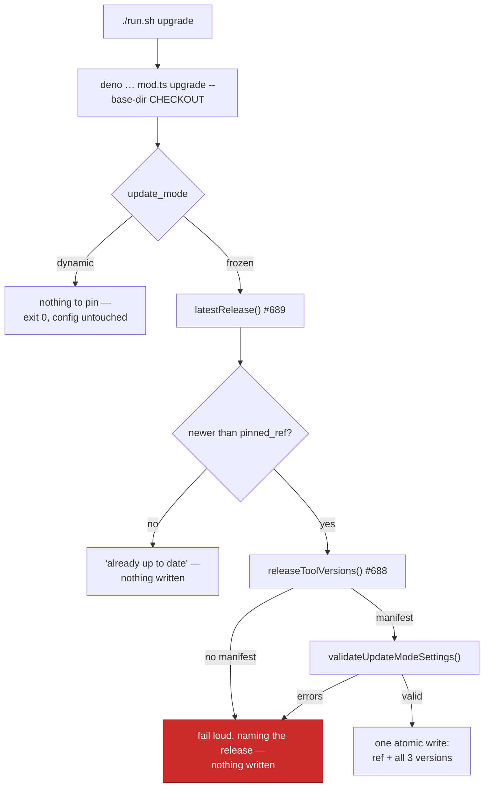

# Upgrade command: one call moves `pinned_ref` and all three pinned tool versions

## Summary

`./run.sh upgrade` moves a frozen host onto the latest release in one call: it
rewrites `pinned_ref` and all three `pinned_tool_versions` in `.config.json` to
what the newest release records in its `tool-versions.json` manifest, and
nothing else. It installs nothing, moves no checkout and starts no container —
the next launch installs exactly what the pins name. Closes #691.

The upgrade itself is the Deno `upgrade` command
(`worker/deno/commands/upgrade.ts`, registered in `worker/deno/mod.ts`); the
shell keeps no upgrade logic of its own, the same delegation shape
`worker-checkout-update` uses. It composes the two pieces this milestone
already landed: `latestRelease()` / `compareToPin()` / `releaseToolVersions()`
from the release-check library (#689) over the release manifest (#688).

Boundaries, all fail-loud and all leaving `.config.json` byte-identical:

- **Already up to date** — prints `Vibe Coder is already up to date (1.0.5).`
  and writes nothing.
- **Dynamic host** — says the host already tracks the latest at every launch
  and that `update_mode` decides this, then exits 0 without touching the file.
- **Release with no manifest** — refused, naming the release: a fresh
  `pinned_ref` beside stale tool versions is exactly the partial pin
  `pinned_tool_versions` is all-or-nothing to prevent.
- **Resolution or network failure** — refused with the underlying cause and the
  config path named.

The resulting settings are validated through `validateUpdateModeSettings()` —
the validator config load itself runs — *before* the write, so an invalid pin
never reaches the file, and the write goes through the existing setup writer
(`setup/config_writer.ts`), which now uses the shared `atomicWrite()` helper so
the ref and all three versions land together or not at all.

Windows (`run.ps1 upgrade`) is out of scope, as in #690.

## Evidence

Backend/CLI change — there is no web interface to screenshot. The evidence is
the test suite below, which runs the real command against a real temporary
`.config.json` with injected release-check deps (no `gh`, no git, no network),
and runs the real `run.sh` under the launcher harness.

What one invocation does:



Command output on a frozen host one release behind:

```text
Upgrading Vibe Coder: 1.0.4 → 1.0.5.
  pinned_ref                   1.0.4 → 1.0.5
  pinned_tool_versions.claude  2.0.76 → 2.0.80
  pinned_tool_versions.gh      2.62.0 → 2.63.0
  pinned_tool_versions.deno    2.5.4 → 2.5.6
Written to /path/to/.config.json — the next launch installs exactly these versions.
```

`bash -n run.sh` and `shellcheck run.sh` both pass. `./quality.sh` passes every
check except `deno tests`, which reports the same pre-existing, environmental
failures this container produces on an unmodified tree — `claude_runner_*`
subprocess timing, `service_account_env` permission restaging, `run_core_*`
GitHub API rate limits and `setup_credential_provisioning`. Verified by
stashing this change and re-running those files: they fail identically without
it. Every test touching this change passes.

## Acceptance Criteria

- **met** — `./run.sh upgrade` on a frozen host behind the latest release
  rewrites `pinned_ref` and all three `pinned_tool_versions` in one write,
  leaving all other config keys untouched — evidence:
  `worker/deno/tests/upgrade_command_test.ts::upgrade - moves pinned_ref and all three tool versions in one write`
- **met** — the output names the old and new ref and each old → new tool
  version — evidence:
  `worker/deno/tests/upgrade_command_test.ts::upgrade - names the old and new ref and every old → new version`
- **met** — running it again prints the already-up-to-date line and leaves the
  file byte-identical — evidence:
  `worker/deno/tests/upgrade_command_test.ts::upgrade - a second run says so and leaves the file byte-identical`
- **met** — a dynamic host is told there is nothing to pin and exits 0 without
  changing the config — evidence:
  `worker/deno/tests/upgrade_command_test.ts::upgrade - a dynamic host has nothing to pin and exits clean`
- **met** — a latest release with no manifest fails loudly naming it, with
  `.config.json` unchanged — evidence:
  `worker/deno/tests/upgrade_command_test.ts::upgrade - a release with no manifest is refused, naming it`
- **met** — a resolution or network failure leaves `.config.json` unchanged and
  reports an actionable error — evidence:
  `worker/deno/tests/upgrade_command_test.ts::upgrade - a failed release resolution leaves the config unchanged`
  and `…::upgrade - a manifest download failure leaves the config unchanged`
- **met** — the written config passes the config validator and the frozen
  launch path reads it back — evidence:
  `worker/deno/tests/upgrade_command_test.ts::upgrade - the written config validates and the launch path reads it back`
  (asserts `validateUpdateModeSettings()` returns no errors and
  `readCheckoutUpdateMode()` resolves `frozen` at the new ref)
- **met** — unit tests cover each path with injected deps and a temporary
  config file; `bash -n`/shellcheck pass over the `run.sh` change; `./quality.sh`
  passes — evidence: `worker/deno/tests/upgrade_command_test.ts` (15 tests),
  `worker/deno/tests/run_sh_upgrade_test.ts` (3 tests), plus the quality-gate
  note above on the pre-existing environmental test failures
- **unrequested** — `writeUpdateModeConfig()` now writes through
  `atomicWrite()` rather than `Deno.writeTextFile()` — reason: the issue
  requires the upgrade to be a single atomic write through this writer; the
  setup path that shares it gets the same crash safety.
- **unrequested** — `UPGRADE_COMMAND_NAME` / `UPGRADE_COMMAND` are exported —
  reason: #690 must assert its notice against the real command name rather
  than a second hard-coded string.

## Test Plan

Added:

- `worker/deno/tests/upgrade_command_test.ts` — 15 tests over the real command
  with injected release-check deps and a temporary `.config.json`: the happy
  path (ref + all three versions, other keys preserved), the printed old → new
  report, validator + frozen-launch read-back, the byte-identical no-op re-run,
  dynamic and absent `update_mode`, a release with no manifest, a failed
  release list, a failed manifest download, a repository with no releases, a
  commit-SHA pin, an unreadable `update_mode`, a missing `.config.json`, a
  missing `--base-dir`, and the registered command name.
- `worker/deno/tests/run_sh_upgrade_test.ts` — 3 tests running the real
  `run.sh upgrade` under the launcher harness: it delegates to the Deno
  `upgrade` command pointed at this checkout, starts no container and launches
  no worker, and propagates a refused upgrade as its own exit status.

Modified:

- `worker/deno/tests/fixtures/launcher_harness.ts` — the Deno stub records and
  intercepts `upgrade`, so a test can never rewrite this checkout's real
  `.config.json`.
- `worker/deno/tests/mod_test.ts` — registered-command count 143 → 144 for the
  new `upgrade` command.
