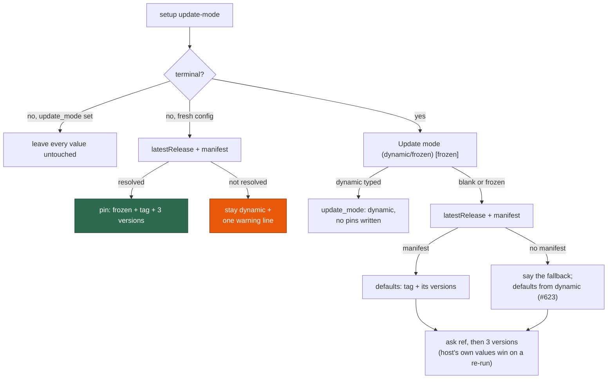

# Pinned becomes the setup default; dynamic stays the opt-in exception

## Summary

The setup conversation now defaults a host being configured to `frozen`,
pinned to the latest release and the tool versions that release recorded, so
accepting every default reproduces a released, tested combination instead of
assembling a set no release ever shipped. `dynamic` stays a valid typed answer
— the deliberate, opt-in exception. Closes #692.

What changed:

- **The mode question defaults to `frozen`** on a fresh host
  (`SETUP_DEFAULT_UPDATE_MODE` in `worker/deno/lib/config_defaults.ts`), and on
  a re-run to whatever the host already says. Blank still accepts the default.
- **The pin defaults come from the release**, not from "what dynamic would
  install today": `pinned_ref` defaults to the latest release tag (#689), and
  the three version prompts default to the versions that release's manifest
  records (#688).
- **Fallback, stated in one line.** When the latest release cannot be resolved,
  or carries no manifest, the version defaults fall back to
  `resolveDynamicVersions()` (#623) and the reason is printed — no version
  prompt is left without a default. The dynamic resolver is only consulted when
  a tool still lacks a default, so a release manifest spares setup the network
  round-trips.
- **Non-interactive setup still never prompts.** A fresh config is pinned to
  the latest release when it resolves *with* a manifest (validated through
  `validateUpdateModeSettings()` before the write); otherwise the host is left
  `dynamic` with one warning line naming what could not be resolved. A ref
  without the versions it ships with is the partial pin frozen mode exists to
  prevent, so nothing is ever half-pinned. Existing values are untouched either
  way.
- **`DEFAULT_UPDATE_MODE` is unchanged.** An absent `update_mode` still
  resolves to `dynamic` at config load: existing hosts carry no pins, and
  freezing them by default would fail config validation at their next launch
  (frozen is all-or-nothing, #622). The docs state that distinction explicitly
  and `update_mode_docs_test.ts` asserts it against both constants.

`setup.ps1` stays out of scope, as it was for #626.

## Evidence

Backend/CLI change — there is no web interface to screenshot. The evidence is
the test suite below, which drives the real conversation with injected input,
injected git and an injected release lookup against a real temporary
`.config.json` (no terminal, no `gh`, no network).

What a fresh setup run now decides:



Test output (`worker/deno/tests/setup_update_mode_test.ts`, 24 tests):

```text
runUpdateModeSetup - accepting every default pins a fresh host to the latest release ... ok
runUpdateModeSetup - typing dynamic still writes dynamic and no pins ... ok
runUpdateModeSetup - a release with no manifest falls back to the dynamic versions and says so ... ok
runUpdateModeSetup - an unresolvable release falls back to the dynamic versions and says why ... ok
runUpdateModeSetup - re-running on a frozen host and pressing Enter changes nothing ... ok
runUpdateModeSetup - re-running on a dynamic host and pressing Enter changes nothing ... ok
runUpdateModeSetup - a non-interactive fresh config pins to the latest release without prompting ... ok
runUpdateModeSetup - a non-interactive fresh config with no release stays dynamic with one warning ... ok
runUpdateModeSetup - a non-interactive fresh config with no manifest stays dynamic rather than half-pinned ... ok
ok | 24 passed | 0 failed
```

## Acceptance Criteria

- **met** — A fresh interactive setup that accepts every default writes
  `update_mode: "frozen"`, a `pinned_ref` equal to the latest release tag, and
  all three `pinned_tool_versions` from that release's manifest — evidence:
  `worker/deno/tests/setup_update_mode_test.ts::runUpdateModeSetup - accepting every default pins a fresh host to the latest release`
- **met** — Typing `dynamic` still writes `update_mode: "dynamic"` and no pin
  fields — evidence:
  `worker/deno/tests/setup_update_mode_test.ts::runUpdateModeSetup - typing dynamic still writes dynamic and no pins`
- **met** — With no resolvable release manifest the version prompts fall back
  to the dynamic defaults, the fallback is stated, and no prompt is left
  without a default — evidence:
  `worker/deno/tests/setup_update_mode_test.ts::runUpdateModeSetup - a release with no manifest falls back to the dynamic versions and says so`
  (asserts every version question carries a `[default]`) and
  `…::runUpdateModeSetup - an unresolvable release falls back to the dynamic versions and says why`
- **met** — Re-running setup and pressing Enter throughout leaves
  `.config.json` unchanged, for a frozen host and a dynamic one — evidence:
  `worker/deno/tests/setup_update_mode_test.ts::runUpdateModeSetup - re-running on a frozen host and pressing Enter changes nothing`
  and `…::runUpdateModeSetup - re-running on a dynamic host and pressing Enter changes nothing`
- **met** — A fresh non-interactive setup pins to the latest release without
  prompting, or stays dynamic with one warning line — evidence:
  `worker/deno/tests/setup_update_mode_test.ts::runUpdateModeSetup - a non-interactive fresh config pins to the latest release without prompting`
  and `…::runUpdateModeSetup - a non-interactive fresh config with no release stays dynamic with one warning`
- **met** — A host whose `.config.json` has no `update_mode` still loads as
  `dynamic`, with no validation failure and no new pin requirement — evidence:
  `worker/deno/tests/update_mode_config_test.ts::update mode - the setup default is frozen while an absent key still loads as dynamic`
- **met** — `docs/SETUP.md` and `docs/CONFIGURATION.md` state the new default
  and the load-time distinction, asserted against the code — evidence:
  `worker/deno/tests/update_mode_docs_test.ts::SETUP.md - the update-mode section states both accepted modes and the default setup offers`
  and `…::CONFIGURATION.md - the setup default and the load-time default are stated and distinguished`
- **met** — Unit tests cover the conversation with injected input, git and
  release lookups; `./quality.sh` passes — evidence:
  `worker/deno/tests/setup_update_mode_test.ts` (injected `latestRelease` /
  `releaseToolVersions` deps throughout)
- **unrequested** — `docs/DEPLOYMENT.md`'s "Keeping a host up to date"
  paragraph and the non-interactive line in
  `worker/deno/setup/setup_cli.ts` — reason: both stated the old default
  ("by default it is dynamic") or omitted the ref an unattended run now pins
  to, so leaving them would have made the shipped docs and output wrong.

## Test Plan

- `worker/deno/tests/setup_update_mode_test.ts` — five new tests (the flipped
  default, the typed `dynamic` answer, both release-fallback paths, the dynamic
  re-run) and three reworked non-interactive tests (pinned, no-release, and
  no-manifest). The pre-existing "accepting the defaults writes dynamic"
  assertions moved into the new typed-`dynamic` test: the shipped default is
  what this issue deliberately flips.
- `worker/deno/tests/update_mode_config_test.ts` — one new test holding the
  load-time default at `dynamic` while the setup default is `frozen`, with a
  clean `validateConfigFull` on a config that has no `update_mode`.
- `worker/deno/tests/update_mode_docs_test.ts` — the SETUP.md default
  assertion now reads `SETUP_DEFAULT_UPDATE_MODE`, plus two new tests: the
  unattended fresh-host outcomes in SETUP.md, and the setup-versus-load-time
  distinction in CONFIGURATION.md (prose and field table, both keyed to the
  constants).
</content>
</invoke>
