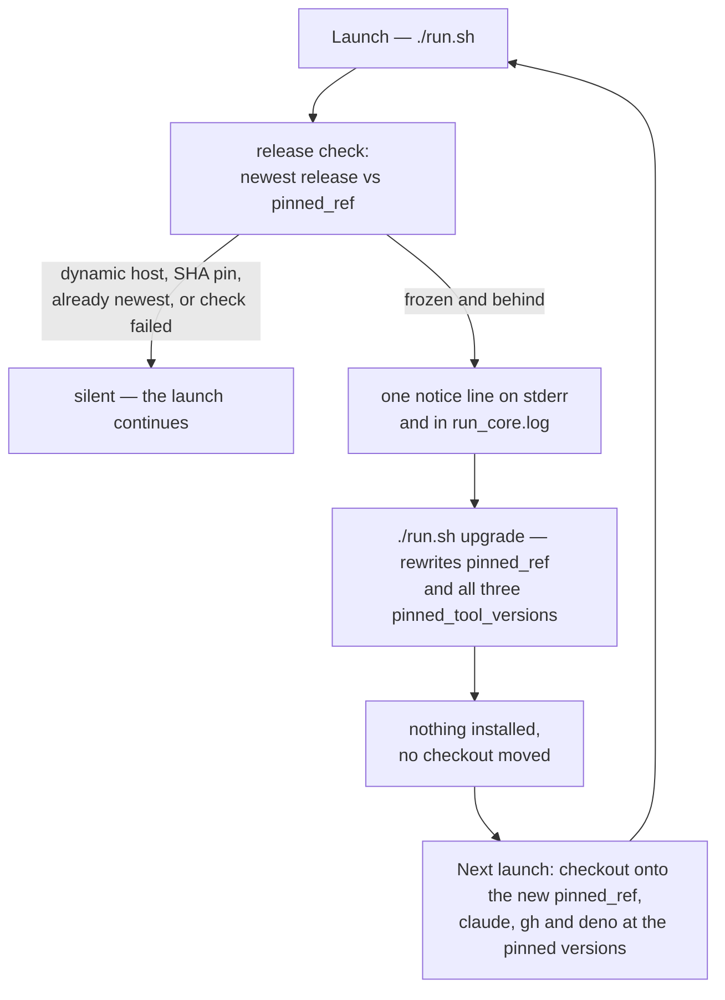

# Document the Deno-style upgrade loop (Issue #693)

## Summary

The notice (#690), the upgrade command (#691) and the pinned-by-default setup
(#692) each documented their own behaviour. This adds the connective tissue
that belongs to none of them: the loop, end to end, tied back to the code that
produces it. Closes #693.

- **`docs/CONFIGURATION.md`** — a new `#### The upgrade loop` section: the
  notice line as the launcher prints it, what `./run.sh upgrade` rewrites
  (`pinned_ref` plus all three `pinned_tool_versions`, and nothing else), that
  it installs nothing itself, and that a hand-edited pin stays first-class for
  a host that wants a specific ref. The `update_mode` row in the defaults table
  now names the setup default and the upgrade command alongside the load-time
  default.
- **A Mermaid diagram of the loop** — launch → release check → notice (frozen
  and behind only) → `./run.sh upgrade` rewrites the pins → next launch
  installs exactly those versions → launch.
- **`docs/SETUP.md`** — where the upgrade command fits after a fresh pinned
  setup: the pin moves by command, not by re-running setup.
- **`docs/RELEASE-TAGGING.md`** — the manifest section now names the two hosts
  that consume `tool-versions.json` (setup's defaults and `./run.sh upgrade`)
  and links them.
- **`docs/DEPLOYMENT.md`** — "keeping a host up to date" now has three answers
  in a table: dynamic, frozen + upgrade command, frozen + hand-edited pin.
- **`docs/TROUBLESHOOTING.md`** — why the notice never appears (dynamic host,
  SHA pin, already newest, failed check), the upgrade command's no-manifest
  refusal quoted from the real message, and that every warning line lands on
  both stderr and `run_core.log`.
- **`README.md`** — one quick-reference entry for `./run.sh upgrade`, linking
  the loop.

## Evidence

Documentation and test change with no web interface to screenshot. The evidence
is the test suite: every documented string is asserted against the constant or
function the code emits it from, so a rename in the code turns the docs tests
red rather than leaving the prose quietly wrong.

```text
deno task test tests/update_mode_docs_test.ts
ok | 19 passed | 0 failed (16ms)

deno run --allow-read --allow-env --allow-run worker/deno/mod.ts check-mermaid --script-dir "$(pwd)"
mermaid: PASSED (581 file(s), 451 block(s) checked)
```

The loop the new diagram documents:



## Acceptance Criteria

- **met** — `docs/CONFIGURATION.md` documents the notice, the upgrade command
  and what it does and does not change, alongside the existing hand-edit path —
  evidence: `docs/CONFIGURATION.md` "The upgrade loop";
  `worker/deno/tests/update_mode_docs_test.ts::CONFIGURATION.md - the upgrade
  loop names the real command and quotes the real notice` and
  `::CONFIGURATION.md - the upgrade loop states what the command changes and
  what it does not`.
- **met** — the Mermaid diagram renders and passes the repo's Mermaid checks —
  evidence: `check-mermaid` output above, plus the `` ```mermaid `` assertion in
  `::CONFIGURATION.md - the upgrade loop names the real command and quotes the
  real notice`.
- **met** — `docs/SETUP.md`, `docs/DEPLOYMENT.md`, `docs/RELEASE-TAGGING.md`,
  `docs/TROUBLESHOOTING.md` and `README.md` are updated, with cross-links
  resolving to real headings — evidence:
  `worker/deno/tests/update_mode_docs_test.ts::the upgrade-loop cross-links
  resolve to real headings` (each added link is resolved against the target
  document's real anchors), plus the per-document tests for README, SETUP,
  DEPLOYMENT, RELEASE-TAGGING and TROUBLESHOOTING.
- **met** — docs tests assert the command name, the notice wording and the
  worked examples against the code — evidence: the tests import
  `UPGRADE_COMMAND_NAME`/`UPGRADE_INVOCATION` (and assert `upgradeCommand.name`
  equals the constant), render the notice with `formatReleaseNotice`, quote the
  no-manifest refusal through `RELEASE_MANIFEST_ASSET`, and continue to push the
  worked `.config.json` examples through `pinValueErrors`/`KNOWN_CONFIG_KEYS`.
- **met** — markdownlint and `./quality.sh` pass — evidence: `./quality.sh` run
  in the foreground on this branch.

No unrequested changes: the diff touches only the six documents the issue names
and the docs test it names.

## Test Plan

- Extended `worker/deno/tests/update_mode_docs_test.ts` with 10 tests:
  - `CONFIGURATION.md - the upgrade loop names the real command and quotes the
    real notice`
  - `CONFIGURATION.md - the upgrade loop states what the command changes and
    what it does not`
  - `the upgrade-loop cross-links resolve to real headings`
  - `README.md - the quick reference carries the real upgrade invocation`
  - `SETUP.md - a freshly pinned host is told how its pin moves afterwards`
  - `DEPLOYMENT.md - keeping a host up to date offers three answers, not two`
  - `RELEASE-TAGGING.md - the manifest section names the hosts that consume it`
  - `TROUBLESHOOTING.md - the notice entry quotes the code's wording and both
    sinks`
  - `TROUBLESHOOTING.md - the silent cases of the notice are all documented`
  - `TROUBLESHOOTING.md - the no-manifest refusal is documented against the real
    asset`
- Existing update-mode docs tests are unchanged and still pass (19 total).
- `check-mermaid` over the whole repository.
