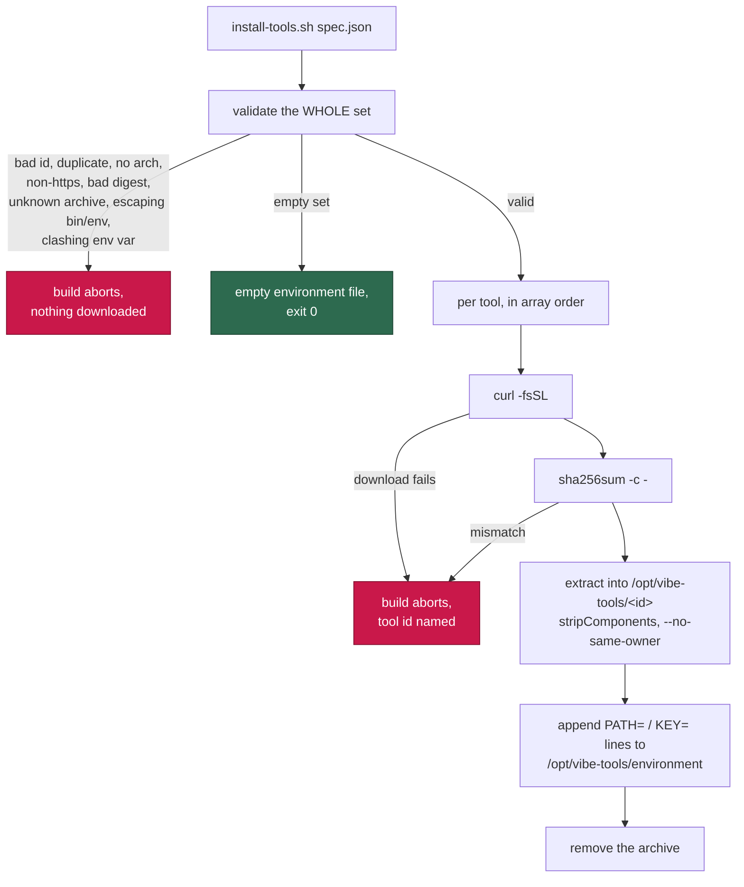

# Add `container/install-tools.sh` (Issue #70, parent #5)

## Summary

New `container/install-tools.sh` — the generic install step for the
deployer-supplied `container_tools` spec validated by #69. It is a standalone
script, developed and tested on its own; the Containerfile wiring is #71.
Closes #70.

Invoked as `install-tools.sh <spec-file.json>`, where the file is either the
`container_tools` array itself or the `.config.json` object carrying it. For
each entry, in array order:

1. Select the download for the build architecture (`amd64`/`arm64`, falling back
   to `noarch`); URL and digest are always taken from the **same** key, so a
   mismatched pair cannot verify.
2. `curl -fsSL` the URL to a temporary path.
3. Verify the declared SHA-256 with `sha256sum -c -` — mandatory, exactly as the
   pinned `gh`/`jq`/Node steps in `container/Containerfile` already do.
4. Extract into `/opt/vibe-tools/<id>` honouring `stripComponents`, with
   `--no-same-owner`. `.tar.gz`, `.tar.xz` and `.zip` by extension; anything
   else aborts rather than guessing. `unzip` has no `--strip-components`, so the
   leading directories are descended by hand and a level that does not hold
   exactly one directory aborts.
5. Append the resolved `bin` directories and `env` values to
   `/opt/vibe-tools/environment`, one `KEY=value` line per entry.
6. Remove the downloaded archive.

**Validate the whole set first**, as `install-providers.sh` does, so a bad set
never leaves a half-installed image behind: id shape, an id twice, an id
colliding with the `environment` file's own name, no download for the build
architecture, a non-https URL, a missing or malformed SHA-256, an unsupported
archive extension, a `bin`/`env` value that is absolute or escapes the install
prefix, and two tools claiming one environment variable are all rejected
**before the first byte is downloaded**. `set -euo pipefail`; every failure
names the offending tool id.

### Decisions worth a reviewer's eye

- **An empty spec is a success, not a failure** (unlike `install-providers.sh`,
  where an empty set means no coding agent at all). A deployment that declares
  no extra tools is ordinary, and the Containerfile can invoke the script
  unconditionally. It still writes an empty `environment` file, so #74 always
  has a file to read. A *malformed* spec file — absent, not JSON, not an array —
  still aborts.
- **Environment file shape.** One `KEY=value` line per resolved value, in spec
  order. `PATH=<dir>` lines are additive (each names one directory to put on
  PATH); every other key is set once, which is why a clash between two tools is
  rejected, and why a tool declaring `env.PATH` is rejected.
- **A declared `bin` directory or `env` path the archive does not contain fails
  the build**, rather than leaving a PATH entry or `JAVA_HOME` pointing at
  nothing for #74 to export.
- **Defence in depth.** #69 is the trust boundary at config load, but this
  script re-checks https, digest shape and prefix confinement itself: it takes a
  file, so it cannot assume the validator ran. jq programs are single-quoted
  with `--arg`/`--argjson` bindings — no spec value is ever interpolated into a
  jq program or a shell word.
- **`CONTAINER_IMAGE_INPUTS`** gains `container/install-tools.sh`: a change to
  the installer changes what the image contains, so it must change the image
  tag. (The committed-files check in `container_image_hash_test.ts` enforces
  this.)
- **`docs/CONFIGURATION.md`**: the `container_tools` section added by #69 was
  lost when `main` was merged into the milestone branch (merge `886a99c` took
  `main`'s copy of the file wholesale), leaving `docs/SETUP.md:657` pointing at
  a section that no longer existed. It is restored here and extended with the
  install step this PR adds.

## Evidence

Backend/CLI change with no web interface, so no screenshot applies. The
evidence is the test suite: 24 cases driving the real script against a
temporary install prefix and local fixture archives, with no network.

Downloads run through a `curl` stub on `PATH` that copies a fixture archive and
logs each call, so the script's own https rule, SHA-256 verification and
extraction all execute for real, and "nothing was downloaded" is directly
assertable. Fixtures are real `.tar.gz`/`.tar.xz` archives (via `tar`) and a
`.zip` built by a small stored-entry ZIP writer in the test (`zip` is not in the
image).

```
deno test tests/install_tools_test.ts
ok | 24 passed | 0 failed (605ms)
```

The tests fail against a broken installer, not just a missing one — with the
`sha256sum -c -` check stubbed out, exactly the two checksum cases fail:

```
install-tools - a checksum mismatch aborts naming the tool and installs nothing ... FAILED
install-tools - a later tool's failure aborts the build, not just its own install ... FAILED
FAILED | 22 passed | 2 failed
```

`shellcheck -e SC1091 -e SC2034 container/install-tools.sh` is clean (the
file-level `SC2016` disable is documented in the header: jq programs are
single-quoted on purpose).



### Quality gate

`./quality.sh` passes every check except `deno tests`, which reports 10
failures that are **pre-existing on this milestone branch and unrelated to this
change** — verified by stashing this PR's work and re-running them:
`buildFleetHealthConfig` (2) and `remind_obsolete_host_work_dirs` /
`applyOptionalFeatureEnv` (8). All are host-side `WORK_DIR` tests from #131/#132
that fail when the suite is run *inside* the container image (the container
branch of `buildFleetHealthConfig` is taken, and `$HOME`-derived host paths
resolve differently). They pass on CI's host-side runner.

## Test Plan

New `worker/deno/tests/install_tools_test.ts` — 24 cases, all executing the real
script:

**Successful installs**

- A two-tool spec (`.tar.gz` + `.tar.xz`) installs both trees under
  `/opt/vibe-tools/<id>` and writes the environment file in spec order.
- The downloaded archive is removed once extracted; the prefix holds only the
  tools and the environment file.
- A `.zip` archive is extracted honouring `stripComponents`.
- `stripComponents` defaults to 0, keeping the archive's own layout.
- `noarch` is used when the build architecture has no entry; an
  architecture-specific entry wins over `noarch`.
- With no `VIBE_TOOLS_ARCH` override the host architecture is detected.
- The spec may be the `.config.json` object carrying `container_tools`.
- An empty spec installs nothing, downloads nothing and still writes an empty
  environment file.

**Rejected before any download** (each asserts the curl log is empty)

- Malformed ids (`Java`, `java tool`, `../java`, `java.sh`, `1java`, `""`).
- A duplicate id; an id colliding with the `environment` file name.
- No download for the build architecture (names the tool and the architecture).
- An unrecognised archive extension (`.tar.bz2`, names the tool and the file).
- A non-https URL; a missing, malformed or wrong-architecture `sha256`.
- `bin`/`env` values that are absolute, `~`-anchored or escape the prefix.
- Two tools setting the same environment variable.
- A missing spec argument, a non-existent file, invalid JSON, a non-array shape.

**Failures during install** (each names the tool)

- A checksum mismatch: non-zero, the tool id and expected digest in stderr,
  nothing extracted, no environment line.
- A failed download (404 from the curl stub).
- A later tool's failure aborts the build; the earlier tool's environment lines
  are the only ones present.
- A declared `bin` directory the archive does not contain.
- An `env` value pointing outside the extracted tree.

Also touched: `worker/deno/lib/container_image_hash.ts` (new enumerated input,
covered by the existing `container/ - every committed container file is
enumerated` test).
