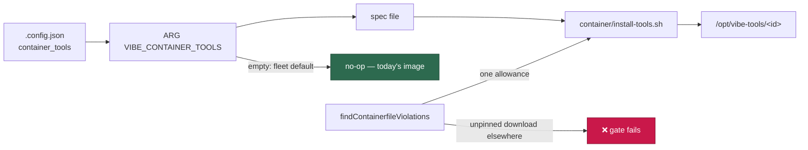

# PR Summary — Containerfile invokes install-tools.sh from a build arg (Issue #71)

## Summary

Wires the deployer-supplied tool set into the image build and teaches the
container-manifest parity gate about the new step. Closes #71.

- **`container/Containerfile`** — one generic stage, last of the install steps:
  `ARG VIBE_CONTAINER_TOOLS=""` → the spec is written from it → `COPY
  install-tools.sh` → one `RUN` that invokes the script → cleanup. **Fixed size
  and tool-count independent** (the script loops over the spec, so no tool adds
  a `RUN`), and an absent or empty argument writes an empty spec, runs nothing
  and leaves nothing behind — today's image for the default fleet build.
- **`worker/deno/lib/container_manifest.ts`** — `findContainerfileViolations`
  now reports any build step that downloads without verifying a checksum in the
  same step, and any step that pipes a download into a shell. The single
  allowance is the `install-tools.sh` step driven by `${VIBE_CONTAINER_TOOLS}`:
  it installs archives deliberately absent from `container/tools.json`, verified
  inside the script against the digests the deployment declared. The allowance
  is narrow — the argument must default to empty, must actually be run when
  declared, must be declared when run, and a `curl` written into that same step
  is still reported.
- **`container/install-tools.sh`** (new) — the script the stage invokes.
  Issue #70 owns the download/verify/extract implementation, so this is a stub:
  an empty selection is a no-op, a non-empty one **aborts the build naming the
  tools it refused** rather than producing an image that silently lacks them.
- **`worker/deno/lib/container_image_hash.ts`** — `container/install-tools.sh`
  added to `CONTAINER_IMAGE_INPUTS`, so editing it changes the image tag.
- **`docs/CONTAINER-IMAGE.md`** — new "Deployer-supplied build-time tools"
  section covering the argument, the no-op default and the gate allowance.

Security note: `RUN` is not one of the instructions the builder performs
variable substitution on — the shell expands `VIBE_CONTAINER_TOOLS` from its
environment, so a `$(...)` or backtick inside the deployer-supplied JSON is
never re-parsed as code. Verified by running the step's command with a spec
whose `version` carried both forms; neither executed.

## Evidence

Backend/build change — no web interface to screenshot. Evidence is the gate
output and the executed build step.

**Gate, both halves** (`deno test --allow-all tests/container_manifest_test.ts`
— all 95 container tests pass):

- the canonical step is accepted — `findContainerfileViolations` returns `[]`
  for the committed Containerfile and for the step in isolation;
- an arbitrary unpinned download is still rejected — appending
  `RUN curl -fsSL https://example.invalid/install.sh | bash` yields
  `build step pipes a download into a shell: …` and
  `build step downloads without verifying a checksum: …`.

**Size cap:** the stripped Containerfile is **10,689 bytes** against the 15,000
cap, and stays there for any tool count — the stage does not grow with the
selection.

**The step, executed** (the RUN body run under `sh` against the committed
script):

| `VIBE_CONTAINER_TOOLS` | Result |
| ---------------------- | ------ |
| unset / empty | exit 0, nothing run, spec removed |
| `[]` | exit 0, "installing nothing" |
| two-tool selection | exit 1, `Refusing to install deployer-supplied container tools: java maven` |
| value carrying `$(…)` / backticks | exit 1, no command executed |

**Quality gate:** `./quality.sh` passes every check except `deno tests`, which
reports 10 pre-existing failures unrelated to this change
(`setup_workdir_reminder_test.ts`, `fleet_health_test.ts`,
`host_workdir_guard_test.ts`, `optional_feature_env_test.ts` — host work-dir
probes that fail inside the container). Confirmed pre-existing: the same 10
fail with this branch's changes stashed. All 14,566 other tests pass.

## Test Plan

New cases in `worker/deno/tests/container_manifest_test.ts`:

- `accepts the build-argument-driven tools step` — the canonical block is clean.
- `the allowance does not excuse an arbitrary unpinned download` — a stray
  `curl … | bash` is still reported (both violations).
- `the allowance does not excuse a download inside the tools step` — a spec
  fetched over the network inside the allowed step is reported twice.
- `a checksum-verified download is not reported` — the rule is not too broad.
- `reports a tools step that ignores the build argument`.
- `reports a tools build argument with a non-empty default` — a default build
  must install nothing.
- `reports a declared tools argument the build never uses`.
- `reports install-tools.sh run without the build argument declared`.
- `ignores a commented-out unpinned download`.
- `container/ - the committed definition drives install-tools.sh from the build
  argument`.

New suite `worker/deno/tests/container_tools_install_test.ts` — runs the real
script and asserts on exit codes and output (contracts that survive Issue #70's
implementation): missing argument aborts, missing spec file aborts naming it,
an empty selection (`""`, whitespace, `[]`, `[ ]`) exits 0, and a requested tool
set is never silently skipped.

Existing coverage that now also guards this change:
`container_image_hash_test.ts::container/ - every committed container file is
enumerated` (fails if `install-tools.sh` is left out of `CONTAINER_IMAGE_INPUTS`)
and the stripped-Containerfile size-cap test.
