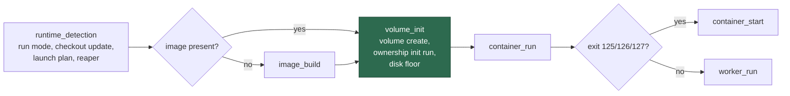

# Launcher self-heal: name the host, and attribute volume-preparation failures honestly

## Summary

Issue #710 is an alert the fleet filed about itself. Two of its three fields
were wrong, and both faults are in this repository, not on the host:

```text
Vibe Coder launcher failing on unknown-host (runtime_detection)
Host: unknown
Failure phase: runtime_detection (container runtime detection)
Last launcher exit status: 125
Exit status 125 is NOT one the worker produces … so it came from the container
runtime client or the container itself
```

1. **`unknown-host`.** `run.sh`, `run.ps1` and `loop.ps1` invoked
   `container-restart-backoff` without `--allow-sys=hostname`, so
   `Deno.hostname()` was refused, `resolveRunHostId()` fell back to `unknown`
   and `escalationHostId()` to `unknown-host`. `loop.sh` has carried the flag
   since Issue #633; the scheduler path (cron/launchd/Task Scheduler, where the
   launcher records its own outcome) and the Windows supervisor never got it.
2. **`runtime_detection` with a status only the runtime client produces.** The
   launchers wrote `runtime_detection` on their first line and did not advance
   the marker again until the worker container started. Everything between the
   image and the launch — `volume create`, and the ownership init, which is
   itself a runtime `run` — therefore reported a phase that had already
   succeeded. An init container that never started (the runtime's own 125) sent
   the operator to look at runtime detection while the same alert said the
   status came from the runtime client.

Both launchers now record a `volume_init` phase covering that stage, described
as **work volume preparation**, and all three recorders may read the hostname.

Closes #710.

## Evidence

Backend/CLI change — no web interface to screenshot. The evidence is the
launcher harness, which runs the real `run.sh` against a recording runtime stub
and asserts on what it actually did.

**Reproduced first.** With `STUB_IMAGE_INSPECT_EXIT=0` (image present) and
`STUB_INIT_EXIT=125` (the volume init fails the way the runtime client does),
`run.sh` exited 125 and left `runtime_detection` in the phase marker — the
reported signature exactly:

```text
run.sh - attributes a failed volume init to volume preparation … FAILED
    [Diff] Actual / Expected
-   runtime_detection
+   volume_init

run.sh - the outcome recorder may read the hostname … FAILED
    the recorder cannot resolve the host without --allow-sys=hostname:
    run --frozen --lock=… --allow-env --allow-read --allow-write --allow-run
    --allow-net …/mod.ts container-restart-backoff --exit-status 0
```

After the fix, both pass, and the whole launcher/supervisor/self-heal set is
green (`132 passed, 0 failed, 22 ignored` — the ignored ones are the `run.ps1`
cases, skipped on a host without PowerShell and run by CI).

The phase a launcher failure is attributed to:



The green node is the phase this change adds; failures there used to be
reported as `runtime_detection`.

## Test Plan

Added:

- `worker/deno/tests/run_sh_launcher_test.ts`
  - `run.sh - attributes a failed volume init to volume preparation, not
    runtime detection (Issue #710)` — the regression test: it fails against the
    unfixed launcher with `runtime_detection`, and also asserts the worker
    container never starts after a failed init.
  - `run.sh - a clean launch still reaches the container_run phase (Issue
    #710)` — the new marker does not strand a healthy launch.
  - `run.sh - the outcome recorder may read the hostname, so the alert can name
    the host (Issue #710)` — asserts on the argument list the launcher really
    handed Deno.
- `worker/deno/tests/run_ps1_launcher_test.ts` — the same two cases for
  `run.ps1` (skipped visibly without PowerShell; CI runs them).
- `worker/deno/tests/container_restart_backoff_test.ts`
  - `resolveFailurePhase - volume preparation is its own phase (Issue #710)`.
  - The "each phase is described in the message" case now covers
    `volume_init`, so the phase reaches the GitHub report.

Changed:

- `worker/deno/lib/container_restart_backoff.ts` — `volume_init` added to
  `LaunchPhaseMarker`, `ContainerFailurePhase`, `resolveFailurePhase` and
  `describeFailurePhase`. Its escalation threshold is the default 3; only a
  failed image build still escalates earlier.
- `run.sh`, `run.ps1` — record `volume_init` before the volume stage;
  `--allow-sys=hostname` on the outcome recorder.
- `loop.ps1` — `--allow-sys=hostname` on the outcome recorder.
- `docs/TROUBLESHOOTING.md`, `docs/DEPLOYMENT.md`,
  `docs/workflows/resilience-and-concurrency.md` — the documented phase list.

No existing test was removed or weakened.

## Security self-check

- No new external input is parsed; the phase marker is written by the launcher
  and already validated by `resolveFailurePhase`, which falls back to
  `worker_run` for anything unrecognised.
- The added Deno permission is the narrowest that resolves the fault:
  `--allow-sys=hostname` grants the hostname alone, and only to the
  outcome-recording invocation, which already reaches GitHub. No mount, no
  privilege flag and no credential path changed.
- No secrets, hidden files or `.config*.json` staged.
