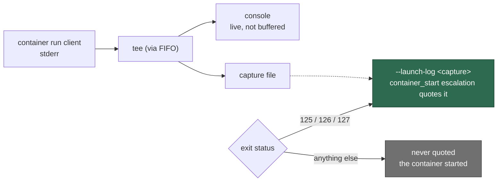

# A refused container start now says why

## Summary

Issue #711 is the third self-heal report of the same shape: the phase, the exit
status, and nothing an operator can act on.

```text
Vibe Coder container self-heal escalation
Failure phase: container_start (container start)
Last launcher exit status: 125
Exit status 125 is NOT one the worker produces … so it came from the container
runtime client or the container itself
```

The runtime client had already explained itself — "no such image", "invalid
reference format", "permission denied" — but `run.sh` started the container
with that stderr inherited by the console and captured nowhere, so the
escalation could not quote it.

`run.sh` now streams the run client's stderr through `tee` into a capture file
and hands that file to `container-restart-backoff` as `--launch-log` on exit
status **125**, **126** or **127** — exactly the statuses
`resolveFailurePhase()` turns into a `container_start` escalation. Any other
status came from a container that started, so its output is the worker's own
console and is never quoted as launch evidence. This is the treatment Issue
#709 gave the image build, applied to the phase after it.

Two details are load-bearing:

- **A FIFO, not a pipeline.** `$!` must stay the runtime client's own PID: a
  pipeline would put `tee`'s PID there, and the watchdog (Issue #4173) would
  wait on — and reap — the wrong process.
- **A bounded drain.** The capture is quoted only after `tee` has drained the
  client's stderr, but that wait is guarded: a runtime helper still holding the
  pipe open must never become the wedge the watchdog exists to end.

`run.ps1` is untouched — the mirrored Windows change is #720.

Closes #711.

## Evidence

Backend/CLI change — no web interface to screenshot. The evidence is the
launcher harness, which runs the real `run.sh` against a recording runtime stub
and asserts on the invocation it actually constructed.

**Red first.** With the runtime stub refusing the start
(`STUB_RUN_EXIT=125`, `STUB_RUN_STDERR=…`), the new test failed against the
unfixed launcher with exactly the reported signature — an escalation carrying
the status and no evidence:

```text
run.sh - a refused container start quotes the runtime client's own stderr … FAILED
    a container_start escalation with no evidence: run --frozen --lock=…
    --allow-sys=hostname …/mod.ts container-restart-backoff --exit-status 125
```

After the change both new cases pass and the whole `run.sh` launcher suite is
green (`53 passed, 0 failed`).

What the launcher does with the client's stderr:



## Test Plan

Added to `worker/deno/tests/run_sh_launcher_test.ts`:

- `run.sh - a refused container start quotes the runtime client's own stderr
  (Issue #711)` — the regression test. It drives every status in
  `CONTAINER_START_EXIT_CODES` (125, 126, 127, imported from
  `container_restart_backoff.ts`, so the launcher's list cannot drift from the
  recorder's), and asserts three things: the refusal still reaches the console,
  `--launch-log` is passed, and the file handed over still holds the client's
  message when the recorder reads it.
- `run.sh - a container that started is never quoted as failure evidence (Issue
  #711)` — exit status 1 with output on stderr: a worker that failed for its
  own reasons inside a container that started fine is not a refused launch, so
  nothing is quoted.

Changed:

- `run.sh` — the capture at the run invocation, the status test that sets
  `EVIDENCE_LOG`, and the capture's removal in the existing exit trap (after
  the outcome record, never before it).
- `worker/deno/tests/fixtures/launcher_harness.ts` — `STUB_RUN_STDERR`, so the
  runtime stub can print the refusal a `container_start` escalation exists to
  quote.
- `docs/workflows/resilience-and-concurrency.md` — the self-heal evidence
  section now covers the refused start alongside the failed build.
