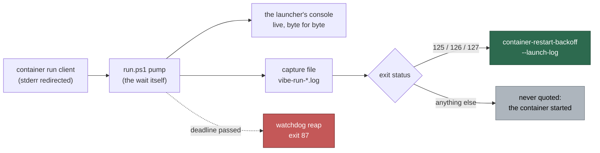

# run.ps1: quote the container run client's stderr in container_start escalations

## Summary

A `container_start` escalation filed from a Windows host named the phase and
the exit status and nothing about why: `run.ps1` let the runtime client's
stderr be inherited by the console and kept it nowhere, so the recorder had no
`--launch-log` to hand over. That is exactly the report Issue #711 was, on the
launcher #711 did not touch.

`run.ps1` now redirects the client's standard error and pumps it — in bounded
slices, from the thread that waits on the client — to both the console and a
capture file. On exit status **125**, **126** or **127** (the statuses
`CONTAINER_START_EXIT_CODES` names, and the only ones the recorder turns into a
`container_start` escalation) that capture is handed over as `--launch-log`, so
the report carries the runtime's own refusal. Any other status came from a
container that started, so its output is never quoted as launch evidence, and
`Exit-Launcher` deletes the capture only *after* the outcome has been recorded.

Pumping *is* the wait, which is what makes this work on .NET:
`Register-ObjectEvent` handlers do not run while the runspace is blocked in
`WaitForExit`, so an event-based tee would buffer the container's console output
for the whole run, and `StandardError.ReadToEnd()` deadlocks a long run
outright. Because the pump is the wait, the watchdog deadline of Issue #4173 is
tested at the top of every slice — wall-clock, not idle time — so a container
that never stops writing cannot postpone its own reaping.

Closes #720.

## Evidence

Backend/CLI change — no web interface to screenshot. The evidence is the
launcher suite, run against a real PowerShell 7.6.5 (`VIBE_PWSH`), which is what
the worker container normally lacks:

```text
running 6 tests from ./tests/run_ps1_launcher_test.ts
run.ps1 - a refused container start quotes the runtime client's own stderr (Issue #720) ... ok (5s)
run.ps1 - the client's stderr reaches the console while the container is still running (Issue #720) ... ok (1s)
run.ps1 - a container that started is never quoted as failure evidence (Issue #720) ... ok (2s)
run.ps1 - keeps reaping a container that outruns the watchdog while it is still writing (Issue #720) ... ok (6s)
run.ps1 - the stderr capture leaves nothing behind in the temporary directory (Issue #720) ... ok (1s)
run.ps1 - the statuses it treats as a refused start are the recorder's own (Issue #720) ... ok (649µs)

ok | 6 passed | 0 failed | 21 filtered out (18s)
```

The whole launcher estate stays green together — `run_ps1_launcher_test.ts`,
`run_sh_launcher_test.ts` and `launcher_parity_test.ts`: **106 passed, 0
failed**.

Where the client's stderr goes now:



## Reproduction

- **symptom** — a Windows host's `container_start` escalation carried the exit
  status and the line ruling out worker code, and no cause; the runtime's own
  refusal went to the console and nowhere else
- **status** — `verified` — `run.ps1 - a refused container start quotes the
  runtime client's own stderr (Issue #720)` failed against the unfixed launcher
  (`AssertionError: a container_start escalation with no evidence: … container-restart-backoff --exit-status 125`)
  and passes after the fix, for every status in `CONTAINER_START_EXIT_CODES`
- **regression test** —
  `worker/deno/tests/run_ps1_launcher_test.ts::run.ps1 - a refused container start quotes the runtime client's own stderr (Issue #720)`

The watchdog regression the review found was reproduced the same way:
`run.ps1 - keeps reaping a container that outruns the watchdog while it is still
writing (Issue #720)` took **37s** against the first cut of the pump (the reap
waited for the container to fall quiet) and **6s** after the deadline was moved
to the top of the loop.

## Acceptance Criteria

<!-- vibe-spec-review inputs="diff+issue-body" -->

- **met** — `run.ps1` redirects the client's standard error and pumps it to both
  `[Console]::Error` and a capture file, keeping the output live — evidence:
  `run.ps1:953` (redirect), `run.ps1:819-909` (pump),
  `worker/deno/tests/run_ps1_launcher_test.ts::the client's stderr reaches the console while the container is still running (Issue #720)`
  — reviewer: partial — reason: the reviewer marked it partial because the pump
  runs on the waiting thread rather than a background runspace; the behaviour
  the criterion asks for (live console output *and* a capture) is delivered, and
  the consequence the reviewer named — a dropped wall-clock deadline check — was
  a real defect, now fixed and covered by the watchdog test above
- **met** — the capture is handed over as `--launch-log` only for the statuses
  `CONTAINER_START_EXIT_CODES` names — evidence: `run.ps1:771`, `run.ps1:1040`,
  `worker/deno/tests/run_ps1_launcher_test.ts::a refused container start quotes the runtime client's own stderr (Issue #720)`
  (drives every status in the contract list) and
  `::a container that started is never quoted as failure evidence (Issue #720)`
  — reviewer: met
- **met** — `run_ps1_launcher_test.ts` gains the counterparts of the `run.sh`
  tests added in #711 — evidence:
  `worker/deno/tests/run_ps1_launcher_test.ts:659-780` — reviewer: met —
  reason: the reviewer could only note them as CI-verified; they were run here
  against PowerShell 7.6.5 and are green (output above)
- **met** — `docs/workflows/resilience-and-concurrency.md` drops the sentence
  saying Windows does not capture the stream yet — evidence:
  `docs/workflows/resilience-and-concurrency.md:133,135` — reviewer: met
- **unrequested** — the post-exit drain bound (`$RunDrainSeconds`, the
  truncation warning) — evidence: `run.ps1:777`, `run.ps1:883-905` — reviewer:
  unrequested — reason: mirrors `run.sh:1100-1122`; without it a runtime helper
  that inherited the client's stderr holds the pump open after the client is
  gone, which is the wedge the watchdog exists to end
- **unrequested** — a fourth test, `the stderr capture leaves nothing behind in
  the temporary directory` — evidence:
  `worker/deno/tests/run_ps1_launcher_test.ts:825` — reviewer: unrequested —
  reason: mirrors the same `run.sh` test; a capture leaked per launch would fill
  the host the launcher exists to keep launching
- **unrequested** — the watchdog regression test and the harness's
  `STUB_RUN_STDERR_REPEAT` writer — evidence:
  `worker/deno/tests/run_ps1_launcher_test.ts:781`,
  `worker/deno/tests/fixtures/launcher_harness.ts:199-213` — reason: the pump
  became the launcher's wait, so the Issue #4173 deadline is now this change's
  to keep; both reviewers found it broken and this is what holds it
- **unrequested** — the both-directions status pin,
  `the statuses it treats as a refused start are the recorder's own` — evidence:
  `worker/deno/tests/run_ps1_launcher_test.ts:864` — reason: `run.ps1`'s comment
  claims the copy is pinned by the launcher tests; the pin now exists, as it
  does for `run.sh`

## Standards Review

<!-- vibe-standards-review inputs="diff+CODING-STANDARDS.md" -->

- **violation** — the watchdog deadline was no longer enforced while the
  container was producing output — evidence: `run.ps1:856-864` (as reviewed) —
  reason: fixed in this diff; the deadline is tested at the top of every slice
  (`run.ps1:839-847`) and the regression is covered by
  `run.ps1 - keeps reaping a container that outruns the watchdog while it is still writing (Issue #720)`
- **violation** — the read-fault `catch` discarded the exception and reported
  end-of-stream — evidence: `run.ps1:848-853` (as reviewed) — reason: fixed; a
  fault now warns on stderr naming the failure before the copy stops
  (`run.ps1:864-867`)
- **violation** — the comment claimed the status copy was pinned by the launcher
  tests when nothing pinned the reverse direction — evidence: `run.ps1:768-770`
  — reason: fixed; the pin exists now
  (`worker/deno/tests/run_ps1_launcher_test.ts:864`)
- **violation** — the cleanup test could pass without the capture ever existing,
  and read `TMPDIR`, which .NET honours only on Unix — evidence:
  `worker/deno/tests/run_ps1_launcher_test.ts:781-799` (as reviewed) — reason:
  fixed; it now runs a refused start, asserts the recorder was handed the
  capture's contents, and sets `TMPDIR`, `TMP` and `TEMP`
- **violation** — the PR summary file was missing — evidence:
  `docs/archive/pr-summaries/pr-summary-720.md` — reason: fixed; this file
- **violation** — no test covers the two degraded paths (a capture that cannot
  be opened, a drain that truncates) — evidence: `run.ps1:883-905`,
  `run.ps1:927-932` — reason: stands. Both are unreachable from the harness: the
  launch plan writes its own file to the same temporary directory, so an
  unwritable one fails the launch before the capture is reached, and a truncated
  drain needs a grandchild holding the client's stderr open. `run.sh` carries
  the same two paths untested for the same reason; both fail loud on stderr when
  they fire
- **violation** (spec reviewer, minor) — the capture leaks if
  `[Process]::Start` itself throws — evidence: `run.ps1:955` — reason: stands.
  Start throwing means the runtime binary disappeared between the launch plan
  and the launch; the launcher fails loudly and leaves one empty temp file.
  Wrapping the start would change this launcher's failure semantics, which is
  outside this issue
- **clean** — Australian English throughout; commit safety (three tracked files,
  no hidden paths); the `Vibe-Coder-Run-Id` trailer on both commits; docs updated
  in the same change; tests drive the real launcher and assert on observable
  effects (recorded `--launch-log` contents, console streaming, exit statuses),
  never on source text — except the status pin, which is a contract-drift check
  in the shape `run.sh` already uses; `deno fmt`, `deno lint` and `deno check`
  clean

## Test Plan

Added to `worker/deno/tests/run_ps1_launcher_test.ts`:

- `run.ps1 - a refused container start quotes the runtime client's own stderr
  (Issue #720)` — the regression test. Drives every status in
  `CONTAINER_START_EXIT_CODES` and asserts the refusal reached the console, that
  `--launch-log` was passed, and that the log the recorder was handed still
  quoted the client's words
- `run.ps1 - the client's stderr reaches the console while the container is
  still running (Issue #720)` — the stub prints and then stalls, so a console
  line read before the launcher returns can only have been streamed
- `run.ps1 - a container that started is never quoted as failure evidence
  (Issue #720)` — exit status 1: a worker that failed for its own reasons is not
  a refused start, so nothing is quoted
- `run.ps1 - keeps reaping a container that outruns the watchdog while it is
  still writing (Issue #720)` — a container writing every 50ms past a 2s
  deadline is still reaped on the deadline (Issue #4173)
- `run.ps1 - the stderr capture leaves nothing behind in the temporary directory
  (Issue #720)` — the capture was created (the recorder's copy proves it) and
  did not outlive the launcher
- `run.ps1 - the statuses it treats as a refused start are the recorder's own
  (Issue #720)` — pins `$ContainerStartExitStatuses` against
  `CONTAINER_START_EXIT_CODES` in both directions

Changed in `worker/deno/tests/fixtures/launcher_harness.ts`:

- `STUB_RUN_STDERR_REPEAT` — a container that keeps writing while it runs,
  bounded at 600 writes and killed with the stub, so no writer outlives its test

No existing test was modified or removed.
