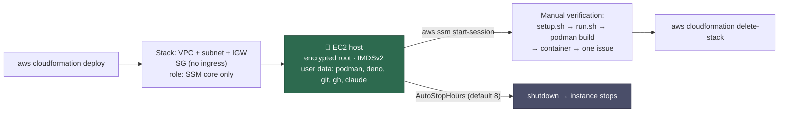

# PR Summary — Issue #721

## Summary

Added `infra/cloudformation/linux-verification-host.yaml`: a self-contained
CloudFormation stack that launches one Ubuntu 24.04 EC2 host whose only access
path is SSM Session Manager, so the launcher's Linux/podman branch — which the
macOS-only maintainer has never been able to confirm — can be exercised by
hand. The user data installs the documented Linux prerequisites (`git`, `gh`,
`jq`, `podman`, Deno, the Claude CLI), clones the checkout, and schedules a
parameterised auto-stop (default 8 hours). Docker is deliberately absent so the
podman branch is the one that runs, and podman is left stock so the known
environment faults still reproduce. Launch, verification and tear-down are
documented in `docs/EC2-LINUX-VERIFICATION.md`, linked from
`docs/DEPLOYMENT.md`. Closes #721.

## Evidence

This is an infrastructure/CLI change with no web interface, so there is no
screenshot. The container has no AWS credentials and no `cfn-lint`, so the
template is not deployed here — the automated evidence is the test suite that
parses the committed template and asserts on its properties, plus a real
`bash -n` syntax check of the rendered user data:

```
deno test --allow-read --allow-run --allow-env --allow-write \
  tests/linux_verification_host_template_test.ts
...
ok | 27 passed | 0 failed (61ms)
```

Two of those tests execute the artefact rather than reading it: the fail-loud
test runs the bootstrap's own prelude against a failing command and asserts the
status file says `FAILED` (mutation-checked — making `fail()` write `OK` turns
it red), and the auto-stop test evaluates the real `shutdown` line in bash with
the command stubbed, confirming `AutoStopHours=3` becomes `+180` minutes.

The full gate (`./quality.sh`) passes — see the Test Plan below.



## Acceptance Criteria

<!-- vibe-spec-review inputs="diff+issue-body" -->

- **met** — A CloudFormation template in this repo launching one EC2 Linux
  instance; `aws cloudformation deploy` is the only launch step and the stack
  outputs the instance id — evidence:
  `infra/cloudformation/linux-verification-host.yaml` (`Outputs.InstanceId`,
  `Outputs.StartSessionCommand`) — reviewer: met
- **met** — Access is SSM Session Manager only: instance profile with
  `AmazonSSMManagedInstanceCore`, no key pair, no inbound security-group rules
  — evidence:
  `linux_verification_host_template_test.ts::access is SSM only: no key pair and no inbound rule anywhere`
  and `::the instance profile grants the SSM managed policy and nothing wider`
  — reviewer: met
- **met** — UserData installs podman, deno, git, gh and the Claude Code CLI and
  clones VibeCoder; verification is by hand over SSM — evidence:
  `linux_verification_host_template_test.ts::the UserData script installs the launcher prerequisites and clones the checkout`
  — reviewer: met
- **met** — No credentials in the template or UserData; GitHub, Anthropic and
  coding-agent credentials are supplied interactively in the SSM session —
  evidence:
  `linux_verification_host_template_test.ts::no credential material or account identifier is embedded`,
  and `docs/EC2-LINUX-VERIFICATION.md` step 3 — reviewer: partial — reason: the
  reviewer found the guide told the operator to run `./setup.sh < /dev/null`,
  which skips every TTY-gated credential prompt; the guide now runs `./setup.sh`
  on the session terminal and names `claude setup-token` as the token source,
  so the criterion is satisfied in this diff.
- **met** — Auto-stop after a parameterised number of hours (default 8);
  tear-down is manual — evidence:
  `linux_verification_host_template_test.ts::the auto-stop delay is computed from the parameter, in minutes`
  (renders `AutoStopHours=3` → `+180`, `8` → `+480`) — reviewer: met
- **met** — A documentation section in or linked from `docs/DEPLOYMENT.md`
  covering launch, the exact verification commands, and stack tear-down —
  evidence: `docs/EC2-LINUX-VERIFICATION.md`, linked from
  `docs/DEPLOYMENT.md` — reviewer: partial — reason: the reviewer's objection
  was the unrunnable verification sequence (the stdin redirect above, plus an
  interactive `claude` login that does not provision the worker's token); both
  are corrected, and a note now warns that the host has no outbound SSH so `gh`
  and `git` must use HTTPS.
- **partial** — "Working OK" = the full cycle: `setup.sh` completes, `run.sh`
  builds the image with podman, the container starts, and the worker processes
  one issue end to end — evidence: `docs/EC2-LINUX-VERIFICATION.md`, "Verify
  the launcher" — reviewer: partial — reason: the bar is a manual observation
  on a live EC2 host; this container has no AWS credentials, so the diff can
  only make that cycle runnable and documented, not demonstrate it. The
  maintainer confirms it on the deployed host.
- **unrequested** — `worker/deno/tests/linux_verification_host_template_test.ts`
  — reviewer: unrequested — reason: the issue rules out an automated *EC2*
  check, not unit tests; the repo's TDD standard requires tests, and these are
  the only automated gate on a template no CI can deploy.
- **unrequested** — `RootVolumeSizeGb` (default 100 GiB) and an encrypted gp3
  root — reviewer: unrequested — reason: the disk floor named in #722 is the
  fault this host must clear, and unencrypted storage would breach the repo's
  CloudFormation best-practice bucket.
- **unrequested** — `InstanceType` `AllowedValues` beyond `t3.large`, and the
  `VibeCoderRepositoryUrl` parameter — reviewer: unrequested — reason:
  defaults match the issue exactly (`t3.large`, this repository); the
  parameters only avoid editing the template to verify a bigger host or a fork.
- **unrequested** — port-scoped egress (443/80/53/123) instead of plain
  egress-only — reviewer: unrequested — reason: least privilege on the network
  boundary; the guide states the SSH consequence.
- **unrequested** — IMDSv2 required, hop limit 1,
  `InstanceInitiatedShutdownBehavior: stop` — reviewer: unrequested — reason:
  standard hardening, and `stop` is what makes the auto-stop a stop rather than
  a terminate.
- **unrequested** — `/var/log/vibe-bootstrap.status` and the
  `BootstrapStatusFile` / `AutoStopAfterHours` outputs — reviewer: unrequested
  — reason: the repo's fail-loud rule; a cloud-init failure is otherwise
  invisible to the operator.
- **unrequested** — `jq`, `uidmap`, `unzip`, `/etc/profile.d/vibe-verification.sh`,
  `loginctl enable-linger` — reviewer: unrequested — reason: prerequisites of
  the installs the issue does list (the Deno installer aborts without `unzip`;
  rootless podman needs lingering).
- **unrequested** — `README.md` documentation-table row and
  `_data/page_titles.yml` entry — reviewer: unrequested — reason: repo
  publishing convention; existing tests fail without them.

## Standards Review

<!-- vibe-standards-review inputs="diff+CODING-STANDARDS.md" -->

- **violation** — the PR summary file was absent from the reviewed diff —
  evidence: `docs/archive/pr-summaries/pr-summary-721.md` — reason: written and
  committed in this diff (the reviewer saw the branch before it landed).
- **violation** — the bootstrap wrote `OK` without positively confirming
  success: `runuser -l ubuntu -c 'curl … | sh'` starts a login shell that does
  not inherit `pipefail`, so a failed download exited 0 — evidence:
  `infra/cloudformation/linux-verification-host.yaml:295` — reason: fixed here.
  Each piped installer now sets `pipefail` inside its own shell, every
  prerequisite is proven with `--version` before the status file says `OK`, and
  `unzip` (which the Deno installer requires) is installed. Covered by
  `::the bootstrap proves each prerequisite runs before it reports OK`,
  `::every piped installer sets pipefail inside its own shell`, and
  `::a failing bootstrap step records FAILED instead of carrying on`.
- **violation** — tests grepped the template's raw characters for
  `Action: "*"`, `KeyName`, `registries.conf` and docker install lines —
  evidence: `worker/deno/tests/linux_verification_host_template_test.ts:286` —
  reason: fixed here. Those questions are now asked of the parsed model
  (`valuesOfKey` walks the template at any depth) or of the rendered script's
  parsed package set (`aptPackages`), so an alternate spelling no longer slips
  through.
- **violation** — three tests asserted UserData *text* (`set -euo pipefail`,
  `trap`, `shutdown`) rather than behaviour — evidence: same file, previous
  `:400-432` — reason: fixed here. The fail-loud path is now executed (the
  script's own prelude plus a failing command, against a redirected status
  file) and the auto-stop arithmetic is evaluated by bash with `shutdown`
  stubbed, so both would catch a real regression. Mutation-checked: changing
  `fail()` to write `OK` turns the fail-loud test red.
- **violation** — the comment above the exported helpers claimed a sharing
  arrangement with other files that does not exist — evidence: same file,
  helper block — reason: fixed here; the comment now says what is true, that
  each helper is unit-tested over synthetic inputs and used by the artefact
  tests below.
- **violation** — two documentation tests assert keyword presence — evidence:
  same file, `::the verification guide documents launch, verification and
  tear-down` — reason: stands. The repository has ~15 `*_docs_test.ts` files
  doing exactly this (`containment_docs_test.ts`, `bucket_docs_test.ts`), and
  a template whose only launch instructions live in prose needs the prose
  pinned; the reviewer flagged it at low confidence for this reason.
- **clean** — Australian English throughout; no hidden path staged; commit
  message references the issue and carries the run-id trailer; the new page is
  registered in the README table, `_data/page_titles.yml` and
  `docs/DEPLOYMENT.md`; every cross-reference anchor resolves and the
  documented `container-runtime-detect` command exists with the flags shown;
  no secrets, account ids or pinned AMI in the template; no `Export` on any
  output; no `prompts/` file touched.

## Test Plan

Added `worker/deno/tests/linux_verification_host_template_test.ts` — 27 tests;
each parses the committed template, or renders and executes a check over it:

- **Helpers (unit, synthetic inputs)** — `substitutionNames` lists template
  substitutions and skips `${!VAR}` shell escapes, returns nothing for a script
  with none; `renderSubScript` substitutes and unescapes, and throws on a
  substitution with no value; `extractUserDataScript` returns `null` for every
  shape that is not `Fn::Base64`/`Fn::Sub`; `aptPackages` lists installed
  packages and drops flags; `scriptPrelude` stops at the trap.
- **Access** — no key pair anywhere; no `AWS::EC2::SecurityGroupIngress`
  resource and no `SecurityGroupIngress` property; egress never covers port 22
  or 3389.
- **Identity** — exactly one managed policy (`AmazonSSMManagedInstanceCore`),
  no inline policy, no wildcard action.
- **Host** — IMDSv2 required with hop limit 1, `stop` on
  instance-initiated shutdown, encrypted `DeleteOnTermination` root volume.
- **Network** — own VPC, subnet, internet gateway and a default route to it.
- **Parameters** — `AutoStopHours` defaults to 8, `t3.large`, a root-volume
  floor with headroom above the worker's 20 GB claiming floor, and the AMI
  resolved from Canonical's SSM parameter rather than a pinned `ami-…` id.
- **User data** — every `${…}` resolves to a declared parameter or
  pseudo-parameter (the escaping footgun that deploys and then boots a broken
  host); the rendered script passes `bash -n`; a failing step records `FAILED`
  rather than continuing; every prerequisite is proven with `--version` before
  the script reports `OK`; every piped installer sets `pipefail` inside its own
  login shell; the installed package set covers `git`, `gh`, `jq`, `podman` and
  `unzip`, and the checkout is cloned from the parameter.
- **Deliberate omissions** — podman is not pre-patched (`registries.conf`,
  `short-name-mode`) and Docker is not installed, so the podman branch runs and
  the known faults still reproduce.
- **Hygiene** — no access key, token, private key or hard-coded account id in
  the template; outputs name the instance and the session command and export
  nothing.
- **Documentation** — the guide carries the template path, the deploy, session
  and delete-stack commands, `setup.sh`/`run.sh` and the bootstrap status file;
  `docs/DEPLOYMENT.md` links the page.

No existing tests were modified or removed.
