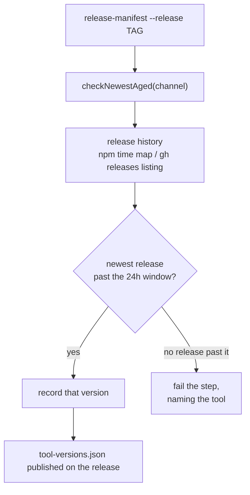

# Release Tag: record the newest quarantine-cleared tool version

## Summary

The `Release Tag` workflow's manifest step has failed on every merge to `main`
since 2026-09-01T01:20Z. `release-manifest` resolved each tool through the
release-age gate's **newest** release, and the Claude CLI publishes several
times a day — so `@anthropic-ai/claude-code` was almost always inside the 24h
quarantine window, the all-or-nothing manifest refused to build, and no
`tool-versions.json` was published at all.

The gate now also answers the neighbouring question: **which is the newest
release that has already cleared the window?** `checkNewestAged()` reads the
release history behind the newest release (the npm packument's `time` map, or
the GitHub releases listing) and returns the newest release outside the window.
The manifest resolves through `resolveQuarantineClearedVersions()`, so a release
records versions a host may install today.

The embargo itself is untouched. A release inside the window is still never
recorded, an unreadable upstream is still indeterminate rather than eligible,
and a tool with *no* release past the window still fails the step naming that
tool. Only stable `MAJOR.MINOR.PATCH` releases are candidates — pre-releases,
drafts, and unpublished npm versions are not part of the series a host installs
from. The upgrade path (`updateClaudeCli`, `updateGhCli`, `updateDeno`) is
unchanged: it still adopts upstream's newest release or nothing.

Closes #726.

## Evidence

Backend/CLI change — no web interface to screenshot. The evidence is the
failing command going green.

**The failure, from the workflow log** (run
[33521630265](https://github.com/stSoftwareAU/VibeCoder/actions/runs/33521630265)):

```text
ERROR: Command failed: Cannot build tool-versions.json for 1.0.21 — a manifest
naming only some tools would let a host drift on the rest, so none was produced:
  - claude: npm:@anthropic-ai/claude-code@2.1.252 is only 21.7h old
    (< 24h quarantine); deferring the upgrade until it ages past the window.
```

**Red before green.** A throwaway script driving the pre-fix resolver over that
exact packument shape (`latest` 2.1.252 published 21.7h before the run, 2.1.251
published two days earlier) reproduced the message verbatim; swapping in the new
resolver built the manifest. That scenario is now the regression test
`release-manifest - a quarantined latest release still yields a manifest`, and
the script was deleted.

**The real command, against live npm and GitHub:**

```console
$ deno run --frozen --lock=worker/deno/deno.lock --allow-net --allow-run \
    --allow-env --allow-read worker/deno/mod.ts release-manifest --release 1.0.21
{
  "release": "1.0.21",
  "tools": {
    "claude": "2.1.251",
    "gh": "2.98.0",
    "deno": "2.9.6"
  }
}
```

`2.1.251` is the aged predecessor of the quarantined `2.1.252` — the step that
was red now publishes a manifest.



## Quality gate

`./quality.sh` passes every check except `deno tests`, which fails on **three
pre-existing, environment-caused failures unrelated to this diff** — stated
plainly rather than reported as a pass:

```text
./tests/run_core_rate_limit_resume_test.ts (uncaught error)
./tests/run_core_test.ts (uncaught error)
  error: gh command failed: GraphQL: API rate limit already exceeded for user ID …
applyServiceAccountEnv - an unwritable gh config dir is restaged writable
  => ./tests/service_account_env_test.ts:385
  [Diff] Actual: /home/vibe/auto-issue-work/.container-state/gh-config
       Expected: /tmp/f942638d94370d56/vibe-gh-config
FAILED | 16529 passed (4 steps) | 33 failed | 48 ignored (8m52s)
```

The first two exhaust the host's GitHub API rate limit; the third reads the
live worker's own `gh` config staging (the same host state that logged
`[SECURITY] cannot re-stage the gh credential` during this run). None of the
three files import `software_updates.ts`, `tool_release_age.ts` or
`release_manifest.ts`, and `Validate Scripts` is green on `main` and on the
PRs merged either side of this one.

The tests this change touches pass under the gate's exact flags:

```console
$ deno test --no-check --allow-read --allow-env --allow-run --allow-write \
    --allow-sys=hostname tests/tool_release_age_test.ts \
    tests/software_updates_test.ts tests/release_manifest_command_test.ts \
    tests/release_manifest_test.ts
ok | 188 passed | 0 failed (30s)
```

Every other gate check — lint, type check, fmt, markdownlint, mermaid, semgrep,
the chokepoint and workflow-hygiene checks — passed.

## Test Plan

Added — `worker/deno/tests/tool_release_age_test.ts`:

- `parseNpmVersionHistory - lists installable stable versions newest first`
- `parseNpmVersionHistory - unreadable metadata yields no history`
- `parseGhReleaseListing - reads tag and date lines newest first`
- `selectNewestAged - falls back to the newest release past the window`
- `selectNewestAged - the newest release is used when it has aged`
- `selectNewestAged - a wholly quarantined history stays ineligible`
- `selectNewestAged - an empty history is indeterminate, never eligible`
- `checkNewestAged - a fresh npm latest resolves its aged predecessor`
- `checkNewestAged - a fresh GitHub release resolves its aged predecessor`
- `checkNewestAged - a failed listing fails closed`
- `checkNewestAged - a malformed repo never reaches the API`
- `checkNewestAged - a gh extension has no older ref to fall back to`

Added — `worker/deno/tests/software_updates_test.ts`:

- `resolveQuarantineClearedVersions - names the newest aged release per tool`
- `resolveQuarantineClearedVersion - nothing past the window stays a failure`

Added — `worker/deno/tests/release_manifest_command_test.ts` (the regression,
end to end over a stubbed upstream — no network):

- `release-manifest - a quarantined latest release still yields a manifest`
- `release-manifest - a tool with nothing past the window still fails loud`

Modified, not removed: the `ReleaseAgeGate` test doubles in
`software_updates_test.ts` gained the new `checkNewestAged` method (the
interface requires it, so a double that lacks it no longer type-checks), and the
`release-manifest` command's injected dep was renamed `dynamicVersions` →
`toolVersions` to match what it now resolves. No assertion was weakened.

## Security

- No new external input is trusted: the npm package name and the `owner/repo`
  are validated against the existing `NPM_PACKAGE_PATTERN` / `REPO_PATTERN`
  before either reaches a URL or a `gh api` path, and a malformed value never
  reaches the API (covered by
  `checkNewestAged - a malformed repo never reaches the API`).
- The quarantine window is not widened, and no new opt-out is introduced.
  Every failure path — unreachable registry, failed listing, empty history — is
  ineligible, never eligible.
- No secrets, credentials, or hidden files are staged.

## Docs

- `docs/RELEASE-TAGGING.md` — where the manifest's versions come from, the new
  quarantine-cleared rule, and the corrected "when a run goes red" cause.
- `docs/INTERNALS.md` — `resolveQuarantineClearedVersions()` beside
  `resolveDynamicVersions()`, and the difference between the questions they
  answer.
