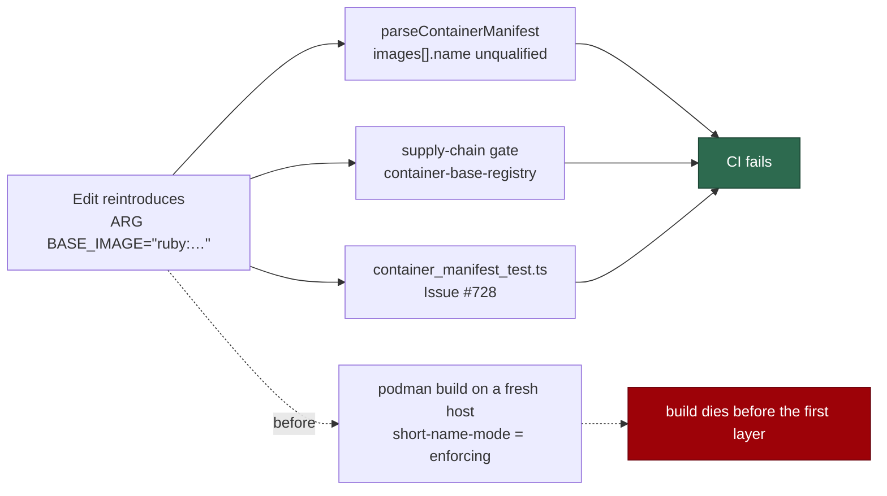

# Containerfile base images name their registry so Podman can resolve them

## Summary

`container/Containerfile` declared its two base images by short name
(`denoland/deno:bin-2.9.6@sha256:…`, `ruby:3.4-trixie@sha256:…`). Docker
silently resolves a short name against Docker Hub; Podman's default
`short-name-mode = "enforcing"` refuses to guess a registry, so on a fresh
Ubuntu host with no `unqualified-search-registries` the build died before the
first layer and the reporter had to pre-pull, re-tag and write an `[aliases]`
block into `~/.config/containers/registries.conf`.

Both defaults are now registry-qualified — `docker.io/denoland/deno:…` and
`docker.io/library/ruby:…` — with the `@sha256:` digests byte-identical to
before, so the resolved images are exactly today's. `container/tools.json`
restates those names and is held to the Containerfile by
`findContainerfileViolations`, so the two moved together.

So a short name cannot come back on a later edit and fail only on a Podman
host at build time, the trip-wire is in CI rather than in the build:

- `parseContainerManifest` rejects an unqualified `images[].name`.
- A new supply-chain gate rule, `container-base-registry`, fails any `FROM`
  under `container/` that resolves — through its `ARG` default — to a short
  name. The rule is "names a registry" (a first path segment with a dot, a
  port, or the literal `localhost`), not "names Docker Hub", so a private
  registry or a `localhost/` build stays legal.
- `container_manifest_test.ts` asserts the committed Containerfile is
  registry-qualified and digest-pinned.

Closes #728.

## Evidence

Backend/CLI change with no web surface to screenshot. The evidence is the
gate and the tests.

Where a short name is caught now, and where it used to escape to a Podman host:



Red/green on the real tree, run by reverting the qualified names in
`container/Containerfile` and `container/tools.json`:

```
# unfixed
container/Containerfile - every base image is registry-qualified and digest-pinned (Issue #728) ... FAILED
supply-chain-gate: the real repository tree passes with no findings ... FAILED
FAILED | 117 passed | 16 failed

# fixed
ok | 137 passed | 0 failed
```

`./quality.sh` runs the `supply-chain-gate` command over the real tree; it
reports no findings, and the generated `docs/audits/dependency-inventory.md`
agrees with the qualified names.

## Reproduction

- **symptom** — `podman build` on a fresh Ubuntu host cannot resolve
  `ruby:3.4-trixie` / `denoland/deno:bin-2.9.6`, so the worker image never
  builds without host-side `registries.conf` workarounds
- **status** — `partial` — reason: no container runtime is installed in this
  worker container (`which podman docker` returns nothing), so the build was
  not driven end to end. What was verified is the condition that causes it:
  the regression tests were watched failing against the unfixed short names
  and passing after the fix
- **regression test** —
  `worker/deno/tests/supply_chain_gate_test.ts::supply-chain-gate: a short-named container base fails (Issue #728)`
  and
  `worker/deno/tests/container_manifest_test.ts::container/Containerfile - every base image is registry-qualified and digest-pinned (Issue #728)`

## Acceptance Criteria

<!-- vibe-spec-review inputs="diff+issue-body" -->

- **met** — `DENO_IMAGE` and `BASE_IMAGE` defaults are registry-qualified with
  `docker.io/...` — evidence: `container/Containerfile:11-12` — reviewer: met
- **met** — the digest pins are unchanged, so the resolved images are
  byte-identical — evidence: `container/Containerfile:11-12` (`sha256:4cf0029b…`,
  `sha256:a9d6c36b…` identical to `f8ae393`) — reviewer: met
- **met** — `podman build` with no `unqualified-search-registries` and no
  `[aliases]` resolves both base images — evidence: `container/Containerfile:11-12`;
  both references are fully qualified, so enforcing short-name mode never has a
  registry to guess — reviewer: met — reason: the reviewer recorded it as not
  empirically verified, and neither could this run — see the `partial`
  reproduction status above
- **met** — `docker build` still succeeds with the same image content —
  evidence: `container/Containerfile:11-12`; `docker.io/library/ruby@<digest>` is
  Docker's own normalisation of `ruby@<digest>` and the digests did not
  change — reviewer: met
- **met** — manifest/pin assertions agree with the new values — evidence:
  `container/tools.json:11,32`, cross-checked against the `ARG` defaults by
  `findContainerfileViolations` (`worker/deno/lib/container_manifest.ts:1024`);
  `container_manifest_test.ts::container/ - the committed definition matches its pinned manifest`
  and `docs/audits/dependency-inventory.md:31-32` — reviewer: met
- **met** — Renovate still recognises the pinned images for updates — evidence:
  `renovate.json` unchanged; no image-specific manager exists, so the built-in
  dockerfile manager owns these pins and takes fully-qualified `docker.io/…`
  references through the quoted `ARG` defaults it already parsed — reviewer:
  met — reason: the reviewer notes this is met by construction with no test
  asserting it; Renovate cannot be run in this container to prove it
- **met** — tests and quality checks pass — evidence: `deno test` over the
  touched suites passes; `./quality.sh` reported every check PASSED except the
  full `deno tests` run, whose failures are unrelated (see **Test Plan**) —
  reviewer: met — reason: the reviewer's own run did not complete the full gate
- **met** — Failure Detection: the manifest test asserts every base-image `ARG`
  default is registry-qualified and digest-pinned — evidence:
  `worker/deno/tests/container_manifest_test.ts:495` — reviewer: met
- **unrequested** — the `container-base-registry` supply-chain gate rule and its
  wiring — evidence: `worker/deno/lib/supply_chain_gate.ts:54,684-714,1275` —
  reason: the issue's **Failure Detection** section asks for a CI trip-wire that
  fires on a reintroduced short name anywhere, and the gate is where
  `listBaseImages` already resolves `ARG` defaults; a test alone would not cover
  a new Containerfile added under `container/`
- **unrequested** — `parseContainerManifest` rejects an unqualified
  `images[].name` — evidence: `worker/deno/lib/container_manifest.ts:241-247` —
  reason: `tools.json` and the Containerfile are held equal by
  `findContainerfileViolations`, so without this the manifest is the one place a
  short name could re-enter unchecked
- **unrequested** — the gate-rule documentation updates — evidence:
  `README.md:445`, `docs/SUPPLY-CHAIN-GATE.md:42,88-91`,
  `docs/security/README.md:37-42` — reason: a new gate rule that is not in the
  operator manual is a rule nobody can act on
- **unrequested** — `docs/EC2-LINUX-VERIFICATION.md:148-156` no longer lists
  short-name resolution among the podman faults that must reproduce — reason:
  raised by the Spec reviewer as a stale surface; that doc exists to confirm
  #722's fixes, and the row now describes a fault this change removes

## Standards Review

<!-- vibe-standards-review inputs="diff+CODING-STANDARDS.md" -->

- **violation** — no PR summary under `docs/archive/pr-summaries/` — evidence:
  `docs/archive/pr-summaries/pr-summary-728.md` — reason: fixed here; this file
  is that summary, and it states the regression-test linkage the standard asks
  for
- **violation** — the manifest test asserted a literal `docker.io/` on every
  resolved `FROM`, over-constraining the rule its own name states — evidence:
  `worker/deno/tests/container_manifest_test.ts:514` (before) — reason: fixed —
  the assertion is removed; which registry is named stays pinned by
  `container/tools.json` through `findContainerfileViolations`
- **violation** — `isRegistryQualifiedImage` had no empty-input or
  leading-slash coverage — evidence:
  `worker/deno/tests/container_manifest_test.ts:174-184` — reason: fixed — both
  degenerate references are asserted unqualified
- **violation** — the first commit's subject uses `(#728)`, not the documented
  `(Issue #728)` form — evidence: commit `9ba5286` — reason: stands — the commit
  is already pushed and rewriting shared history to correct a subject line is a
  worse trade than leaving it; the two commits added in this run use the
  documented form
- **violation** — `docs/audits/dependency-inventory.md:31-32` cites
  `container/Containerfile:14` and `:16` while the `ARG` declarations are at
  lines 11-12 — reason: stands, and the finding is a misreading — those rows
  point at the `FROM` lines (14 and 16) annotated with the `ARG` each resolves
  through, and the file is generated by `buildDependencyInventory`; hand-editing
  it would fail the gate's `inventory-stale` rule
- **violation** — the manifest test duplicates the real-tree coverage the
  supply-chain gate test already provides — evidence:
  `worker/deno/tests/container_manifest_test.ts:495` — reason: stands — the
  issue's **Failure Detection** section names the container manifest test as the
  trip-wire, so it is asserted there deliberately, and the two tests fail for
  different reasons (one names the rule, one runs the whole gate)
- **clean** — Australian English throughout; every doc surface naming the images
  or the gate's rule list updated in the same change; fail-loud (`fail()` names
  the offending field and the rejected name, findings surface through the gate's
  non-zero exit); tests call real functions with real data and no existing test
  was removed or weakened; `isRegistryQualifiedImage` defined once and imported
  so the parser and the gate cannot drift; JSDoc with `@param`/`@returns` on both
  new exported functions; no hidden paths staged; `prompts/` untouched

## Test Plan

Added:

- `worker/deno/tests/container_manifest_test.ts::isRegistryQualifiedImage - a registry host, a port or localhost qualifies (Issue #728)`
  — a registry host, a port-bearing private registry and `localhost` qualify;
  `ruby:3.4-trixie`, `denoland/deno:…`, an empty reference and a leading-slash
  reference do not.
- `worker/deno/tests/container_manifest_test.ts::parseContainerManifest - rejects an unqualified image name (Issue #728)`
- `worker/deno/tests/container_manifest_test.ts::container/Containerfile - every base image is registry-qualified and digest-pinned (Issue #728)`
- `worker/deno/tests/supply_chain_gate_test.ts::supply-chain-gate: findUnqualifiedBaseImages flags a short base-image name (Issue #728)`
- `worker/deno/tests/supply_chain_gate_test.ts::supply-chain-gate: findUnqualifiedBaseImages flags a short name behind an ARG (Issue #728)`
- `worker/deno/tests/supply_chain_gate_test.ts::supply-chain-gate: findUnqualifiedBaseImages accepts qualified registries (Issue #728)`
- `worker/deno/tests/supply_chain_gate_test.ts::supply-chain-gate: a short-named container base fails (Issue #728)`
  — the fixture-tree regression test.

Modified:

- `worker/deno/tests/workflow_hardening_test.ts` — the `ARG DENO_IMAGE` regex was
  anchored on `denoland/deno`, which would have matched nothing once the
  reference gained its registry; widened to accept the prefix rather than
  silently extracting no version.
- The fixtures in both suites now carry qualified names, since an unqualified
  one is a failure the new rules must report.

Full-suite note: `deno test` over the whole worker (16525 passed, 33 failed,
12m) reports three unrelated root causes, none of which import the container
manifest or supply-chain gate modules:

- `run_core_test.ts` and `run_core_rate_limit_resume_test.ts` die on an
  uncaught `gh command failed (exit 1): GraphQL: API rate limit already
  exceeded` — this worker's live GitHub quota leaking into the run, which
  cancels the rest of both files (the bulk of the 33).
- `service_account_env_test.ts::applyServiceAccountEnv - an unwritable gh config dir is restaged writable`
  asserts a staged path and gets the running worker's real
  `.container-state/gh-config` instead of its fixture — host environment
  leaking into the test.

The three suites this change touches pass in full: 137/137 across
`container_manifest_test.ts`, `supply_chain_gate_test.ts` and
`workflow_hardening_test.ts`. Every other `./quality.sh` check — semgrep,
`deno lint`, `deno check`, `deno fmt`, mermaid, the chokepoint guards —
reported PASSED.
