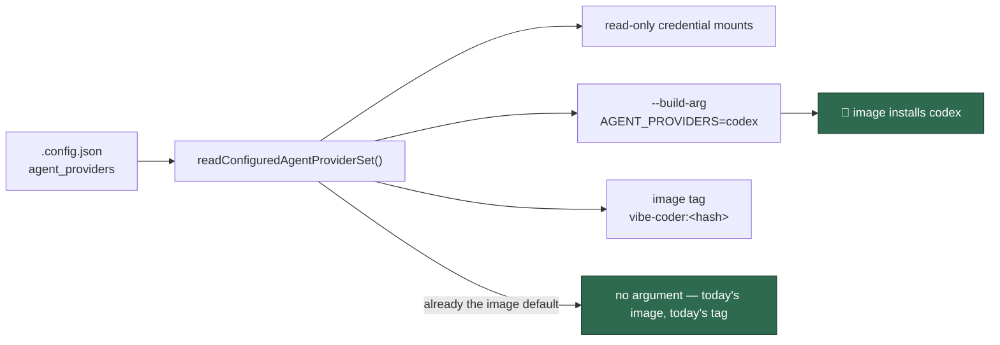

# Image build follows the configured providers (Issue #729)

## Summary

A `.config.json` selecting only Codex still built a Claude image: the launch
plan resolved the enabled provider set for the credential mounts alone, so
every build took the Containerfile's `AGENT_PROVIDERS="claude"` default and the
Codex CLI was simply absent from the image the host then ran.

The **same resolved set** now drives the mounts, the build argument and the
image tag:

- `agentProvidersBuildValue()` (`worker/deno/lib/agent_provider.ts`) turns the
  enabled ids into the `AGENT_PROVIDERS` value, or `undefined` when they are
  already `container/tools.json` `installedProviders` — the invariant that the
  default fleet build stays byte-for-byte what it was.
- `buildContainerLaunchPlan()` appends `--build-arg AGENT_PROVIDERS=<ids>` to
  the plan; `run.sh` and `run.ps1` both execute the plan's build arguments
  verbatim, so there is one build path, not two.
- `computeContainerImageHash()` mixes the value in under `agent_providers`, so
  switching providers rebuilds instead of silently reusing an image with the
  wrong agents baked in.
- `worker/deno/lib/agent_provider_config.ts` is the single reader of the
  selection; the launch plan and `container-image-hash` both call it, so their
  tags cannot diverge.

Closes #729.

## Evidence

Backend/CLI change — no web interface to screenshot. The evidence is the tests
below plus the argument lists and tags they pin.



Test run (`worker/deno`):

```text
deno test --allow-all tests/container_image_provider_set_test.ts \
  tests/container_image_hash_test.ts
ok | 41 passed | 0 failed
```

Full-suite state: three failures, all environmental and all present on the base
branch — `run_core_test.ts` / `run_core_rate_limit_resume_test.ts` hit a live
`gh` API rate limit, and `service_account_env_test.ts` reads an ambient
`gh-config` path from the container. `./quality.sh` reports every other check
(lint, type check, fmt, semgrep, mermaid, docs, chokepoints) as PASSED.

## Reproduction

- **symptom** — a `.config.json` selecting only `codex` produced an image with
  Claude installed and no Codex CLI, because no build ever received the
  configured set
- **status** — `verified` — with the build-argument branch in
  `worker/deno/lib/container_launch.ts` disabled, the two plan tests below fail
  (`expected "codex", got undefined`); with it in place all eleven pass. The
  tag half was red as a type error before `ContainerImageHashOptions` carried
  `agentProviders`
- **regression test** —
  `worker/deno/tests/container_image_provider_set_test.ts::buildContainerLaunchPlan - a Codex-only configuration builds a Codex image`
  (with
  `…::buildContainerLaunchPlan - a multi-provider configuration passes one build argument`)

## Acceptance Criteria

<!-- vibe-spec-review inputs="diff+issue-body" -->

- **met** — a Codex-only `.config.json` builds an image whose
  `VIBE_IMAGE_AGENT_PROVIDERS` reports `codex` — evidence:
  `worker/deno/lib/container_launch.ts` build args + `container/Containerfile`
  ARG→ENV; `worker/deno/tests/container_image_provider_set_test.ts::readConfiguredAgentProviderSet - a Codex-only config resolves to a Codex build`
  — reviewer: met
- **met** — that image installs the Codex CLI and not Claude — evidence:
  `container/install-providers.sh` runs exactly the requested ids — reviewer:
  met
- **met** — a Claude-only `.config.json` produces an unchanged image and tag —
  evidence:
  `worker/deno/tests/container_image_provider_set_test.ts::buildContainerLaunchPlan - a Claude-only configuration reproduces today's build arguments`
  and
  `worker/deno/tests/container_image_hash_test.ts::container-image-hash - selecting the image's own provider set keeps today's reference`
  — reviewer: met
- **met** — a multi-provider `.config.json` passes all selected providers in one
  build arg — evidence:
  `worker/deno/tests/container_image_provider_set_test.ts::buildContainerLaunchPlan - a multi-provider configuration passes one build argument`
  — reviewer: met
- **met** — changing the configured providers changes the derived image tag —
  evidence:
  `worker/deno/tests/container_image_provider_set_test.ts::resolveContainerImageReference - a changed provider set changes the tag`
  (four sets → four tags) — reviewer: met
- **met** — the build arg is passed on both build paths, or one shared path is
  used by both — evidence: `renderContainerLaunchPlan` emits `build=<arg>`;
  `run.sh:465,533` and `run.ps1:409,510` execute it verbatim — reviewer: met
- **partial** — tests and quality checks pass — evidence:
  `worker/deno/tests/service_account_env_test.ts:385` — reviewer: partial —
  reason: one pre-existing failure the reviewer reproduced on the base branch
  (plus two `gh` rate-limit failures), all environmental and untouched by this
  diff
- **unrequested** — new `worker/deno/lib/agent_provider_config.ts` extracted
  from the launch-plan command — reviewer: unrequested — reason: it is what
  makes the "single normalised derivation" the issue demands actually single;
  both commands now read the selection through it
- **unrequested** — `container-image-hash` reads the configured providers, and
  now fails when the config names an unusable one — reviewer: unrequested —
  reason: the command's whole job is naming the tag this host must have; a tag
  the launcher never builds would be worse than a loud failure
- **unrequested** — `agentProvidersBuildValue` re-checks id shape, duplicates
  and emptiness; `PROVIDER_ID_PATTERN` extracted; framing helper in
  `computeContainerImageHash` — reviewer: unrequested — reason: the plan accepts
  caller-constructed descriptors that never passed the config parser, so the
  value reaching a build argument is validated where it is built
- **unrequested** — documentation updates across `README.md`,
  `docs/CONFIGURATION.md`, `docs/CONTAINER.md`, `docs/CONTAINER-IMAGE.md`,
  `docs/QUORUM.md`, `docs/SETUP.md` — reviewer: unrequested — reason: six
  surfaces told operators to build the image by hand, which this change makes
  wrong

## Standards Review

<!-- vibe-standards-review inputs="diff+CODING-STANDARDS.md" -->

- **violation** — no `docs/archive/pr-summaries/pr-summary-729.md` — evidence:
  `docs/archive/pr-summaries/` — reason: fixed here, this file
- **violation** — a code change owes a docs change: three near-identical
  sentences still said the operator must build the image by hand — evidence:
  `docs/CONTAINER.md:1242`, `docs/CONTAINER.md:1326`, `docs/SETUP.md:865` (and
  the provider table rows) — reason: fixed in the second commit; all now say the
  launcher builds the configured set
- **violation** — stale in-code comment claiming the provider set is only the
  Containerfile default — evidence:
  `worker/deno/lib/container_image_hash.ts:52` — reason: fixed; it now names
  `AGENT_PROVIDERS_HASH_INPUT` as the config-derived input
- **violation** — the launcher-level composition had no test — evidence:
  `worker/deno/commands/container_launch_plan.ts` — reason: fixed by extracting
  `readConfiguredAgentProviderSet` into a lib seam and testing it over real
  `.config.json` files, including four loud failures
- **violation** — DRY: the "read selection → derive build value" composition
  existed in both commands, with divergent manifest path handling — evidence:
  `worker/deno/commands/container_image_hash.ts:91` vs
  `worker/deno/commands/container_launch_plan.ts:168` — reason: fixed; one lib
  function, called by both, and the cross-command import is gone
- **clean** — Australian English throughout the added prose and comments;
  fail-loud with the offending value named and no silent fallback; tests call
  real functions and assert on returned values (no source-grepping); commit
  safety (no hidden paths staged) and `Vibe-Coder-Run-Id` trailers; Deno
  conventions — `@std/assert`, full JSDoc on new exports, `deno fmt`/`lint`/
  `check` clean

## Test Plan

Added `worker/deno/tests/container_image_provider_set_test.ts` (11 tests):

- `agentProvidersBuildValue` — the image default needs no build argument; a
  different set is passed comma-separated; an unusable set fails loud (empty,
  duplicate, blank, path-traversing, upper-case).
- `readConfiguredAgentProviderSet` — a Codex-only config resolves to a Codex
  build; a Claude-only or unconfigured one needs no build argument; four
  unusable configurations fail loud.
- `buildContainerLaunchPlan` — a Codex-only configuration carries
  `--build-arg AGENT_PROVIDERS=codex` before the build context; a
  multi-provider one passes all four ids in one argument; a Claude-only one
  reproduces today's exact argument list.
- `resolveContainerImageReference` — the image default keeps today's tag;
  four differing sets yield four tags.

Added to `worker/deno/tests/container_image_hash_test.ts` (3 tests): the
configured provider set moves the printed reference and is reported as a hash
input; selecting the image's own set keeps today's reference; an unsupported id
fails the command naming it. Added
`worker/deno/tests/fixtures/provider_env.ts` so those tests are not judged
against the image the suite itself runs in.

No existing test was removed or weakened.

## Follow-up

`stSoftwareAU/VibeCoder#743` — `worker/deno/setup/prerequisites.ts:469` and
`worker/deno/lib/tabletop_container_runner.ts:402` still derive the tag without
the deployment's `container_tools` or `agent_providers`, so they can name a tag
the launcher never builds. Pre-existing for tools, widened by this change to
providers; genuinely separate work, so it is filed rather than folded in.
