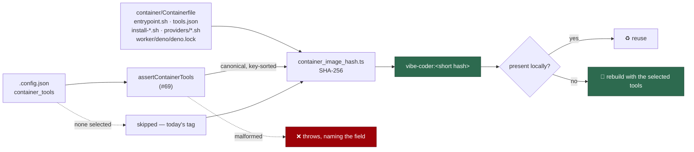

# Include the selected tool spec in the container image hash (Issue #73)

## Summary

The image tag was derived from a fixed list of **committed files** only, so two
deployments that select different `container_tools` produced the *same*
`vibe-coder:<hash>` — one host's cached image silently satisfied another host's
requirement and the selected tool (Maven, Java) was quietly missing inside the
container. The resolved selection is now mixed into the hash, so a different
tool set is a different image. Closes #73.

What changed:

- `worker/deno/lib/container_image_hash.ts` — `computeContainerImageHash` and
  `resolveContainerImageReference` take an optional `containerTools` value and
  mix in `canonicalContainerToolsSpec()`: a key-sorted, whitespace-free
  serialisation of the **validated** spec (#69). Re-ordering keys in
  `.config.json`, or spelling a digest in upper case, does not churn the tag;
  any change of id, version, URL or checksum does. Array order is kept — it
  decides PATH order inside the image.
- **The empty case is byte-identical to before**: a deployment that selects no
  tools skips the mix-in entirely, so the existing fleet does not rebuild on
  upgrade. `deno run --allow-env --allow-read worker/deno/mod.ts
  container-image-hash` on this repo still prints `vibe-coder:31a77aa24fba`,
  the tag it printed before the change.
- **Fail loud**: the spec is validated *before* any file is read, so a
  malformed selection throws naming the offending tool and field rather than
  falling back to a tools-free tag.
- `worker/deno/commands/container_image_hash.ts` — reads the selection from
  `--config`, else `CONFIG_PATH`, else `<base-dir>/.config.json`, reports
  `container_tools` in its `inputs` and the selected ids in `containerTools`,
  and fails the command on a malformed spec. Launchers decide whether to
  rebuild from this output alone.
- `worker/deno/lib/container_tools_config.ts` — new
  `readContainerToolsSelection()` reads and validates the block once for both
  host-side callers (the launch plan's `VIBE_CONTAINER_TOOLS` argument and the
  hash), instead of the plan-only reader added in #72. An absent file means "no
  tools"; an unreadable one throws.
- `worker/deno/commands/container_launch_plan.ts` — passes the validated spec
  into the reference, so the tag the launcher builds and runs is the tag the
  command prints.
- The framing separator in the hash was a **literal NUL byte** in the source,
  invisible to any reader; it is now the named `FIELD_SEPARATOR = "\0"`. Same
  bytes, same tag.

## Evidence

Backend/CLI change — no web interface to screenshot. Verified by the test suite
and by the command itself:

```console
$ deno run --allow-env --allow-read worker/deno/mod.ts container-image-hash
vibe-coder:31a77aa24fba     # unchanged: this repo selects no container_tools
```



`./quality.sh` passes except for ten pre-existing failures unrelated to this
change (`setup_workdir_reminder_test.ts`, `optional_feature_env_test.ts`,
`fleet_health_test.ts`, `host_workdir_guard_test.ts` — host work-dir probes
that also fail on the milestone branch with these changes stashed).

## Test Plan

`worker/deno/tests/container_image_hash_test.ts`:

- `no selected tools keeps the pre-#73 tag` — the no-tools digest is compared
  against a reference implementation of the pre-change algorithm, for
  `undefined`, `null` and `[]`. Fails the moment the empty case churns and the
  fleet would rebuild.
- `different tool sets give different tags` — none / java / java+maven / maven
  produce four distinct references.
- `re-ordering keys keeps the tag` — the same selection typed in a different
  key order, including inside the architecture blocks, hashes the same.
- `a version, url or digest change moves the tag` — each of the three moves it.
- `re-ordering the tool array moves the tag` — entry order is PATH order.
- `a malformed spec fails loud, naming the field` — names `sha256.amd64` and
  the tool id.
- `canonicalContainerToolsSpec - is key-sorted, whitespace-free and resolved` —
  pins the canonical form, including validator defaults and digest lower-casing.
- Command: `reports the selected tool spec as an input`,
  `a changed tool version changes the printed reference`,
  `a malformed spec fails the command, naming the field`,
  `an absent config selects no tools`, plus `resolveConfigFile` precedence.
- Existing command tests now pass an explicit `--config`, so they no longer
  depend on whichever `CONFIG_PATH` the suite happens to run under.

`worker/deno/tests/container_tools_config_test.ts`: five cases for
`readContainerToolsSelection` — validated spec plus verbatim JSON, empty and
absent selections, a malformed spec naming the field, and unreadable JSON
naming the file.
