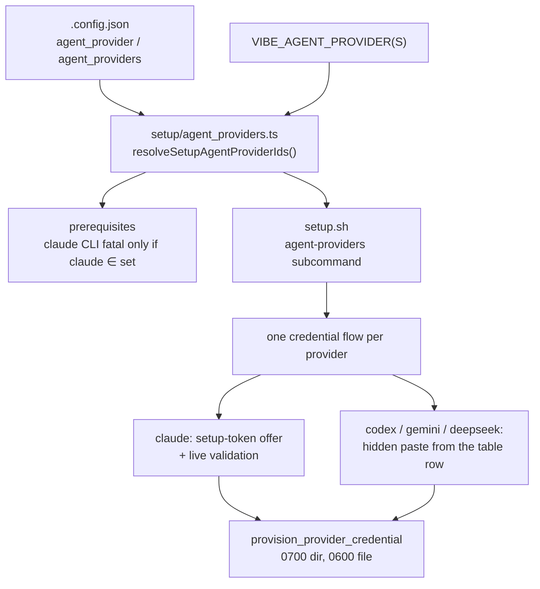

# setup.sh asks for the credentials the configured providers need

## Summary

`setup.sh` demanded the Claude CLI and a Claude OAuth token on every host,
whatever `.config.json` selected. On a Codex-only host the host-fatal `claude`
prerequisite stopped the run before its configuration-writing stage, so
`.config.json` was never created and the operator fell back to
`VIBE_SKIP_PREREQ_CHECK=true ./setup.sh < /dev/null` plus a hand-written
config.

The selection is now resolved once, from the same seam the worker uses, and
both surfaces follow it:

- **`worker/deno/setup/agent_providers.ts`** (new) resolves `agent_provider` /
  `agent_providers` — with the `VIBE_AGENT_PROVIDER(S)` overrides and the
  default — through `resolveEnabledAgentProviderIds`. A configuration file that
  exists but is broken, or names an unregistered provider, throws rather than
  falling back to Claude.
- **The prerequisite probe** demands the `claude` CLI only where Claude is
  among the configured providers, reports the providers it classified for, and
  names the claude CLI in its failure advice only when that host runs Claude.
- **`setup.sh`** runs one credential flow per configured provider, in the order
  the configuration enables them. Each flow is driven by that provider's row in
  the existing `vibe_provider_credential_table` and writes through the existing
  `provision_provider_credential`, so a provider registered in
  `worker/deno/lib/agent_provider.ts` with a table row is handled with no
  further edit here. Claude keeps exactly today's behaviour — the CLI probe,
  the `claude setup-token` offer, the live validation call and the OAuth
  paste — because its subscription token has no paste-free equivalent.
- **`setup_cli.ts agent-providers`** (new subcommand) prints the resolved ids,
  one per line, so the shell never parses `.config.json` itself (host `jq` is
  container-owned and may be absent).

Closes #730.

## Evidence

Backend/CLI change with no web interface to screenshot. The evidence is the
probe's own output, captured on a host with **no `claude` on `PATH`** and a
Codex-only `.config.json`.

Before (the reported fault — `run_setup_cli prerequisites` exits 1, so
`.config.json` is never written):

```text
✗  claude CLI is not installed
ℹ  Required on the host in every run mode: setup mints and validates the worker's OAuth token with `claude setup-token` (Issue #4161)...
✗  Some host prerequisites are missing or not configured (run mode: container).
EXIT=1
```

After, same host, same configuration:

```text
✓  claude CLI not required — this host is configured for codex
✓  All host prerequisites satisfied (run mode: container)
REACHED_CONFIG_STAGE
EXIT=0
```



## Reproduction

- **symptom** — a Codex-only `.config.json` on a host with no `claude` CLI
  failed the host-fatal claude prerequisite, so `setup.sh` exited before
  writing `.config.json`, and the Claude OAuth token was prompted for anyway
- **status** — `verified` — the prerequisite stage was driven against the
  unfixed code on a host with no `claude` (stub container runtime and `gh`,
  Codex-only config) and exited 1 with `claude CLI is not installed`; the same
  command after the fix reports
  `claude CLI not required — this host is configured for codex` and reaches the
  configuration-writing stage
- **regression test** —
  `worker/deno/tests/setup_provider_credential_flow_test.ts::setup.sh - a Codex-only host with no claude CLI reaches the configuration-writing stage`

## Acceptance Criteria

<!-- vibe-spec-review inputs="diff+issue-body" -->

- **met** — a Codex-only `.config.json` runs `setup.sh` to completion with no
  Claude CLI installed and no Claude prompt shown — evidence:
  `worker/deno/setup/prerequisites.ts:checkClaudeCli`,
  `worker/deno/tests/setup_provider_credential_flow_test.ts::setup.sh - a Codex-only host with no claude CLI reaches the configuration-writing stage`
  — reviewer: met
- **met** — a Codex-only run prompts for, or validates,
  `~/.vibe-coder/credentials/codex/provider.env` — evidence:
  `worker/deno/tests/setup_provider_credential_flow_test.ts::interactive_credentials_flow - a Codex-only host is asked for the Codex credential, never Claude's`
  — reviewer: met
- **met** — that file is written `0600` inside a `0700` directory, and an
  existing credential file is never overwritten — evidence: the mode
  assertions in the same test, plus
  `::interactive_credentials_flow - an existing Codex credential is never overwritten`
  — reviewer: met
- **met** — a Claude-only configuration keeps today's behaviour — evidence:
  `::interactive_credentials_flow - a Claude-only host keeps today's behaviour`
  and the 18 unchanged tests in
  `worker/deno/tests/setup_credential_provisioning_test.ts` — reviewer: met
- **met** — a configuration selecting both providers exercises both credential
  flows — evidence:
  `::interactive_credentials_flow - a two-provider host runs both flows` —
  reviewer: met
- **partial** — `setup.sh < /dev/null` completes without hanging and without
  `VIBE_SKIP_PREREQ_CHECK` — evidence:
  `::prompt_interactive_credentials - a run with no terminal prompts for nothing`
  and the stdin-`/dev/null` stage replay in
  `::setup.sh - a Codex-only host with no claude CLI reaches the configuration-writing stage`
  — reviewer: partial — reason: no test invokes `./setup.sh` end to end, because
  the later stages install this checkout's git hooks and call the GitHub API;
  the tests drive `main()`'s stages in order instead
- **partial** — `.config.json` is written by a completed run; report item 1
  fixed or recorded on #722 — evidence: the regression test above (config
  present after the stages that used to abort) — reviewer: partial — reason:
  fixed for a host that *has* a Codex-only configuration, which is the reported
  state; a host with **no** `.config.json` at all still resolves to the default
  provider, so its first run is told to use `VIBE_AGENT_PROVIDER=codex`
  (documented in `docs/SETUP.md`, covered by
  `setup_agent_provider_gating_test.ts::resolveSetupAgentProviderIds - VIBE_AGENT_PROVIDER selects the provider on a host with no configuration yet`,
  and named in the failing probe's own hint)
- **met** — which provider flows ran is stated in setup's output — evidence:
  `worker/deno/setup/setup_cli.ts` (`Configured coding-agent providers: …`) and
  `setup.sh` (`Coding-agent credential flows for this host: …`), asserted in
  both new test files — reviewer: met
- **partial** — tests and quality checks pass — evidence: the new tests pass
  (42 in the two new files plus the credential suite); `deno lint`, `deno check`,
  `deno fmt` and `shellcheck -S warning setup.sh` are clean — reviewer: partial
  — reason: `./quality.sh` reports three pre-existing test failures
  (`service_account_env_test.ts`, `run_core_test.ts`,
  `run_core_rate_limit_resume_test.ts`); the identical 33 failures were
  reproduced on the base commit `f8ae393` in a clean worktree, so they are
  environmental (host `.container-state` path, live GitHub rate limit) and not
  caused by this diff
- **unrequested** — the setup-time resolution fails loudly on a `.config.json`
  that exists but is unreadable, is not JSON, or sets the provider keys to the
  wrong type — reviewer: unrequested — reason: the alternative is guessing a
  provider from a broken file and prompting for the wrong vendor's credential,
  which is the failure this issue is about
- **unrequested** — the setup-time resolution ignores the
  `VIBE_IMAGE_AGENT_PROVIDERS` image stamp — reviewer: unrequested — reason:
  setup runs on the host to configure the providers the *next* image build
  installs; the worker still enforces the stamp at run time inside the image
- **unrequested** — `provider_credential_source_hint` carries per-vendor key
  URLs for codex/gemini/deepseek — reviewer: unrequested — reason: an operator
  at the prompt needs to know where the key comes from; a provider with no
  entry still gets a working prompt, so no edit is required to add one
- **unrequested** — new `setup_cli.ts agent-providers` subcommand and the
  exported `probedAgentProviders` helper — reviewer: unrequested — reason: the
  seam the shell reads the selection through, so `setup.sh` neither parses
  `.config.json` nor needs host `jq`

## Standards Review

<!-- vibe-standards-review inputs="diff+CODING-STANDARDS.md" -->

- **violation** — a credential was announced with `✓ Provisioned …` before it
  was validated, so a token that failed `claude -p` printed success then a
  warning — evidence: `setup.sh:316` — reason: fixed here —
  `provision_provider_credential` takes a `quiet` mode and the interactive flow
  prints its success line only after validation
- **violation** — the committed tests failed `deno fmt --check` — evidence:
  `worker/deno/tests/setup_provider_credential_flow_test.ts:97` — reason: fixed
  here (`deno fmt` applied; the gate is clean)
- **violation** — an explicitly empty provider set fell back to Claude in
  `probedAgentProviders`, `prerequisiteSummaryLines` and `main()` — evidence:
  `worker/deno/setup/prerequisites.ts:296` — reason: fixed here — an empty set
  now throws in Deno and exits non-zero in `setup.sh`; the *absent* option
  still means "the default provider", which is what every pre-existing caller
  asks for
- **violation** — new fail-loud branches had no error-path test — evidence:
  `setup.sh:613` (unknown provider), `setup.sh:792`
  (`configured_agent_providers`), `worker/deno/setup/setup_cli.ts:386` — reason:
  fixed here — three error-path tests added, including the `agent-providers`
  stdout contract (non-zero exit, empty stdout)
- **violation** — `docs/SETUP.md` gated the claude prerequisite in the
  checklist but still told every host to install the CLI in the three manual
  recipes — evidence: `docs/SETUP.md:431` — reason: fixed here — the recipes
  now say the `claude` step is skippable on a host that does not run Claude
- **violation** — the comment claimed the provider set is "resolved once" when
  the probe and the shell each resolve it — evidence: `setup.sh:1291` — reason:
  fixed here — the comment now says both read the same selection through the
  same seam
- **violation** — new provider decision logic (id → prompt variable, → hint,
  → validation, → mint) is written in bash rather than Deno — evidence:
  `setup.sh:487-598` — reason: stands. `setup.sh` owns the interactive terminal
  layer by design (it is what the Deno CLI cannot do), and the issue asks for
  the flow there. Each of those functions is a small capability lookup with a
  safe default, so a new provider still needs no edit. Moving the prompt text
  and per-provider capabilities behind the Deno seam is a larger refactor of
  `setup.sh`/`setup.ps1` than this issue's scope allows
- **violation** — `VIBE_DEFAULT_AGENT_PROVIDER` duplicates
  `DEFAULT_AGENT_PROVIDER_ID` — evidence: `setup.sh:253` — reason: kept, now
  gated:
  `setup_provider_credential_flow_test.ts::setup.sh - the default provider mirrors the registered default`
  fails the quality gate if the two drift, the same guard the credential table
  already has
- **violation** — single-case dispatchers and a file-scope global
  (`VIBE_MINTED_CREDENTIAL`) used as a return channel — evidence:
  `setup.sh:533` — reason: stands. `mint_provider_credential` prints operator
  instructions to stdout, so it cannot also return the token through stdout;
  the global is cleared immediately after it is read, and the
  operator-inherited variable it borrows is now restored rather than unset
  (`setup.sh:674-690`)
- **violation** — the PR summary was not committed — evidence:
  `docs/archive/pr-summaries/pr-summary-730.md` — reason: fixed here — this file
  is committed with the change
- **clean** — Australian English throughout the diff; `set -euo pipefail` with
  every `read` carrying an EOF fallback; bash 3.2-safe constructs (`printf -v`,
  `local -a`, `<<<`, process substitution, `${arr[@]+…}`); tests call real code
  (they source the real `setup.sh` and assert on files, modes and output — no
  source grepping); no existing test removed or weakened; secrets read with
  `read -rs`, written under `umask 077` and asserted absent from output; no
  hidden path staged

## Test Plan

New — `worker/deno/tests/setup_provider_credential_flow_test.ts` (drives the
real functions in the real `setup.sh`):

- a Codex-only host is asked for the Codex credential, never Claude's — asserts
  `codex/provider.env` contents, `0600` inside `0700`, no Claude prompt, no
  `claude/` directory, the pasted secret never echoed, and the worker's own
  credential preflight accepting the result
- a Codex-only host **with** `claude` installed still sees no Claude prompt
  (the gate is the configuration, not what happens to be on `PATH`)
- an existing Codex credential is never overwritten
- a Claude-only host keeps today's behaviour, and is asked for nothing else
- a two-provider host runs both flows
- `prompt_interactive_credentials` with no terminal prompts for nothing
- `setup.sh` reaches the configuration-writing stage on a Codex-only host with
  no `claude` CLI (the regression test above)
- `configured_agent_providers` resolves the selection through the real Deno seam

New — `worker/deno/tests/setup_agent_provider_gating_test.ts`:

- `resolveSetupAgentProviderIds` for a Codex-only, a two-provider and an absent
  configuration, and loud failure on broken JSON, a wrong type and an unknown
  provider
- `checkClaudeCli` / `checkAllPrerequisites` for Codex-only (passes with no
  claude CLI), Claude-only and both-providers hosts
- `prerequisiteSummaryLines` names the claude CLI only when Claude is
  configured

Added after the independent reviews:

- an unknown provider id fails the flow loudly instead of being skipped
- `configured_agent_providers` exits non-zero, printing no provider id, for a
  broken configuration
- the `agent-providers` subcommand contract: ids on stdout, or a non-zero exit
  with an empty stdout
- `VIBE_DEFAULT_AGENT_PROVIDER` mirrors `DEFAULT_AGENT_PROVIDER_ID`
- `VIBE_AGENT_PROVIDER` selects the provider on a host with no configuration
  yet, and the failing claude probe names that escape
- `probedAgentProviders` throws on an explicitly empty set

Unchanged and still passing: `setup_credential_provisioning_test.ts` (18
tests, including every existing Claude flow), `setup_prerequisites_test.ts`,
`multi_provider_credentials_test.ts`, `setup_cli_container_repair_test.ts`,
`setup_parity_test.ts`.

`./quality.sh`: every check passes except `deno tests`, which reports three
failures — `service_account_env_test.ts::applyServiceAccountEnv - an unwritable
gh config dir is restaged writable`, and uncaught errors in `run_core_test.ts`
and `run_core_rate_limit_resume_test.ts`. The identical 33 failures were
reproduced on the base commit `f8ae393` in a clean worktree
(`git worktree add /tmp/base730 f8ae393 && deno task test …`), so they are
environmental (the host's `.container-state` path and a live GitHub rate
limit), not caused by this change.

## Follow-up

`setup.ps1` — the Windows twin — still prompts for `CLAUDE_CODE_OAUTH_TOKEN`
unconditionally, so a Codex-only Windows host keeps the behaviour this change
removes on macOS and Linux. That is outside this issue's scope (`setup.sh`) and
is filed separately.
