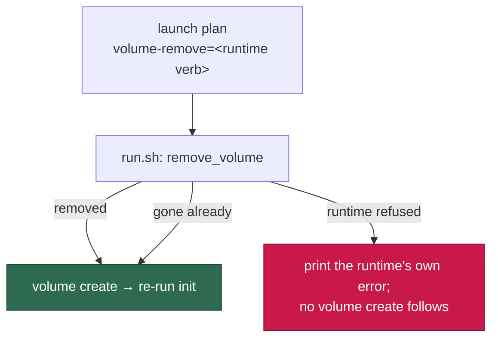

# Recover volumes with the runtime's own removal verb (Issue #731)

## Summary

Both volume-recovery paths in `run.sh` ran `"${RUNTIME}" volume delete` and
discarded the result with `2>&1 || true`. Podman has no `volume delete`
sub-command: it answered "unrecognized command", the suppression threw that
away, the volume survived, and the `volume create` on the very next line failed
with `volume with name vibe-work already exists` — a name clash reported in
place of a removal that never happened. Closes #731.

The removal verb is **not** shared across the runtimes this fleet supports, so
guessing one spelling in shell only moves the breakage: Docker and Podman spell
it `volume rm`, Apple `container` spells it `volume delete`
(`APPLE_DIALECT.volumeRemoveArgs`, `worker/deno/lib/container_runtime.ts:427`).
The fix therefore takes the verb from the runtime dialect that already exists
in this repo and carries it to the launchers in the launch plan, beside the
other per-runtime argument lists:

- `container_launch.ts` — the plan gains `volumeRemoveArgs`, rendered as
  `volume-remove=` tokens and parsed back with the rest.
- `run.sh` — parses `volume-remove` (an incomplete plan is still a loud
  refusal), and both recovery paths call a new `remove_volume` helper instead
  of a hardcoded verb. A removal that fails is surfaced with the runtime's own
  stderr and **stops** the recreate; a volume that is already gone is still not
  an error. The `#478` heal additionally leaves its interval state unwritten
  when nothing was removed, so a later launch may try again.
- `run.ps1` — accepts and uses the new plan key (it fails loud on unknown keys,
  and it had the same suppressed-removal shape), keeping launcher parity.
- The comment claiming the verbs "are spelled identically on every supported
  runtime" and the operator remedy quoting `container volume delete vibe-work`
  are corrected in `run.sh` and `docs/CONTAINER.md`.

## Evidence

Backend/CLI change — no web surface to screenshot. The evidence is the
launcher suite, which runs the real `run.sh` against a recording runtime stub:

- `deno test tests/run_sh_launcher_test.ts tests/container_launch_test.ts
  tests/launcher_parity_test.ts tests/launcher_source_test.ts
  tests/run_ps1_launcher_test.ts tests/container_restart_backoff_test.ts`
  → **160 passed, 0 failed**.
- The stub now models the real difference: `STUB_VOLUME_REMOVE_VERB` pins the
  one spelling a runtime accepts and refuses any other the way Podman does
  (`Error: unrecognized command "podman volume delete"`, exit 125), with the
  volume surviving.

## Reproduction

- **symptom** — volume recovery on Podman removed nothing and then failed to
  recreate, reporting `volume with name vibe-work already exists`
- **status** — `verified` — with the runtime stub pinned to the verb the
  runtime accepts (`rm` on this Linux host), the three new behavioural tests
  failed against the unfixed `run.sh` and pass after the fix; the fourth (a
  removal of a volume that is not there) passed before and after, as intended
- **regression test** —
  `worker/deno/tests/run_sh_launcher_test.ts::run.sh - recreates an
  unrepairable volume with the verb its runtime accepts (Issues #731, #229)`

## Acceptance Criteria

<!-- vibe-spec-review inputs="diff+issue-body" -->

- **met** — Both recovery paths use `volume rm` — evidence: `run.sh:765`
  (`remove_volume`), call sites `run.sh:839` and `run.sh:974`, verb from
  `worker/deno/lib/container_runtime.ts:356` (`["volume","rm"]` for
  Docker/Podman) — reviewer: met — reason: the reviewer noted the verb is not
  hardcoded; Apple container keeps its own `volume delete`, which is that
  runtime's correct spelling and the only way `run.sh` stays right on macOS.
- **met** — `podman volume rm` succeeds against an existing volume during
  recovery, and the subsequent `volume create` succeeds — evidence:
  `worker/deno/tests/run_sh_launcher_test.ts::run.sh - recreates an
  unrepairable volume with the verb its runtime accepts (Issues #731, #229)`,
  plus `container_launch_test.ts::buildContainerLaunchPlan - the plan carries
  the runtime's own volume-removal verb (Issue #731)` — reviewer: met
- **met** — A removal that genuinely fails prints the runtime's own error and
  does not fall through to a `volume create` — evidence: `run.sh:839-843`,
  `run.sh:974-978`; `run_sh_launcher_test.ts::run.sh - a removal the runtime
  refuses is surfaced, and no volume create follows it (Issue #731)` —
  reviewer: met
- **met** — Removing a volume that does not exist is still not an error —
  evidence: `run.sh:779-787`; `run_sh_launcher_test.ts::run.sh - removing a
  volume that is not there is still not an error (Issue #731)` — reviewer: met
- **partial** — Docker recovery behaviour is unchanged — evidence:
  `run.sh:992` — reviewer: partial — reason: the success path is unchanged, but
  the `#478` heal no longer stamps `HEAL_STATE_FILE` when nothing was
  recreated, so a refused removal does not spend the 24 h interval. Kept: the
  interval bounds destruction, and stamping it for a heal that never happened
  would lock the host out of a retry it never used.
- **met** — The remediation text names a command that works on both Docker and
  Podman — evidence: `run.sh:869-873`, `docs/CONTAINER.md:729-731` — reviewer:
  met — reason: the reviewer confirmed by grep that this comment was the only
  site; no printed operator string carries a removal verb.
- **met** — The comment describing shared verb spelling is corrected —
  evidence: `run.sh:720-728` — reviewer: met
- **partial** — Tests and quality checks pass (`deno test`, `./quality.sh`) —
  evidence: `./quality.sh` reports every check PASSED except `deno tests` —
  reviewer: partial — reason: the residual failures are environmental and
  pre-existing (`service_account_env_test.ts` reads the host's
  `.container-state/gh-config`; `run_core*` tests hit a real `gh` GraphQL rate
  limit). The reviewer reproduced them identically on the base branch in a
  clean worktree; every suite this change touches is green.
- **met** — Failure Detection: no `volume delete` invocation remains in
  `run.sh`, and the recovery path emits the runtime's verb — evidence:
  `worker/deno/tests/launcher_parity_test.ts::run.sh and run.ps1 - neither
  hardcodes a volume-removal verb (Issue #731)`, which strips comments with the
  real `executableLines()` before checking, plus the invocation assertion in
  `run_sh_launcher_test.ts:1404` — reviewer: missing — reason: departed; the
  reviewer read the diff before this guard was added in response to its own
  finding.
- **unrequested** — the launch-plan field/key `volumeRemoveArgs` /
  `volume-remove` — reviewer: unrequested — reason: hardcoding `volume rm`
  would break Apple container, whose dialect already spells removal
  `volume delete`; the verb belongs beside the other per-runtime argument
  lists rather than in shell.
- **unrequested** — `run.ps1` parses the new key and surfaces a refused removal
  — reviewer: unrequested — reason: `run.ps1` fails loud on unknown plan keys,
  so parsing it was forced; it carried the same discarded-removal shape, and
  launcher parity is enforced by `launcher_parity_test.ts`.
- **unrequested** — the `#478` heal reports a failed `volume create` instead of
  aborting (`run.sh:981-986`) — reviewer: unrequested — reason: raised by the
  reviewer itself as a correctness risk: under `set -e` a broken runtime would
  have taken down a launch that Issue #477 requires to run and report.
- **unrequested** — `docs/CONTAINER.md` narrative and Mermaid node — reviewer:
  unrequested — reason: the doc named the same unusable command; a code change
  owes a docs change.
- **unrequested** — harness stub semantics (`STUB_VOLUME_REMOVE_VERB` /
  `_EXIT` / `_STDERR`, `STUB_INIT_RETRY_EXIT`, removals recorded only on
  success) — reviewer: unrequested — reason: the stub could not express the
  reported failure before; defaults leave every existing test unchanged.

## Standards Review

<!-- vibe-standards-review inputs="diff+CODING-STANDARDS.md" -->

- **violation** — `deno fmt --check` failed on the new hunk — evidence:
  `worker/deno/tests/run_sh_launcher_test.ts:1379` — reason: fixed here
  (`deno fmt`); the gate now reports fmt PASSED.
- **violation** — no `docs/archive/pr-summaries/pr-summary-731.md` — evidence:
  `docs/archive/pr-summaries/` — reason: fixed here; this file.
- **violation** — `run.ps1` gained a failure branch with no test, though the
  harness already drives it — evidence: `run.ps1:722-739` — reason: fixed here;
  two mirrored cases added to `worker/deno/tests/run_ps1_launcher_test.ts`
  (they self-skip where `pwsh` is absent, as the rest of that suite does).
- **violation** — the new runtime calls were unbounded, unlike the analogous
  builder-stop helper — evidence: `run.sh:771`, `run.sh:782` — reason: fixed
  here; both run under `bounded 120`, as does the heal's `volume create`.
- **violation** — the stderr-capture idiom is duplicated — evidence:
  `run.sh:696-701` vs `run.sh:768-776` — reason: stands. Two short copies is
  under the repo's "three similar lines beats a premature abstraction" line,
  and factoring it would touch the builder-stop path this issue does not own.
- **violation** — `docs/CONTAINER.md` paragraph left un-reflowed — evidence:
  `docs/CONTAINER.md:743` — reason: fixed here; the paragraph is rewrapped.
- **violation (observation)** — a partial heal still spends the interval —
  evidence: `run.sh:992` — reason: stands, and is now stated in the comment:
  the interval bounds destruction, not success, and any refused volume is
  reported by `report_unrecovered`.
- **clean** — the areas the reviewer checked and found compliant: `2>&1 || true`
  gone from both recovery paths with the runtime's own message reaching stderr
  and `run_core.log`; absence-is-not-success handled message-agnostically via
  `volume inspect` rather than string matching; bash 3.2 / `set -euo pipefail`
  discipline and `shellcheck` clean; the dialect reused rather than a second
  spelling table introduced; every new test executes real code (no
  source-grepping of implementation internals); Australian English throughout
  (the sole "unrecognized" is inside the stub reproducing Podman's literal
  output); docs updated alongside the code; no hidden paths staged and both
  commits carry the run-id trailer.

## Test Plan

Added to `worker/deno/tests/run_sh_launcher_test.ts`:

- `run.sh - recreates an unrepairable volume with the verb its runtime accepts
  (Issues #731, #229)` — the volume is removed and recreated, the init re-runs,
  and the launcher never invokes the spelling the runtime rejects.
- `run.sh - a removal the runtime refuses is surfaced, and no volume create
  follows it (Issue #731)` — the runtime's own message reaches stderr and
  `run_core.log`, no `volume create` is attempted, and the launch fails at
  volume preparation.
- `run.sh - removing a volume that is not there is still not an error
  (Issue #731)` — a non-zero removal over an absent volume recreates as normal.
- `run.sh - a heal whose removal the runtime refuses is reported, never dressed
  up as a fix (Issues #731, #478)` — `[WORK_VOLUME_UNRECOVERED]` with the
  runtime's message, no recreate, no heal-interval state written, and the
  worker still launches (Issue #477).

Added to `worker/deno/tests/container_launch_test.ts`:

- `buildContainerLaunchPlan - the plan carries the runtime's own volume-removal
  verb (Issue #731)` — `volume rm` for Docker and Podman, `volume delete` for
  Apple container.
- The round-trip test now asserts `volume-remove` survives the plan framing.

Added to `worker/deno/tests/run_ps1_launcher_test.ts` (self-skipping where
`pwsh` is absent, as that suite already does): the same two cases against
`run.ps1`.

Added to `worker/deno/tests/launcher_parity_test.ts`:

- `run.sh and run.ps1 - neither hardcodes a volume-removal verb (Issue #731)` —
  comments stripped with the real `executableLines()`, so the launchers may
  explain the difference in prose but may not spell an invocation.

Harness (`worker/deno/tests/fixtures/launcher_harness.ts`):
`STUB_VOLUME_REMOVE_VERB`, `STUB_VOLUME_REMOVE_EXIT`,
`STUB_VOLUME_REMOVE_STDERR` and `STUB_INIT_RETRY_EXIT`; a removal is recorded
only when it succeeded.
