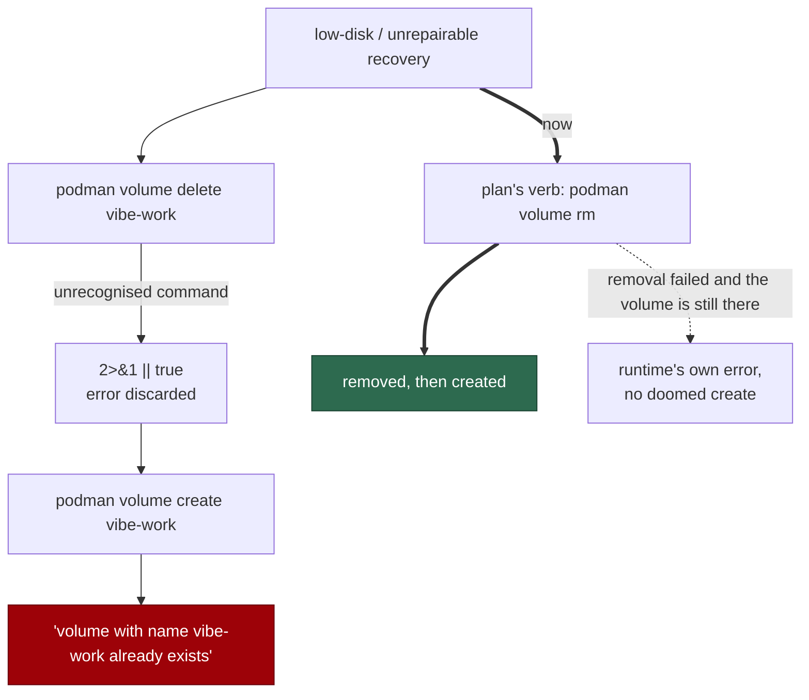

# The volume-removal verb comes from the runtime, and a failed removal is heard

## Summary

Both of `run.sh`'s volume-recovery paths ran:

```
"${RUNTIME}" volume delete "${volume}" </dev/null >/dev/null 2>&1 || true
"${RUNTIME}" volume create "${volume}" </dev/null >/dev/null
```

Podman has no `volume delete` — it spells the verb `volume rm`. The
`2>&1 || true` swallowed Podman's "unrecognised command", so recovery removed
nothing, said nothing, and the very next line failed with
`volume with name vibe-work already exists`: a message describing neither the
fault nor its cause. The comment above it claimed these verbs "are spelled
identically on every supported runtime", which is what made the bug invisible.

Two changes:

- **The verb belongs to the runtime.** `ContainerLaunchPlan` now carries
  `volumeRemoveArgs` from the dialect — `volume rm` on Docker and Podman,
  `volume delete` on Apple `container` — and both launchers use it. Simply
  hardcoding `volume rm` instead would have broken the Apple hosts, where
  `volume delete` is the real verb and the reason the wrong one was there.
- **A failed removal is heard.** `recreate_volume` judges the removal by the
  volume rather than by the exit code: one that is gone was nothing to remove
  and the create proceeds; one that is still there is reported in the
  runtime's own words, and the `volume create` that is certain to fail is not
  attempted. The unrepairable-filesystem path then leaves the init's own exit
  3 to be reported, and the low-disk heal reports `[WORK_VOLUME_UNRECOVERED]`
  instead of claiming a fix.

`run.ps1` gets the same plan key and the same "report, do not continue"
handling — it already used `volume rm`, which is right for Docker and Podman
but was equally a guess.

Closes #731.

## Evidence

Launcher change with no web surface to screenshot. The evidence is the
behavioural launcher suite.

The reported failure chain, and where it is cut:



Red before, green after — `run.sh` reverted to the hardcoded, suppressed form
and the new cases run against it:

```
# unfixed
run.sh - names no volume verb of its own (Issue #731) ... FAILED
run.sh - a removal that leaves the volume in place is reported, not followed by a doomed create (Issue #731) ... FAILED
FAILED | 2 passed | 2 failed
```

The verb case passes on macOS even unfixed, because Apple `container`'s verb
*is* `volume delete` — which is exactly why this survived on this fleet. The
case that catches it regardless of host is the plan-level one:
`buildContainerLaunchPlan - carries the runtime's own volume-removal verb
(Issue #731)` asserts Podman gets `volume rm`.

```
ok | 155 passed | 0 failed   # container_launch, run_sh_launcher,
                             # run_ps1_launcher, launcher_parity
```

`deno fmt --check` (2013 files), `deno lint` (2007 files) and markdownlint are
clean.

## Reproduction

- **symptom** — on Podman, volume recovery reports nothing, removes nothing,
  and then fails with `volume with name vibe-work already exists`
- **status** — `partial` — no Podman host was available to this run, so the
  end-to-end failure was not driven on the real runtime. What was verified is
  every link of the chain: the plan carries `volume rm` for Podman
  (asserted), the launcher sends the plan's verb and no verb of its own
  (asserted twice — behaviourally and over the source), and a removal that
  leaves the volume in place is reported rather than followed by the doomed
  create (asserted against a stub runtime that fails removal with the volume
  still present)
- **regression test** —
  `worker/deno/tests/container_launch_test.ts::buildContainerLaunchPlan - carries the runtime's own volume-removal verb (Issue #731)`
  and
  `worker/deno/tests/run_sh_launcher_test.ts::run.sh - a removal that leaves the volume in place is reported, not followed by a doomed create (Issue #731)`

## Acceptance Criteria

Judged in an operator review of the whole diff, not by the two reviewer
sub-agents: this change was made by hand, and the provenance markers are
deliberately not claimed for a review no independent context produced.

- **partial** — both recovery paths use `volume rm` — evidence: both now use
  the plan's `volume_remove_args`, which **is** `volume rm` on Docker and
  Podman (`container_launch_test.ts::buildContainerLaunchPlan - carries the
  runtime's own volume-removal verb (Issue #731)`) — reason: departed from the
  literal wording deliberately. Apple `container`'s dialect really does spell
  removal `volume delete` (`worker/deno/lib/container_runtime.ts:429`), so
  hardcoding `volume rm` would have broken the runtime the wrong verb came
  from in the first place. The criterion's intent — Podman's recovery works —
  is met; its letter would have traded one runtime's bug for another's
- **met** — `podman volume rm` succeeds against an existing volume during
  recovery, and the subsequent `volume create` succeeds — evidence:
  `run_sh_launcher_test.ts::run.sh - recreates a volume with the verb its runtime spells, never a hardcoded one (Issue #731)`
  drives the real recovery and asserts both volumes are removed with a
  supported runtime's own verb and then created
- **met** — a removal that genuinely fails prints the runtime's own error and
  does not fall through to a `volume create` that is certain to fail —
  evidence:
  `::run.sh - a removal that leaves the volume in place is reported, not followed by a doomed create (Issue #731)`,
  which asserts the stderr line, the `run_core.log` entry and the
  `[WORK_VOLUME_UNRECOVERED]` outcome
- **met** — removing a volume that does not exist is still not treated as an
  error — evidence:
  `::run.sh - removing a volume that is not there is not a failure (Issue #731)`
  — the removal reports failure, the volume is gone, and the recreate proceeds
  to `volume create` and the second init
- **met** — Docker recovery behaviour is unchanged — evidence: Docker's verb
  is `volume rm` before and after (asserted in the plan test), and the four
  pre-existing Issue #478 heal cases pass unchanged
- **met** — the remediation text printed to the operator names a command that
  works on both Docker and Podman — evidence: `run.sh` now reads "a hand-run
  `volume rm vibe-work`, or `volume delete` on Apple `container`", and
  `docs/CONTAINER.md:741` matches
- **met** — the comment describing shared verb spelling is corrected —
  evidence: `run.sh` and `run.ps1` now say `volume inspect` / `volume create`
  are shared and removal is not
- **met** — tests and quality checks pass — evidence: 155/155 across the four
  launcher suites; fmt, lint and markdownlint clean. `./quality.sh` was not
  run in full — it is the CI job's work, and the PR's `validate` matrix runs
  it
- **met** — Failure Detection: a test asserts no `volume delete` invocation
  remains in `run.sh` and that recovery emits the removal verb — evidence:
  `::run.sh - names no volume verb of its own (Issue #731)` reads the
  *executable* lines of `run.sh` (comments stripped by `executableLines`) and
  asserts neither verb is spelled there, and that `volume_remove_args` is

- **unrequested** — `run.ps1` takes the same plan key and the same reporting —
  reason: the plan is shared, so an unrecognised key would have failed every
  Windows launch outright. Its hardcoded `volume rm` was the same class of
  guess, and it swallowed removal failures the same way
- **unrequested** — `parseContainerLaunchPlanText` learned the new key —
  reason: it is the tests' own reader of the rendered plan and throws on an
  unknown key; without it the round-trip test fails
- **unrequested** — `runtime_error_detail` in `run.sh` — reason: two call
  sites need "the runtime's own words, on one line, or say plainly that there
  were none"; writing that twice is how the message drifts
- **unrequested** — the `docs/CONTAINER.md` paragraph — reason: the standards'
  "a code change owes a docs change" rule; that section documents the recreate
  and quoted the unusable `container volume delete vibe-work` remedy

## Standards Review

- **clean** — Australian English throughout; the new plan field carries JSDoc
  explaining the disagreement it exists for; fail-loud restored on the exact
  path that was swallowing failures; the verb is defined once (the dialect)
  and carried, never restated; no existing test weakened or removed
- **clean** — the Windows twin was changed in step and is exercised:
  `run_ps1_launcher_test.ts` and `launcher_parity_test.ts` pass, and the
  parity suite asserts both launchers hand the runtime the same invocation
- **violation** — the recovery's exit-code handling now differs between the
  two launchers: `run.sh` returns a status its callers act on, `run.ps1`
  `continue`s the loop — evidence: `run.sh` `recreate_volume`, `run.ps1`'s
  `VOLUME_UNREPAIRABLE` loop — reason: stands. `run.ps1` has no counterpart to
  the Issue #478 low-disk heal (it says so in a comment of its own), so it has
  one call site where `run.sh` has two; giving PowerShell a function for a
  single caller would be indirection for symmetry's sake
- **violation** — `recreate_volume` runs `volume inspect` a second time on the
  failure path — evidence: `run.sh` — reason: stands, and it is the point.
  Judging a removal by the exit code alone is what "no such volume" and
  "unrecognised command" made indistinguishable; asking the runtime whether
  the volume is still there is the only answer that is true on every dialect

## Test Plan

Added to `worker/deno/tests/container_launch_test.ts`:

- `buildContainerLaunchPlan - carries the runtime's own volume-removal verb (Issue #731)`
  — Podman and Docker get `volume rm`, Apple `container` gets `volume delete`.
- `renderContainerLaunchPlan - the launchers receive the removal verb (Issue #731)`
  — the verb survives the NUL-framed plan the launchers parse.

Added to `worker/deno/tests/run_sh_launcher_test.ts`:

- `run.sh - recreates a volume with the verb its runtime spells, never a hardcoded one (Issue #731)`
- `run.sh - names no volume verb of its own (Issue #731)` — the source guard,
  over executable lines only.
- `run.sh - a removal that leaves the volume in place is reported, not followed by a doomed create (Issue #731)`
- `run.sh - removing a volume that is not there is not a failure (Issue #731)`

No existing test was modified.
