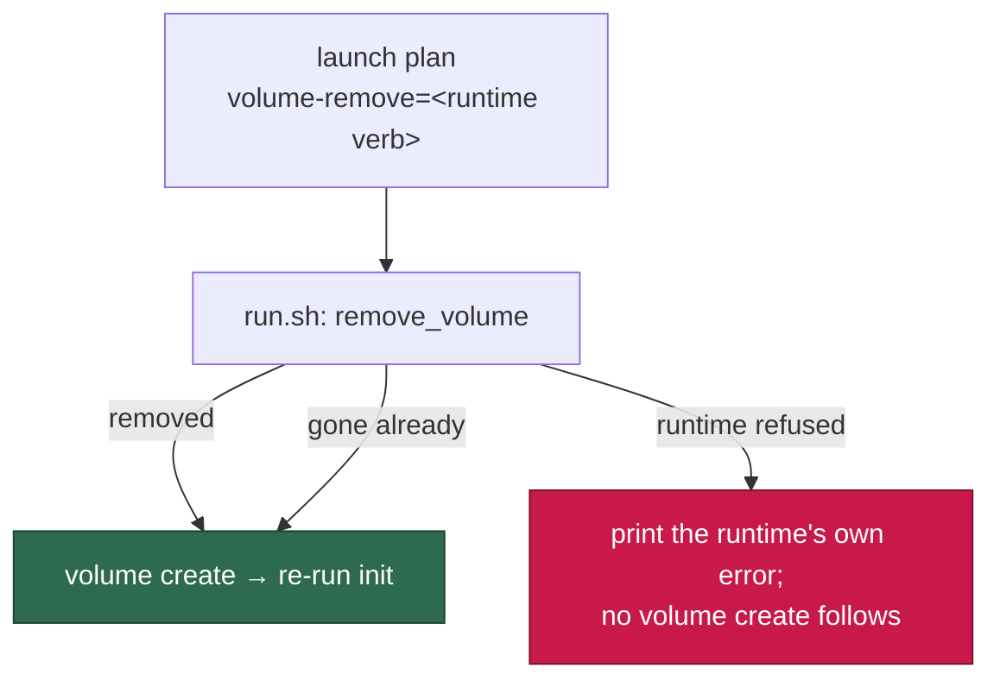

# Recover volumes with the runtime's own removal verb (Issue #731)

## Summary

Both volume-recovery paths in `run.sh` ran `"${RUNTIME}" volume delete` and
discarded the result with `2>&1 || true`. Podman has no `volume delete`
sub-command: it answered "unrecognized command", the suppression threw that
away, the volume survived, and the `volume create` on the very next line failed
with `volume with name vibe-work already exists` — a name clash reported in
place of a removal that never happened. Closes #731.

The removal verb is **not** shared across the runtimes this fleet supports, so
guessing one spelling in shell only moves the breakage: Docker and Podman spell
it `volume rm`, Apple `container` spells it `volume delete`
(`APPLE_DIALECT.volumeRemoveArgs`, `worker/deno/lib/container_runtime.ts:427`).
The fix therefore takes the verb from the runtime dialect that already exists
in this repo and carries it to the launchers in the launch plan, beside the
other per-runtime argument lists:

- `container_launch.ts` — the plan gains `volumeRemoveArgs`, rendered as
  `volume-remove=` tokens and parsed back with the rest.
- `run.sh` — parses `volume-remove` (an incomplete plan is still a loud
  refusal), and both recovery paths call a new `remove_volume` helper instead
  of a hardcoded verb. A removal that fails is surfaced with the runtime's own
  stderr and **stops** the recreate; a volume that is already gone is still not
  an error. The `#478` heal additionally leaves its interval state unwritten
  when nothing was removed, so a later launch may try again.
- `run.ps1` — accepts and uses the new plan key (it fails loud on unknown keys,
  and it had the same suppressed-removal shape), keeping launcher parity.
- The comment claiming the verbs "are spelled identically on every supported
  runtime" and the operator remedy quoting `container volume delete vibe-work`
  are corrected in `run.sh` and `docs/CONTAINER.md`.

## Evidence

Backend/CLI change — no web surface to screenshot. The evidence is the
launcher suite, which runs the real `run.sh` against a recording runtime stub:

- `deno test tests/run_sh_launcher_test.ts tests/container_launch_test.ts
  tests/launcher_parity_test.ts tests/launcher_source_test.ts
  tests/run_ps1_launcher_test.ts tests/container_restart_backoff_test.ts`
  → **160 passed, 0 failed**.
- The stub now models the real difference: `STUB_VOLUME_REMOVE_VERB` pins the
  one spelling a runtime accepts and refuses any other the way Podman does
  (`Error: unrecognized command "podman volume delete"`, exit 125), with the
  volume surviving.

## Reproduction

- **symptom** — volume recovery on Podman removed nothing and then failed to
  recreate, reporting `volume with name vibe-work already exists`
- **status** — `verified` — with the runtime stub pinned to the verb the
  runtime accepts (`rm` on this Linux host), the three new behavioural tests
  failed against the unfixed `run.sh` and pass after the fix; the fourth (a
  removal of a volume that is not there) passed before and after, as intended
- **regression test** —
  `worker/deno/tests/run_sh_launcher_test.ts::run.sh - recreates an
  unrepairable volume with the verb its runtime accepts (Issues #731, #229)`

## Test Plan

Added to `worker/deno/tests/run_sh_launcher_test.ts`:

- `run.sh - recreates an unrepairable volume with the verb its runtime accepts
  (Issues #731, #229)` — the volume is removed and recreated, the init re-runs,
  and the launcher never invokes the spelling the runtime rejects.
- `run.sh - a removal the runtime refuses is surfaced, and no volume create
  follows it (Issue #731)` — the runtime's own message reaches stderr and
  `run_core.log`, no `volume create` is attempted, and the launch fails at
  volume preparation.
- `run.sh - removing a volume that is not there is still not an error
  (Issue #731)` — a non-zero removal over an absent volume recreates as normal.
- `run.sh - a heal whose removal the runtime refuses is reported, never dressed
  up as a fix (Issues #731, #478)` — `[WORK_VOLUME_UNRECOVERED]` with the
  runtime's message, no recreate, no heal-interval state written, and the
  worker still launches (Issue #477).

Added to `worker/deno/tests/container_launch_test.ts`:

- `buildContainerLaunchPlan - the plan carries the runtime's own volume-removal
  verb (Issue #731)` — `volume rm` for Docker and Podman, `volume delete` for
  Apple container.
- The round-trip test now asserts `volume-remove` survives the plan framing.

Harness (`worker/deno/tests/fixtures/launcher_harness.ts`):
`STUB_VOLUME_REMOVE_VERB`, `STUB_VOLUME_REMOVE_EXIT`,
`STUB_VOLUME_REMOVE_STDERR` and `STUB_INIT_RETRY_EXIT`; a removal is recorded
only when it succeeded.
