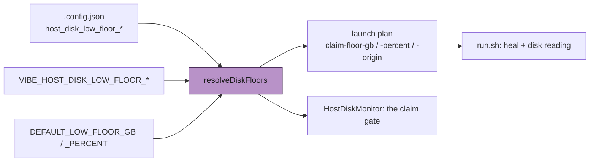

# The claiming floor is configurable, and the launcher names the one it used

## Summary

The worker stops claiming work below a floor: the **larger** of a gigabyte
term (20) and a percentage term (10 %) of the filesystem. On the reporter's
1.875 TB filesystem the percentage term is ≈ 187 GB, so a host with 37.5 GB
free was judged "low" and refused work. The two environment overrides that
would have moved it worked — the reporter used them — but were documented
nowhere, and there was no way to state the floor in `.config.json` beside the
rest of the host's configuration.

The default formula is unchanged. What changed:

- **`.config.json` states the floor.** `host_disk_low_floor_gb` and
  `host_disk_low_floor_percent`, either or both.
- **Precedence is defined and implemented per term:** the config key wins,
  then the environment variable, then the default — the rule Issue #289 set
  for every other knob. So a deployment may pin the percentage in its file and
  still raise the gigabyte term for one launch from the environment.
- **One resolution, everywhere.** `resolveDiskFloors` is the only place the
  floor is decided; the launch plan carries the resolved terms and their
  origin, and `run.sh` uses what the plan carries instead of reading two
  environment variables of its own. The worker's `HostDiskMonitor` takes the
  same configured terms, so the launcher cannot heal at one floor while the
  worker claims at another.
- **The launcher says which number refused it**, and which knob would move it:

```
host-disk: 38400 MB free on /var/lib/containers; claiming floor 20480 MB
(larger of 20 GB and 1% of 1966080 MB; gb=config,percent=config)
```

Closes #732.

## Evidence

Configuration and launcher-output change with no web surface to screenshot.
The evidence is the resolution table and the launcher's own log line.

Where the floor comes from now:



The resolution table the issue asks for is a test: unconfigured on a small and
a very large filesystem, config-only, environment-only, both together
(asserting the documented precedence, per term), and unusable values falling
through rather than binding. The reported host is asserted directly — 1.875 TB,
a configured 20 GB / 1 % floor, and 37.5 GB free clearing it.

```
ok | 356 passed | 0 failed   # host_disk_floor_config, host_disk,
                             # container_store_prune, config, container_launch,
                             # config_unknown_keys, validation, run_sh_launcher
```

`deno fmt --check` (2016 files), `deno lint` (2010 files), `deno check` over
**every** file in `worker/deno/tests` (0 errors) and markdownlint are clean.
The whole-test-tree type check is deliberate: the previous change in this
milestone added a plan field and broke a hand-built fixture that the suites run
locally did not include, and CI caught it. It is run here before pushing.

## Reproduction

- **symptom** — on a 1.875 TB filesystem the floor resolves to ≈ 187 GB, so
  37.5 GB free refuses work, and the only escape is an undocumented
  environment variable
- **status** — `verified` — the reported numbers are asserted directly:
  `resolveDiskFloors - an unconfigured host keeps today's formula (Issue #732)`
  shows the default floor on a 1.875 TB filesystem is still > 180 GB, and
  `resolveDiskFloors - .config.json sets either term (Issue #732)` shows the
  reporter's own 20 GB / 1 % configuration resolving to 20 GB, which 37.5 GB
  free clears. The launcher's output is asserted end to end through the real
  `run.sh` under the launcher harness
- **regression test** —
  `worker/deno/tests/host_disk_floor_config_test.ts::resolveDiskFloors - .config.json wins over the environment (Issue #732)`
  and
  `worker/deno/tests/run_sh_launcher_test.ts::run.sh - the disk reading names the claiming floor and where it came from (Issue #732)`

## Acceptance Criteria

Judged in an operator review of the whole diff, not by the two reviewer
sub-agents: this change was made by hand, and the provenance markers are
deliberately not claimed for a review no independent context produced.

- **met** — a host with no floor configuration behaves exactly as today
  (larger of 20 GB or 10 %) — evidence:
  `::resolveDiskFloors - an unconfigured host keeps today's formula (Issue #732)`
  asserts both terms, both origins, and the resolved floor on a small and a
  1.875 TB filesystem;
  `run_sh_launcher_test.ts::run.sh - an unconfigured host reports the default floor as default (Issue #732)`
  asserts the same through the real launcher
- **met** — `.config.json` can set both terms, and the launcher honours them —
  evidence: `readConfiguredDiskFloors` reads them,
  `commands/container_launch_plan.ts` resolves with them, and the plan carries
  the result to `run.sh`;
  `::readConfiguredDiskFloors - reads the file, and says nothing when there is none (Issue #732)`
  and `container_launch_test.ts::buildContainerLaunchPlan - carries the claiming floor and its origin (Issue #732)`
- **met** — the environment overrides still work, and their precedence is
  defined, implemented and documented — evidence:
  `::resolveDiskFloors - the environment overrides still work (Issue #732)`,
  `::resolveDiskFloors - .config.json wins over the environment (Issue #732)`,
  and `docs/CONFIGURATION.md` "The claiming floor (Issue #732)"
- **met** — the launcher's output names the resolved floor and the free space
  it was compared against — evidence: `claim_floor_detail` in `run.sh`, on the
  disk reading, the hard-floor path and the heal's above-floor line;
  `::run.sh - the disk reading names the claiming floor and where it came from (Issue #732)`
- **met** — a 1.875 TB filesystem with 37.5 GB free and a configured
  20 GB / 1 % floor claims work rather than refusing it — evidence:
  `::resolveDiskFloors - .config.json sets either term (Issue #732)` asserts
  the resolved floor is exactly 20 GiB and that 37.5 GB clears it
- **met** — `docs/CONFIGURATION.md` documents the `.config.json` keys and both
  environment variables — evidence: the new section and two new rows in the
  operational environment table
- **met** — the launcher and the shared default constants agree — evidence:
  they are now the *same* values rather than two lists: `run.sh` takes the
  resolved terms from the plan, which come from `DEFAULT_LOW_FLOOR_GB` /
  `DEFAULT_LOW_FLOOR_PERCENT` through `resolveDiskFloors`. The Issue #493
  drift guard is rewritten onto that real path
- **met** — tests and quality checks pass — evidence: 356/356; fmt, lint,
  whole-tests type check and markdownlint clean. `./quality.sh` was not run in
  full — it is the CI job's work, and the PR's `validate` matrix runs it
- **met** — Failure Detection: a test table covers unconfigured defaults on a
  small and a very large filesystem, config-configured values, environment-only
  values, and both together asserting the documented precedence — evidence: the
  seven cases in `host_disk_floor_config_test.ts`. A regression that changed
  the default formula fails the first case; one that let the environment beat
  the file fails the fourth

- **unrequested** — the worker's `HostDiskMonitor` takes the configured terms
  — reason: the issue asks for the launcher to honour them, but a floor the
  launcher heals at and the worker does not claim at is the drift the Issue
  #493 guard exists to prevent. One resolution, both instruments
- **unrequested** — the plan carries `claim-floor-*` and `run.ps1` parses them
  — reason: `run.sh` cannot read `.config.json` (it has no jq, and jq is
  container-owned), so the resolved floor has to reach it somehow; the plan is
  how everything else reaches it. `run.ps1` must accept the keys because an
  unrecognised plan key fails a Windows launch outright
- **unrequested** — the Issue #493 drift guard was rewritten — evidence:
  `container_store_prune_test.ts` — reason: it asserted `run.sh`'s source text
  for two env-reading fallbacks this change removes. Its property is preserved
  and now checked on the real path (`resolveDiskFloors` against the
  constants), with a narrow source assertion kept for the defensive fallback
  that remains
- **unrequested** — three existing `DiskFloors` literals in tests gained the
  two new source fields — reason: the type gained them; the literals are
  fixtures, and no assertion was weakened

## Standards Review

- **clean** — Australian English throughout; JSDoc with `@param`/`@returns` on
  every new export; fail-loud on a malformed configuration (a `.config.json`
  that cannot be parsed throws rather than reading as unconfigured, asserted);
  the floor is resolved in one place and carried, never restated; defaults are
  not duplicated into `config_defaults.ts` — the config keys stay optional so
  `resolveDiskFloors` remains the only thing that knows the numbers
- **clean** — new logic is Deno TypeScript; the shell only formats and prints
  what the plan carries, as the standards require
- **violation** — `run.sh` still carries a `|| gb=20` / `|| pct=10` fallback,
  a second statement of the defaults — evidence: `run.sh` `claim_floor_kb` —
  reason: stands. It is unreachable while the plan is well-formed (the plan is
  validated as incomplete without both terms), and a launcher that divides by
  a malformed value is worse than one with a defensive constant. The Issue
  #493 guard now asserts those two literals against the shared constants, so
  they cannot drift
- **violation** — `run.ps1` parses the floor and does nothing with it —
  evidence: `run.ps1` — reason: stands, and it is commented as such. Windows
  has no counterpart to the low-disk heal; the keys must be accepted because
  an unrecognised plan key is fatal, and carrying them is what makes the
  Windows launcher ready for the heal if it ever lands

## Test Plan

Added `worker/deno/tests/host_disk_floor_config_test.ts` (7 tests): the
resolution table (unconfigured / config / env / both, per term), unusable
values falling through, `describeDiskFloors` and `diskFloorOrigin`, and
`readConfiguredDiskFloors` including its loud failure on a malformed file.

Added to `worker/deno/tests/container_launch_test.ts`:

- `buildContainerLaunchPlan - carries the claiming floor and its origin (Issue #732)`
  — the terms and origin survive the NUL-framed plan the launchers parse.

Added to `worker/deno/tests/run_sh_launcher_test.ts`:

- `run.sh - the disk reading names the claiming floor and where it came from (Issue #732)`
- `run.sh - an unconfigured host reports the default floor as default (Issue #732)`

Modified: the Issue #493 drift guard (rewritten onto the real path, documented
above) and three `DiskFloors` fixtures that gained the new source fields.
