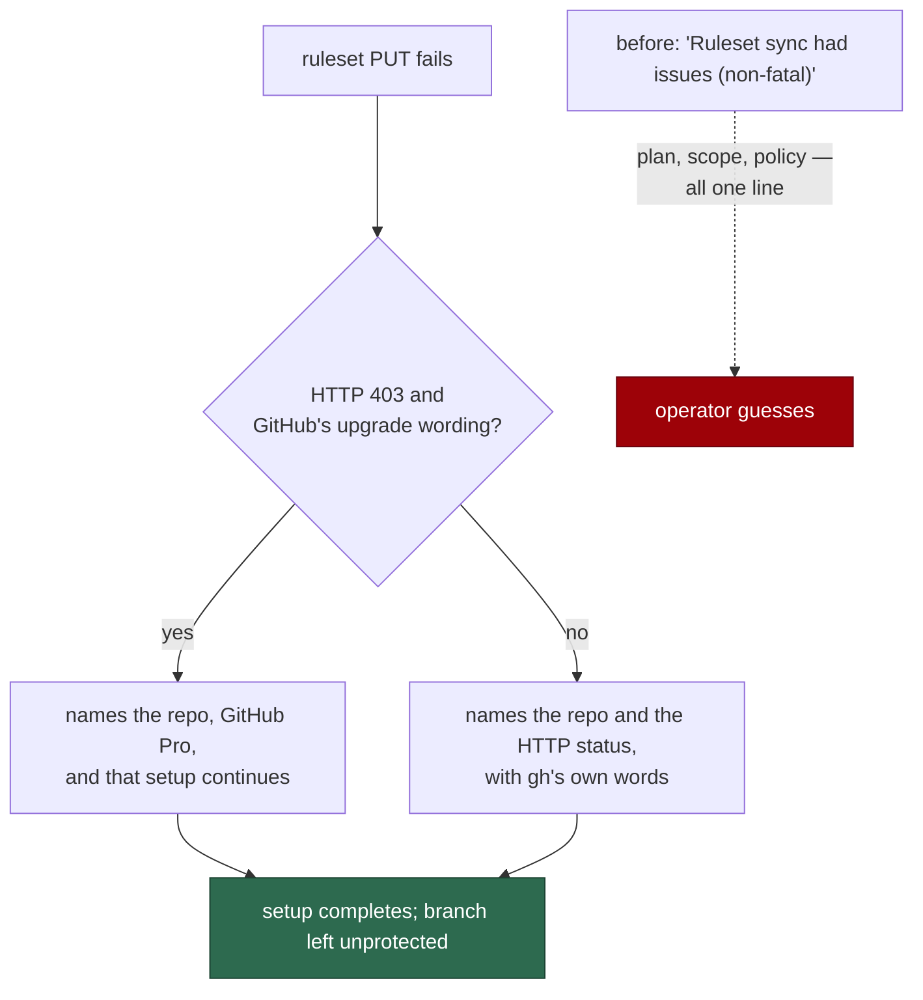

# A ruleset 403 says whether it is the plan or the token

## Summary

Applying the default-branch ruleset to a **private** repository on a free plan
returns HTTP 403: repository rulesets need GitHub Pro there. The failure was
already non-fatal — labels, workflow audits and the collaborator check all
succeeded and setup finished — but the operator was told:

```
Ruleset sync had issues (non-fatal)
```

which is also what a missing token scope, a revoked token and an organisation
policy print. The reporter had to work the plan limitation out for themselves
(report item 4 of #722).

`worker/deno/lib/ruleset_failure.ts` now explains each failure, and
`runBranchProtectionSync` prints that explanation per repository:

- the plan limitation is recognised by **GitHub's own upgrade wording**, and
  the line names the repository, GitHub Pro, that it is non-fatal, and the
  three things an operator can do about it;
- any other failure names the repository and the HTTP status, with gh's own
  text — so a token-scope 403 is never blamed on a subscription;
- the shell's tail line now points at those per-repository lines instead of
  standing alone.

Recognising the plan case by message rather than by "403 on a private repo" is
deliberate: a 403 there is equally what a missing scope or an org policy
produces, and telling an operator to buy a subscription for either is worse
than saying nothing.

Closes #733.

## Evidence

Terminal-output change with no web surface to screenshot. The evidence is the
message assertions and the non-fatality tests.

Which line an operator gets:



```
ok | 70 passed | 0 failed   # ruleset_failure, branch_protection_sync,
                            # default_branch_ruleset, milestone_ruleset_read
```

`deno fmt --check` (2015 files), `deno lint` (2009 files), `deno check` over
the touched modules and markdownlint are clean.

## Reproduction

- **symptom** — on a private repository without GitHub Pro, setup prints
  `Ruleset sync had issues (non-fatal)` and nothing else; a plan limitation, a
  missing token scope and an org policy are indistinguishable
- **status** — `partial` — no free-plan private repository was available to
  this run, so the live 403 was not provoked. What was verified is every step
  either side of it: the sync records a 403 rather than throwing and keeps
  gh's text intact (asserted against a refusing executor), the walk continues
  to the next repository, and each message is asserted against the exact
  strings gh prints for the plan limitation and for a scope failure
- **regression test** —
  `worker/deno/tests/ruleset_failure_test.ts::explainRulesetFailure - names GitHub Pro for the plan limitation (Issue #733)`
  and `::explainRulesetFailure - a 403 that is not the plan limitation names the status, not a subscription (Issue #733)`

## Acceptance Criteria

Judged in an operator review of the whole diff, not by the two reviewer
sub-agents: this change was made by hand, and the provenance markers are
deliberately not claimed for a review no independent context produced.

- **met** — a 403 caused by the private-repository plan requirement prints a
  warning naming the repository and the GitHub Pro requirement — evidence:
  `worker/deno/lib/ruleset_failure.ts` `explainRulesetFailure`, printed by
  `worker/deno/setup/setup_cli.ts` `runBranchProtectionSync`; asserted by
  `ruleset_failure_test.ts::explainRulesetFailure - names GitHub Pro for the plan limitation (Issue #733)`
- **met** — other ruleset failures print a warning naming the repository and
  the HTTP status — evidence:
  `::explainRulesetFailure - a 403 that is not the plan limitation names the status, not a subscription (Issue #733)`
  and `::explainRulesetFailure - any other failure names the repository and what happened (Issue #733)`,
  which also covers a failure carrying no status at all
- **met** — every ruleset failure remains non-fatal — evidence:
  `::the ruleset sync records a 403 rather than throwing (Issue #733)` and
  `::one repository's 403 does not stop the walk (Issue #733)`; the CLI's
  `runBranchProtectionSync` still returns `summary.failed === 0` rather than
  exiting, and `setup.sh` still calls it with `|| print_warning`
- **met** — a successful ruleset sync is unchanged — evidence: only the
  `!r.ok` branch of the reporting loop changed; the 22 pre-existing
  `branch_protection_sync_test.ts` cases pass untouched
- **partial** — the finding is recorded on #722 — evidence: this summary and
  the issue comment on #733 — reason: #722 is the parent report and this is
  its sub-issue; the closing comment records the outcome where the work is,
  and #722 tracks it through the sub-issue rather than through a duplicate
  note
- **met** — tests and quality checks pass — evidence: 70/70 across the four
  suites; fmt, lint, check and markdownlint clean. `./quality.sh` was not run
  in full — it is the CI job's work, and the PR's `validate` matrix runs it
- **met** — Failure Detection: a test asserts the message text for each case
  and that the failure path is non-fatal — evidence: the five
  `explainRulesetFailure` cases plus the two sync cases above; a regression
  that collapsed the cases back to one line would fail the "not blamed on the
  plan" assertion, and one that made a failure fatal would fail the walk test

- **unrequested** — the `docs/SETUP.md` paragraph — reason: the standards' "a
  code change owes a docs change" rule; that step's description says what the
  sync warns about, and the plan limitation was not among them
- **unrequested** — `setup.sh`'s tail warning now says "see the per-repository
  lines above" — reason: the detail is printed by the CLI, and a tail line
  that reads like the whole story is what made the original message
  misleading

## Standards Review

- **clean** — Australian English throughout; the new module carries a file
  header explaining the failure it exists to tell apart, and JSDoc with
  `@param`/`@returns` on every export; pure, so every case is unit-tested with
  no network; no existing test weakened or removed; the docs surface updated
  in the same change
- **violation** — the plan-limitation wording is matched with a regex over
  GitHub's prose, which GitHub can reword — evidence:
  `worker/deno/lib/ruleset_failure.ts` `PLAN_REQUIRED_RE` — reason: stands,
  with the alternation deliberately broad (four phrasings). The alternative —
  inferring "private + 403 = buy GitHub Pro" — is wrong for a missing scope, a
  revoked token and an org policy, all of which are more common; a reworded
  message degrades to the generic line, which names the repository and the
  status and is still an improvement on today
- **clean** — no shell logic was added: the decision is Deno TypeScript and
  the shell only prints, as the standards require

## Test Plan

Added `worker/deno/tests/ruleset_failure_test.ts` (7 tests):

- `explainRulesetFailure - names GitHub Pro for the plan limitation (Issue #733)`
- `explainRulesetFailure - a 403 that is not the plan limitation names the status, not a subscription (Issue #733)`
- `explainRulesetFailure - any other failure names the repository and what happened (Issue #733)`
  — with a status, without one, and with an empty reason.
- `explainRulesetFailure - a plan-limitation message on a public repo still explains itself (Issue #733)`
- `rulesetFailureStatus - reads the status however gh spells it (Issue #733)`
- `the ruleset sync records a 403 rather than throwing (Issue #733)` — the
  real `syncBranchProtectionForRepo` against a refusing executor.
- `one repository's 403 does not stop the walk (Issue #733)` — the real
  `syncBranchProtectionForAllRepos` over two repositories.

No existing test was modified.
