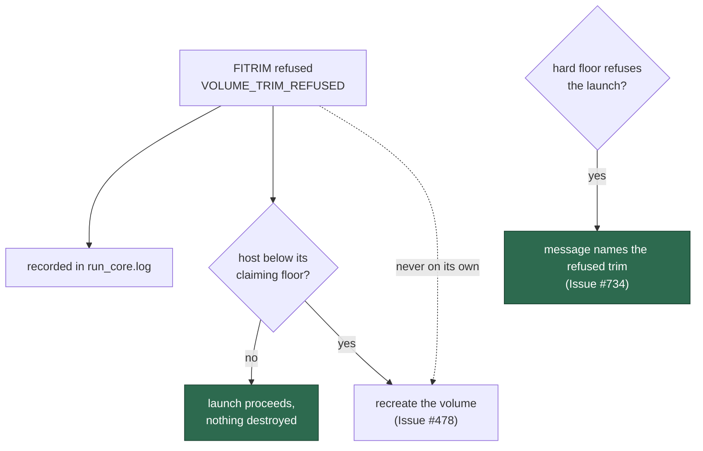

# A refused FITRIM starts no recovery — and every disk decision after one says so

## Summary

Report item 9 of #722 read: Podman refuses `FITRIM` on a named volume, and the
refusal *appeared* to activate low-disk recovery, which then failed on the
wrong `volume delete` verb. The issue asked for the behaviour to be established
before anything was changed. It is established here, and the finding is the
second of the three readings the issue offered:

- **A refused trim does not, by itself, start recovery.** `run.sh`'s heal
  (`heal_untrimmable_volumes`) returns early unless the refusal coincides with
  a host **below its claiming floor**, and the hard floor is a measurement of
  the host that no message can move. With floors of zero and a refused trim,
  nothing is removed, nothing is recreated, the init runs once, and the worker
  starts — now asserted.
- **Volume initialisation still completes.** `container/volume-init.sh` treats
  the `FITRIM ioctl failed: Operation not permitted` refusal as the quiet,
  expected path: it names the volume on stdout, chowns the mount root, and
  exits 0 — now asserted with Podman's exact message.
- **But the space genuinely stays unreclaimed.** A runtime that cannot discard
  never returns the guest's freed blocks to the host, so the reading stays low
  and the floor fires on its own. That is the reported chain, and it is a
  different defect from "the warning triggers recovery".

So the change this issue wants is not to disconnect anything — nothing was
connected — it is to **connect the explanation**. Every disk decision taken
after a refused trim now names the refusal:

```
[run.sh] refusing to launch: /var/lib/containers has 900 MB free, below the
5 GB hard floor (VIBE_HOST_DISK_HARD_FLOOR_GB) (Issue #226) - this runtime
refused to trim vibe-work on this launch, so the volume image keeps every
block it holds and the guest's own reclaim cannot return host disk
(Issues #384, #734)
```

A host whose trim worked is told nothing about one, and the same note rides
the `host-disk:` line in `run_core.log` on a launch that proceeds.

The recovery path this triggered on the reporter's host failed for a separate
reason — Podman has no `volume delete` — fixed in #731.

Closes #734.

## Evidence

Launcher-output change with no web surface to screenshot. The evidence is the
three launcher cases and the volume-init case.

What a refused trim does and does not do:



```
ok | 91 passed | 0 failed   # run_sh_launcher, volume_init_script,
                            # run_core_work_volume_usage
```

`deno fmt --check` (2013 files), `deno lint` (2007 files) and markdownlint are
clean.

## Reproduction

- **symptom** — on a Podman host, `fstrim` is refused on the named volume and
  the host then refuses work for low disk, with nothing connecting the two
- **status** — `partial` — no Podman host was available to this run, so the
  live refusal was not provoked. What was established instead is the code's
  own answer to the question the issue asks, driven through the real
  `run.sh` and the real `container/volume-init.sh` against a stub runtime and
  a stub `fstrim` printing Podman's exact message: a refusal alone destroys
  nothing and stops no launch (asserted), initialisation completes (asserted),
  and a disk refusal after one names it (asserted)
- **regression test** —
  `worker/deno/tests/run_sh_launcher_test.ts::run.sh - a refused trim alone starts no recovery and stops no launch (Issue #734)`
  and `::run.sh - a disk refusal after a refused trim names the refusal (Issue #734)`

## Acceptance Criteria

Judged in an operator review of the whole diff, not by the two reviewer
sub-agents: this change was made by hand, and the provenance markers are
deliberately not claimed for a review no independent context produced.

- **partial** — the behaviour is reproduced (or shown not to reproduce) on a
  Podman host, with the captured output recorded on #722 — evidence: the three
  launcher cases and the volume-init case, run against Podman's exact refusal
  text; the finding is recorded on this issue's closing comment — reason: no
  Podman host was available to this run. The finding is a code-level
  determination rather than a host capture, and it says so wherever it is
  stated. #736 is the milestone's end-to-end verification issue and remains
  the place a real host confirms it
- **met** — a refused `FITRIM` does not by itself cause low-disk recovery to
  run — evidence:
  `::run.sh - a refused trim alone starts no recovery and stops no launch (Issue #734)`
  — floors of zero, a refused trim, and nothing removed, one init, worker
  started; `heal_untrimmable_volumes` requires the claiming floor to be
  breached as well
- **met** — if space genuinely stays unreclaimed, that is reported in the
  launcher's output as the reason for a low-disk decision — evidence: the note
  appended to both the hard-floor refusal and the `host-disk:` log line;
  `::run.sh - a disk refusal after a refused trim names the refusal (Issue #734)`
  and, for the converse, `::run.sh - a disk reading with no refused trim says nothing about one (Issue #734)`
- **met** — volume initialisation still completes and the launch proceeds when
  `fstrim` is refused — evidence:
  `volume_init_script_test.ts::volume-init - the Podman FITRIM refusal completes the init and names the volume (Issue #734)`
  (exit 0, chown still run) and the launcher case above (the worker starts)
- **met** — Docker behaviour is unchanged — evidence: the note appears only
  when `trim_refused_volumes` is non-empty, and a successful trim emits no
  `VOLUME_TRIM_REFUSED`; the "says nothing about one" case pins that, and the
  pre-existing Issue #384 and #478 cases pass unchanged
- **met** — tests and quality checks pass — evidence: 91/91 across the three
  suites; fmt, lint and markdownlint clean. `./quality.sh` was not run in full
  — it is the CI job's work, and the PR's `validate` matrix runs it
- **met** — Failure Detection: a test drives volume initialisation with a stub
  `fstrim` exiting non-zero with the `FITRIM ioctl failed: Operation not
  permitted` message, asserting initialisation still succeeds and that no
  low-disk recovery is triggered by the refusal alone; an additional assertion
  covers the operator-facing message that names it — evidence: the four cases
  above; a regression reconnecting a trim refusal to a work refusal fails the
  "starts no recovery" case, and one dropping the explanation fails the
  "names the refusal" case

- **unrequested** — the `docs/CONTAINER.md` paragraph — reason: the standards'
  "a code change owes a docs change" rule; that section is where the refusal is
  documented as "a fact, not a warning", and it did not say what the refusal
  does *not* do, which is the whole question this issue asked

## Standards Review

- **clean** — Australian English throughout; the new note is built once and
  used by both the refusal and the reading, so the two cannot drift; the
  comment explains why a refusal is context rather than a cause; no existing
  test weakened or removed; the docs surface updated in the same change
- **clean** — no behaviour was changed on the path that decides anything: the
  heal's conditions, the floors and the init are untouched. This change adds
  an explanation to messages, which is what the issue asks for once the
  reproduction question is answered
- **violation** — `trim_refusal_note` is computed before the `if` that uses
  it, so a launch that never reaches the gate still builds the string —
  evidence: `run.sh` — reason: stands. It is a string concatenation over an
  array that is almost always empty, and computing it beside the reading keeps
  the refusal and the decision it explains in one place to read
- **violation** — the finding is asserted about the code rather than captured
  from a Podman host, which the issue asks for first — evidence: this summary's
  Reproduction block — reason: stands and is declared. No Podman host is
  reachable from this run; #736 is the milestone's end-to-end verification
  issue, and the code-level determination is worth having either way

## Test Plan

Added to `worker/deno/tests/run_sh_launcher_test.ts`:

- `run.sh - a refused trim alone starts no recovery and stops no launch (Issue #734)`
- `run.sh - a disk refusal after a refused trim names the refusal (Issue #734)`
- `run.sh - a disk reading with no refused trim says nothing about one (Issue #734)`

Added to `worker/deno/tests/volume_init_script_test.ts`:

- `volume-init - the Podman FITRIM refusal completes the init and names the volume (Issue #734)`

No existing test was modified.
