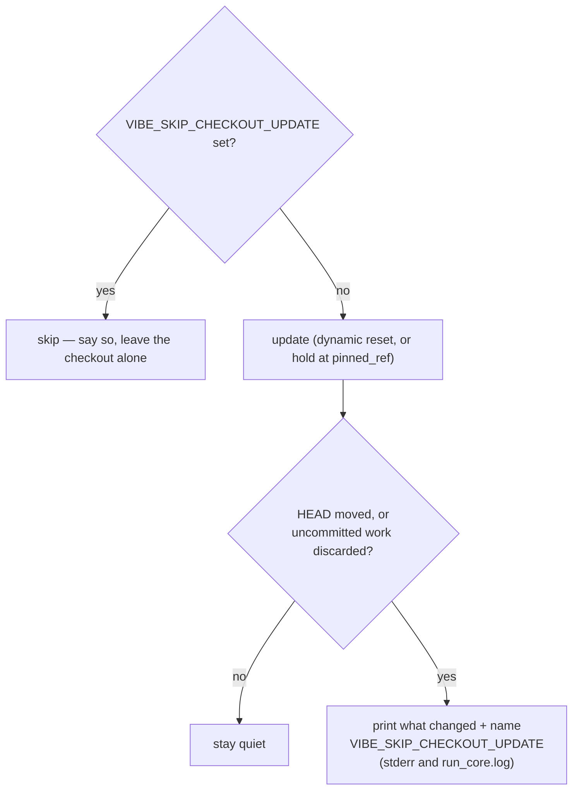

# Name the checkout-update opt-out at the moment it overwrites work

## Summary

`VIBE_SKIP_CHECKOUT_UPDATE` already turned the host-side checkout update off,
but an operator hitting launcher defects on a new platform never found it and
re-applied a patch that the next launch discarded. This makes the opt-out
discoverable at the moment it matters instead of adding a second knob: an
update that actually changed the checkout — moved the commit, or discarded
uncommitted work — now prints one line naming the variable, on stderr (both
launchers relay the command's message) and in `run_core.log`. An update that
changed nothing stays silent. Closes #735.

No new environment variable: `SKIP_CHECKOUT_UPDATE_ENV` moved from the command
into `worker/deno/lib/checkout_update.ts` and the command re-exports it, so the
name an update advertises is the same constant the skip reads.

Documentation follows the operator's path — the first run (`docs/SETUP.md`), a
troubleshooting section they reach when a launcher fix keeps vanishing
(`docs/TROUBLESHOOTING.md`), and the behaviour note beside the existing
reference (`docs/CONFIGURATION.md`).

## Evidence

Backend/CLI change — no web interface to screenshot. Verified by running the
real command against a temporary clone carrying a hand-applied patch:

```text
=== with VIBE_SKIP_CHECKOUT_UPDATE=1 ===
VIBE_SKIP_CHECKOUT_UPDATE is set: leaving /tmp/…/clone exactly as it is — the
worker will run whatever this checkout holds
patch survived: locally patched launcher

=== without the opt-out ===
updated /tmp/…/clone to origin/trunk. The checkout update changed /tmp/…/clone
(1 uncommitted change(s) discarded). Local edits in this checkout do not
survive a launch — set VIBE_SKIP_CHECKOUT_UPDATE=1 to leave it exactly as it
is.
patch now: one

=== run_core.log ===
2026-09-02T01:12:28Z Updating /tmp/…/clone to origin/trunk
2026-09-02T01:12:28Z The checkout update changed /tmp/…/clone (1 uncommitted
change(s) discarded). Local edits in this checkout do not survive a launch —
set VIBE_SKIP_CHECKOUT_UPDATE=1 to leave it exactly as it is.
```

That is both halves of the first acceptance criterion (the skip leaves the
checkout untouched, says so, and the run proceeds) and the second (an update
that modified the checkout names the variable).



## Acceptance Criteria

<!-- vibe-spec-review inputs="diff+issue-body" -->

- **met** — `VIBE_SKIP_CHECKOUT_UPDATE` confirmed to skip the update, log it and
  let the run proceed — evidence:
  `worker/deno/tests/worker_checkout_update_test.ts::worker-checkout-update - VIBE_SKIP_CHECKOUT_UPDATE leaves the checkout untouched`
  plus the manual run above — reviewer: met
- **met** — an update that modifies the checkout prints a line naming the
  variable — evidence:
  `worker/deno/tests/worker_checkout_update_test.ts::worker-checkout-update - an update that moves the checkout names VIBE_SKIP_CHECKOUT_UPDATE (Issue #735)`
  and `…discarding a local patch names VIBE_SKIP_CHECKOUT_UPDATE (Issue #735)`;
  `worker/deno/lib/checkout_update.ts:checkoutOverwriteNotice` — reviewer: met
- **met** — the variable appears in the first-run/troubleshooting documentation
  — evidence: `docs/SETUP.md` (First run) and `docs/TROUBLESHOOTING.md`
  (The launcher keeps overwriting my local fix) — reviewer: met — note: the
  reviewer observed the Podman/provider prerequisites are referenced rather
  than restated, which is deliberate; that material already lives in
  `docs/SETUP.md`
- **met** — no new duplicate opt-out variable — evidence: the diff adds no
  `VIBE_*` name; `worker/deno/lib/checkout_update.ts:SKIP_CHECKOUT_UPDATE_ENV`
  is the single constant, re-exported by the command — reviewer: met
- **met** — existing behaviour and existing documentation references stay
  correct — evidence: `docs/CONTAINER.md`, `docs/DEPLOYMENT.md`,
  `docs/INTERNALS.md` untouched and still accurate; the pre-existing
  checkout-update and frozen-mode tests pass unchanged — reviewer: met
- **partial** — tests and quality checks pass — evidence: `./quality.sh`
  reports every check PASSED except `deno tests`, whose only failures are the
  `setup_*` bash-harness suites — reviewer: partial — reason: those failures
  are environmental and pre-existing (identical `498 passed | 34 failed` on
  `origin/milestone/722-…` in a clean worktree at `/tmp/base735`), and no test
  this diff touches fails
- **unrequested** — `SKIP_CHECKOUT_UPDATE_ENV` relocated to the library and
  re-exported, and `CheckoutSnapshot` / `checkoutOverwriteNotice` /
  `CheckoutUpdateOutcome.overwriteNotice` added — reviewer: unrequested —
  reason: the issue forbids a second variable, so the notice has to be built
  from the same constant the skip reads; the new exports are what makes that
  one source of truth testable
- **unrequested** — two extra read-only git reads (`rev-parse HEAD`,
  `status --porcelain`) before and after each update — reviewer: unrequested —
  reason: the notice must only fire on an observed change, which needs the
  before/after state; both are local reads and neither writes to the checkout

## Standards Review

<!-- vibe-standards-review inputs="diff+CODING-STANDARDS.md" -->

- **violation** — catch-and-ignore in the snapshot helper, against *Never Fail
  Silently* — evidence: `worker/deno/lib/checkout_update.ts:376` — reason: fixed
  here; the two dependencies are documented as returning `null` rather than
  throwing, so the helper now reads them directly, exactly as the frozen path
  does
- **violation** — `as string` assertions the compiler cannot prove, against
  *Strict TypeScript* — evidence: `worker/deno/lib/checkout_update.ts:431` —
  reason: fixed here; the notice now narrows inside each condition and drops
  both casts
- **violation** — missing `docs/archive/pr-summaries/pr-summary-735.md` —
  evidence: repository root — reason: fixed here; this file is that summary
- **violation** — no error-path test for the snapshot helper's catch blocks —
  evidence: `worker/deno/tests/checkout_update_test.ts:343` — reason: resolved
  by removing the catch blocks, as the reviewer noted it would be
- **clean** — Australian English throughout; additive test changes only, no
  existing test weakened; tests drive real temporary git checkouts and assert on
  emitted output rather than grepping source; new logic lives in Deno
  TypeScript with the launchers untouched; docs updated in the same change with
  resolving cross-links; commits name the issue and carry the run-id trailer;
  no hidden paths staged

## Test Plan

Added — `worker/deno/tests/worker_checkout_update_test.ts` (real temporary git
repositories, end to end through the command):

- `an update that moves the checkout names VIBE_SKIP_CHECKOUT_UPDATE (Issue #735)`
- `discarding a local patch names VIBE_SKIP_CHECKOUT_UPDATE (Issue #735)` — the
  reported case: a hand-applied patch with nothing new on origin
- `an update that changes nothing stays quiet about VIBE_SKIP_CHECKOUT_UPDATE (Issue #735)`

Added — `worker/deno/tests/checkout_update_test.ts` (injected dependencies):

- `checkoutOverwriteNotice - names the opt-out only when the checkout changed (Issue #735)`
  — unchanged, moved, discarded, unreadable state, and work that appeared during
  the update
- `updateCheckout - an update that moved the checkout logs the opt-out (Issue #735)`
- `updateCheckout - an update that changed nothing keeps quiet (Issue #735)`

Commands run: `deno test tests/checkout_update_test.ts tests/worker_checkout_update_test.ts`
(48 passed), `deno fmt`, `deno lint`, `deno check mod.ts`, and `./quality.sh`.
