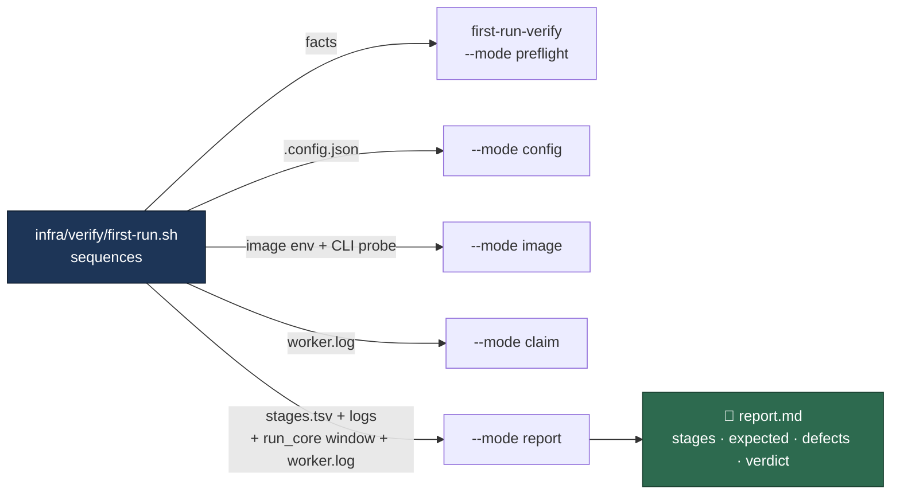

# The fresh first-run verification, scripted

## Summary

Issue #722's definition of done is an end-to-end run on a fresh Ubuntu + Podman
host: `setup.sh` then `run.sh` complete and the worker takes one issue end to
end with **no** manual workaround. Issue #736 is that verification, and its
Failure Detection section states how it must be done — "the run is scripted
rather than hand-driven, so it is repeatable and its output is comparable
between attempts".

This PR lands that scripted run and the host that can host it. It does **not**
contain the run's output: executing it needs AWS credentials, a deployed EC2
stack and a human answering `setup.sh`'s TTY-gated prompts over Session
Manager. This container has no `aws` CLI, no AWS credentials, no `podman` and
no `docker`, so the run itself is not something an unattended worker can
perform. Issue #736 therefore carries `needs-human` with a comment naming the
exact command and where the report goes. Closes #736.

What landed:

- **`infra/verify/first-run.sh`** — seven stages, each captured to its own
  transcript file, with a `report.md` ready to paste onto the issue. It
  verifies and never repairs: a host already carrying one of the reporter's
  workarounds is refused at stage 1, before `setup.sh` is touched, because a
  run that starts from a patched host proves nothing. It leaves no worker
  behind — the launcher and any `vibe-coder` container are stopped on exit.
- **`first-run-verify`** (`worker/deno/lib/first_run_verification.ts`,
  `worker/deno/commands/first_run_verify.ts`) — every judgement the report
  makes, in six modes. The shell only sequences the run, which is the
  repository's standard (shell orchestrates, Deno decides) and is what makes
  each decision testable without a host, a Podman or an image build.
- **No coding-agent CLI on the verification host by default.** The #721
  template installed the Claude CLI unconditionally, so the host it creates
  would have failed criterion 1 of this issue on its first line.
  `HostAgentCli=claude` restores it for a Claude deployment.
- **A follow-up for the defect this work found by reading the code:**
  stSoftwareAU/VibeCoder#799 — `setup.sh` resolves the provider selection but
  never persists it, so the `.config.json` it writes on a Codex host is not
  Codex-only and `run.sh` then builds a Claude image. Filed as a further
  sub-issue of #722 rather than worked around, which is what criterion 10 asks
  for.

The report separates the two things a reader would otherwise re-derive by hand:

| Report section | What it holds |
| --- | --- |
| Expected warnings | A private-repository ruleset 403 (#733); a runtime that refuses `FITRIM` (#734); a refusal that names its resolved floor and the free space behind it (#732) |
| New defects | A refused `tmpfs` mount option (#727), a base image that will not resolve (#728), setup demanding the Claude CLI (#730), a volume verb the runtime rejects or an unrecovered work volume (#731), an unexplained refusal (#732), a refused trim followed by a refused launch (#734) |

## Evidence

Backend and shell change with no web interface to screenshot. The evidence is
the test suite: **73 tests** over the harness — 47 unit tests on the decisions,
14 on the command seam, and 12 end-to-end tests that run the real script
against stub `setup.sh` / `run.sh` / `podman` executables and the **real** Deno
command, asserting on exit status and the report written.

`./quality.sh` reports every check green except `deno tests`, which fails
**identically on the base branch** — 35 failures across
`run_core_test.ts` / `run_core_rate_limit_resume_test.ts` (a real
`gh` GraphQL rate limit), `service_account_env_test.ts`,
`setup_credential_provisioning_test.ts`, `setup_lockfile_test.ts`,
`setup_prerequisites_test.ts`, `setup_provider_credential_flow_test.ts` and
`setup_workdir_reminder_test.ts`. Each was reproduced from a clean worktree of
`milestone/764-timeouts-should-be-soft-extend-progressing-run` with the same
counts, so none is introduced here; they are host-environment failures of the
`setup.sh` shell-sourcing tests inside a worker container. Every test this PR
adds or touches passes.

Two independent reviews ran against the finished diff before this summary was
written, and between them found nine faults where the harness would have
reported the wrong thing on a real host. Each is fixed in this PR and covered
by a test:

- The prerequisites stage grepped **its own log** for `podman` — a line the
  same function had already written — and discarded
  `container-runtime-detect`'s exit code. A host resolving Docker, or a
  detector that crashed, passed the stage that exists to prove otherwise.
- `run_core.log` is appended to and never truncated, so an earlier launch's
  refused trim was attributed to this run. Only the bytes this launch appends
  are read back now.
- Criterion 7 is about the **claim**, which the worker refuses in `worker.log`
  (`[HOST_DISK_LOW] … GB free …, floor …`). The chain read only the launcher,
  which refuses in MB in `run_core.log`, so a worker that started and then
  refused was reported as "claimed nothing" with neither figure.
- A dead launcher no longer costs the full 45-minute claim timeout.
- The run stopped nothing on the way out, leaving a worker claiming issues and
  a host that its own stage 1 would refuse next time.
- "No pre-pulled images" now means what the issue's Scope says: **any** image in
  the container store refuses the run, not only a pre-built `vibe-coder`. A host
  already holding the base layers resolved those names before the run began.
- A `podman` that cannot list images, a checkout that cannot be read, and a
  stage log that exists but cannot be read are faults, not empty evidence.
- The claim markers moved into Deno beside every other signature the run reads.
- `report.md` goes to a public issue, so it is passed through `redactSecrets()`.

## Acceptance Criteria

<!-- vibe-spec-review inputs="diff+issue-body" -->

- **partial** — `setup.sh` completes on a fresh Ubuntu + Podman host with a
  Codex-only configuration, no Claude CLI and no `VIBE_SKIP_PREREQ_CHECK` —
  evidence: `infra/verify/first-run.sh` (`check_fresh_state`, `run_setup`),
  `worker/deno/tests/first_run_script_test.ts::setup is told which agent this
  bare host runs` — reviewer: partial — reason: the harness refuses those
  workarounds and runs setup, but no run has been executed on a host, so no
  captured setup output exists.
- **partial** — `.config.json` is written by setup, not by hand — evidence:
  `worker/deno/tests/first_run_verification_test.ts::evaluateFreshState - a
  configuration setup did not write refuses the run` — reviewer: partial —
  reason: an existing configuration is refused and the written one is asserted
  Codex-only, but nothing shows setup wrote one on a host — and
  stSoftwareAU/VibeCoder#799, found while building this, says the file setup
  writes will **not** be Codex-only until that is fixed.
- **partial** — the image builds under Podman with no registry aliases or
  search registries on the host — evidence:
  `worker/deno/tests/first_run_verification_test.ts::evaluateFreshState - any
  image already on the host refuses the run` — reviewer: partial — reason: no
  build has been performed. The reviewer's second point — that a host holding
  the base layers passed as fresh, so the resolution the criterion is about had
  already happened — is fixed here: any image at all now refuses the run. The
  distribution's own `/etc/containers/registries.conf` is still recorded rather
  than refused, and both its settings are now recorded, not just one.
- **partial** — the built image reports `codex` in `VIBE_IMAGE_AGENT_PROVIDERS`
  and has the Codex CLI, not Claude — evidence:
  `worker/deno/tests/first_run_verification_test.ts::evaluateImage - the Claude
  image built from a Codex configuration fails` — reviewer: partial — reason:
  never exercised against a real image, and stSoftwareAU/VibeCoder#799 predicts
  it will fail on the first real host until setup persists the selection.
- **partial** — `podman run` starts the worker, no `unknown mount option`
  failure — evidence: `worker/deno/tests/first_run_script_test.ts::a refused
  mount option is reported as a defect to file` — reviewer: partial — reason:
  the detection is covered end to end against a stub launcher; nothing has run
  on a real host.
- **partial** — volume initialisation completes; a refused `FITRIM` does not
  cause a work refusal — evidence:
  `worker/deno/tests/first_run_script_test.ts::a previous launch's refused trim
  is not attributed to this run` — reviewer: partial — reason: both sources are
  read, the evidence is now bounded to the window this launch wrote, and a
  stage with no volume-init evidence is `SKIPPED`, never a pass. It still
  awaits a real Podman volume.
- **partial** — the host claims work without disk-floor overrides, or the
  refusal names the resolved floor and the free space behind it — evidence:
  `worker/deno/tests/first_run_script_test.ts::the worker's claim-time refusal
  is read from worker.log`,
  `worker/deno/tests/first_run_verification_test.ts::analyseDiskChain - the
  worker's claim-time refusal names its floor and free space` — reviewer:
  missing — reason: **departed from the reviewer's verdict.** It was right and
  the fault was real: the chain read the launcher's refusal only, in MB, so the
  worker's claim-time `[HOST_DISK_LOW]` refusal in GB was invisible and the run
  reported "claimed nothing". `worker.log` is now a third source and the
  free-space pattern matches both units. The claim-time refusal on a real host
  is still unobserved, so `partial`, not `met`.
- **partial** — the worker claims one issue and takes it to completion —
  evidence: `worker/deno/tests/first_run_script_test.ts::fails when the worker
  claims but completes nothing`,
  `worker/deno/tests/first_run_verification_test.ts::evaluateClaim - a worker
  that claimed but finished nothing is not a pass` — reviewer: partial —
  reason: no worker has run. The reviewer was right that `Claimed by ` is a
  GitHub comment body rather than a worker-log line; the markers are now the
  worker's own two (`Processing issue …#N`, `Successfully processed`), decided
  in Deno.
- **missing** — zero manual workarounds were applied; every stage's output is
  recorded on #722 — reviewer: missing — reason: the run has not been executed.
  It needs AWS credentials, a deployed stack and a human at an interactive SSM
  session for `setup.sh`'s TTY-gated prompts; this container has no `aws` CLI,
  no credentials and no container runtime. `needs-human` and a comment on #736
  name the command and where the report goes.
- **partial** — any workaround still needed is filed as a further sub-issue of
  #722 — evidence: stSoftwareAU/VibeCoder#799 — reviewer: missing — reason:
  **departed from the reviewer's verdict.** One workaround was found without a
  host, by reading the setup write path, and is filed rather than applied.
  Workarounds only the run itself can surface still cannot be filed until it is
  executed, so `partial`.
- **unrequested** — `VIBE_SKIP_AUTH_CHECK`, `VIBE_HOST_DISK_AVAIL_BYTES`,
  `VIBE_HOST_DISK_TOTAL_BYTES` and `VIBE_SKIP_CHECKOUT_UPDATE` refused
  alongside `VIBE_SKIP_PREREQ_CHECK` — reviewer: unrequested — reason: each is
  a seam that fakes one of the things this run must observe unaided — the
  credential probe, the disk reading behind the floor, the checkout update. The
  issue names the class ("no manual workarounds"), not an exhaustive list.
- **unrequested** — a `prerequisites` stage (tool versions, `df`, and the
  launcher's own runtime detection) — reviewer: unrequested — reason: without
  it a missing `podman` is misattributed to whichever later stage failed; it
  also keeps the `container-runtime-detect` step the documented sequence had.
- **unrequested** — `codex` in the prerequisites tool loop — reviewer:
  unrequested — reason: recorded, never required. The agent runs inside the
  image; the line exists so a reader of a failed report can see what the host
  had.
- **unrequested** — the hand-driven sequence was removed from
  `docs/EC2-LINUX-VERIFICATION.md` — reviewer: unrequested — reason: the
  reviewer was right; a shortened version is restored under "If you need to
  drive a stage by hand", marked as a debugging path that leaves the host
  non-fresh.
- **unrequested** — `--launch-timeout`, `--poll-interval`, `--repo-root`, the
  Mermaid stage diagram and the report-section table in the docs — reviewer:
  unrequested — reason: the flags are what make an unattended run bounded and
  testable (the tests set them to seconds); the diagram and table are how a
  reader tells an expected warning from a defect.

## Standards Review

<!-- vibe-standards-review inputs="diff+CODING-STANDARDS.md" -->

- **violation** — never fail silently: `podman image ls … 2>/dev/null || :`
  discarded both stderr and the exit code, so a broken podman yielded an empty
  image list that read as "no image was pre-built" — evidence:
  `infra/verify/first-run.sh:check_fresh_state` — reason: fixed here — the
  failure is captured and the stage refuses; the same applies to a checkout
  that cannot be read.
- **violation** — never fail silently: `container-runtime-detect … || true`
  threw away the detector's exit code, and the compensating
  `grep -qi podman "${log}"` read a log the same function had already seeded
  with `podman: /usr/bin/podman`, so the stage's only claim was unfalsifiable —
  evidence: `infra/verify/first-run.sh:check_prerequisites` — reason: fixed —
  the detector writes its own file, its status is honoured, and the grep reads
  that file. Covered by `first_run_script_test.ts::a runtime that is not podman
  fails the stage that claims it is` and `::a detection that could not answer
  is not read as podman`.
- **violation** — never fail silently: `readIfPresent` caught every error and
  returned `""`, so an unreadable stage log contributed zero findings and the
  report said "no workaround was required"; a `/nonexistent` sentinel was
  passed deliberately into the same swallow — evidence:
  `worker/deno/commands/first_run_verify.ts:readIfPresent`,
  `infra/verify/first-run.sh` report invocation — reason: fixed — only
  `NotFound` is absence, everything else throws naming the path, and the
  sentinel is gone (the flag is omitted when there is no launch log).
- **violation** — unattended execution: the no-terminal branch ran `./setup.sh`
  with inherited stdin — evidence: `infra/verify/first-run.sh:run_setup` —
  reason: fixed — `< /dev/null`, matching `run_launcher`.
- **violation** — shell decides: `check_claim` classified
  `Successfully processed` / `Claimed by ` in bash, the one signature set
  living outside Deno — evidence: `infra/verify/first-run.sh:check_claim` —
  reason: fixed — `evaluateClaim` and `--mode claim`, with the worker's real
  markers.
- **violation** — shell decides, and DRY: the script hand-wrote a
  `FreshStateVerdict` JSON literal, duplicating a Deno-owned type and its
  wording — evidence: `infra/verify/first-run.sh` (report section) — reason:
  fixed — `--mode report` decides that a preflight which wrote no verdict is a
  host never confirmed fresh.
- **violation** — a dead field with a tautological test: `configFileSplit` had
  no production caller, since the shell learns of a split configuration from
  `resolveHostConfigPath` throwing — evidence:
  `worker/deno/lib/first_run_verification.ts`,
  `worker/deno/tests/first_run_verification_test.ts` — reason: fixed — field
  and test removed, with the removal documented in place.
- **violation** — module/test convention: `commands/first_run_verify.ts` had no
  `*_command_test.ts`, so the mode dispatch, the argument validation and the
  error paths had no direct test — evidence:
  `worker/deno/commands/first_run_verify.ts` — reason: fixed —
  `worker/deno/tests/first_run_verify_command_test.ts`, 14 tests.
- **violation** — secret redaction on an outbound sink: `renderReport` copied
  raw log lines into a document whose documented destination is a public issue
  — evidence: `worker/deno/lib/first_run_verification.ts:renderReport` —
  reason: fixed — the rendered report goes through `redactSecrets()`, covered
  by `first_run_verification_test.ts::a secret quoted from a stage log never
  reaches the issue`. The raw transcripts beside it are **not** redacted and
  stage 3 captures the whole `setup.sh` terminal session, which the guide now
  says outright.
- **violation** — a self-referential test: "every workaround-shaped variable
  refuses the run" iterates the constant under test, so it can never go red for
  a missing entry; three workaround-shaped variables were unlisted — evidence:
  `worker/deno/tests/first_run_verification_test.ts` — reason: **partly
  fixed** — the three the reviewer named are now listed and each names the seam
  it fakes. The loop still cannot catch a variable nobody thought of; pinning
  it would mean enumerating every `VIBE_*` the codebase reads, which is a
  different change from this issue.
- **violation** — informational probes still discard status:
  `"${tool}" --version … || true` and `df -h / || true` — evidence:
  `infra/verify/first-run.sh:check_prerequisites` — reason: **stands** — both
  are recorded for a human reading a failed report, and neither feeds a
  decision: whether a mandatory tool exists is decided by `command -v` on its
  own line, and the runtime question by the detector above. A tool that cannot
  print its version is still present.
- **violation** — text inspection in the template test: after executing the
  rendered guard, the payload is asserted by string match over `echo`ed source
  lines — evidence:
  `worker/deno/tests/linux_verification_host_template_test.ts` — reason:
  **stands** — the behavioural half (the default host installs no agent CLI) is
  executed with `bash`; the string match is a secondary assertion on what the
  guard would run, and replacing it means executing a real installer.
- **clean** — Australian English throughout code, comments and docs (the only
  `color` hits are Mermaid style syntax); `deno fmt`, `deno lint`, `shellcheck`
  and `markdownlint` clean; commit safety (no hidden path staged,
  `.config.json` only ever written inside `Deno.makeTempDir` sandboxes); test
  runtime well inside the 120s budget; no process-group signals; fail-loud
  stage accounting (`parseStages` throws rather than dropping a stage,
  `SKIPPED` is never a pass); docs updated with the code, with no orphaned
  references; prompts untouched.

## Test Plan

- `worker/deno/tests/first_run_verification_test.ts` — 47 unit tests on the
  decisions: fresh state (each workaround variable, any image present, both
  `registries.conf` files, a commented-out setting, a patched checkout, the
  declared provider), the Codex-only configuration, the image stamp and CLI
  probe, every expected-warning and defect signature, the
  refused-trim/refused-launch chain, the worker's claim-time refusal in both
  units, the claim markers, the verdict rules, the report and its redaction.
- `worker/deno/tests/first_run_verify_command_test.ts` — 14 tests on the
  command seam: unknown and missing modes, a missing required path, an
  unreadable configuration, a non-boolean flag, the verdict the preflight
  writes, the claim modes, a stage log that exists but cannot be read, a
  preflight that wrote no verdict, an empty stage record, and one fault seen in
  two stages counted once.
- `worker/deno/tests/first_run_script_test.ts` — 12 end-to-end tests that run
  `infra/verify/first-run.sh` with stub `setup.sh`, `run.sh` and `podman` and
  the real `first-run-verify`: a clean host passes every stage; a host carrying
  a workaround is refused before `setup.sh` runs; an `unknown mount option`
  becomes a defect to file; the refused trim is read from `run_core.log`; a
  previous launch's refused trim is **not**; the worker's claim-time refusal is
  read from `worker.log`; a runtime that is not podman fails the stage that
  claims it is; a detection that could not answer is not read as podman; setup
  is told which agent the host runs; the run leaves no worker behind; a worker
  that claims but completes nothing fails; `--help` names every flag.
- `worker/deno/tests/linux_verification_host_template_test.ts` — the
  verification host installs no coding-agent CLI by default, proved by
  executing the template's own rendered guard.
- `./quality.sh` — every check passes except `deno tests`, whose 35 failures
  reproduce unchanged on the base branch (see Evidence). One of them **was**
  mine and is fixed: the preflight test set `VIBE_SKIP_PREREQ_CHECK` and Deno
  runs a file's tests in one process, so the variable leaked and turned 30
  unrelated prerequisite checks into skips. The helper now clears the whole set
  before restoring what it saved.
