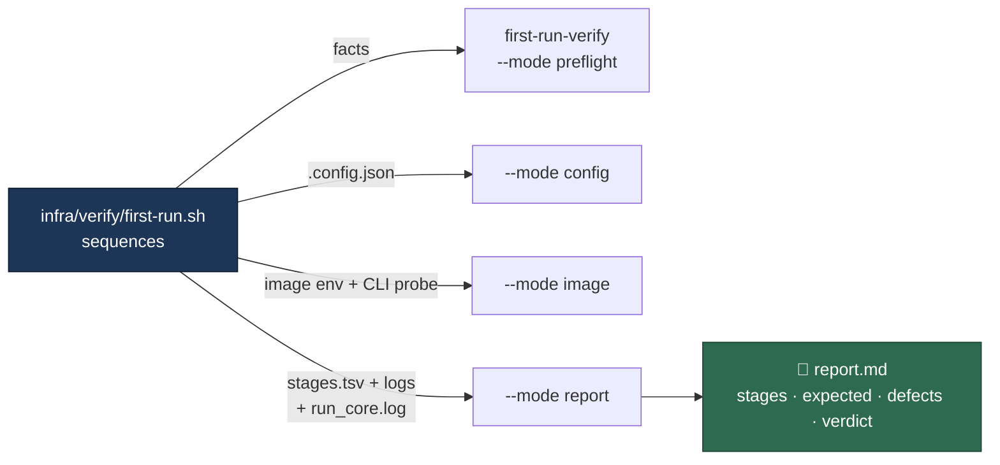

# The fresh first-run verification, scripted

## Summary

Issue #722's definition of done is an end-to-end run on a fresh Ubuntu +
Podman host: `setup.sh` then `run.sh` complete and the worker takes one issue
end to end with **no** manual workaround. Issue #736 is that verification, and
its Failure Detection section states how it must be done — "the run is scripted
rather than hand-driven, so it is repeatable and its output is comparable
between attempts".

This PR lands that scripted run and the host that can host it. It does **not**
contain the run's output: executing it needs AWS credentials, a deployed EC2
stack and a human answering `setup.sh`'s TTY-gated prompts over Session
Manager, none of which an unattended worker has. The issue therefore carries
`needs-human` with a comment naming the exact command to run and where to paste
the result. Closes #736.

What landed:

- **`infra/verify/first-run.sh`** — eight stages, each captured to its own
  transcript file, with a `report.md` ready to paste onto the issue. It
  verifies and never repairs: a host already carrying one of the reporter's
  workarounds is refused at stage 1, before `setup.sh` is touched, because a
  run that starts from a patched host proves nothing.
- **`first-run-verify`** (`worker/deno/lib/first_run_verification.ts`,
  `worker/deno/commands/first_run_verify.ts`) — every judgement the report
  makes. The shell only sequences the run, which is the repository's standard
  (shell orchestrates, Deno decides) and is what makes each decision testable
  without a host, a Podman or an image build.
- **No coding-agent CLI on the verification host by default.** The #721
  template installed the Claude CLI unconditionally, so the host it creates
  would have failed criterion 1 of this issue on its first line.
  `HostAgentCli=claude` restores it for a Claude deployment.

The report separates the two things a reader would otherwise re-derive by hand:

| Report section | What it holds |
| --- | --- |
| Expected warnings | A private-repository ruleset 403 (#733); a runtime that refuses `FITRIM` (#734); a launch refusal that names its resolved floor and the free space behind it (#732) |
| New defects | A refused `tmpfs` mount option (#727), a base image that will not resolve (#728), setup demanding the Claude CLI (#730), a volume verb the runtime rejects or an unrecovered work volume (#731), an unexplained refusal (#732), a refused trim followed by a refused launch (#734) |

## Evidence

Backend and shell change with no web interface to screenshot. The evidence is
the test suite: 37 unit tests over the decisions and 6 end-to-end tests that
run the real script against stub `setup.sh` / `run.sh` / `podman` executables
and the **real** Deno command, asserting on exit status and the report written.

Three faults an independent review found were fixed here, each one a case where
the harness would have reported the wrong thing on a real host:

- `run.sh` captures `volume-init`'s stdout, so `VOLUME_TRIM_REFUSED` never
  reaches the launcher stream the first draft grepped; the refusal is recorded
  in `run_core.log`. Both sources are now read, so the #734 chain is detectable
  where it actually appears.
- Podman lists a locally built image as `localhost/vibe-coder`, so a bare-name
  match never fired and a pre-built image would have passed as "fresh".
- The image CLI probe states both answers (`CODEX_PRESENT` / `CODEX_ABSENT`),
  so a probe that failed outright can never be read as "the image carries
  Claude".

## Acceptance Criteria

<!-- vibe-spec-review inputs="diff+issue-body" -->

- **partial** — `setup.sh` completes on a fresh Ubuntu + Podman host with a
  Codex-only configuration, no Claude CLI and no `VIBE_SKIP_PREREQ_CHECK` —
  evidence: `infra/verify/first-run.sh` (`check_fresh_state`, `run_setup`),
  `worker/deno/tests/first_run_verification_test.ts::evaluateFreshState - every
  workaround-shaped variable refuses the run` — reviewer: partial — reason: the
  harness refuses those workarounds and runs setup, but no run has been
  executed on a host, so no captured setup output exists.
- **partial** — `.config.json` is written by setup, not by hand — evidence:
  `worker/deno/tests/first_run_verification_test.ts::evaluateFreshState - a
  configuration setup did not write refuses the run` — reviewer: partial —
  reason: an existing configuration is refused and the written one is asserted
  Codex-only, but nothing shows setup wrote one on a host. The reviewer's `jq`
  concern no longer applies: the check parses JSON in Deno and names a parse
  failure.
- **partial** — the image builds under Podman with no registry aliases or
  search registries on the host — evidence:
  `worker/deno/tests/first_run_verification_test.ts::evaluateFreshState - the
  operator's short-name workarounds refuse the run` — reviewer: partial —
  reason: no build has been performed; the distribution's own
  `/etc/containers/registries.conf` is recorded rather than refused, so a build
  that depended on it would still pass this stage.
- **partial** — the built image reports `codex` in
  `VIBE_IMAGE_AGENT_PROVIDERS` and has the Codex CLI, not Claude — evidence:
  `worker/deno/tests/first_run_verification_test.ts::evaluateImage - the Claude
  image built from a Codex configuration fails` — reviewer: partial — reason:
  never exercised against a real image. The reviewer's `CONFIG_PATH`-only
  concern is fixed: the reference is resolved with `--config` from the path the
  repository's own resolver returned.
- **partial** — `podman run` starts the worker, no `unknown mount option`
  failure — evidence:
  `worker/deno/tests/first_run_script_test.ts::a refused mount option is
  reported as a defect to file` — reviewer: partial — reason: the detection is
  covered end to end against a stub launcher; nothing has run on a real host.
- **partial** — volume initialisation completes; a refused `FITRIM` does not
  cause a work refusal — evidence:
  `worker/deno/tests/first_run_verification_test.ts::analyseDiskChain - the
  refusal is read from run_core.log as well as the launcher` — reviewer:
  partial — reason: the reviewer was right that the first draft grepped a
  stream the token never reaches; both sources are now read and a stage with no
  volume-init evidence is `SKIPPED`, never a pass. It still awaits a real
  Podman volume.
- **partial** — the host claims work without disk-floor overrides, or the
  refusal names the resolved floor and the free space behind it — evidence:
  `worker/deno/tests/first_run_verification_test.ts::analyseDiskChain - a
  refusal that names its floor and free space explains itself` — reviewer:
  partial — reason: the reviewer was right that the "or" branch was
  unimplemented; it is implemented now (explained refusal → expected,
  unexplained → the #732 defect). The claim-time refusal on a real host is
  still unobserved.
- **partial** — the worker claims one issue and takes it to completion —
  evidence: `worker/deno/tests/first_run_script_test.ts::fails when the worker
  claims but completes nothing` — reviewer: partial — reason: the markers are
  the worker's real ones (`Claimed by`, `Successfully processed`), but no
  worker has run.
- **missing** — zero manual workarounds were applied; every stage's output is
  recorded on #722 — reviewer: missing — reason: the run has not been executed.
  It needs AWS credentials, a deployed stack and a human at an interactive SSM
  session for `setup.sh`'s TTY-gated prompts; `needs-human` and a comment on
  #736 name the command and where the report goes.
- **missing** — any workaround still needed is filed as a further sub-issue of
  #722 — reviewer: missing — reason: nothing can be filed until the run has
  been executed; the report's "New defects" section is the list to file from.
- **unrequested** — `HostAgentCli` CloudFormation parameter and its test —
  reviewer: unrequested — reason: criterion 1 requires a host with no Claude
  CLI present, and the #721 template installed one unconditionally, so without
  this the run could not start on the host the issue names.
- **unrequested** — `VIBE_SKIP_AUTH_CHECK` is refused alongside
  `VIBE_SKIP_PREREQ_CHECK` — reviewer: unrequested — reason: it is the same
  skip one gate over, and a run started with it would not have probed the
  credentials setup provisions.
- **unrequested** — a `prerequisites` stage (tool versions, `df`, and the
  launcher's own runtime detection) — reviewer: unrequested — reason: without
  it a missing `podman` is misattributed to whichever later stage failed; it
  also restores the `container-runtime-detect` step the reviewer flagged as
  dropped from the documented sequence.
- **unrequested** — `--launch-timeout`, `--poll-interval`, `--repo-root`, the
  Mermaid stage diagram and the report-section table in the docs — reviewer:
  unrequested — reason: the flags are what make an unattended run bounded and
  testable; the diagram and table are how a reader tells an expected warning
  from a defect.

## Standards Review

<!-- vibe-standards-review inputs="diff+CODING-STANDARDS.md" -->

- **violation** — Deno TypeScript for new logic; shell scripts orchestrate only
  — evidence: `infra/verify/first-run.sh` (the first draft made every decision
  in bash) — reason: fixed here — fresh state, the Codex-only configuration,
  the image, classification, the verdict and the report all moved to
  `worker/deno/lib/first_run_verification.ts` behind the `first-run-verify`
  command; the shell gathers facts, runs processes and captures output.
- **violation** — never fail silently: `podman run … || true` discarded the
  probe's exit code, so an absent `NO_CLAUDE` marker was read as evidence —
  evidence: `infra/verify/first-run.sh:check_image` — reason: fixed — the probe
  states both answers and a probe that did not run is reported as exactly that.
- **violation** — never fail silently: `jq … || cat` and
  `container-image-hash 2>/dev/null` turned a tool failure into a wrong
  conclusion — evidence: `infra/verify/first-run.sh:check_config`,
  `check_image` — reason: fixed — JSON is parsed in Deno and a parse failure
  names itself; the image-hash failure is captured and quoted.
- **violation** — `usage()` printed a hard-coded line range of the file's own
  header, and omitted `--launch-timeout` — evidence:
  `infra/verify/first-run.sh:usage` — reason: fixed — a here-doc lists every
  flag, and `first_run_script_test.ts::--help names every option and exits 0`
  holds it.
- **violation** — tests that inspect text rather than exercise code: a
  documentation-keyword assertion, and `indexOf` position arithmetic over the
  rendered CloudFormation UserData — evidence:
  `worker/deno/tests/first_run_script_test.ts`,
  `worker/deno/tests/linux_verification_host_template_test.ts:522` — reason:
  fixed — the doc assertion is gone, and the template's agent-CLI guard is now
  **executed** with `bash` (its own rendered conditions, commands replaced by
  `echo`), asserting the default host installs nothing.
- **violation** — `deno fmt --check` would have failed on the new template test
  — evidence: `worker/deno/tests/linux_verification_host_template_test.ts:523`
  — reason: fixed — `deno fmt` run over every touched file, and `./quality.sh`
  passes.
- **violation** — test coverage: several classifiers and refusal branches had
  no test — evidence: `worker/deno/tests/first_run_verification_test.ts` —
  reason: fixed — 37 unit tests now cover every workaround variable, every
  defect signature, both registries files, the malformed-input paths and the
  verdict rules.
- **clean** — Australian English throughout; commit safety (no hidden path
  staged, `.config.json` only ever written inside `Deno.makeTempDir`
  sandboxes); fail-loud stage accounting (a stage that did not run is
  `SKIPPED`, never a pass); shellcheck and markdownlint clean; real tests that
  execute the script and the command rather than reading their source; docs
  updated with the code.

## Test Plan

- `worker/deno/tests/first_run_verification_test.ts` — 37 unit tests over the
  decisions: fresh state (each workaround variable, both `registries.conf`
  files, a commented-out setting, `localhost/`-prefixed images, a patched
  checkout, a split configuration), the Codex-only configuration, the image
  stamp and CLI probe, every expected-warning and defect signature, the
  refused-trim/refused-launch chain, the verdict rules and the report.
- `worker/deno/tests/first_run_script_test.ts` — 6 end-to-end tests that run
  `infra/verify/first-run.sh` with stub `setup.sh`, `run.sh` and `podman` and
  the real `first-run-verify`: a clean host passes every stage; a host carrying
  a workaround is refused before `setup.sh` runs; a `unknown mount option`
  becomes a defect to file; the refused trim is read from `run_core.log`; a
  worker that claims but completes nothing fails; `--help` names every flag.
- `worker/deno/tests/linux_verification_host_template_test.ts` — the
  verification host installs no coding-agent CLI by default, proved by
  executing the template's own rendered guard.
- `./quality.sh` — passes.
