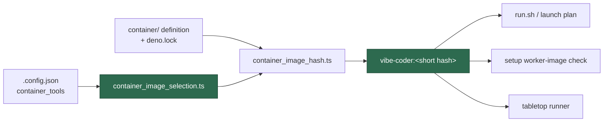

# Name the tag the launcher builds in setup's check and the tabletop runner (Issue #743)

## Summary

The container image tag covers the deployment's own `container_tools`
selection as well as the committed definition (Issue #73), but two callers
resolved the reference from the checkout alone and so named a tag `./run.sh`
never builds:

- `worker/deno/setup/prerequisites.ts` — reported `Worker image
  vibe-coder:<other tag> is not built yet` on a host whose image *was* built.
- `worker/deno/lib/tabletop_container_runner.ts` — refused to run with "the
  image `<other tag>` is not present … build it with ./run.sh", against an
  image `./run.sh` had just produced.

Both now read the selection, through one shared reader. Closes #743.

What changed:

- **`worker/deno/lib/container_image_selection.ts`** (new) —
  `readDeploymentImageSelection()` reads the deployment's selections out of its
  `.config.json` and returns the `ContainerImageHashOptions` the launch path
  uses, and `resolveDeploymentConfigFile()` owns the "explicit path, else
  `CONFIG_PATH`, else `.config.json` beside the checkout" rule the launcher
  applies. Fail-loud: a malformed selection throws with the offending field
  named rather than falling back to a selection-free tag.
- **`worker/deno/setup/prerequisites.ts`** — the worker-image check takes the
  selection into the reference. New `configPath` option, so setup checks the
  configuration it resolved; `setup_cli.ts` passes it. A malformed selection
  now fails the check with the cause named — the launcher could not build that
  selection either, and this reuses the existing "not buildable" branch.
- **`worker/deno/lib/tabletop_container_runner.ts`** — new exported
  `resolveTabletopImage()` names the image the run inspects (an explicit
  `--image` still wins), and the runner calls it. New `configFile` option so
  the resolution is testable without mutating process environment.
- **`worker/deno/commands/container_image_hash.ts`** — `resolveConfigFile`
  delegates to the shared rule instead of restating it.
- Docs: `docs/CONTAINER.md` (image identity) and `docs/SETUP.md` (what the
  worker-image line names).



Follow-ups filed, not folded in: #749 (the `agent_providers` half, which needs
#729's hash input — that code is on `milestone/722-…`, not on `main`) and #750
(setup resolves `CONFIG_FILE` while the launcher resolves `CONFIG_PATH`).

## Evidence

Backend/CLI change with no web interface to screenshot. The evidence is the
test run: `worker/deno/tests/container_image_selection_test.ts` asserts both
callers report exactly the reference the `container-image-hash` command prints
for the same configuration.

```text
deno test --allow-all tests/container_image_selection_test.ts
ok | 10 passed | 0 failed (23ms)
```

## Reproduction

- **symptom** — on a host whose `.config.json` selects `container_tools`,
  setup reported a built image as "not built yet", and the tabletop runner
  refused to start over an image `./run.sh` had just built, because both named
  the selection-free tag
- **status** — `verified` — with both callers reverted to
  `resolveContainerImageReference(repoRoot)` the new tests failed 5/10
  (`checkContainerPrerequisites … tools-selecting host`, `… provider-selecting
  host`, `… malformed selection`, `resolveTabletopImage … tools-selecting
  host`, `… provider-selecting host`); with the fix in place all 10 pass
- **regression test** —
  `worker/deno/tests/container_image_selection_test.ts::checkContainerPrerequisites - names the tag the launcher builds for a tools-selecting host`
  and
  `worker/deno/tests/container_image_selection_test.ts::resolveTabletopImage - names the tag the launcher builds for a tools-selecting host`

## Acceptance Criteria

<!-- vibe-spec-review inputs="diff+issue-body" -->

- **met** — a host selecting `container_tools` sees setup report the same tag
  `container-image-hash` and the launcher use — evidence:
  `worker/deno/setup/prerequisites.ts:481-491`,
  `worker/deno/tests/container_image_selection_test.ts::checkContainerPrerequisites - names the tag the launcher builds for a tools-selecting host`
  — reviewer: met — reason: the reviewer's residual (setup resolves
  `CONFIG_FILE`, the launcher `CONFIG_PATH`, so a `CONFIG_PATH`-only host can
  still read two different files) is pre-existing and spans setup's whole
  configuration handling — filed as #750 rather than widened into this diff
- **partial** — same for a host selecting a non-default `agent_providers` set —
  evidence: `worker/deno/lib/container_image_selection.ts` — reviewer: partial
  — reason: `agent_providers` is not a hash input on `main`
  (`ContainerImageHashOptions` has only `containerTools`, and
  `agent_provider_config.ts` does not exist here) — it arrives with #729, which
  is on `milestone/722-…`; the two callers therefore agree with the launcher
  for such a host today, and #749 carries the assertion that the tag must
  *change* with the set
- **partial** — tests cover both callers with a tools-selecting and a
  provider-selecting configuration — evidence:
  `worker/deno/tests/container_image_selection_test.ts` (4 caller cases, plus a
  malformed-selection case) — reviewer: partial — reason: the provider cases
  cannot fail on the provider dimension while the set is absent from the hash;
  they are named and commented for what they do pin — agreement with the
  launcher — and are the seam #749 extends
- **unrequested** — the shared reader
  `worker/deno/lib/container_image_selection.ts` and the delegation of
  `commands/container_image_hash.ts::resolveConfigFile` to it — reviewer:
  unrequested — reason: assembling the hash inputs per caller is the root cause
  of this bug; one reader is what stops the next caller drifting again. The
  delegation also makes the path rule single-source, and matches the launcher's
  nullish fallbacks exactly so `--config ""` behaves as before
- **unrequested** — a malformed `container_tools` selection now fails setup's
  worker-image check — reviewer: unrequested — reason: fail-loud. The launcher
  cannot build that selection either, and the check already failed for a
  definition it could not build; the message names the offending field
- **unrequested** — `configFile` option on `TabletopContainerRunnerOptions` —
  reviewer: unrequested — reason: the injection seam the tests need to resolve
  a configuration without mutating process environment, matching the existing
  `image`/`egressProbeUrl` options
- **unrequested** — the `docs/CONTAINER.md` and `docs/SETUP.md` additions —
  reviewer: unrequested — reason: the repo's "a code change owes a docs change"
  standard; both surfaces describe the tag this change alters

## Standards Review

<!-- vibe-standards-review inputs="diff+CODING-STANDARDS.md" -->

- **violation** — the docstring and `docs/CONTAINER.md` claimed the new module
  is read by the launch plan and `container-image-hash`, which still read the
  selection themselves — evidence: `worker/deno/lib/container_image_selection.ts:12`,
  `docs/CONTAINER.md:306` — reason: fixed here; both now say the module serves
  the callers that only *name* the tag, and that the other two read the same
  `.config.json` through `readContainerToolsSelection` because they also need
  the verbatim spec the build carries
- **violation** — the config-path rule did not mirror the launcher it claimed
  to mirror (`||` fallbacks and a trim, against the launcher's `??`), silently
  changing `--config ""` and `CONFIG_PATH=""` — evidence:
  `worker/deno/lib/container_image_selection.ts:48` — reason: fixed here; the
  fallbacks are nullish, exactly as `container_launch.ts:792`
- **violation** — the two provider tests asserted nothing about provider
  selection while carrying names that claimed they did — evidence:
  `worker/deno/tests/container_image_selection_test.ts:219,276` — reason: fixed
  here; renamed to "agrees with the launcher for a provider-selecting host" and
  commented with why the tag cannot vary yet, and #749 carries the assertion
  that it must once the set joins the hash
- **violation** — the config-resolution test duplicated
  `container_image_hash_test.ts:715`, which now exercises the same function
  transitively — evidence:
  `worker/deno/tests/container_image_selection_test.ts:167` — reason: trimmed
  here to the caller-supplied-path behaviour the delegating test cannot reach
- **violation** — a third copy of config-path resolution beside
  `resolveContainerLaunchHostPaths` — evidence:
  `worker/deno/lib/container_image_selection.ts:43-51` — reason: stands.
  `resolveContainerLaunchHostPaths` resolves a whole host layout and throws
  without `HOME`/`USERPROFILE`, which neither caller needs; the copy is now
  behaviourally identical for the config file, and this diff removed the *other*
  copy (`commands/container_image_hash.ts`) rather than adding to the count
- **clean** — Australian English throughout; tests call real code against real
  temp fixtures (no source grepping) with happy, error and edge cases; no test
  removed or modified; fail-loud on every new path; JSDoc on every new exported
  symbol; no hidden path staged; `deno fmt`, `deno lint` and `deno check` clean
  on all changed files

## Test Plan

- Added `worker/deno/tests/container_image_selection_test.ts` (10 tests):
  - `readDeploymentImageSelection` — carries the selected tools, an absent
    config selects nothing, a malformed selection fails loud
  - `resolveDeploymentConfigFile` — the caller's own path wins over
    `CONFIG_PATH`; a relative path resolves against the checkout
  - `checkContainerPrerequisites` — names the launcher's tag for a
    tools-selecting host (and that tag differs from the tools-free one), agrees
    with the launcher for a provider-selecting host, and fails loudly on a
    malformed selection
  - `resolveTabletopImage` — the same two agreement cases, plus an explicit
    `--image` override still winning
- Re-ran the existing suites that touch these paths:
  `container_image_hash_test.ts`, `setup_prerequisites_test.ts`,
  `tabletop_container_runner_test.ts`, `container_containment_test.ts` — 91
  passed, 0 failed.
- `./quality.sh` run in the foreground before the PR.
