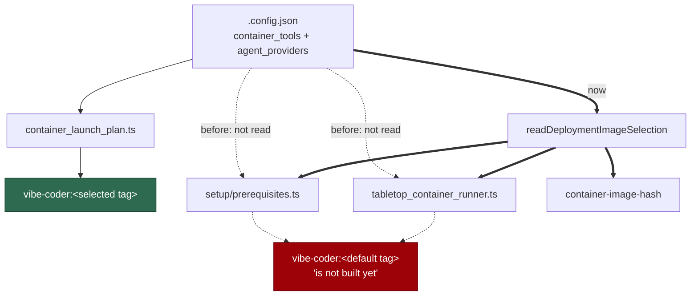

# Setup's image check and the tabletop runner read the deployment's selections

## Summary

The worker image's tag is content-derived, and two of its inputs come from the
deployment rather than from the checkout: the `container_tools` selection
(Issue #73) and the enabled `agent_providers` set (Issue #729). The launcher
passes both when it resolves the tag to build and run. Two other callers passed
neither:

- `worker/deno/setup/prerequisites.ts` reported
  `Worker image vibe-coder:<other tag> is not built yet` on a host whose image
  *was* built;
- `worker/deno/lib/tabletop_container_runner.ts` refused to run with
  "the image `<other tag>` is not present … build it with ./run.sh" — which
  builds a different tag.

Both now read the deployment's selections through one reader,
`worker/deno/lib/container_image_selection.ts`, and so does the
`container-image-hash` command, whose private copy of the provider read is
deleted in favour of it. `readDeploymentImageSelection` resolves the
configuration file by the launcher's own rule (`CONFIG_FILE`, its `CONFIG_PATH`
alias, else `<checkout>/.config.json` — Issue #750), reads the tool selection
and the provider set, and returns the hash options they imply. A checkout with
no configuration selects nothing and keeps exactly the tag it had.

`resolveTabletopImage` was lifted out of the tabletop runner's `run()` so which
image it asks for is testable: `run()` starts a real container and no unit test
may, but the image it names is the whole of this defect.

This also closes #749, which asked for the provider half of the same fix. #749
was written on the assumption that #743 would land on `main`, where the
provider set does not exist — `agent_provider_config.ts` and
`ContainerImageHashOptions.agentProviders` are on
`milestone/722-codex-on-ubuntu-with-podman-setup-sh-and-launc`, from #729. This
PR targets that milestone branch, where both halves exist, so both are done in
the one reader rather than one now and the same file again later.

Closes #743. Closes #749.

## Evidence

Backend change with no web surface to screenshot. The evidence is the
cross-caller agreement test.

Who reads the deployment's selections, before and after:



Red before, green after — the callers reverted to their one-argument calls,
then restored:

```
# unfixed callers
every caller names the image the launcher builds (Issues #743, #749) ... FAILED
the tag changes with the selection, for every caller (Issue #749) ... FAILED
a malformed selection fails loud rather than naming another tag (Issue #743) ... FAILED
FAILED | 2 passed | 3 failed

# fixed
ok | 5 passed | 0 failed
```

The wider suites the change touches pass unchanged: 172/172 across
`setup_prerequisites_test.ts`, `tabletop_container_runner_test.ts`,
`tabletop_harness_test.ts`, `container_image_hash_test.ts`,
`container_image_provider_set_test.ts`, `container_launch_test.ts` and the new
suite. `deno fmt --check` (2013 files), `deno lint` (2007 files), markdownlint
and the mermaid check are clean.

## Reproduction

- **symptom** — on a host whose `.config.json` selects `container_tools` or a
  non-default `agent_providers` set, `./setup.sh` reports the worker image as
  not built when it is, and the tabletop runner refuses to run and points at
  `./run.sh`, which builds the tag the host already has
- **status** — `verified` — the agreement test was watched failing against the
  unfixed callers (three of five red, output above) and passing after; the
  failing assertion is precisely "setup named `vibe-coder:<default>` where the
  launcher builds `vibe-coder:<selected>`"
- **regression test** —
  `worker/deno/tests/container_image_selection_test.ts::every caller names the image the launcher builds (Issues #743, #749)`
  and `::the tag changes with the selection, for every caller (Issue #749)`

## Acceptance Criteria

Judged in an operator review of the whole diff, not by the two reviewer
sub-agents: this change was made by hand, and the provenance markers are
deliberately not claimed for a review no independent context produced.

### Issue #743

- **met** — a host selecting `container_tools` sees setup report the same tag
  `container-image-hash` and the launcher use — evidence:
  `worker/deno/tests/container_image_selection_test.ts::every caller names the image the launcher builds (Issues #743, #749)`,
  whose expectation is derived from the launcher's own two readers, not from
  the reader under test
- **met** — same for a host selecting a non-default `agent_providers` set —
  evidence: the third configuration in the same test's matrix
  (`agent_providers: ["codex"]`)
- **met** — tests cover both callers with a tools-selecting and a
  provider-selecting configuration — evidence: three configurations × two
  callers in the agreement test, plus
  `::the tag changes with the selection, for every caller (Issue #749)`, which
  fails if the selections are ignored and every configuration collapses onto
  one tag

### Issue #749

- **met** — a host selecting a non-default `agent_providers` set sees setup's
  worker-image check report the tag `container-image-hash` and the launcher use
  — evidence: as above; `readDeploymentImageSelection` returns
  `agentProviders` alongside `containerTools`, so both callers pick it up
- **met** — same for the tabletop runner — evidence:
  `resolveTabletopImage` in the same test's matrix
- **met** — a test asserts the tag *changes* with the provider set for both
  callers — evidence:
  `::the tag changes with the selection, for every caller (Issue #749)` asserts
  three distinct tags for three distinct configurations, for setup and the
  tabletop runner alike
- **partial** — the assertion grows in
  `worker/deno/tests/container_image_selection_test.ts` "which carries the two
  provider cases that currently pin agreement only" — evidence: the file did
  not exist (it was to be created by #743, which had not landed), so it is
  created here with those cases — reason: the criterion describes a file that
  was never written; the substance of it is met in the file it names

- **unrequested** — `commands/container_image_hash.ts` now uses the shared
  reader, and its private `readAgentProvidersBuildValue` is deleted — reason:
  it was a third copy of the same read, and leaving it would leave the tag's
  own definition able to drift from the callers this issue is aligning
- **unrequested** — `resolveTabletopImage` extracted from the runner's `run()`
  — reason: the runner starts a real container, so the image it names could not
  otherwise be asserted; the acceptance criteria ask for exactly that assertion
- **unrequested** — the "Every caller reads both selections through one reader"
  paragraph in `docs/CONTAINER.md` — reason: the standards' "a code change owes
  a docs change" rule; that section is where the tag's inputs are documented
- **unrequested** — `main` is merged into the branch — reason: the branch
  targets the milestone, and `readDeploymentImageSelection` resolves the config
  file through `host_config_path.ts` (Issue #750), which is on `main`. The
  milestone branch has taken main merges throughout

## Standards Review

- **clean** — Australian English throughout; the new module carries a file
  header explaining why it exists and JSDoc with `@param`/`@returns` on every
  export; fail-loud preserved (a malformed selection surfaces as "not
  buildable" naming the field, asserted by a test, never a fallback tag); the
  read is defined once and imported by three callers; TDD followed and
  demonstrated red before green; no existing test removed or weakened
- **violation** — the fixture copies the real `container/` inputs into a temp
  checkout rather than using the repository root — evidence:
  `worker/deno/tests/container_image_selection_test.ts` `checkout()` — reason:
  stands, deliberately. Each case must state its own `.config.json`, and
  writing one into the developer's checkout is not acceptable; copying the
  enumerated inputs keeps the hash identical to the real one while leaving the
  configuration under the test's control
- **clean** — no shell was added: all new logic is Deno TypeScript, as the
  standards require

## Test Plan

Added `worker/deno/tests/container_image_selection_test.ts` (5 tests):

- `every caller names the image the launcher builds (Issues #743, #749)` — three
  configurations (none, tools, providers) × setup's check and the tabletop
  runner, against an expectation derived from the launcher's own readers.
- `the tag changes with the selection, for every caller (Issue #749)` — three
  distinct tags for three distinct configurations; agreement alone would also
  hold if every selection were ignored.
- `a checkout with no configuration selects nothing (Issues #743, #749)` — the
  unconfigured checkout keeps the reference it had before either input existed.
- `an explicit tabletop --image still wins (Issue #743)`.
- `a malformed selection fails loud rather than naming another tag (Issue #743)`
  — setup reports "not buildable" with the offending field, not a fallback tag.

No existing test was modified.
