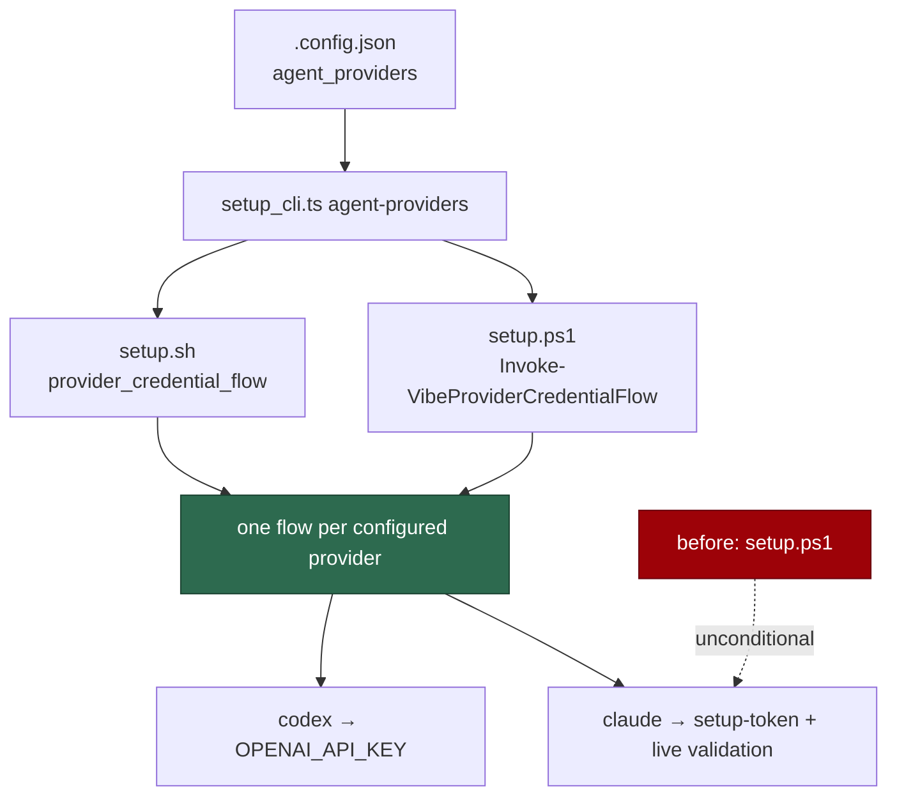

# setup.ps1 asks for the credentials the configured providers need

## Summary

`setup.ps1` ran the Claude credential flow unconditionally, so a Codex-only
Windows host was asked for a `CLAUDE_CODE_OAUTH_TOKEN` it will never use —
offered `claude setup-token`, then a hidden paste, then warned that the worker
"fails its credential preflight" when the operator skipped a prompt for a
vendor they do not run. This is the fault #730 fixed on macOS and Linux; the
Windows twin was left behind.

`setup.ps1` now resolves the configured providers through the same
`agent-providers` subcommand `setup.sh` uses — one Deno seam
(`worker/deno/setup/agent_providers.ts`), so the two platforms cannot disagree
about which host this is — and runs one credential flow per configured
provider, driven by its own provider credential table:

- `Invoke-VibeProviderCredentialFlow` is the generic flow, the twin of
  `provider_credential_flow` in `setup.sh`: validate an existing credential,
  offer rotation, mint where the vendor's CLI can, else paste, then write
  through the one owner-only path and prove the result.
- Claude keeps every refinement it had — the `claude setup-token` transcript
  capture, the full by-hand recipe, and the live validation call — because
  those are Claude's row in the table, not the shape of the flow.
- Every other provider gets the generic hidden paste, its own source hint, and
  `<provider>/provider.env` at `600`.

An unresolvable provider set is fatal rather than a licence to guess: the
default here would prompt a Codex host for a Claude token.

The parity contract grows a `gatesCredentialsByProvider` field, so a script
that goes back to prompting for Claude regardless — on either platform — fails
`setup_parity_test.ts` instead of shipping.

Closes #745.

## Evidence

Terminal change with no web surface to screenshot. The evidence is the
behavioural PowerShell suite, run against the real script.

What each host is asked for:



Red before, green after — the new cases against the unchanged `setup.ps1`,
then against the fix:

```
# unfixed setup.ps1
setup.ps1 - a Codex flow asks for the Codex credential and never mentions Claude ... FAILED
setup.ps1 - a Claude flow keeps today's behaviour ... FAILED
setup.ps1 - the provider set comes from the setup CLI ... FAILED
setup.ps1 - every configured provider gets a flow, in order ... FAILED
setup.ps1 - an unregistered provider is reported, not guessed at ... FAILED
both setup scripts ask which providers this host runs before prompting ... FAILED
FAILED | 1 passed | 6 failed

# fixed
ok | 19 passed | 0 failed   # tests/setup_ps1_test.ts, under pwsh
ok | 13 passed | 0 failed   # tests/setup_parity_test.ts
```

The PowerShell suite drives the real script: it dot-sources `setup.ps1`, and
the only thing replaced is `Read-VibeSecret` — the console is the external
service, and a test may fake the external service but not the logic. The Codex
case runs with a `claude` executable on `PATH`, so "no Claude prompt" is a
statement about the provider gate and not about a missing CLI.

`deno fmt --check` (2013 files), `deno lint` (2007 files), markdownlint and the
PowerShell parser are clean.

Pre-existing, unrelated: `setup_provider_credential_flow_test.ts::setup.sh - a
Codex-only host with no claude CLI reaches the configuration-writing stage`
fails on this host because no container runtime is installed — verified failing
on the unmodified branch with the change stashed. CI's container job has one.

## Reproduction

- **symptom** — on a Windows host whose `.config.json` selects only Codex,
  `.\setup.ps1` offers `claude setup-token`, then prompts for
  `CLAUDE_CODE_OAUTH_TOKEN`, then warns that the worker fails its credential
  preflight without one — and never asks for the Codex credential at all
- **status** — `verified` — the new cases were watched failing against the
  unmodified `setup.ps1` (six red, output above) and passing after; the Codex
  case asserts the absence of both `CLAUDE_CODE_OAUTH_TOKEN` and `setup-token`
  in the run's whole output
- **regression test** —
  `worker/deno/tests/setup_ps1_test.ts::setup.ps1 - a Codex flow asks for the Codex credential and never mentions Claude (Issue #745)`
  and
  `worker/deno/tests/setup_parity_test.ts::a setup script that drops the provider gate is a fault, on either platform (Issue #745)`

## Acceptance Criteria

Judged in an operator review of the whole diff, not by the two reviewer
sub-agents: this change was made by hand, and the provenance markers are
deliberately not claimed for a review no independent context produced.

- **met** — a Codex-only configuration runs `setup.ps1` with no Claude prompt
  shown — evidence:
  `worker/deno/tests/setup_ps1_test.ts::setup.ps1 - a Codex flow asks for the Codex credential and never mentions Claude (Issue #745)`,
  which asserts neither `CLAUDE_CODE_OAUTH_TOKEN` nor `setup-token` appears in
  the output and no `claude/provider.env` is written, with a `claude` CLI
  present on `PATH`
- **met** — a Codex-only run prompts for, or validates,
  `<credential dir>\codex\provider.env` — evidence: the same test asserts the
  file contains `OPENAI_API_KEY=…` at mode `600`, and that the prompt names
  `OPENAI_API_KEY`, the `platform.openai.com` source and
  `VIBE_LAUNCHAGENT_OPENAI_API_KEY`
- **met** — a Claude-only configuration keeps today's behaviour — evidence:
  `::setup.ps1 - a Claude flow keeps today's behaviour (Issue #745)` asserts
  `CLAUDE_CODE_OAUTH_TOKEN=…` at `600` and the full by-hand recipe;
  `setup_parity_test.ts::setup.sh and setup.ps1 - both mint and prove a claude credential`
  passes unchanged, so the transcript capture and the live validation call are
  still there
- **met** — the parity test fails if either script loses the provider gate —
  evidence:
  `::a setup script that drops the provider gate is a fault, on either platform (Issue #745)`
  strips the `agent-providers` call from each real script in turn and asserts
  both a fault and a divergence; `::both setup scripts ask which providers this
  host runs before prompting (Issue #745)` pins the live state

- **unrequested** — `Set-VibeProviderCredential` gained `-VarName`/`-Secret`
  and `-Quiet` — reason: the interactive flow must write through the same
  owner-only path as the non-interactive one (the issue asks for exactly
  that), which means handing it a pasted secret under the name the prompt
  asked for. `setup.sh` does this by exporting the variable and calling the
  shared writer; passing the value directly keeps the secret out of the
  process environment altogether. `-Quiet` mirrors the `quiet` argument
  `setup.sh` already passes on that path, so success is reported after
  validation rather than before it
- **unrequested** — the PowerShell contract extractor now also reads
  `Invoke-VibeSetupCliCapture` — evidence:
  `worker/deno/lib/setup_contract.ts` `SUBCOMMAND_INVOCATION` — reason:
  `agent-providers` is a query, so it is only ever called through the capture
  helper; without this the extractor cannot see the gate it is now asked to
  compare
- **unrequested** — two existing parity tests were edited — evidence:
  `worker/deno/tests/setup_parity_test.ts` — reason: a new fault means the
  "decides for itself" fixture now raises 8 rather than 7, and the
  "compliant except one step" fixture had to gain the `agent-providers` call
  to stay compliant-except-one-step. Both are fixture updates demanded by the
  new contract field; no assertion was weakened and none was removed
- **unrequested** — the `setup.ps1` sentence in `docs/SETUP.md:71-76` —
  reason: the standards' "a code change owes a docs change" rule. That
  paragraph already described the provider-gated flow without naming a
  platform, so it read as true on Windows when it was not

## Standards Review

- **clean** — Australian English throughout; comment-based help on every new
  PowerShell function, JSDoc on the new contract field; fail-loud on an
  unresolvable provider set and on an unregistered provider (both asserted);
  one owner-only write path for both credential flows, so there is still
  exactly one place that decides where a credential lands; TDD followed and
  demonstrated red before green; no existing assertion weakened
- **clean** — the Windows twin rule is honoured in the direction it was
  breached: this change *is* the twin, and it is exercised under a real `pwsh`
  rather than asserted by reading the script
- **violation** — the flow's shape is now stated twice, once in bash and once
  in PowerShell — evidence: `setup.sh` `provider_credential_flow`,
  `setup.ps1` `Invoke-VibeProviderCredentialFlow` — reason: stands. The
  interactive terminal layer is the one part of setup that cannot live in the
  Deno CLI, which is why both scripts have one at all; the parity contract is
  the mechanism that keeps the two honest, and this change extends it to cover
  exactly this behaviour
- **violation** — `Write-VibeSuccess` reports a claude credential as
  "validated with a live claude call" even when no `claude` CLI is installed,
  because `Test-VibeClaudeCredential` returns true in that case — evidence:
  `setup.ps1` `Invoke-VibeProviderCredentialFlow` — reason: stands,
  pre-existing and deliberately preserved. The unmodified script printed the
  same message on the same path, and the acceptance criteria require Claude's
  behaviour to be unchanged; correcting the wording belongs in its own change

## Test Plan

Added to `worker/deno/tests/setup_ps1_test.ts` (5 cases, all under a real
`pwsh`, skipped where none is installed):

- `a Codex flow asks for the Codex credential and never mentions Claude (Issue #745)`
- `a Claude flow keeps today's behaviour (Issue #745)`
- `the provider set comes from the setup CLI, and an unresolved one is empty (Issue #745)`
  — a stubbed `deno` on `PATH` answers the subcommand; a failing one yields no
  providers rather than a Claude fallback.
- `every configured provider gets a flow, in order (Issue #745)` — two
  providers, two files, no `claude/provider.env`, and the run names the flows
  before driving them.
- `an unregistered provider is reported, not guessed at (Issue #745)`

Added to `worker/deno/tests/setup_parity_test.ts` (2 cases):

- `both setup scripts ask which providers this host runs before prompting (Issue #745)`
- `a setup script that drops the provider gate is a fault, on either platform (Issue #745)`

Modified (fixtures only, documented above): the two parity tests whose
synthetic sources predate the new contract field.
