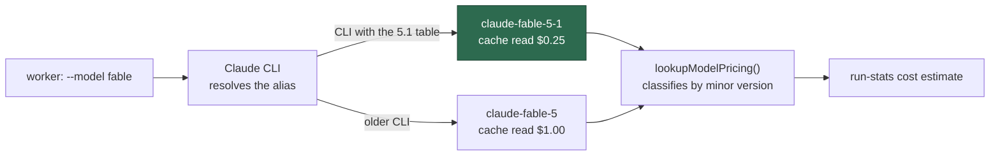

# Adopt Claude Fable 5.1 — pricing, docs, and a prompt review

## Summary

Anthropic released **Claude Fable 5.1** (`claude-fable-5-1`) on 2026-09-01 at
the same $10 / $50 per MTok as Fable 5, but with **cache reads at $0.25/MTok —
a quarter of the Fable 5 rate**. The worker requests the tier alias `fable`,
never a pinned model id, so routing needs no change; what needed changing was
the price the run-stats comment applies to those cache reads.

This change adds the `claude-fable-5-1` pricing row, refreshes the other
current-model rows against Anthropic's published pricing (Sonnet 5 is
**cheaper** than the 4.x line it replaces, at $2 / $10), makes `lookupModelPricing()`
classify Fable and Sonnet ids by version so a dated id prices at its own
generation's rate, and updates `docs/MODEL-AND-CACHING.md`. `claude-fable-5`
keeps its own $1.00 cache-read row so a run whose served model was Fable 5 is
still costed at the rate it was billed at. Closes #747.

## Evidence

Backend/CLI change with no web interface, so no screenshot applies. The
evidence is the test suite plus the published rates each row was checked
against.

**Rates verified against Anthropic's published pricing**
([`platform.claude.com/docs/en/about-claude/pricing`](https://platform.claude.com/docs/en/about-claude/pricing),
re-fetched and re-checked row by row on the resumed attempt — every row below
matches the published table, including the footnote that Fable 5.1 cache hits
are priced at 0.025× base input rather than the standard 0.1×):

| Model | Input | Output | Cache write | Cache read | Change |
|---|---:|---:|---:|---:|---|
| Fable 5.1 | $10 | $50 | $12.50 | **$0.25** | new row |
| Fable 5 | $10 | $50 | $12.50 | $1.00 | unchanged |
| Opus 5 / 4.5–4.8 | $5 | $25 | $6.25 | $0.50 | unchanged |
| Sonnet 5 | $2 | $10 | $2.50 | $0.20 | **new row** — the launch rate is now standard; the scheduled rise to $3/$15 was cancelled |
| Sonnet 4.6 / 4.x | $3 | $15 | $3.75 | $0.30 | unchanged |
| Haiku 4.5 | $1 | $5 | $1.25 | $0.10 | unchanged |
| Opus 4.0/4.1, Haiku 3.5 | — | — | — | — | unchanged, still correct |

**Why the live-run check cannot pass in this container — measured, not assumed.**
The installed Claude CLI is 2.1.223, and its binary contains no
`claude-fable-5-1` string at all:

```console
$ claude --version
2.1.223 (Claude Code)
$ strings -a /usr/local/bin/claude | grep -oE 'claude-fable-[0-9][a-z0-9-]*' | sort -u
claude-fable-5
claude-fable-5-mythos-5
```

So this CLI resolves `--model fable` to `claude-fable-5`; there is no
configuration by which a run here could be served 5.1. The alias flip is the
CLI's to make and it needs no worker change: containers auto-update to the
latest CLI, and the `software_min_versions` floor (`claude`, 2.1.170) is a
minimum rather than a pin, so the fleet picks 5.1 up the moment a CLI shipping
that alias table lands. Both pricing rows are carried so neither side of the
flip needs a config change. This is why the live-run criterion below is
`missing`, and it is the whole answer to the issue's "do we need to do anything
to take advantage of 5.1?" on the routing side: no.



## Prompt review — Fable 5.1 guidance vs the Fable-preferring phase prompts

Reviewed the eight Fable-preferring phases' surfaces (`prompts/planning/v23.md`,
`prompts/planning_critique/v7.md`, `prompts/grill-me/v14.md`,
`prompts/question/v9.md`, `prompts/quorum/v1.md`, `prompts/quorum_judge/v1.md`)
against [Prompting Claude Fable 5.1](https://platform.claude.com/docs/en/build-with-claude/prompt-engineering/prompting-claude-fable-5-1)
and the [migration guide](https://platform.claude.com/docs/en/models/fable-5-1/migration-guide).
**Every heading on the 5.1 prompting page gets a row**, so a reader can see the
review was exhaustive rather than a sample:

| 5.1 guidance heading | Outcome |
|---|---|
| Migration guide: breaking API changes (forced `tool_choice` 400s; thinking blocks bound to model and to an unedited prefix) | **No change needed** — the worker drives the Claude Code CLI, which owns request construction and history; the worker sends only CLI flags. Recorded in `docs/MODEL-AND-CACHING.md` |
| Consider all effort levels | **No change made, deliberately** — the guide says to re-run an effort sweep for 5.1 because level names do not map across models, and that `medium` may match Fable 5's `high` at lower cost. All eight Fable phases sit at `high` (`DEFAULT_CLAUDE_EFFORT_PLANNING`/`_GRILL_ME`/`_QUORUM`/`_QUESTION`/`_REFINEMENT`/`_REVISION`/`_CLARIFICATION`, `worker/deno/lib/config_defaults.ts:640-712`), which is the guide's recommended starting point. Stepping down needs measured eval evidence this run cannot produce, and changing effort defaults is not what the issue asked for |
| Ask for user-facing progress updates | **Changed, as a filed gap** — the guide's first instruction is to audit for narration-suppressing lines. `grill_me` renders both "Narrate briefly as you go" (`prompts/grill-me/v14.md:6`) and "no running commentary while you work" (`worker/deno/lib/verbosity.ts:37`, via `standard`), so one rendered prompt asks for and forbids narration. `planning` and `question` render `verbose` and `pr_feedback` renders `concise` — neither text carries the clause — so `grill_me` is the only affected surface. Which side wins is a product call, and committed `vN.md` files are immutable, so it is filed as stSoftwareAU/VibeCoder#759 per the checklist's gap-issue policy |
| Batch independent tool calls in agent loops | **No change needed** — the guidance targets a caller that owns the tool loop; the CLI owns ours, and the shared guidelines already carry parallel-tool-call guidance (checklist row 11) |
| Keep the conversation history append-only | **No change needed** — the worker never constructs a `messages` array; the CLI owns history, compaction and thinking-block replay |
| Writing density | **No change needed** — the anti-mannered-prose block is a chat-writing fix. The Fable phases emit structured artefacts (issue bodies, verdict blocks, plan text) whose shape is already pinned by each template's output contract |
| Formatting in chat | **No change needed** — the guidance is to *remove* anti-formatting rules written for older models. No Fable-phase template carries one (grepped the latest version of every template for bullet/header/bold prohibitions) |
| Quoting retrieved sources | **No change needed** — no Fable phase summarises retrieved documents; `grill_me` and `question` read issue text, which they are meant to restate in the user's own terms |
| Finish the whole task | **No change needed** — the guide's key sentence is "the user is not watching in real time". Every Fable-phase template already opens with exactly that framing (`prompts/planning/v23.md:10`, `prompts/grill-me/v14.md:6`, `prompts/quorum/v1.md:6`, `prompts/quorum_judge/v1.md:6`), and the shared guidelines carry the finish-the-whole-task and no-mid-task-permission rules |
| Tell the model what to preserve in compaction summaries | **No change needed** — the worker does not compact on the client; the CLI does |
| Keep changes and tests to what the task asks for | **No change needed** — covered by the shared coding-guidelines scope rules and checklist row 20; and the Fable phases are read-only by construction (they may not edit code at all) |
| Search triggering at low effort | **Not applicable** — the behaviour is specific to `low` effort; all eight Fable phases run at `high` |
| Reduce safeguard false positives | **No change needed** — no Fable-phase prompt uses compile-check phrasing, targets a lesser-known language, or feeds base64 tool output into context (the only "compiles" lines live in the execute/`ci_fix` templates, and they instruct running the quality gate rather than asking the model to judge compilation) |
| Prefer targeted edits over whole-file rewrites | **Not applicable** — no Fable phase edits files; the execute phase, which does, runs on the Opus tier |
| Leave room for long outputs at `xhigh`/`max` | **Not applicable** — the Fable phases run at `high`; `max` is where the Opus fallback is spent |
| Let the lead agent keep working while subagents run | **No change needed** — the CLI owns subagent dispatch and blocking; the worker cannot make its `Agent` tool return early |
| Give vision work tools to crop and zoom | **Not applicable** — no Fable phase takes an image as task input |
| The best-practices guide's model-specific section restructured into one **Model-specific guidance** table | **Changed** — `docs/PROMPT-BEST-PRACTICES-CHECKLIST.md` names that section (with Fable 5.1 among the pages it links) in place of four now-nonexistent per-model headings, keeping the doc's "every guide heading is accounted for" invariant true; the guard test's heading list moves with it |

## Acceptance Criteria

<!-- vibe-spec-review inputs="diff+issue-body" -->

- **met** — separate `claude-fable-5-1` row at $10 / $50 / $12.50 / $0.25 with `claude-fable-5` kept at $1.00 — evidence: `worker/deno/lib/token_usage.ts:65-82`, `worker/deno/tests/token_usage_test.ts::prices Fable 5.1 cache reads at a quarter of Fable 5` — reviewer: met
- **met** — other current-model rows checked against Anthropic's published pricing, stale rates corrected — evidence: `worker/deno/lib/token_usage.ts:104-117` (Sonnet 5), `docs/MODEL-AND-CACHING.md` Model Pricing table — reviewer: met
- **partial** — prompt review of the phase templates, adjustments applied, each finding's outcome recorded — evidence: the Prompt review table above (one row per heading on the 5.1 prompting page); `docs/PROMPT-BEST-PRACTICES-CHECKLIST.md`; stSoftwareAU/VibeCoder#759 — reviewer: partial — reason: no `prompts/` template changed. One genuine gap was found and filed rather than edited (committed `vN.md` files are immutable and the winning side is a product call); every other heading is recorded above as no-change-needed or not-applicable with its reason
- **met** — `docs/MODEL-AND-CACHING.md` updated where it names Fable 5 as the top tier, with the alias resolution and the $0.25/MTok cache-read rate — evidence: `docs/MODEL-AND-CACHING.md` "Fable 5.1 — the current top tier" and the Model Selection alias paragraph — reviewer: met
- **missing** — verify on a real run that the CLI serves `claude-fable-5-1` with `Degraded: no` — reviewer: missing — reason: not verifiable in this container and not because of the change: CLI 2.1.223 has no `claude-fable-5-1` in its binary at all (evidence above), so `--model fable` here can only resolve to `claude-fable-5`. What is proven instead is that the detector accepts 5.1 (`worker/deno/tests/planning_run_stats_test.ts::modelsMatch - Fable 5.1 satisfies a Fable-preferring phase`), so the first Fable-phase run on a 5.1-capable CLI reports `Degraded: no` and prices cache reads at $0.25/MTok without any further change
- **unrequested** — the historical "Opus↔Sonnet gap shrank to ~1.7×" decision note gained a parenthetical saying Sonnet 5 reopened it to ~2.5× — reviewer: unrequested — reason: the line reads as a current rate in the same document the issue asked to refresh; the original figure is kept and marked as the rate at the time rather than rewritten

## Standards Review

<!-- vibe-standards-review inputs="diff+CODING-STANDARDS.md" -->

- **violation** — quality gates must pass: collapsing the four per-model rows broke the untouched guard `worker/deno/tests/prompt_best_practices_checklist_test.ts` — evidence: `worker/deno/tests/prompt_best_practices_checklist_test.ts:59` — reason: fixed here — the guide replaced those four headings with one `Model-specific guidance` section, so the constant now names that section and says why
- **violation** — a PR summary under `docs/archive/pr-summaries/` was missing — evidence: commit `d5703f8` file list — reason: fixed here — this file
- **violation** — Boy Scout Rule: the reworded Fable paragraph carried a truncated sentence forward ("…`quorum_judge`) under, and.") — evidence: `docs/MODEL-AND-CACHING.md` Model Pricing section — reason: fixed here — the sentence now ends cleanly
- **violation** *(from the spec reviewer, same axis)* — a load-bearing comment gave the wrong reason for the row ordering — evidence: `worker/deno/lib/token_usage.ts:153` — reason: fixed here — `lookupModelPricing()` classifies fable ids by version before reaching the map, so the comment now names the consumer that really depends on insertion order, `estimateBatchCost` in `batch_api.ts`
- **clean** — Australian English throughout; `deno fmt`/`deno lint`/`deno check` on the touched files; tests call real functions and assert results (no source-grepping); no error swallowing; renamed private constants have no stale references; commit cites Issue #747 and carries the `Vibe-Coder-Run-Id` trailer; no hidden paths staged; no `prompts/` file mutated, so prompt-version immutability holds

## Test Plan

Added to `worker/deno/tests/token_usage_test.ts`:

- `prices Fable 5.1 cache reads at a quarter of Fable 5` — `claude-fable-5-1` → $0.25 cache read
- `prices a dated Fable 5.1 id at the 5.1 rate` — `claude-fable-5-1-20260901`
- `returns pricing for a dated Fable 5 id` — `claude-fable-5-20260115` is **not** captured by the 5.1 row
- `returns pricing for Sonnet 5` — $2 / $10 / $2.50 / $0.20
- `estimateCost prices Fable 5.1 cache reads at $0.25/MTok` — end-to-end cost breakdown

Added to `worker/deno/tests/planning_run_stats_test.ts`:

- `modelsMatch - Fable 5.1 satisfies a Fable-preferring phase` — `fable` and `claude-fable-5` both accept `claude-fable-5-1` (and its dated form); a different tier still fails

Modified, because the behaviour they pinned changed:

- `returns pricing for bare fable alias` — the `fable` alias resolves to the latest Fable, so it now expects the 5.1 cache-read rate
- `resolves bare 'sonnet'/'haiku' aliases` — the `sonnet` alias now expects Sonnet 5's $2 / $10
- `tier fallback gives Sonnet 4.x pricing for unknown 4-family minor` — renamed and re-commented: an unknown Sonnet **4** minor keeps $3 / $15 now that Sonnet 5 has its own branch
- `prompt_best_practices_checklist_test.ts` out-of-scope heading list — tracks the guide's restructure into one `Model-specific guidance` section
