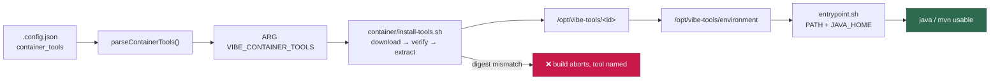

# PR Summary — End-to-end Java + Maven example and documentation for `container_tools` (Issue #75)

## Summary

Closing slice of parent #5: the deployer-facing documentation for the
`container_tools` mechanism, the worked Java + Maven example it was built for,
and a test suite that keeps that example honest by driving it through the real
validator and the real installer. No behaviour change — no `container/`,
launcher or worker-library code is touched. Closes #75.

- **`docs/CONTAINER.md`** — new `## Deployer-supplied build-time tools` section
  beside the provider-set section: the spec field table, the fixed
  `/opt/vibe-tools/<id>` prefix with `bin`/`env` confined to it, the mandatory
  per-architecture SHA-256, the worked Temurin 25.0.4+7 (amd64 + arm64) and
  Maven 3.9.16 (`noarch`) example, how to find a published checksum for a new
  tool (Adoptium publishes SHA-256; Apache publishes SHA-512 only, so verify
  that first and record the SHA-256 of the verified file), and
  `### When a checksum stops matching` — the #14 constraint stated where a
  deployer reads it.
- **`docs/CONFIGURATION.md`** — a `container_tools` row in the defaults table,
  matching the `agent_providers` row in style.
- **`docs/DEPLOYMENT.md`** — `## 🧰 Changing container_tools forces an image
  rebuild`, plus a TOC entry.
- **`docs/CONTAINER-IMAGE.md`** — the "install implementation is still a stub"
  sentence is stale since #70 landed on this milestone branch; it now describes
  what the step really does and links to the new section.
- **`CHANGELOG.md`** — `Unreleased` entry.

**One correction to the issue's brief.** The issue asked for a note that
changing `container_tools` changes the image tag. It does not — yet.
`computeContainerImageHash()` hashes enumerated *committed* inputs
(`container/install-tools.sh` among them); the **selection** travels as the
`VIBE_CONTAINER_TOOLS` build argument out of `.config.json`, and folding it into
the hash is Issue #73, which has not landed. Rather than document a behaviour
the code does not have, both the container and deployment pages say plainly
that a selection-only edit leaves the tag unchanged, name #73, and give the
deployer the action that works today (drop the tag so the next launch
rebuilds).

## Evidence

No web interface is involved, so there is no screenshot. The verification is
the mechanism running end to end.



**End-to-end run** (full logs are on
[issue #75](https://github.com/stSoftwareAU/VibeCoder/issues/75)). The real
`container/install-tools.sh` was run over the documented spec against the real
published archives, then the `environment` hand-off applied exactly as
`container/entrypoint.sh` applies it:

```text
install-tools: installing 2 tool(s) for arm64: java maven
install-tools: installed 2 tool(s): java maven

JAVA_HOME=/tmp/vibe-tools-e2e/java
openjdk version "25.0.4" 2026-07-21 LTS
Apache Maven 3.9.16 (2bdd9fddda4b155ebf8000e807eb73fd829a51d5)
Java version: 25.0.4, vendor: Eclipse Adoptium, runtime: /tmp/vibe-tools-e2e/java

[INFO] Downloaded from central: .../commons-lang3-3.18.0.jar (703 kB at 1.8 MB/s)
[INFO] Building jar: /tmp/e2e75/demo/target/container-tools-e2e-1.0.0.jar
[INFO] BUILD SUCCESS
```

`mvn package` (not just `-version`) was used so dependency resolution from
Maven Central and `javac` are both exercised, with Maven finding its JDK
through the `JAVA_HOME` the spec's `env` sets.

**What could not be run on this host.** The worker runs inside the Vibe Coder
container (`VIBE_IMAGE_AGENT_PROVIDERS=claude`) and that image carries no
container runtime — `docker`, `podman`, `nerdctl`, `buildah` and `container`
are all absent and there is no `/var/run/docker.sock` — so the OCI build
wrapper around the install step could not be executed here. That wrapper
(`ARG` → spec file → `install-tools.sh`, and the empty-selection no-op) is
already covered by `container_tools_install_test.ts` from #71; everything the
image would contain was exercised above at a temporary prefix.

**Checksum provenance.** Temurin's SHA-256 came from the Adoptium API; Maven's
was derived by verifying the download against Apache's published SHA-512
(`sha512sum -c` → `OK`) and then recording the SHA-256 of that verified file —
the procedure the new documentation prescribes.

## Test Plan

New suite `worker/deno/tests/container_tools_example_docs_test.ts` (11 cases).
It extracts the fenced example from `docs/CONTAINER.md` and exercises it
against real code rather than reading prose:

- the documented example passes `parseContainerTools()` — the #69 trust
  boundary — and declares exactly `java` and `maven`;
- Java pins both `amd64` and `arm64` with 64-hex digests, Maven pins `noarch`;
- every download is `https:` and ends in an extension `install-tools.sh` can
  extract;
- `bin`/`env` are prefix-relative, with `JAVA_HOME` as the prefix root;
- the documented spec, with its URLs swapped for local fixture archives of the
  same layout (so the suite stays offline and fast), is driven through the real
  `container/install-tools.sh` for **both** architectures: `stripComponents: 1`
  really lands `bin/java` and `bin/mvn`, and the `environment` file really
  carries the two `PATH=` lines plus `JAVA_HOME` / `MAVEN_HOME`;
- the four documentation surfaces this slice owes carry what they promise —
  the configuration row, the prefix and mandatory digest, the checksum-drift
  answer (`.config.json`, never relaxed verification) and the deployment
  rebuild note — so a later edit that drops one fails the gate.

Commands run:

```bash
deno test --allow-all tests/container_tools_example_docs_test.ts   # 11 passed
./quality.sh < /dev/null                                            # clean
```
