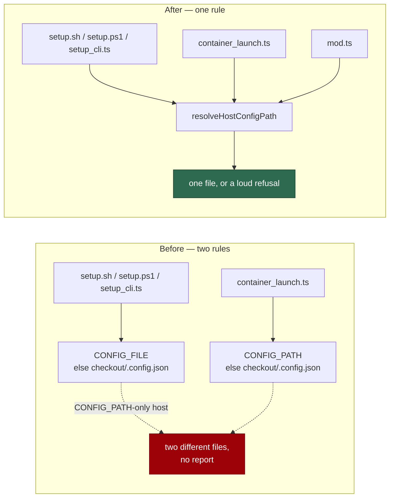

# One config file, one name: CONFIG_FILE with CONFIG_PATH as its alias

## Summary

The two halves of a deployment resolved the configuration from different
environment variables. Setup (`setup.sh`, `setup.ps1`,
`worker/deno/setup/setup_cli.ts`) read **`CONFIG_FILE`**; the launcher
(`resolveContainerLaunchHostPaths`) read **`CONFIG_PATH`**; and
`worker/deno/mod.ts` — the worker CLI, run on the host as well as in the
container — read `CONFIG_PATH` too. A host that relocated its `.config.json`
and set only one of them had setup reading and writing
`<checkout>/.config.json` while `./run.sh` staged the relocated file. Nothing
reported the split. A relative value made it worse: the Deno side resolved it
against the checkout, `setup.sh` against whatever directory the operator
happened to be in.

`CONFIG_FILE` is now canonical and `CONFIG_PATH` is its documented alias, with
one rule in `worker/deno/lib/host_config_path.ts` that every side calls:

- a relative value resolves against the **checkout**, in the host's own path
  spelling, everywhere;
- both set to the same file once resolved is fine;
- both set to **different** files is a deployment fault and is reported as one,
  in all four callers, rather than silently answered differently on each side.

The host path helpers (`pathStyleFor`, `normalisePath`, `isAbsolutePath`,
`joinPath`) moved out of `container_launch.ts` into `host_path_style.ts` so the
resolver joins a relative path exactly as the launcher does — writing that
logic twice is the defect this issue reports. `container_launch.ts` re-exports
the two names it has always published, so no caller changed.

`CONFIG_PATH` keeps its second, unrelated meaning inside the container, where
the launcher sets it to the staged read-only copy: that value is absolute and
arrives with no `CONFIG_FILE` beside it, so the rule answers it unchanged.

Closes #750.

## Evidence

Backend and shell change with no web surface to screenshot. The evidence is the
cross-checked matrix.

Who resolves what, before and after:



The seven-case matrix — neither set, either alone (absolute and relative), both
agreeing, both agreeing only once resolved — is asserted four times over: against
the resolver, against `resolveContainerLaunchHostPaths`, against a real
`source setup.sh`, and against a real `. setup.ps1`. Each shell run reports the
checkout it resolved itself to, and the expectation is computed from that base,
so no path-canonicalisation difference can make the comparison lie.

```
ok | 10 passed | 0 failed (8s)   # tests/host_config_path_test.ts, pwsh included
ok | 116 passed | 0 failed       # + the setup config suites
ok | 42 passed | 0 failed        # tests/container_launch_test.ts, unchanged
ok | 73 passed | 0 failed        # workflow definition + hardening suites
✅ supply-chain-gate: no findings
```

The restricted-permission caller was run for real, since it is the one place
where reading a new environment variable can throw rather than return nothing:

```
$ deno run --allow-read --allow-env=DEBUG,LOG_LEVEL,CONFIG_FILE,CONFIG_PATH,OUTPUT_JSON \
    worker/deno/mod.ts check-mermaid
mermaid: PASSED (602 file(s), 470 block(s) checked)
```

Pre-existing, unrelated: `tests/setup_ps1_test.ts` fails 11 tests on this host
because its harness finds `pwsh` on the inherited `PATH` and then spawns it with
`PATH=/usr/bin:/bin`, where a Homebrew `pwsh` is not. Untouched by this change —
the new suite avoids the same trap by keeping the host `PATH`.

## Reproduction

- **symptom** — a host that sets only `CONFIG_PATH` has setup read and write
  `<checkout>/.config.json` while `./run.sh` stages the relocated file, with no
  report of the split; a relative `CONFIG_FILE` resolves against the checkout in
  Deno and against the working directory in `setup.sh`
- **status** — `verified` — the matrix test was watched failing before the
  shells and the launcher were moved onto the shared rule (the `CONFIG_PATH`-only
  and relative cases resolved to different files on the two sides) and passing
  after
- **regression test** —
  `worker/deno/tests/host_config_path_test.ts::setup.sh - resolves the file the resolver names, for every combination (Issue #750)`
  and `::the launcher stages the file the resolver names (Issue #750)`

## Acceptance Criteria

Judged in an operator review of the whole diff, not by the two reviewer
sub-agents: this change was made by hand, and the provenance markers are
deliberately not claimed for a review no independent context produced.

- **met** — setup and the launcher resolve the same `.config.json` for every
  combination of `CONFIG_FILE` / `CONFIG_PATH` — evidence: the one MATRIX in
  `worker/deno/tests/host_config_path_test.ts` drives `resolveHostConfigPath`,
  `resolveContainerLaunchHostPaths`, a real `source setup.sh` and a real
  `. setup.ps1`, and asserts one answer
- **met** — a relative value resolves against the same base in both paths —
  evidence: the two relative cases in the matrix; `setup.sh`'s
  `absolute_config_path` and `setup.ps1`'s `Resolve-VibeConfigFile` join against
  `SCRIPT_DIR` / `$ScriptDir`, and `host_config_path.ts` against `baseDir`,
  through the shared `joinPath` in `host_path_style.ts`
- **met** — both set and disagreeing is reported, not silently resolved —
  evidence: `worker/deno/lib/host_config_path.ts:88-98` throws naming both
  variables and both resolved files;
  `::resolveHostConfigPath - both set and disagreeing fails loud (Issue #750)`,
  `::the launcher refuses a host whose two config variables disagree (Issue #750)`,
  `::setup.sh - refuses two config variables that disagree (Issue #750)` and the
  `setup.ps1` twin
- **met** — tests cover each combination — evidence: seven cases × four
  implementations, plus the empty-value and Windows-spelling cases; 10/10 in the
  new suite with PowerShell present
- **unrequested** — `worker/deno/mod.ts` was moved onto the same resolver —
  reason: it is the third host-side reader of `CONFIG_PATH` and had exactly the
  defect the issue describes; leaving it out would have left a host where setup
  and the launcher agree but `deno run mod.ts <command>` still reads a different
  file
- **unrequested** — `CONFIG_FILE` added to the `--allow-env` allowlist of the
  `check-mermaid` job in `.github/workflows/markdown-lint.yml` and its generator
  `worker/deno/lib/workflow_definitions.ts` — reason: required by the `mod.ts`
  change, not optional. That job runs with an explicit allowlist, and an
  unlisted `Deno.env.get` throws rather than returning nothing — the command was
  run under those exact flags to confirm it
- **unrequested** — the host path helpers moved to
  `worker/deno/lib/host_path_style.ts` — reason: the resolver must join a
  relative path exactly as the launcher does; duplicating `joinPath` would
  reproduce the class of defect this issue is about. `container_launch.ts`
  re-exports `LauncherPathStyle` and `pathStyleFor`, so its public surface and
  every caller are unchanged
- **unrequested** — the `## One config file, one name` section in
  `docs/CONFIGURATION.md` and the pointer from `docs/SETUP.md` — reason: the
  standards' "a code change owes a docs change" rule; the env table's
  `CONFIG_FILE` row described a variable whose behaviour this change defines

## Standards Review

- **clean** — Australian English throughout; new modules carry file headers
  explaining why they exist and JSDoc with `@param`/`@returns` on every export;
  fail-loud on the disagreement rather than picking a side; the rule is defined
  once and imported, never copied, in the Deno paths; TDD followed — the matrix
  was written first and watched failing; no existing test removed or weakened;
  no hidden paths staged
- **violation** — the rule is stated three times: once in TypeScript and once in
  each shell — evidence: `setup.sh` `resolve_config_file`, `setup.ps1`
  `Resolve-VibeConfigFile` — reason: stands, and it is the reason the parity
  tests exist. `setup.sh` resolves its config before it has installed Deno, so
  it cannot call the Deno command that owns the rule; the shells are held to the
  TypeScript by running the real scripts over the same matrix and comparing
  against `resolveHostConfigPath`, so a drift fails CI rather than a host
- **clean** — the Windows twin was written and run: `setup.ps1` carries the same
  function and the same refusal, and both are exercised by `pwsh` in the new
  suite rather than asserted by reading the script

## Test Plan

Added `worker/deno/tests/host_config_path_test.ts` (10 tests):

- `resolveHostConfigPath - answers every CONFIG_FILE / CONFIG_PATH combination (Issue #750)`
- `resolveHostConfigPath - both set and disagreeing fails loud (Issue #750)`
- `resolveHostConfigPath - an empty value is not a setting (Issue #750)`
- `resolveHostConfigPath - resolves in the host's own path spelling (Issue #750)`
  — a Windows checkout joins with a backslash and a `D:\` value stays absolute.
- `the launcher stages the file the resolver names (Issue #750)` and
  `the launcher refuses a host whose two config variables disagree (Issue #750)`
- `setup.sh - resolves the file the resolver names, for every combination (Issue #750)`
  and `setup.sh - refuses two config variables that disagree (Issue #750)` — the
  real script, sourced, reporting the checkout and the file it resolved.
- The `setup.ps1` twins of both, skipped only where no PowerShell is installed.

No existing test was modified.
