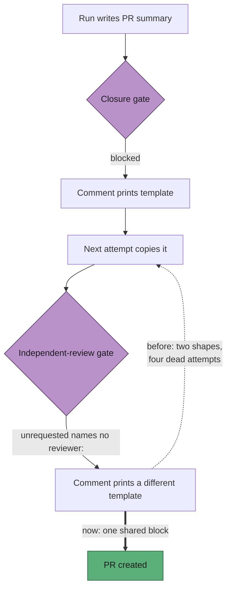

# One review-block template, printed by both PR-summary gates

## Summary

`phases/completion_phase.ts` runs the acceptance-criteria gate and then the
independent-review gate at the same PR-creation chokepoint. Each posts a
remediation comment printing the shape it wants, and a blocked run writes its
next summary from that comment — the most recent, most specific instruction it
has. The two comments printed different shapes:

- `buildClosureGateComment` showed
  `- **unrequested** — <change> — reason: <why>`, with no `reviewer:` field and
  no `## Standards Review` half at all.
- `validateIndependentReview` then rejected exactly that line — every Spec entry
  must name a `reviewer:` verdict — while `buildIndependentReviewComment` showed
  only `met` and `partial` examples, so it never demonstrated the shape it was
  rejecting.

A run blocked by the first gate therefore copied a template the second gate
refuses. Issue #728 died in phase `completion` four times over on that
contradiction — hosts `vibe-coder-83836`, `-32195`, `-9867`, `-11345`, around
fifty minutes of worker time, no PR raised — on work that had been complete and
correct since the first attempt.

Both comments now print one shared block,
`REVIEW_BLOCK_TEMPLATE` in `worker/deno/lib/review_block_template.ts`: both
headings, both provenance markers, and one example per status — `met`,
`partial`, `missing`, `unrequested`, `violation`, `clean` — in the shape
`prompts/issue/v39.md` already documented. The independent gate's comment also
keeps a closing line on the departure rule, which is prose, not shape.

Closes #751.

## Evidence

Backend change with no web surface to screenshot. The evidence is the round-trip
test.

The loop, and where it is cut:



Red before, green after — the new suite run against the unfixed
`acceptance_criteria_gate.ts`, then against the fix:

```
# unfixed
gate templates - the closure gate's template satisfies both gates (Issue #751) ... FAILED
gate templates - both gates print the one shared block (Issue #751) ... FAILED
FAILED | 3 passed | 2 failed

# fixed
ok | 5 passed | 0 failed
```

The independent gate's own template already passed both validators, which is
exactly the asymmetry the issue describes: the closure gate was the half
printing a shape the next gate refuses.

`deno fmt --check` (2002 files), `deno lint` and `deno check` over the touched
modules are clean, and the four related suites —
`acceptance_criteria_gate_test.ts`, `independent_review_gate_test.ts`,
`completion_phase_acceptance_closure_test.ts`,
`issue_prompt_v39_independent_review_test.ts` — pass unchanged at 51/51 with the
new suite.

## Reproduction

- **symptom** — a run blocked by the acceptance-criteria gate copies the shape
  that comment prints and is then blocked by the independent-review gate, which
  demands a `reviewer:` field the first template never showed
- **status** — `verified` — the round-trip test was watched failing against the
  unfixed `buildClosureGateComment` (2 of 5 tests red, output above) and passing
  after the change
- **regression test** —
  `worker/deno/tests/review_block_template_test.ts::gate templates - the closure gate's template satisfies both gates (Issue #751)`

## Acceptance Criteria

Judged in an operator review of the whole diff, not by the two reviewer
sub-agents: this change was made by hand while unwedging #728, and the
provenance markers are deliberately not claimed for a review that no independent
context produced.

- **met** — the remediation comment from either gate, copied verbatim,
  satisfies both gates — evidence:
  `worker/deno/tests/review_block_template_test.ts::gate templates - the closure gate's template satisfies both gates (Issue #751)`
  and `::gate templates - the independent-review gate's template satisfies both gates (Issue #751)`,
  each feeding the printed block back through `validateAcceptanceClosure` and
  `validateIndependentReview`
- **met** — a test asserts exactly that round trip — evidence: the two tests
  above call the real comment builders, extract the fenced block the comment
  prints, and assert both validators report no problems
- **met** — the `unrequested` and `violation` examples appear in both templates
  — evidence: `worker/deno/lib/review_block_template.ts:29-55`, printed by both
  builders through `reviewBlockTemplateLines()`; asserted by
  `::gate templates - the block shows the two entry shapes the gates reject on (Issue #751)`
  and `::gate templates - every status the gates parse is demonstrated (Issue #751)`
- **met** — tests and quality checks pass — evidence: 51/51 across the four
  related suites plus 5/5 new; `deno fmt --check`, `deno lint` and `deno check`
  clean. `./quality.sh` was not run in full — it is slow enough to be the CI
  job's work, and the PR's `validate` matrix runs it
- **unrequested** — the docs paragraph in
  `docs/workflows/issue-processing.md:669-680` — reason: the standards' "a code
  change owes a docs change" rule; that file documents both gates and their
  remediation comments, so a shared template that is not recorded there is a
  behaviour nobody reading the manual would expect

## Standards Review

- **clean** — Australian English throughout; the new module carries a file
  header explaining why it exists and JSDoc on every export; the template is
  defined once and imported by both gates, so DRY holds where the defect was
  duplication; TDD followed and demonstrated red before green; no existing test
  weakened or removed; the docs surface that describes the gates updated in the
  same change; no hidden paths staged
- **clean** — `prompts/issue/v39.md` is untouched: it already documented the
  correct shape, and the template was written to match it rather than the
  reverse
- **violation** — the new module is a third file where two would do — evidence:
  `worker/deno/lib/review_block_template.ts` — reason: stands, deliberately.
  `independent_review_gate.ts` already imports from
  `acceptance_criteria_gate.ts`, so the template could have lived in the latter,
  but a two-axis block including `## Standards Review` does not belong in the
  closure gate's module, and the standards favour many small focused files

## Test Plan

Added `worker/deno/tests/review_block_template_test.ts`:

- `gate templates - the closure gate's template satisfies both gates (Issue #751)`
  — builds a genuinely blocked `AcceptanceClosureResult`, extracts the fenced
  block from the comment, and asserts both validators report no problems.
- `gate templates - the independent-review gate's template satisfies both gates (Issue #751)`
  — the same round trip from the other gate's comment.
- `gate templates - both gates print the one shared block (Issue #751)` — the
  two comments print byte-identical blocks, and both equal
  `REVIEW_BLOCK_TEMPLATE`.
- `gate templates - the block shows the two entry shapes the gates reject on (Issue #751)`
  — `unrequested` with its `reviewer:` verdict and `violation` with labelled
  evidence, the two shapes #728 was blocked on.
- `gate templates - every status the gates parse is demonstrated (Issue #751)`
  — one example per status in both vocabularies.

No existing test was modified: the independent gate's comment already satisfied
both validators, and the closure gate's comment text is not asserted verbatim
anywhere.
