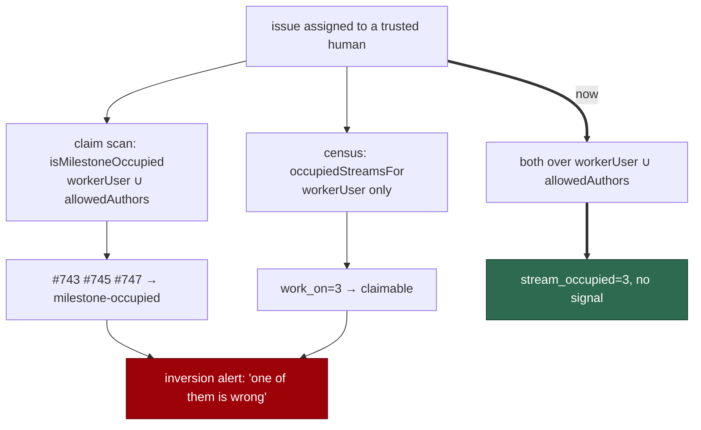

# The census counts stream occupancy over the accounts the scan honours

## Summary

The idle-decision census and the claim scan contradicted each other on
`stSoftwareAU/VibeCoder` for three consecutive cycles, and the worker filed
#753 about it. Both were right about their own rule; they were applying
different ones.

The scan refuses an issue whose work stream — its milestone, or `""` for the
default-branch stream — already hosts an open issue assigned to **any account
it honours**: `isMilestoneOccupied` over `workerUser ∪ allowedAuthors`. The
census modelled the same gate over **`workerUser` alone**. So when a human took
two unmilestoned issues, the default-branch stream was occupied for the scan
and free for the census: the scan refused every other unmilestoned `work-on`
issue with `milestone-occupied`, and the census reported `work_on=3
inversion_signal=true`, cycle after cycle, until the streak filer raised an
issue whose own test — "a reason that names a **permanent** condition on an
issue the census calls claimable is the bug" — `milestone-occupied` does not
meet.

`occupiedStreamsFor` now takes the scan's set, and
`buildIdleDecisionCensus` takes `allowedAuthors` from the caller's
configuration.

The narrow set had a stated reason: a sibling host's claim should not silence
this host's inversion signal. It does not survive the rule this instrument
applies. `milestone-occupied` is declared **`self`**-clearing in
`skip_reason_clearing.ts` — the stream frees when the work lands — and the
streak escalation exists for gates that *never* clear. Work in flight, whoever
holds it, is not a contradiction worth waking anyone for. An account the scan
does **not** honour still occupies nothing here, so the property that comment
was protecting survives wherever it is real.

Closes #753.

## Evidence

Backend change with no web surface to screenshot. The evidence is the filed
case, reproduced as a test.

Where the two instruments diverged:



The filed case is a test, with the old behaviour asserted beside the new in the
same case, so the regression is visible rather than described:

```
before (worker-only set):     work_on=3, stream_occupied=0, inversion_signal=true
after  (the scan's own set):  work_on=0, stream_occupied=3, inversion_signal=false
```

```
ok | 135 passed | 0 failed   # idle_decision_census, idle_inversion_streak,
                             # idle_detect_diagnostics
```

The pre-existing `census - a sibling worker's assignment does not occupy the
stream (Issue #3852)` passes unchanged: it names an account no configuration
honours, and such an account still occupies nothing.

`deno fmt --check` (2005 files), `deno lint` (1999 files), `deno check` over
the touched modules, markdownlint and the mermaid check are clean.

## Reproduction

- **symptom** — the census reports `work_on=N inversion_signal=true` for a repo
  whose issues the claim scan is refusing as `milestone-occupied`, and after
  three cycles files an idle-inversion issue about work that is simply in
  flight
- **status** — `verified` — the filed case is reproduced in
  `idle_decision_census_test.ts` from the issue's own numbers: the "before"
  half asserts `work_on=3, stream_occupied=0, inversion_signal=true` with the
  worker-only set (the alert as filed), and the "after" half asserts
  `work_on=0, stream_occupied=3, inversion_signal=false` once the census is
  given the scan's set
- **regression test** —
  `worker/deno/tests/idle_decision_census_test.ts::census - the reported inversion is not raised once the sets agree (Issue #753)`

## Acceptance Criteria

This issue was auto-filed and states no `## Acceptance Criteria` block; its
"What to check" list is answered here. Judged in an operator review of the whole
diff, not by reviewer sub-agents.

- **met** — *"Whether the census models every gate the claim scan applies. Each
  gate present in one and missing from the other manufactures this alert
  (Issue #460)."* — evidence: the gate was present in both but over different
  account sets, which manufactures the alert exactly as a missing gate does.
  `occupiedStreamsFor` now takes `workerUser ∪ allowedAuthors`, the set
  `isMilestoneOccupied` uses (`worker/deno/lib/issue_filter.ts:147-163`)
- **met** — *"A reason here that names a permanent condition on an issue the
  census calls claimable is the bug"* — evidence: the reasons were all
  `milestone-occupied`, declared `self`-clearing in
  `skip_reason_clearing.ts:82`. By the issue's own test this streak was not a
  defect in the scan; it was the census over-counting, which is what is fixed
- **met** — the three issues named (#743, #745, #747) are accounted for —
  evidence: #743 and #745 were merged and closed while this milestone's work
  ran (#755, #756); #747 remains open and unassigned, and is claimable again
  as soon as the stream frees
- **unrequested** — the `docs/IDLE-TASK-FRAMEWORK.md` paragraphs — reason: the
  standards' "a code change owes a docs change" rule; that document states the
  occupancy rule as "assigned to this worker", which is the sentence this
  change corrects

## Standards Review

- **clean** — Australian English throughout; the docblock records the filed
  case and why the previous narrowness was wrong, rather than only what
  changed; the account set is derived from the scan's rule rather than restated
  as a second list; the new parameter defaults to the old behaviour, so no
  caller is silently changed; no existing test weakened or removed — the
  sibling-assignment case still passes on its own terms
- **violation** — `repo_availability.ts`'s `checkRepoAvailability` still
  resolves occupancy against `workerUser` alone, so the census's
  `availability` verdict and its `stream_occupied` count now use different
  sets — evidence: `worker/deno/lib/idle_decision_census.ts:836` — reason:
  stands, deliberately scoped out. That function is the repo-availability
  instrument used elsewhere in the loop, and widening it changes claim
  behaviour rather than reporting; this issue is about the inversion signal,
  which is computed from the counts. Worth its own issue if the verdict is
  ever read as authoritative for occupancy
- **clean** — the fix is data-driven at the caller (`config.allowedAuthors`)
  rather than a new hardcoded list, so a deployment that adds a trusted author
  gets consistent behaviour from both instruments with no code change

## Test Plan

Added to `worker/deno/tests/idle_decision_census_test.ts`:

- `census - a trusted author's assignment occupies the stream, as the scan says it does (Issue #753)`
  — the held issue is not counted at all (the assignee gate already refuses
  it); its two siblings are attributed to occupancy.
- `census - the reported inversion is not raised once the sets agree (Issue #753)`
  — the filed case, asserting the old behaviour and the new one side by side.
- `census - an account the scan does not honour still does not occupy (Issue #753)`
  — the property the narrow set was protecting, kept.
- `census - the account set is matched case-insensitively, as the scan matches it (Issue #753)`

No existing test was modified.
