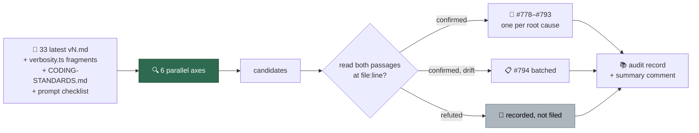

## Summary

Audited the latest version of every prompt surface for contradictions **between**
prompts, in the spirit of #759 (which recorded a contradiction *within* one
rendered prompt). Sixteen confirmed conflicts are filed one per root cause
(#778–#793), terminology and structural drift is batched into #794, and a summary
comment on the issue lists every surface compared including those with no
findings. Closes #762.

The only file this PR adds is the committed audit record — the deliverable of an
audit is the issues it files and the record of what was compared, not a prompt
edit. Committed `vN.md` files are immutable, so every prompt-side fix lands in a
new version under its own issue.

**What is in the diff**

- `docs/audits/prompt-audit-cross-prompt-contradictions-762.md` — the audit
  record: method, the 33 templates plus fragments and docs compared, the finding
  table with issue links, the candidates that failed verification and why, and
  what the audit did not cover.
- `_data/page_titles.yml` — the title/`page_icon` entry the new published page
  needs (`page_titles_completeness_test.ts` and
  `page_heading_emoji_matches_favicon_test.ts` both enforce it).

## Evidence

Backend/documentation change with no web interface to screenshot. The evidence is
the verification behind each finding and the two tests that gate the new page.

**Every finding was verified by reading both quoted passages at their cited lines
before it was filed.** Six axes were swept in parallel (lifecycle/labels, the
idle-task scan family, testing and thresholds, output shape and evidence,
security and dependency policy, terminology drift); the sweep produced candidates,
and verification decided them. Two candidates were refuted at that step and are
recorded in the audit page as "recorded, not filed" rather than filed — a false
finding costs more than a missed one.

Verification commands whose output is quoted in the filed issues:

```bash
# #792 — 11 latest templates declare the previous version in their H1
for d in prompts/*/; do
  l=$(ls "$d" | grep -E '^v[0-9]+\.md$' | sed 's/v//;s/.md//' | sort -n | tail -1)
  t=$(head -1 "$d/v$l.md"); tv=$(echo "$t" | grep -oE '\(v[0-9]+\)' | tr -d '()v')
  [ -n "$tv" ] && [ "$tv" != "$l" ] && echo "STALE $d v$l title says v$tv"
done

# #778 — resolveVerbosity has one non-test call site, always "issue"
grep -rn "resolveVerbosity(" worker/deno/ --include=*.ts | grep -v tests

# #780 — label_security carves needs-human out of the reserved set
grep -n "needs-human" worker/deno/lib/label_security.ts

# #791 — security_scan is the only filing scan with no gh label create
grep -c "gh label create" prompts/security_scan/v31.md prompts/doc_coverage/v7.md
```

Tests gating the new page:

```
$ cd worker/deno && deno test --allow-read \
    tests/page_titles_completeness_test.ts \
    tests/page_heading_emoji_matches_favicon_test.ts < /dev/null
ok | 8 passed | 0 failed (43ms)
```

### How the audit ran



### The headline result

Answering the issue's question as asked — *does coding best practices say one
thing and security best practices say another?* — **yes, three times**: #783
(`git commit --no-verify` categorically forbidden vs conditionally permitted),
#784 (the secret-staging allowlist has three different memberships across the
guidelines, the standards and the enforcer), and #785 (a 3-attempt cap that
licenses raising a PR past a failing semgrep stage).

Eight of the sixteen share one shape: a phase prompt and the
`<coding_guidelines>` block injected beneath it issue opposite mandates, and
nothing says which wins. `coding_guidelines/v42.md:5-8` states a precedence rule,
but it resolves *specificity*, not *opposition* — it does not reach a phase
prompt that forbids what the block mandates. The audit record names a
rendered-prompt consistency check as the fix for that class, because sixteen
wording changes will not stop the seventeenth.

#778 is the sharpest single result: #759's defect survives verbatim in
`ci_fix/v14`, `pr_feedback/v13` and `planning/v23`, and the audit also found that
`resolveVerbosity()` is only ever called with `"issue"`, so `PHASE_VERBOSITY_DEFAULTS`
is unreachable for every other phase and all of them render the `standard` text
regardless of what the config declares.

## Test Plan

No new tests: the diff adds a documentation page and its metadata entry, and both
are already covered by existing tests that fail closed on a missing or mismatched
entry.

- `worker/deno/tests/page_titles_completeness_test.ts` — fails if the new page
  has no `_data/page_titles.yml` entry with a `page_icon`. Run, passes.
- `worker/deno/tests/page_heading_emoji_matches_favicon_test.ts` — fails if the
  page's H1 emoji does not match its `page_icon`. Run, passes.
- `./quality.sh < /dev/null` — run in the foreground before the PR.

Tests the audit *recommends* (in #792 and #794) are deliberately not in this
diff: they belong with the fixes they gate, in the issues that own them.
