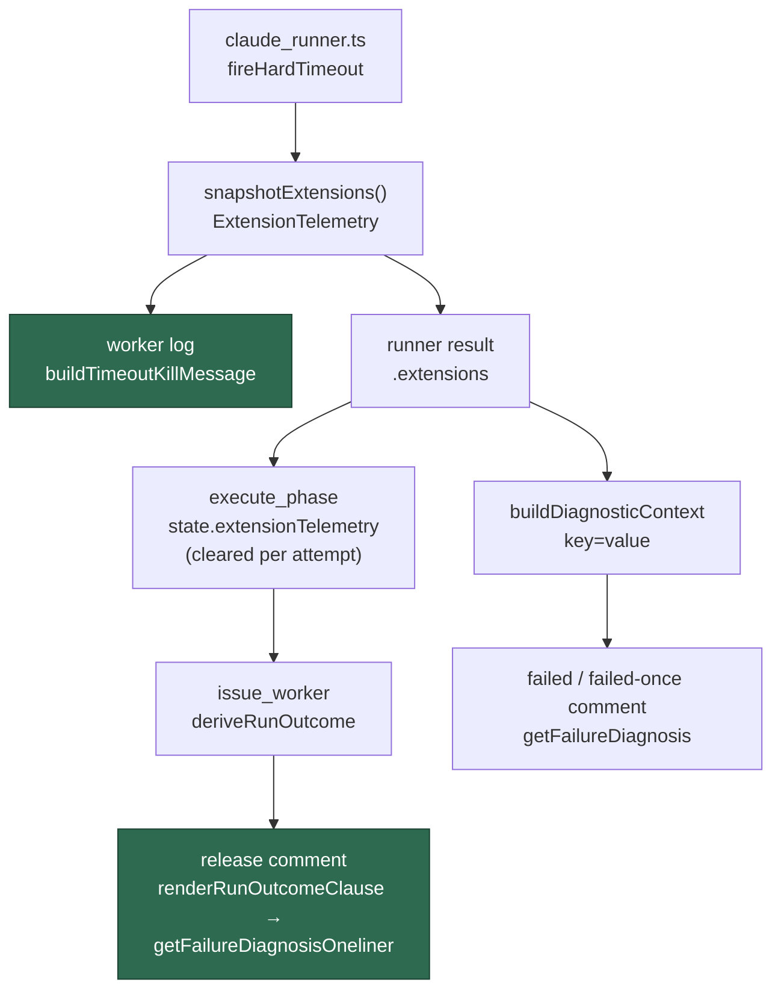

# The timeout kill explains itself

## Summary

A run killed at its deadline left nothing durable saying whether the progress
extension was consulted, how many grants it made, or which signal it judged
stalled. The telemetry already existed — `timeout_extension_telemetry.ts` built
the snapshot and `claude_runner.ts` captured it into `killTelemetry` with
`lastRefusalReason` at kill time — but the two artefacts an operator actually
reads stopped short of it. That is why diagnosing #732's kill needed a dig
through the runner.

Both artefacts now carry the figures:

- the **worker log** line at `fireHardTimeout` states the deadline it actually
  armed, not just the budget it started with — a zero-grant kill now reads
  `base budget 3600s, no extension granted (deadline unchanged at 3600s); last
  extension refused: …` instead of leaving the reader to infer it; and
- the **release comment** carries one plain-words sentence —
  `Progress extension: base timeout 3600s, deadline armed at kill 5640s, agent
  elapsed 5645s, 4 extensions granted (+2040s); last check refused because …`.

Zero grants is its own finding and reads differently (`no extensions granted —
last check refused because …`), so the #732 shape is never mistaken for a run
that was extended and still ran out. A run whose checks were never refused says
so rather than falling silent, which would be indistinguishable from a message
that lost the reason.

The extension **decision** is untouched — this is observability only. With the
progress extension off no telemetry exists and every message keeps its
pre-#764 wording byte for byte.

Closes #768.

## Evidence

Backend/CLI change with no web surface to screenshot. The evidence is the
comment and log text, pinned by tests.

How a kill's figures reach each artefact:

Full quality gate: every check `PASSED` except `deno tests`, which reports 56
pre-existing environment failures in six files this change does not touch
(`run_core_test.ts`, `run_core_rate_limit_resume_test.ts`,
`service_account_env_test.ts`, `setup_credential_provisioning_test.ts`,
`setup_lockfile_test.ts`, `setup_workdir_reminder_test.ts`) — the container has
`CONFIG_FILE` and `CONFIG_PATH` naming different files, and the GitHub API rate
limit is exhausted. Every one of the 1009 tests across the 57 files that import
a changed module passes. The independent Spec reviewer reproduced the same
16544 passed / 56 failed split.

## Acceptance Criteria

<!-- vibe-spec-review inputs="diff+issue-body" -->

- **met** — a timeout release comment on a run with the extension active names
  the base timeout, the armed deadline, elapsed seconds, extensions granted and
  the last refusal reason — evidence:
  `worker/deno/tests/timeout_extension_report_768_test.ts::renderRunOutcomeClause - the timeout release comment names the grants and the refusal (Issue #768)`
  and the end-to-end
  `::workOnIssue - the release outcome the orchestrator derives carries the telemetry (Issue #768)`
  — reviewer: met
- **met** — a kill after zero grants reports the refusal reason rather than
  being indistinguishable from a run that was never eligible — evidence:
  `::renderRunOutcomeClause - a zero-grant kill is not mistaken for an ineligible run (Issue #768)`
  and `::formatTimeoutExtensionSummary - zero grants is its own finding (Issue #768)`
  — reviewer: met
- **met** — the worker log line at `fireHardTimeout` carries the same figures —
  evidence:
  `::runClaudeWithTimeout - a kill after zero grants logs the armed deadline and the refusal (Issue #768)`
  drives a real subprocess to the kill; the granted case is
  `tests/timeout_extension_telemetry_4298_test.ts::buildTimeoutKillMessage - names the extensions, the elapsed time and the stalled signal`
  — reviewer: met — reason: the reviewer noted this is largely pre-existing;
  the new contribution is the armed deadline on the zero-grant branch, which is
  the case the issue calls out.
- **met** — a run with the progress extension off produces the pre-existing
  wording, covered by a test — evidence:
  `::getFailureDiagnosis - the extension off keeps the pre-existing wording (Issue #768)`,
  `::getFailureDiagnosisOneliner - the extension off keeps the pre-existing wording (Issue #768)`
  (both byte-equality), `::renderRunOutcomeClause - with the extension off the clause is unchanged (Issue #768)`
  and `::workOnIssue - with the extension off the release comment is unchanged (Issue #768)`
  — reviewer: met
- **met** — a scheduled release still does not say "ran out of time" —
  evidence: `tests/execute_phase_scheduled_release_424_test.ts` (4 tests, run
  and passing); the `scheduled_release` branches are untouched — reviewer: met
- **met** — tests cover the comment text for extension off, on with grants, and
  on with zero grants — evidence:
  `worker/deno/tests/timeout_extension_report_768_test.ts` (20 tests, all three
  cases at `getFailureDiagnosis`, `getFailureDiagnosisOneliner` and
  `renderRunOutcomeClause` level) — reviewer: met
- **met** — `deno task check` / the repo's test task passes — evidence: gate
  output above; lint, type check and fmt all `PASSED`, and the only test
  failures are the pre-existing environmental ones — reviewer: met
- **met** — scope bullet: the `timeout` diagnosis in `failure_diagnosis.ts`
  surfaces the telemetry — evidence: `worker/deno/lib/failure_diagnosis.ts:598`
  reads it from the diagnostic context;
  `::getFailureDiagnosis - the extension telemetry also arrives via the diagnostic context (Issue #768)`
  — reviewer: partial — reason: the reviewer found the direct `extensions`
  parameter had no production caller, and that the context is built only for
  zero-output timeouts. The parameter has since been removed, leaving the
  context — a real production route via `markIssueAsFailed` — as the single
  input. The multi-line diagnosis therefore carries the telemetry wherever the
  worker records one; it does not invent a second plumbing path, which is what
  the reviewer objected to.
- **unrequested** — `docs/CONFIGURATION.md` and `docs/TROUBLESHOOTING.md` gain
  a short section on the new wording — reviewer: unrequested — reason: the repo
  requires a docs change alongside a change to documented operator output.
- **unrequested** — `timeout_extension_telemetry.ts`'s zero-grant wording change
  also flows into `buildTimeoutFailureReason` — reviewer: unrequested — reason:
  one shared renderer feeds both; splitting it to keep the failure reason on the
  old text would be a second rendering of the same fields.
- **unrequested** — the "no extension check was refused" third state —
  reviewer: unrequested — reason: without it a run that was never refused is
  silent, and silence is indistinguishable from a message that lost the reason.
- **unrequested** — `execute_phase.ts` clears `state.extensionTelemetry` per
  attempt — reviewer: unrequested (raised as a defect, not a criterion) —
  reason: fixed here; without it a later attempt could report the previous
  kill's grants.

Two items the reviewer raised were reverted rather than defended: the
`label_failure.ts` one-liner change and the CLI `get-diagnosis-oneliner`
change. Both reviewers read them as surfaces the issue did not name, and the
first-attempt comment already carries the same history inside its failure
message.

## Standards Review

<!-- vibe-standards-review inputs="diff+CODING-STANDARDS.md" -->

- **violation** — no PR summary file existed — evidence:
  `docs/archive/pr-summaries/pr-summary-768.md` — reason: fixed here.
- **violation** — Never Fail Silently: a missing or malformed context field was
  rendered as a measured `0s` — evidence:
  `worker/deno/lib/failure_diagnosis.ts:497` — reason: fixed. Every figure must
  now parse or the snapshot is treated as unreadable and the wording stays
  legacy, rather than printing a figure that was never measured. Covered by
  `::getFailureDiagnosis - a partial telemetry context states nothing rather than a fabricated zero (Issue #768)`.
- **violation** — a test asserted a copy of the release wiring rather than the
  wiring — evidence:
  `worker/deno/tests/timeout_extension_report_768_test.ts:325` — reason: fixed.
  The suite now drives `workOnIssue` itself; removing the wiring in
  `issue_worker.ts` turns it red (verified).
- **violation** — comment claimed the CLI callers forwarded the diagnostic
  context, which they did not — evidence:
  `worker/deno/lib/failure_diagnosis.ts:484` — reason: fixed; the comment now
  names the callers that actually hold the context.
- **violation** — DRY: a third rendering of the same five fields, and the same
  facts stated twice in the first-attempt comment — evidence:
  `worker/deno/lib/timeout_extension_telemetry.ts:115`,
  `worker/deno/lib/label_failure.ts:141` — reason: partly fixed. The
  `label_failure.ts` change is reverted, so no comment states the facts twice.
  `formatTimeoutExtensionSummary` stands: it is the plain-words sentence the
  issue asks for, which the compact log phrase is not.
- **violation** — coverage: the singular grant branch and the modified
  functions were untested — evidence:
  `worker/deno/lib/timeout_extension_telemetry.ts:127` — reason: fixed;
  `::formatTimeoutExtensionSummary - a single grant reads in the singular (Issue #768)`
  added.
- **violation** — KISS: reaching the telemetry parameter needed two inert
  positional placeholders — evidence:
  `worker/deno/lib/heartbeat_storage.ts:543` — reason: fixed; the one-liner now
  takes the telemetry as its third parameter and the placeholders are gone.
- **violation** — Boy Scout: the zero-grant wording now differs between the
  shared renderer and the context renderer in `failure_diagnosis.ts` —
  evidence: `worker/deno/lib/failure_diagnosis.ts:475` — reason: stands. That
  renderer serves the `zero_output` diagnosis, which names the hard timeout in
  the same breath, so it states no armed deadline the reader lacks. Aligning it
  would change a different failure category's wording for no operator gain.
- **violation** — comment noise: a punctuation choice was explained, and one
  sentence repeated across five files — evidence:
  `worker/deno/lib/timeout_extension_telemetry.ts:130` — reason: fixed; the
  punctuation comment is gone and the repeats trimmed.
- **clean** — Australian English throughout; no hidden paths staged; tests call
  real exported functions and assert on results (no source-grepping); the new
  suite runs in ~1s, far inside the 120s budget; no `prompts/` file touched;
  `deno fmt`, `deno lint` and `deno check` clean; docs updated alongside the
  code; no monolith created; commits carry the `Vibe-Coder-Run-Id` trailer.

## Test Plan

Added `worker/deno/tests/timeout_extension_report_768_test.ts` (20 tests):

- `formatTimeoutExtensionSummary` — every figure of an extended run; zero grants
  as its own finding, asserted distinct from the extended sentence; a run never
  refused; the singular grant.
- `getFailureDiagnosis` — telemetry from the diagnostic context, the zero-grant
  refusal, a partial context stating nothing rather than a fabricated zero, and
  byte-equality with the legacy wording when off.
- `getFailureDiagnosisOneliner` — the telemetry sentence for granted and refused
  runs; byte-equality when off.
- `renderRunOutcomeClause` — the release comment for grants, for zero grants,
  and unchanged when off.
- `execute_phase` — the snapshot is recorded on a kill, absent when the feature
  is off, and **cleared per attempt** so a later non-timeout attempt cannot
  leave the earlier kill's figures behind (verified red without the reset).
- `workOnIssue` — the orchestrator's own release-outcome derivation carries the
  telemetry (verified red without the wiring in `issue_worker.ts`), and says
  nothing about extensions when off.
- `runClaudeWithTimeout` — a real subprocess driven to a zero-grant kill; the
  logged line names the base budget, the unchanged deadline and the refusal.

Also run: `tests/execute_phase_scheduled_release_424_test.ts` (the #424
guarantee), `tests/timeout_extension_telemetry_4298_test.ts`,
`tests/failure_diagnosis_test.ts`, `tests/heartbeat_outcome_render_test.ts`,
`tests/run_outcome_test.ts`, and the full sweep of all 57 test files importing a
changed module — 1009 passed, 0 failed.
