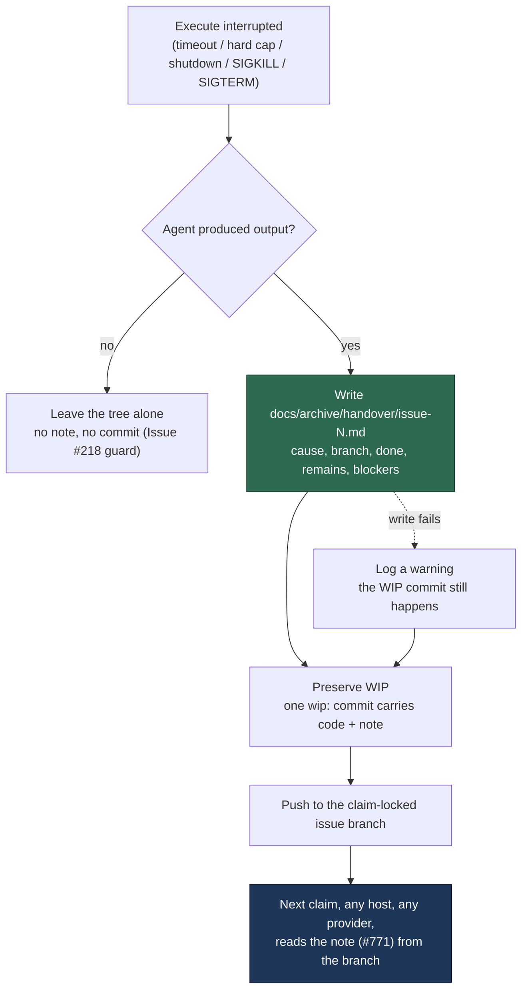

# Commit a portable handover note when a run is interrupted

## Summary

An interrupted run preserved its **code** — WIP checkpoints and the one-shot
`wip:` commit go to the claim-locked issue branch — but not its **intent**. What
was done, what was left and what comes next lived only in the dead session's own
transcript: host-local, provider-specific, and unreadable by a worker on another
machine.

The worker now writes the handover note into the clone **before** the preserving
commit runs, so the same `commitAndPushPending` carries it to the branch on every
preservation path. The note is built from what the worker already knows —
interruption cause, elapsed time, the commits this run added, the
uncommitted-file list, and whether a wind-down notice was delivered — so it costs
no agent call and works on the timeout path, where no agent is alive to help.
Each interruption rewrites the note and keeps a bounded "previous attempts" tail.
A failed write is logged and non-fatal: losing the note never costs the code.

Closes #769.

### The path is the one #770 and #771 already agreed

Issues #770 (advertises the file in the release comment) and #771 (reads it into
the resuming prompt) merged into the milestone branch first, and both consume
`handoverFilePath()` from `preserved_wip_branch.ts` —
`docs/archive/handover/issue-<N>.md`. This writer uses that same constant, so the
advertisement, the reader and the writer cannot drift apart.

Not the `.vibe/handover/…` the issue sketched: `gitignore_enforcer.ts` ignores
every hidden path in a monitored repo and `pre_commit_safety.ts` refuses to
commit one, so `git add -A` would have dropped the note in silence — preserved
nowhere, reported as written. `docs/archive/` is excluded from the Jekyll build
(`_config.yml`), the markdownlint globs and the page-title manifest, so free
agent prose on a WIP branch cannot trip a docs gate and strand the branch the
note exists to rescue.

## Evidence

Backend/CLI change with no web interface to screenshot. The evidence is the test
suite: 10 execute-phase tests drive the live phase against a real temporary clone
and assert the note's content **at the moment `commitAndPushPending` is called** —
i.e. what `git add -A` would stage — plus 22 unit tests over the note itself.



Test run at HEAD:

```text
deno test tests/handover_note_test.ts tests/execute_phase_handover_test.ts
ok | 32 passed | 0 failed
```

## Acceptance Criteria

<!-- vibe-spec-review inputs="diff+issue-body" -->

- **met** — After a timeout kill, the pushed issue branch contains the handover
  file at the defined path, committed. — evidence:
  `worker/deno/lib/phases/run_wip_preservation.ts` (the note is written before
  `preserveTimedOutWip`),
  `worker/deno/tests/execute_phase_handover_test.ts::execute_phase #769 - a hard timeout commits the handover note`;
  committability pinned by
  `handover_note_test.ts::handover note #769 - a fixed, discoverable, committable path`
  — reviewer: met
- **met** — The same is true after a scheduled release and after a hard-cap
  wind-down. — evidence:
  `execute_phase_handover_test.ts::… a scheduled release commits the handover note`
  and `… a hard-cap wind-down commits the handover note`, each driven
  independently through `workOnIssueExecuteClaude`; SIGKILL and external SIGTERM
  are covered too — reviewer: met
- **met** — The file names the interruption cause, the branch, what was done, and
  what remains. — evidence: `worker/deno/lib/handover_note.ts`
  (`buildHandoverNote`),
  `handover_note_test.ts::… names the cause, branch, what was done and what remains`
  — reviewer: met
- **met** — The file contains no host-local paths, no session ids, and no
  provider-specific identifiers — asserted by a test. — evidence:
  `handover_note_test.ts::… carries no host paths, session ids or provider identifiers`,
  `… a host path inside a commit subject is stripped`,
  `… a session id inside a commit subject is stripped`,
  `execute_phase_handover_test.ts::… the committed note is portable across hosts and providers`
  — reviewer: met — reason: the reviewer flagged a residual gap (agent-authored
  commit subjects could carry a session id); `stripNonPortable` now redacts
  UUID- and long-hex-shaped tokens as well as absolute paths, with a test.
- **met** — A second interruption rewrites the file and records that a prior
  attempt existed. — evidence:
  `handover_note_test.ts::… a second interruption rewrites the note and records the prior attempt`,
  `… the prior-attempts tail is bounded` — reviewer: met
- **met** — A write or commit failure is logged and the run continues; the WIP
  commit still happens. — evidence:
  `execute_phase_handover_test.ts::… a failed handover write is logged and the work is still preserved`
  (asserts the `wip: execute timed out` commit still occurred) — reviewer: met
- **met** — Tests cover: file produced on each of the three preservation paths,
  portability assertion, and the non-fatal failure path. — evidence:
  `worker/deno/tests/execute_phase_handover_test.ts` (10 tests) — reviewer: met
- **met** — `deno task check` / the repo's test task passes. — evidence:
  `./quality.sh` — type check, lint, fmt, markdownlint, mermaid, semgrep and the
  preservation/handover suites all pass. The residual `deno tests` failures are
  pre-existing environmental ones confined to host-setup, credential and
  container-prerequisite suites (`setup_provider_credential_flow_test.ts`,
  `setup_credential_provisioning_test.ts`, `setup_lockfile_test.ts`,
  `setup_prerequisites_test.ts`, `setup_workdir_reminder_test.ts`); none touches
  preservation or the handover — reviewer: met
- **unrequested** — A commit is now created on a *clean* working tree when
  checkpoint commits exist (`wip: handover note for the interrupted run on issue
  #N`). — reviewer: unrequested — reason: required by the criteria. The
  phase-end checkpoint usually leaves the tree clean, so without this the note
  would never be committed on the very path the issue names. The commit keeps the
  `wip:` prefix, so the #148 WIP-only gate still refuses to build a PR from it.
- **unrequested** — Release-comment wording: the clean-tree "pushed" branch now
  reports the checkpoint sentence rather than "committed and pushed". —
  reviewer: unrequested — reason: with a note-only commit, "the working tree was
  rescued" would be false; `describeCheckpointCommits` is shared so the two
  wordings cannot drift.
- **unrequested** — Handover wired on the SIGKILL and external-SIGTERM paths too.
  — reviewer: unrequested — reason: the scope says "every preservation path";
  both are covered by tests.
- **unrequested** — `redactSecrets` over the note, Liquid-tag defusing of
  interpolated values, `describeWipCause` exported, `countDirtyFiles` replaced by
  `listDirtyFiles` with C-quoting/rename decoding. — reviewer: unrequested —
  reason: the file list and cause prose are direct inputs to the note; the
  redaction and Liquid defusing are hardening on a new file that is committed and
  pushed.

## Standards Review

<!-- vibe-standards-review inputs="diff+CODING-STANDARDS.md" -->

- **violation** — the new committed-and-pushed sink was wired through
  `redactSecrets()` in code but never registered in the sink register — evidence:
  `SECURITY.md:410` — reason: fixed here; the note is added to the sink list, the
  sink categories and the Mermaid diagram.
- **violation** — a failed `git status` / `git log` was swallowed and then
  written into a permanent record as the affirmative facts "the working tree was
  clean" and "no commit was recorded" — evidence:
  `worker/deno/lib/phases/run_wip_preservation.ts` (`listDirtyFiles`,
  `wipCommitSubjects`) — reason: fixed here; both now return `null`, log a
  warning, and the note reports the state as unknown
  (`handover_note_test.ts::… an unreadable git state is reported as unknown, never as clean`).
- **violation** — the porcelain C-quoting decoder and rename handling had no test
  at any level — evidence: `run_wip_preservation.ts` (`decodePorcelainPath`) —
  reason: fixed here through the public seam
  (`execute_phase_handover_test.ts::… git's porcelain quoting and renames read as real paths`),
  which also exposed that `JSON.parse` cannot decode git's octal byte escapes;
  the decoder now decodes bytes and then UTF-8.
- **violation** — vestigial `.github` directory setup left over from an
  abandoned path — evidence: `worker/deno/tests/handover_note_test.ts:265` —
  reason: fixed here; removed.
- **violation** — the PR summary described the abandoned `.github/handover/`
  path and a `handoverPath` field the final diff does not carry — evidence:
  `docs/archive/pr-summaries/pr-summary-769.md` — reason: fixed here; this file
  is rewritten against the shipped code.
- **clean** — Australian English throughout; no hidden path staged; tests call
  real production functions against real temporary directories (no
  source-grepping, no timing assertions); new logic in Deno TypeScript under
  `worker/deno/lib/`; `deno fmt`, `deno lint` and `deno check` pass; fail-loud
  handling in `pathExists` / `readExistingNote`; `prompts/` untouched; commits
  carry the issue reference and the run-id trailer.

### Two defects the spec reviewer found, fixed here

- **Zero-output timeout guard was defeated.** `inspectWorkingTree: false` means
  the tree is not this run's work and must be left alone. Writing a note there
  forced a commit whose `git add -A` swept in exactly those files.
  `writeHandoverForRun` now returns early on that path, restoring the pre-change
  behaviour (no note, no commit), asserted by
  `execute_phase_handover_test.ts::… a zero-output timeout leaves the tree alone and writes no note`.
- **The structure marker was mangled by its only consumer.** `HANDOVER_MARKER`
  was an HTML comment, and #771 splices the note through
  `fenceUntrustedIssueText` → `neutraliseHtmlComments`, which rewrites `<!--`. It
  is now a visible code span, asserted through the real fencing function in
  `handover_note_test.ts::… the structure marker survives the untrusted fencing #771 applies`.

## Test Plan

- `worker/deno/tests/handover_note_test.ts` (22 tests) — the path is the shared
  `handoverFilePath()` and is committable (asserted through the real
  `classifyStagedPath`); the note names cause/branch/what-was-done/what-remains;
  a scheduled release is never called a timeout; portability of the whole note,
  of the dirty-file list, and of agent-authored commit subjects (host paths and
  session ids); the structure marker, including survival of #771's fencing; an
  unreadable git state reported as unknown rather than clean; the attempt line
  counting only listed files; truncation; Liquid defusing; attempt-line
  extraction; write, rewrite-with-tail, bounded tail, non-fatal write failure,
  "not a clone" skip, and wind-down detection.
- `worker/deno/tests/execute_phase_handover_test.ts` (10 tests) — the live
  execute phase, driven independently for hard timeout, scheduled release
  (worker shutdown), hard-cap wind-down, SIGKILL and external SIGTERM; porcelain
  quoting and renames; the zero-output guard; the committed note's portability;
  the non-fatal failure path (the `wip:` commit still happens); and a clean tree
  with checkpoint commits still committing the note.
- Existing preservation suites re-run unchanged: `wip_checkpoint_test.ts`,
  `preserved_wip_branch_test.ts`, `preserved_branch_release_comment_test.ts`,
  `execute_phase_killed_test.ts`, `completion_wip_only_gate_test.ts`,
  `wip_resume_handoff_test.ts`, `handover_prompt_note_771_test.ts`,
  `resume_handover_phase_771_test.ts`, `page_titles_completeness_test.ts`.
