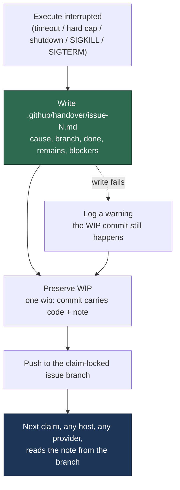

# Commit a portable handover note when a run is interrupted

## Summary

An interrupted run preserved its **code** — WIP checkpoints and the one-shot
`wip:` commit go to the claim-locked issue branch — but not its **intent**. What
was done, what was left and what comes next lived only in the dead session's own
transcript: host-local, provider-specific, and unreadable by a worker on another
machine.

The worker now writes `.github/handover/issue-<N>.md` into the clone **before**
the preserving commit runs, so the same `commitAndPushPending` carries it to the
branch on every preservation path. The note is built from what the worker
already knows — interruption cause, elapsed time, the commits this run added,
the uncommitted-file list, and whether a wind-down notice was delivered — so it
costs no agent call and works on the timeout path, where no agent is alive to
help. Each interruption rewrites the note and keeps a bounded "previous
attempts" tail. A failed write is logged and non-fatal: losing the note never
costs the code.

Closes #769.

### Why `.github/handover/`, not `.vibe/handover/`

The issue suggested `.vibe/handover/issue-<N>.md`. That path could never have
been committed: `gitignore_enforcer.ts` ignores every hidden path in a monitored
repo (`.*`) and `pre_commit_safety.ts` refuses to commit one, so `git add -A`
would have dropped the note in silence — preserved nowhere, reported as written.
`.github/` is the one hidden directory both layers already re-allow (that is how
`.github/workflows/*.yml` is committed today), and it sits outside every docs
gate — the first path tried, `docs/handover/`, broke this repo's own
`page_titles_completeness_test`, which would have failed the resuming claim's
quality gate: the note poisoning the branch it exists to rescue.

## Evidence

Backend/CLI change with no web interface to screenshot. Evidence is the test
suite: 8 execute-phase tests drive the live phase against a real temporary clone
and assert the note's content **at the moment `commitAndPushPending` is called**
— i.e. what `git add -A` would stage — plus 18 unit tests over the note itself.



Test run at HEAD:

```text
deno test tests/handover_note_test.ts tests/execute_phase_handover_test.ts
ok | 26 passed | 0 failed
```

## Acceptance Criteria

<!-- vibe-spec-review inputs="diff+issue-body" -->

- **met** — After a timeout kill, the pushed issue branch contains the handover
  file at the defined path, committed. — evidence:
  `worker/deno/tests/execute_phase_handover_test.ts::execute_phase #769 - a hard timeout commits the handover note`,
  `worker/deno/lib/phases/run_wip_preservation.ts` (note written before
  `preserveTimedOutWip`) — reviewer: met
- **met** — The same is true after a scheduled release and after a hard-cap
  wind-down. — evidence:
  `worker/deno/tests/execute_phase_handover_test.ts::… a scheduled release commits the handover note`
  and `… a hard-cap wind-down commits the handover note`, each driven
  independently through `workOnIssueExecuteClaude` — reviewer: met
- **partial** — The file names the interruption cause, the branch, what was
  done, and what remains. — evidence: `worker/deno/lib/handover_note.ts`
  (`buildHandoverNote`), `handover_note_test.ts::… names the cause, branch, what was done and what remains`
  — reviewer: partial — reason: the reviewer judged "What remains" and "Known
  blockers" generic boilerplate; "What remains" now names this run's branch,
  commit count and file count, but the worker genuinely has no more knowledge
  once the agent is dead — an agent-authored summary is explicitly a separate
  issue in the scope.
- **met** — The file contains no host-local paths, no session ids, and no
  provider-specific identifiers — asserted by a test. — evidence:
  `handover_note_test.ts::… carries no host paths, session ids or provider identifiers`,
  `… a host path inside a commit subject is stripped`,
  `execute_phase_handover_test.ts::… the committed note is portable across hosts and providers`
  — reviewer: partial — reason: departed. The reviewer's `partial` was correct
  against the reviewed commit — agent-authored commit subjects bypassed the
  filter — and that hole is closed in this diff by `stripHostPaths`, with the
  commit-subject case now asserted.
- **met** — A second interruption rewrites the file and records that a prior
  attempt existed. — evidence:
  `handover_note_test.ts::… a second interruption rewrites the note and records the prior attempt`,
  `… the prior-attempts tail is bounded` — reviewer: met
- **met** — A write or commit failure is logged and the run continues; the WIP
  commit still happens. — evidence:
  `execute_phase_handover_test.ts::… a failed handover write is logged and the work is still preserved`
  (asserts the `wip: execute timed out` commit still occurred) — reviewer: met
- **met** — Tests cover: file produced on each of the three preservation paths,
  portability assertion, and the non-fatal failure path. — evidence:
  `worker/deno/tests/execute_phase_handover_test.ts` (8 tests, now including the
  SIGKILL and external-SIGTERM paths the reviewer found untested) — reviewer:
  met
- **met** — `deno task check` / the repo's test task passes. — evidence:
  `./quality.sh` — type check, lint, fmt, markdownlint, mermaid, semgrep and the
  preservation/handover suites pass; the residual `deno tests` failures are
  pre-existing environmental ones — every one is in a host-setup, credential,
  container-prerequisite or work-dir suite (`applyServiceAccountEnv`,
  `provision_vibe_credentials`, `interactive_credentials_flow`,
  `checkContainerPrerequisites`, `run_setup_cli`, `setup.sh`,
  `remind_obsolete_host_work_dirs`), none touches preservation, and
  `applyServiceAccountEnv` was verified failing identically on the base branch
  in a clean worktree — reviewer:
  met
- **unrequested** — A commit is now created on a *clean* working tree when
  checkpoint commits exist (`wip: handover note for the interrupted run on issue
  #N`). — reviewer: unrequested — reason: required by the criteria. The
  phase-end checkpoint usually leaves the tree clean, so without this the note
  would never be committed on the very path the issue names. The commit keeps
  the `wip:` prefix, so the #148 WIP-only gate still refuses to build a PR from
  it.
- **unrequested** — Release-comment wording gains ` with a handover note at
  '<path>'`, and `handoverPath` is added to `PreservedRunWip`. — reviewer:
  unrequested — reason: the path has to be observable for #770 (release comment)
  and #771 (resume prompt); this is the seam they agreed to consume.
- **unrequested** — Handover wired on the SIGKILL and external-SIGTERM paths
  too. — reviewer: unrequested — reason: the scope says "every preservation
  path"; both are covered by tests.
- **unrequested** — `redactSecrets` over the note, Liquid-tag defusing of
  interpolated values, `describeWipCause` exported, `countDirtyFiles` replaced
  by `listDirtyFiles` with porcelain path decoding. — reviewer: unrequested —
  reason: the file list and cause prose are direct inputs to the note; the
  redaction and Liquid defusing are hardening added after standards review of a
  new file that is committed and pushed.

## Standards Review

<!-- vibe-standards-review inputs="diff+CODING-STANDARDS.md" -->

- **violation** — new committed/pushed sink not routed through
  `redactSecrets()` — evidence: `worker/deno/lib/handover_note.ts` (note body) —
  reason: fixed here; `buildHandoverNote` returns `redactSecrets(...)`.
- **violation** — swallowed errors: an unreadable prior note and a failed
  `Deno.stat` were both reported as benign absence — evidence:
  `worker/deno/lib/handover_note.ts` (`readExistingNote`, `pathExists`) —
  reason: fixed here; a non-`NotFound` read fault is logged as a fault, and a
  non-`NotFound` stat fault is raised into the outcome instead of reading as
  "not a git clone".
- **violation** — `?? 0` issue-number fallback would have written `issue #0`
  rather than failing — evidence:
  `worker/deno/lib/phases/run_wip_preservation.ts` (handover-only commit
  subject) — reason: fixed here; the subject is only built when the handover
  facts exist.
- **violation** — the "N checkpoint commit(s) pushed to '<branch>'" sentence was
  built twice with different issue citations — evidence:
  `worker/deno/lib/phases/run_wip_preservation.ts` — reason: fixed here; both
  call `describeCheckpointCommits`.
- **violation** — generated notes dropped into a linted, published `docs/` tree
  — evidence: `worker/deno/lib/handover_note.ts` (`HANDOVER_DIR`) — reason:
  fixed here by moving to `.github/handover/`, which no docs gate scans; the
  markdownlint/Jekyll exclusions the old path forced are reverted.
- **violation** — git's porcelain path quoting left C-escapes in the note —
  evidence: `worker/deno/lib/phases/run_wip_preservation.ts`
  (`decodePorcelainPath`) — reason: fixed here.
- **violation** — untested edge cases (truncation, non-portable paths, the
  structure marker, `describeWipCause`) and a hardcoded `.vibe-run-budget.md`
  in the test — evidence: `worker/deno/tests/handover_note_test.ts` — reason:
  fixed here; each has a test and the filename is imported from
  `wind_down_notice.ts`.
- **clean** — Australian English throughout; no hidden path staged beyond the
  allowlisted `.github/`; tests call real production functions against real
  temporary directories (no source-grepping); new logic in Deno TypeScript under
  `worker/deno/lib/`; module/test naming convention honoured; the non-fatal
  failure path is handled and logged, not swallowed; `prompts/` untouched;
  commits carry the issue reference and the run-id trailer.

## Test Plan

- `worker/deno/tests/handover_note_test.ts` (18 tests) — path is committable and
  outside `docs/` (asserted through the real `classifyStagedPath`); the note
  names cause/branch/what-was-done/what-remains; a scheduled release is never
  called a timeout; portability of the whole note, of the dirty-file list, and of
  agent-authored commit subjects; the structure marker; truncation of a long
  file list; Liquid defusing; attempt-line extraction; write, rewrite-with-tail,
  bounded tail, non-fatal write failure, "not a clone" skip, and wind-down
  detection.
- `worker/deno/tests/execute_phase_handover_test.ts` (8 tests) — the live
  execute phase, driven independently for hard timeout, scheduled release
  (worker shutdown), hard-cap wind-down, SIGKILL and external SIGTERM; the
  committed note's portability; the non-fatal failure path (the `wip:` commit
  still happens); and a clean tree with checkpoint commits still committing the
  note.
- Existing preservation suites re-run unchanged: `wip_checkpoint_test.ts`,
  `execute_phase_killed_test.ts`, `execute_phase_superseded_wip_test.ts`,
  `completion_phase_superseded_wip_test.ts`, `completion_wip_only_gate_test.ts`,
  `run_outcome_classifier_test.ts`, `wip_resume_handoff_test.ts`,
  `page_titles_completeness_test.ts`.
